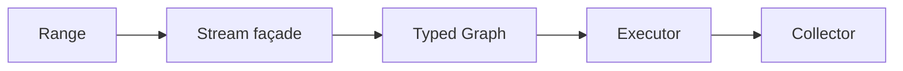

# 第五章：从 Graph 到 Stream——用高级接口构造同一张 Typed Graph

> **Stream 不拥有第二套执行语义。**
>
> 它只是 Graph builder façade。
>
> 因此本章只需要证明：**Stream surface lower 到同一张 canonical Graph。** 如果 façade 改变了 observable semantics，它就不是 façade。

---

## 1. Surface API

用户可能希望写：

~~~c
stream_int s =
    stream_from_int(xs, n);

stream_long out =
    stream_int_filter(
        &s,
        &is_even)
    .map(&square);

long total =
    stream_long_reduce(
        &out,
        0,
        &sum);
~~~

具体 API 可以不同。

关键是每一步只构造 Graph。

---

## 2. Builder Pseudocode

~~~text
stream.filter(predicate):

    require predicate : T -> bool

    node =
        graph.add(
            FILTER,
            input=T,
            output=T,
            callable=predicate)

    graph.connect(stream.tail, node)

    return Stream<T>(
        graph = stream.graph,
        tail  = node)
~~~

Map：

~~~text
stream.map(f):

    require f : T -> U

    node = graph.add(
        MAP,
        input=T,
        output=U,
        callable=f)

    graph.connect(stream.tail, node)

    return Stream<U>(
        graph,
        node)
~~~

Reduce：

~~~text
stream.reduce(init, reducer):

    require reducer : (A,T) -> A

    node = graph.add(
        REDUCE,
        input=T,
        output=A,
        callable=reducer,
        init=init)

    graph.connect(stream.tail, node)

    return Terminal<A>(graph,node)
~~~

---

## 3. Type Rules

Filter：

~~~text
p : T -> bool
────────────────
Filter<T>(p) : T -> T
~~~

Map：

~~~text
f : T -> U
──────────────
Map<T,U>(f) : T -> U
~~~

Reduce：

~~~text
r : (A,T) -> A
────────────────
Reduce<A,T>(r) : Stream<T> -> A
~~~

所以很多错误在 builder call 时已经可拒绝。

---

## 4. Range / Stream / Collector Ownership

不要让 Stream secretly own user data。

推荐 ownership：

| 对象 | Ownership |
|---|---|
| Range | borrows source data |
| Stream | owns/borrows Graph builder state |
| Collector | owns destination policy |
| Execution | owns transient frame |

例如：

~~~c
IntRange range =
    int_range(xs, n);

UserVec out = {0};

UserVec_init(&out, 64);

stream_execute(
    stream_from_range(&range)
        .filter(...)
        .map(...),
    vec_collector(&out));
~~~

源与目标 ownership 仍然由普通 C object 表达。

---

## 5. Façade Preservation Rule

Stream 最核心的 correctness 不是“链式语法漂亮”。

而是：

~~~text
build_stream(program)
=
build_graph(program)
~~~

更具体：

~~~text
eval(lower(StreamSurface))
=
eval(CanonicalGraph)
~~~

所以 Stream 不应该偷偷改变 encounter order、插入 hidden buffering、drop error、改变 ownership，或选择不同的 fallback backend。

---

## 6. Lowering 回普通 Loop

对于：

~~~text
Source
 -> Filter(is_even)
 -> Map(square)
 -> Reduce(sum)
~~~

eligible Direct lowering 可以生成：

~~~c
long total = 0;

for (size_t i = 0; i < n; ++i) {
    int x = xs[i];

    if (!is_even(x))
        continue;

    total += square(x);
}
~~~

Stream façade 不应该出现在这个 hot path。

---

## 7. Failure Cases

### Wrong predicate

如果 `Stream<int>` 收到 `User -> bool` predicate，返回 `TYPE_MISMATCH`。

### Invalid reducer

如果 reducer 是 `(double,int) -> long`，而要求的是 `(long,int) -> long`，返回 `TYPE_MISMATCH`。

### Unsupported lowering

如果 surface 已接受、canonical Graph 也合法，但 selected backend 无法 lower，返回 `UNSUPPORTED`.

不要因为 façade API 存在，就保证所有 backend 都支持所有 Graph shape。

后半章继续检查 canonical pipeline、semantic preservation、真实 C implementation 与 benchmark discipline。

## 8. Canonical Example：同一张 Graph，换一个更适合用户的入口

第四章已经有了：

~~~text
Input<int>
    ↓
Filter(is_even)
    ↓
Map(square)
    ↓
Reduce(sum)
~~~

如果用户每次都直接调用低层 Graph builder，API 会显得很机械。

Stream 的价值是让构造过程更接近数据转换本身：

~~~c
cflow_stream s = {0};

cflow_stream_init(&s, &cmeta_type_int);

s.filter(&s, is_even)
 ->map(&s, square)
 ->reduce(&s, sum);
~~~

这里最重要的不是 fluent syntax。

真正重要的是：

> **这三次调用最终仍然只是在构造同一套 Graph IR。**

Stream 没有重新拥有一套 StreamNode、StreamExecutor、StreamOptimizer、StreamTypeSystem；它只是 **user-friendly construction surface → same typed Graph**。这就是“高级接口不等于新 Runtime”。

---

## 9. Semantic Contract：Stream façade 不能偷偷改变什么

### 21.1 Operator semantics 必须与 Graph 一致

如果 Graph 中：

~~~text
FILTER
    output type = input type
    cardinality = 0..1

MAP
    output type = callable return
    cardinality = 1

REDUCE
    homogeneous fold
    cardinality = N..1
~~~

那么 Stream 不能因为 surface API 不同而重新定义这些规则。

因此 Stream method 本质上应该是 **typed Graph builder wrapper**，而不是 second semantic authority。

### 21.2 Stream owns the description, not the source data

Stream 可以拥有 Graph description、copied Range view、evaluation options、builder/admission state，但输入 object/container 的真实数据仍然由原 owner 管理。因此 **Stream lifetime ≠ container lifetime**。

如果绑定的是 borrowed Range，那么 evaluation 期间原 owner 必须继续存活并满足 Range contract。

### 21.3 Evaluation state 必须与 reusable Graph 分离

一个很关键的 contract 是：

> 同一条 Stream/Graph description 可以在条件允许时多次执行，但每次执行拥有新的 cursor/operator state。

不能把 reduce accumulator、skip counter、take counter、publisher cursor 这些 live execution facts 写回 Graph 本身，否则 **Build Once, Execute Many** 会立刻失效。

### 21.4 “可链式”不等于“延迟执行对象无限增长”

Stream 只负责 construction。

当用户真正执行时，可以选择 direct synchronous evaluation、normalized Graph、compiled Plan 或 Reactive Subscription。因此链式 API 不是成本模型。

真正成本取决于：

> **最终选中的 execution backend。**

---

## 10. Lean / Proof Obligation：Stream 这一层应该证明什么

Stream façade 本身不需要拥有一套新的复杂 formal semantics。

更自然的证明目标是：

### 22.1 Surface-to-Graph construction correctness

如果一串 Stream method 是 filter f、map g、reduce h，并构造出对应的 `FILTER(f)`、`MAP(g)`、`REDUCE(h)` Graph，那么 Stream 的 observable meaning 应直接继承 Graph。

也就是说可以把证明问题写成：

~~~text
BuildStream(ops) = g
→
StreamSemantics(ops, input)
=
GraphSemantics(g, input)
~~~

如果 Stream 只是 deterministic builder，这个 theorem 应该非常薄。

这正是好事。

> **Façade 越薄，需要独立证明的语义就越少。**

### 22.2 Type-chain preservation

对于：

~~~text
T
  --filter--> T
  --map f--> U
  --reduce--> U
~~~

需要确保 surface method 不可能偷偷绕过 Graph admission。

例如：

~~~text
map : T -> U
next filter expects V
U != V
~~~

应该在 Graph construction/admission 阶段失败。

### 22.3 Reusable description / fresh execution separation

形式模型中最好明确区分 **Program Description** 与 **Execution State**。

这会在后面的 Reactive 章节变得更加重要。

如果 formal model 一开始就把 cursor/demand/cancel state 塞进 Graph，就会把 control plane 与 execution plane 混在一起。

---

## 11. Current C Implementation：Stream 真的就是 Graph façade

对照本版 Salts 实现快照 `qigao/salts@ad389928b437c0612c1c60844fe53677f3ed27a6`：

当前 cflow_stream 的核心形态非常直接：

~~~c
struct cflow_stream {
    cflow_graph graph;

    cmeta_range input_range;
    bool has_input_range;

    cflow_eval_options eval_options;
    bool failed;

    /* generated explicit-self operator methods */
    ...
};
~~~

这段 representation 本身就回答了很多问题。

### 23.1 Graph 是 Stream 的核心 owned description

Stream 不是指向一个隐藏 Stream runtime。

它直接拥有 `cflow_graph graph`，operator method 的主要工作就是继续构造它。

因此：

~~~text
Stream
    ↓
Graph
~~~

不是架构图上的理想关系，而是实际 data layout。

### 23.2 Range 是输入协议，不是 Graph 的一部分

`input_range` 与 `has_input_range` 表示这个 Stream 当前绑定了哪一种 input view，但不改变 Graph 的 operator semantics。这让 array、container Range、channel-like publisher 和 other source 可以逐步共享后面的计算描述。

### 23.3 Method fields 是显式 self 的 ISO C11 façade

当前 Stream methods 不是 C++ member function。

它们仍然只是 C function pointer fields：

~~~text
stream.filter(&stream, ...)
stream.map(&stream, ...)
~~~

这样的设计有两个价值：

1. 保持 ISO C11；
2. surface syntax 更接近 fluent API，但没有引入 object runtime。

### 23.4 Public Graph view 是 read-only introspection

当前 API 已经明确：

~~~text
cflow_stream_graph()
    → borrowed read-only Graph view
~~~

普通用户不应该直接写 `stream.graph.nodes[...] = ...` 来绕过 builder contract。

这延续了第四章的原则：

> **public visibility 不等于 arbitrary mutability。**

---

## 12. Evidence：canonical pipeline 已经存在于真实测试里

本版 CFlow 实现 的 certificate tests 已经使用几乎和本书完全一致的 pipeline：

~~~text
filter even
    ↓
map square
    ↓
reduce add
~~~

测试会继续执行：

~~~text
Stream
    ↓
Surface Graph
    ↓
Normalize
    ↓
Optimize
    ↓
Compile Plan
    ↓
Build Certificate
    ↓
Check Certificate
~~~

这说明 canonical example 不是为了书临时发明的 toy example。

它已经是实际 trusted execution path 的测试对象。

### 24.1 Surface/API evidence

需要验证：

~~~text
filter/map/reduce method
    ↓
Graph rows appear with expected operators/types
~~~

### 24.2 Reuse evidence

同一 Stream description 在合法 Range contract 下多次 evaluation，应拥有独立 execution state。

特别要检查 reduce accumulator、take/skip counters 和 temporary value storage 不能泄漏回 Graph description。

### 24.3 Ownership evidence

测试要明确：Stream destroys its Graph，但不会 destroy borrowed container/Range owner。

### 24.4 Certificate / verification evidence

当 Stream 构造完成以后，所有 trusted transformation 都应该针对 Graph / Plan / Certificate，而不是 surface syntax。

这再次证明：

> **Stream 不是 semantic center；Graph 才是。**

---

## 13. Performance：不要 benchmark “链式语法”，要 benchmark execution path

Stream API 本身大多发生在 construction/control plane。

因此性能问题不能简单问“`stream.map()` 比普通 C 慢多少？”，更有意义的问题是：**同一条 pipeline 最终如何执行？**

比较 hand-written C loop、surface Graph interpreter、normalized/optimized Graph、compiled Plan 和 direct/AOT path。

如果最后 lowering 成与手写 loop 等价的执行形式，那么 Stream 的高级表达能力和 hot-path cost 可以被分离。

这就是本书最重要的观点之一：

> **高级 API 的成本不应该自动等于每个 value 的执行成本。**

---

## 14. What We Learned

第五章真正完成的不是“给 C 加链式 API”。

而是证明一个更重要的架构关系：

~~~text
Friendly Surface Syntax
        ↓
Typed Graph IR
        ↓
Independent Execution Backends
~~~

因此我们得到：

1. **Stream is a façade, not a second runtime.**
2. **Operator semantics belong to Graph/operator schema.**
3. **Input Range ownership remains explicit.**
4. **Program description and execution state are separate.**
5. **A reusable Stream can create fresh execution state each time.**
6. **Formal reasoning should target Graph meaning, not surface syntax.**
7. **Performance evidence must compare execution backends, not API aesthetics.**

到这里，同一条 canonical pipeline 已经拥有两个视角：

~~~text
user view:
    filter → map → reduce

compiler/control-plane view:
    typed Graph
~~~

下一章不先增加新的 runtime capability，而是先回答一个更基础的问题：

> **当 optimizer 想把一张 Graph 改写成另一张 Graph 时，凭什么相信 observable meaning 没有改变？**

这会引出 Observable Semantics、rewrite judgment、Lean theorem 与 proof/certificate boundary。

---

**小结：Stream 是 Graph 的第一个高级应用，而不是它的底层**

本章最重要的关系可以总结成：

```text
Graph
    描述计算

Stream
    提供方便的数据转换接口

Range
    提供输入

Collector
    提供输出

Executor
    以后决定如何执行
```

也就是：



这种分层带来的最大好处是：

> **高级接口和底层执行不再绑定。**

用户可以获得类似 Java Stream 的声明式数据转换，而系统仍然可以把它降低为普通 C loop、预编译 Plan 或其他执行形式。

所以 Stream 的价值并不是让 C 变得像 Java。

而是证明：

> **当 C 已经拥有 Type、Callable 和 Graph 后，也可以用很高级的方式表达数据转换，而这种表达能力并不要求牺牲 C 原本简单、高效的执行模型。**

下一章会继续沿着这条 Graph 主线前进，但先处理 correctness：

> **哪些 transformation 可以被允许？一个 metadata property 与真正授权 rewrite 的 semantic law 有什么区别？**

这就是从 Graph/Stream surface 进入 Verified Rewrite。
