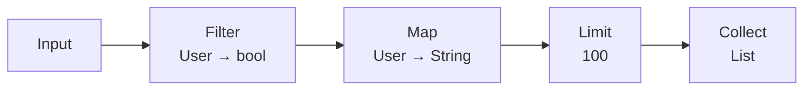
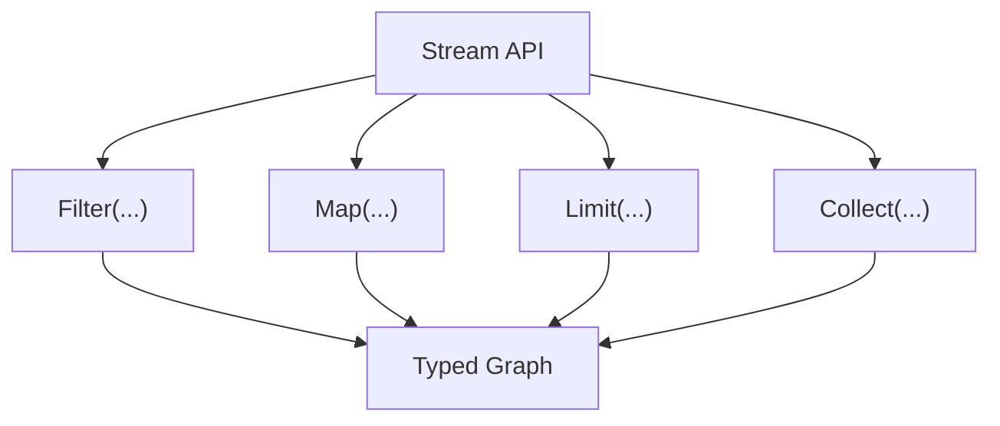
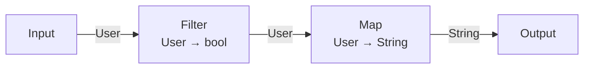
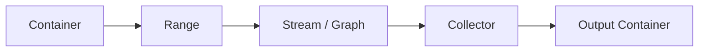
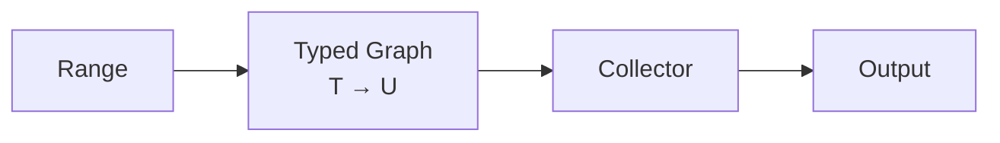
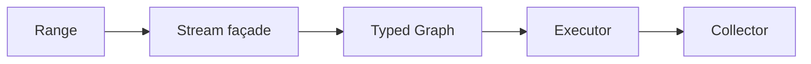

# 第五章：从 Graph 到 Stream——用高级接口解决数据转换问题

> **本章路线**
>
> 第四章已经把 Filter → Map → Reduce 从控制流保存成 typed Graph。
>
> 这一章只问一个工程问题：
>
> **普通 C 用户是否必须亲手创建 Node / Edge，才能使用这套计算模型？**
>
> 先看原始 C：
>
> ~~~c
> long total = 0;
>
> for (size_t i = 0; i < n; ++i) {
>     int x = input[i];
>     if (!is_even(x))
>         continue;
>     total += square(x);
> }
> ~~~
>
> 再看同一条计算通过 Stream façade 表达：
>
> ~~~c
> cflow_stream s = {0};
>
> cflow_stream_init(&s, &cmeta_type_int);
>
> s.filter(&s, is_even)
>  ->map(&s, square)
>  ->reduce(&s, sum);
> ~~~
>
> 第二段代码的价值不在“链式调用更漂亮”。
>
> 真正重要的是：这些调用没有创建第二套 Stream runtime，而是在构造第四章的同一张 typed Graph。
>
> ~~~text
> C Stream surface
>       ↓
> typed Graph
>       ↓
> normalize / optimize / compile
>       ↓
> Plan / Direct / other execution
> ~~~
>
> 因此这里所谓 LINQ-like，并不是模仿语法；而是让 C 可以把一整条数据计算当成可检查、可转换、可编译的 program object。

## 1. 从手写循环到 LINQ-like surface：变化的是“描述方式”，不是计算结果

继续使用同一个例子：

~~~c
long plain_sum_even_squares(const int *input, size_t n)
{
    long total = 0;

    for (size_t i = 0; i < n; ++i) {
        int x = input[i];
        if (!is_even(x))
            continue;
        total += square(x);
    }

    return total;
}
~~~

Plain C 已经非常直接。

如果只执行一次，它通常不需要任何 abstraction。

Stream 的意义出现在计算开始被复用、组合、检查、优化或切换 execution backend 的时候。

这时手写循环的问题不是性能，而是 library 看不到：

~~~text
Filter(is_even)
Map(square)
Reduce(sum)
~~~

这三个 operator 之间的关系。

Stream façade 让用户写出接近业务计算的接口，而 Graph 保存真正的语义事实。

因此这一章守住三个边界：

~~~text
Stream != second type system
Stream != second optimizer
Stream != mandatory runtime interpreter
~~~

它只负责把更自然的 C surface 收敛到同一张 Graph。

---

## 2. Graph 已经能够表达这种关系

上一章中的 Graph 已经拥有：

```text
Node
Edge
Type
Callable
```

所以可以自然表达：



这里每一步都有非常明确的语义。

例如：

```text
Filter
```

并不是：

```text
调用一个 bool callback
```

那么简单。

它表达的是：

```text
输入类型 = T
Predicate = T -> bool
输出流类型仍然 = T
Cardinality = 0..1
```

而：

```text
Map
```

表达：

```text
输入 = T
Callable = T -> U
输出 = U
Cardinality = 1
```

`FlatMap` 则是：

```text
输入 = T
Generator = T -> 0..N U
输出 = U
```

一旦这些语义进入 Graph，数据转换第一次变成可以被统一处理的结构。

---

## 3. 但是 Graph API 对普通数据处理来说太底层

Graph 的优势是通用。

它可以表达：

```text
Node
Edge
Subgraph
Relation
Branch
Join
```

但如果用户只是想：

```text
filter
map
reduce
```

直接写：

```text
create_node
connect
set_exit
```

显然过于繁琐。

这就像编译器 IR 很强，但用户不会直接写 SSA。

所以需要一个更高层的 façade。

对于线性数据转换，一个很自然的 façade 就是：

**Stream**

---

## 4. Stream 的作用是“更方便地构造 Graph”

这一点必须非常明确。

Stream 不应该拥有第二套：

```text
Type System
Operator System
Runtime
Optimizer
```

它应该只是：

```text
Graph Builder
```

例如用户写：

```text
stream
    .filter(enabled)
    .map(name)
    .limit(100)
    .collect(...)
```

内部做的仍然是：

```text
Graph
    + Filter Node
    + Map Node
    + Limit Node
    + Collect Node
```

可以表示成：



所以：

> **Stream 是用户体验；Graph 是语义事实。**

---

## 5. 为什么这比“直接实现一个 Stream Runtime”更重要

如果一开始就设计：

```text
Stream Runtime
```

很容易让每个 operator 都变成一个 runtime object：

```text
FilterStage
MapStage
LimitStage
ReduceStage
```

然后每个 value 流经：

```text
Stage
 ↓
virtual dispatch
 ↓
Stage
 ↓
virtual dispatch
```

这当然能工作。

但这样高级 API 会天然绑定一种执行实现。

而如果 Stream 只是构造 Graph：

```text
Stream
    ↓
Graph
```

那么执行方式可以以后再决定。

同一张 Graph 可以：

```text
直接解释
```

也可以：

```text
编译成 Plan
```

还可以：

```text
静态 lowering 成普通 C
```

甚至以后：

```text
Reactive execution
```

所以：

```text
High-level API
```

和：

```text
Execution Strategy
```

真正分离了。

---

## 6. Java Stream 给出的启发主要是“表达方式”

Java Stream 很成功的一点，是它把很多数据处理问题表达成：

```java
source.stream()
    .filter(...)
    .map(...)
    .limit(...)
    .collect(...);
```

用户读代码时看到的是：

```text
数据变化
```

而不是：

```text
迭代控制
```

这种表达方式对 C 同样有价值。

例如：

```text
users
  -> filter(enabled)
  -> map(name)
  -> collect(names)
```

比一个大型循环更容易直接看出：

```text
输入是什么
发生了哪些转换
最终得到什么
```

所以希望获得的是：

> **Java Stream 的高层表达能力。**

但没有必要复制：

> Java Stream 的全部语言、对象和 runtime 实现。

---

## 7. C 版本最大的机会：我们可以让类型链更明确

因为底层已经拥有类型系统，所以：

```text
Input<User>
```

接一个：

```text
Filter<User>
```

再接：

```text
Map<User, String>
```

可以在 Graph 构造时明确形成：

```text
User
 ↓
User
 ↓
String
```

例如：



如果后面接了一个：

```text
Map<int, double>
```

那么在执行之前就应该失败：

```text
String != int
```

而不是把错误留给运行时的 `void *`。

---

## 8. Filter、Map、Reduce 的类型规则可以正规化

Stream operator 并不只是 API 名字。

它们各自拥有明确的类型规则。

例如：

### Filter

```text
Input Flow Type = T

Predicate:
    T -> bool

Output Flow Type:
    T
```

---

### Map

```text
Input Flow Type = T

Mapper:
    T -> U

Output Flow Type:
    U
```

---

### FlatMap

```text
Input Flow Type = T

Generator:
    T -> 0..N U

Output Flow Type:
    U
```

---

### Reduce

```text
Input Flow Type = T

Reducer:
    T × T -> T

Output:
    T
```

---

### Collect

```text
Input Flow Type = T

Collector:
    T* -> Container<T>

Output:
    Container<T>
```

这些规则本身都可以建立在前面已经存在的：

```text
Signature
Finite Relation
Type Inference
```

之上。

---

## 9. Stream API 因此可以在“调用时”进行类型约束

例如用户有：

```text
enabled : User -> bool
name    : User -> String
```

那么：

```text
stream<User>
    .filter(enabled)
    .map(name)
```

是合法的。

而：

```text
stream<User>
    .filter(name)
```

应该失败。

因为：

```text
Filter<User>
```

要求：

```text
User -> bool
```

而 `name` 是：

```text
User -> String
```

这也是为什么前一章专门把 Callable 类型化非常重要。

如果 callback 仍然只是：

```text
void *
```

Stream 就无法成为真正的 typed API。

---

## 10. Stream 不应该拥有数据

另一个很重要的设计边界是：

> Stream 应该描述数据处理，而不是成为新的容器。

例如：

```text
Vec<User>
```

数据仍然属于 Vec。

```text
Range<User>
```

只提供 traversal。

Stream 只是描述：

```text
如何处理 Range 中的值
```

因此结构应该更接近：



这样：

```text
Container
```

和：

```text
Computation
```

不会混在一起。

---

## 11. Range 是 Stream 的自然输入协议

前面 CMeta 已经可以提供：

```text
Range
```

用于统一：

```text
Vec
List
Set
Map
```

等不同数据结构的读取方式。

一个 Range 可以描述：

```text
value type
size
iteration
capabilities
```

例如：

```text
SIZED
ORDERED
SORTED
UNIQUE
CONTIGUOUS
RANDOM_ACCESS
```

因此 Stream 不需要分别实现：

```text
VecStream
ListStream
SetStream
```

而只需要：

```text
Range<T>
```

作为一种统一输入。

---

## 12. Collector 则成为 Stream 的自然输出协议

另一端：

```text
Collect
```

也不应该写死：

```text
Vec_push_back
```

否则每增加一种 output container 都需要增加 Stream 特殊逻辑。

所以更自然的是：

```text
Collector
```

统一：

```text
begin
accept
finish
abort
```

于是：

```text
Stream<T>
```

最终可以收集到：

```text
Vec<T>
List<T>
Set<T>
其他 destination
```

只要目标提供：

```text
Collector<T>
```

即可。

---

## 13. Range + Graph + Collector 形成完整数据转换模型

这一组合非常重要：

```text
Range
    ↓
Graph
    ↓
Collector
```

分别回答：

```text
Range
    数据从哪里读？

Graph
    数据怎样变？

Collector
    数据写到哪里？
```

可以表示成：



这样数据转换系统就不再绑定：

```text
某种输入容器
```

或：

```text
某种输出容器
```

---

## 14. 这使很多常见的数据处理问题可以统一表达

例如：

### 过滤

```text
Users
 ↓
Filter(enabled)
 ↓
EnabledUsers
```

### 投影

```text
User
 ↓
Map(name)
 ↓
String
```

### 一对多转换

```text
Sentence
 ↓
FlatMap(words)
 ↓
Word
```

### 聚合

```text
Numbers
 ↓
Reduce(sum)
 ↓
Number
```

### 收集

```text
Value Stream
 ↓
Collect
 ↓
Vec / List / Set
```

这些模式不再需要每一个业务模块自己实现完整遍历逻辑。

---

## 15. 但真正有意思的是：Graph 允许优化整条数据转换链

例如：

```text
Map(f)
 ↓
Map(g)
```

如果条件允许，可以转成：

```text
Map(g ∘ f)
```

这样中间的：

```text
B
```

甚至不需要成为一个 materialized object。

例如原来：

```text
A
 ↓ f
B
 ↓ g
C
```

可以执行成：

```c
C c = g(f(a));
```

而不是：

```c
B b = f(a);
C c = g(b);
```

虽然编译器有时也能优化掉局部变量，但 Graph 层能看到更高层的语义。

---

## 16. Filter 和 Map 也可能进一步合并到同一个 loop

例如 Graph：

```text
Filter(enabled)
 ↓
Map(name)
 ↓
Limit(100)
```

如果走 Direct path，最终完全可能变成：

```c
size_t out = 0;

for (size_t i = 0; i < count && out < 100; ++i) {
    if (!enabled(users[i]))
        continue;

    names[out++] = name(users[i]);
}
```

也就是说：

```text
高级 Stream API
```

不必对应：

```text
三个 runtime stage objects
```

反而可以对应：

```text
一个普通 C loop
```

这就是整个设计中非常重要的性能方向。

---

## 17. “高级接口”与“低成本执行”并不冲突

很多 C 开发者对类似：

```text
Stream
Graph
Lambda
```

的抽象天然警惕。

因为它们经常意味着：

```text
allocation
virtual dispatch
temporary objects
runtime type erasure
```

但如果系统拥有足够多的编译期和 control-plane 信息，就可以走完全不同的路线：

```text
高级表达
    ↓
Graph
    ↓
Validate
    ↓
Optimize
    ↓
Lower
    ↓
普通 C
```

也就是说：

> **高级接口负责让人写得简单，Graph 负责让系统看懂，Lowering 负责让机器执行得简单。**

---

## 18. Stream 因此可以只是 façade，而不是成本中心

理想情况下：

```text
stream.filter(...).map(...)
```

主要承担：

```text
Graph Construction Cost
```

而不是：

```text
Per-item Runtime Cost
```

这两者的差别非常大。

如果一个 Graph 构建一次，处理：

```text
1,000,000 个 value
```

那么在构建阶段多做一点：

```text
类型检查
signature lookup
optimization
```

完全可能是划算的。

因为这些成本只付一次。

---

## 19. 从 Stream façade 进入可验证执行

到这里，Stream 的角色已经足够清楚：它把 Graph 的构造变成更自然的类型化数据转换接口，但不重新发明执行语义，也不拥有 source data。Range、Collector、Callable 与 Graph 仍然各自保持原来的职责。

因此后半章不再重复讨论“Stream 可以应用到哪些数据处理场景”或再次证明高级 API 与低层 Graph 可以共存，而是直接回到 canonical pipeline，检查 façade 到 Graph 的 construction correctness、type-chain preservation、description/execution ownership、真实 C 实现和可重复使用证据。

性能部分也只讨论 execution path；链式语法本身不是 benchmark 对象。

---

## 20. Canonical Example：同一张 Graph，换一个更适合用户的入口

第四章已经有了：

~~~text
Input<int>
    ↓
Filter(is_even)
    ↓
Map(square)
    ↓
Reduce(sum)
~~~

如果用户每次都直接调用低层 Graph builder，API 会显得很机械。

Stream 的价值是让构造过程更接近数据转换本身：

~~~c
cflow_stream s = {0};

cflow_stream_init(&s, &cmeta_type_int);

s.filter(&s, is_even)
 ->map(&s, square)
 ->reduce(&s, sum);
~~~

这里最重要的不是 fluent syntax。

真正重要的是：

> **这三次调用最终仍然只是在构造同一套 Graph IR。**

Stream 没有重新拥有一套：

~~~text
StreamNode
StreamExecutor
StreamOptimizer
StreamTypeSystem
~~~

而只是：

~~~text
user-friendly construction surface
        ↓
same typed Graph
~~~

这就是“高级接口不等于新 Runtime”。

---

## 21. Semantic Contract：Stream façade 不能偷偷改变什么

### 21.1 Operator semantics 必须与 Graph 一致

如果 Graph 中：

~~~text
FILTER
    output type = input type
    cardinality = 0..1

MAP
    output type = callable return
    cardinality = 1

REDUCE
    homogeneous fold
    cardinality = N..1
~~~

那么 Stream 不能因为 surface API 不同而重新定义这些规则。

因此 Stream method 本质上应该是：

~~~text
typed Graph builder wrapper
~~~

而不是：

~~~text
second semantic authority
~~~

### 21.2 Stream owns the description, not the source data

Stream 可以拥有：

~~~text
Graph description
copied Range view
evaluation options
builder/admission state
~~~

但输入 object/container 的真实数据仍然由原 owner 管理。

所以需要明确：

~~~text
Stream lifetime
    ≠
container lifetime
~~~

如果绑定的是 borrowed Range，那么 evaluation 期间原 owner 必须继续存活并满足 Range contract。

### 21.3 Evaluation state 必须与 reusable Graph 分离

一个很关键的 contract 是：

> 同一条 Stream/Graph description 可以在条件允许时多次执行，但每次执行拥有新的 cursor/operator state。

不能把：

~~~text
reduce accumulator
skip counter
take counter
publisher cursor
~~~

这些 live execution fact 写回 Graph 本身。

否则：

~~~text
Build Once, Execute Many
~~~

会立刻失效。

### 21.4 “可链式”不等于“延迟执行对象无限增长”

Stream 只负责 construction。

当用户真正执行时，可以选择：

~~~text
direct synchronous evaluation
normalized Graph
compiled Plan
Reactive Subscription
~~~

因此链式 API 不是成本模型。

真正成本取决于：

> **最终选中的 execution backend。**

---

## 22. Lean / Proof Obligation：Stream 这一层应该证明什么

Stream façade 本身不需要拥有一套新的复杂 formal semantics。

更自然的证明目标是：

### 22.1 Surface-to-Graph construction correctness

如果一串 Stream method：

~~~text
filter f
map g
reduce h
~~~

构造出的 Graph 是：

~~~text
FILTER(f)
MAP(g)
REDUCE(h)
~~~

那么 Stream 的 observable meaning 应直接继承 Graph。

也就是说可以把证明问题写成：

~~~text
BuildStream(ops) = g
→
StreamSemantics(ops, input)
=
GraphSemantics(g, input)
~~~

如果 Stream 只是 deterministic builder，这个 theorem 应该非常薄。

这正是好事。

> **Façade 越薄，需要独立证明的语义就越少。**

### 22.2 Type-chain preservation

对于：

~~~text
T
  --filter--> T
  --map f--> U
  --reduce--> U
~~~

需要确保 surface method 不可能偷偷绕过 Graph admission。

例如：

~~~text
map : T -> U
next filter expects V
U != V
~~~

应该在 Graph construction/admission 阶段失败。

### 22.3 Reusable description / fresh execution separation

形式模型中最好明确区分：

~~~text
Program Description
~~~

与：

~~~text
Execution State
~~~

这会在下一章 Reactive 变得更加重要。

如果 formal model 一开始就把 cursor/demand/cancel state 塞进 Graph，就会把 control plane 与 execution plane 混在一起。

---

## 23. Current C Implementation：Stream 真的就是 Graph façade

对照本版 Salts 实现快照：

~~~text
qigao/salts
snapshot: ad389928b437c0612c1c60844fe53677f3ed27a6
~~~

当前 cflow_stream 的核心形态非常直接：

~~~c
struct cflow_stream {
    cflow_graph graph;

    cmeta_range input_range;
    bool has_input_range;

    cflow_eval_options eval_options;
    bool failed;

    /* generated explicit-self operator methods */
    ...
};
~~~

这段 representation 本身就回答了很多问题。

### 23.1 Graph 是 Stream 的核心 owned description

Stream 不是指向一个隐藏 Stream runtime。

它直接拥有：

~~~text
cflow_graph graph
~~~

operator method 的主要工作就是继续构造它。

因此：

~~~text
Stream
    ↓
Graph
~~~

不是架构图上的理想关系，而是实际 data layout。

### 23.2 Range 是输入协议，不是 Graph 的一部分

input_range 与 has_input_range 表示：

~~~text
这个 Stream 当前绑定了哪一种输入 view
~~~

但它不改变 Graph 的 operator semantics。

这让：

~~~text
array
container Range
channel-like publisher
other source
~~~

可以逐步共享后面的计算描述。

### 23.3 Method fields 是显式 self 的 ISO C11 façade

当前 Stream methods 不是 C++ member function。

它们仍然只是 C function pointer fields：

~~~text
stream.filter(&stream, ...)
stream.map(&stream, ...)
~~~

这样的设计有两个价值：

1. 保持 ISO C11；
2. surface syntax 更接近 fluent API，但没有引入 object runtime。

### 23.4 Public Graph view 是 read-only introspection

当前 API 已经明确：

~~~text
cflow_stream_graph()
    → borrowed read-only Graph view
~~~

普通用户不应该：

~~~text
stream.graph.nodes[...] = ...
~~~

来绕过 builder contract。

这延续了第四章的原则：

> **public visibility 不等于 arbitrary mutability。**

---

## 24. Evidence：canonical pipeline 已经存在于真实测试里

本版 CFlow 实现 的 certificate tests 已经使用几乎和本书完全一致的 pipeline：

~~~text
filter even
    ↓
map square
    ↓
reduce add
~~~

测试会继续执行：

~~~text
Stream
    ↓
Surface Graph
    ↓
Normalize
    ↓
Optimize
    ↓
Compile Plan
    ↓
Build Certificate
    ↓
Check Certificate
~~~

这说明 canonical example 不是为了书临时发明的 toy example。

它已经是实际 trusted execution path 的测试对象。

### 24.1 Surface/API evidence

需要验证：

~~~text
filter/map/reduce method
    ↓
Graph rows appear with expected operators/types
~~~

### 24.2 Reuse evidence

同一 Stream description 在合法 Range contract 下多次 evaluation，应拥有独立 execution state。

特别要检查：

~~~text
reduce accumulator
take/skip counters
temporary value storage
~~~

不能泄漏回 Graph description。

### 24.3 Ownership evidence

测试要区分：

~~~text
Stream destroys its Graph

but

Stream does not destroy borrowed container/Range owner
~~~

### 24.4 Certificate / verification evidence

当 Stream 构造完成以后，所有 trusted transformation 都应该针对：

~~~text
Graph / Plan / Certificate
~~~

而不是针对 surface syntax。

这再次证明：

> **Stream 不是 semantic center；Graph 才是。**

---

## 25. Performance：不要 benchmark “链式语法”，要 benchmark execution path

Stream API 本身大多发生在 construction/control plane。

因此性能问题不能简单问：

~~~text
stream.map() 比普通 C 慢多少？
~~~

更有意义的问题是：

~~~text
同一条 pipeline 最终如何执行？
~~~

比较：

~~~text
hand-written C loop
surface Graph interpreter
normalized/optimized Graph
compiled Plan
direct/AOT path
~~~

如果最后 lowering 成与手写 loop 等价的执行形式，那么 Stream 的高级表达能力和 hot-path cost 可以被分离。

这就是本书最重要的观点之一：

> **高级 API 的成本不应该自动等于每个 value 的执行成本。**

---

## 26. What We Learned

第五章真正完成的不是“给 C 加链式 API”。

而是证明一个更重要的架构关系：

~~~text
Friendly Surface Syntax
        ↓
Typed Graph IR
        ↓
Independent Execution Backends
~~~

因此我们得到：

1. **Stream is a façade, not a second runtime.**
2. **Operator semantics belong to Graph/operator schema.**
3. **Input Range ownership remains explicit.**
4. **Program description and execution state are separate.**
5. **A reusable Stream can create fresh execution state each time.**
6. **Formal reasoning should target Graph meaning, not surface syntax.**
7. **Performance evidence must compare execution backends, not API aesthetics.**

到这里，同一条 canonical pipeline 已经拥有两个视角：

~~~text
user view:
    filter → map → reduce

compiler/control-plane view:
    typed Graph
~~~

下一章真正改变的不是 operator。

改变的是：

> **数据不一定已经在那里。**

当 source 可以回答：

~~~text
WAIT
~~~

以后，Graph semantics 开始进入时间、Wake、Demand 与 Backpressure。

这就是 Reactive。

---

**小结：Stream 是 Graph 的第一个高级应用，而不是它的底层**

本章最重要的关系可以总结成：

```text
Graph
    描述计算

Stream
    提供方便的数据转换接口

Range
    提供输入

Collector
    提供输出

Executor
    以后决定如何执行
```

也就是：



这种分层带来的最大好处是：

> **高级接口和底层执行不再绑定。**

用户可以获得：

```text
类似 Java Stream 的声明式数据转换
```

而系统仍然可以把它降低为：

```text
普通 C loop
预编译 Plan
其他执行形式
```

所以 Stream 的价值并不是让 C 变得像 Java。

而是证明：

> **当 C 已经拥有 Type、Callable 和 Graph 后，也可以用很高级的方式表达数据转换，而这种表达能力并不要求牺牲 C 原本简单、高效的执行模型。**

下一章将继续沿着这一发现前进：

> **如果 Graph 的 Publisher 不一定马上有数据，会发生什么？**

答案就是从同步 Stream 走向 **Reactive、WAIT、Wake、Demand 与 Backpressure**。
