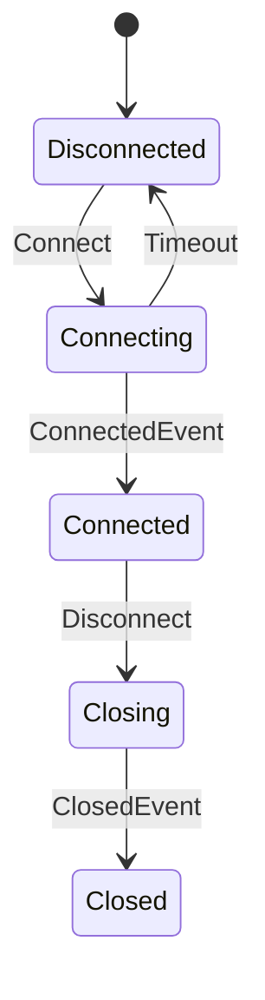
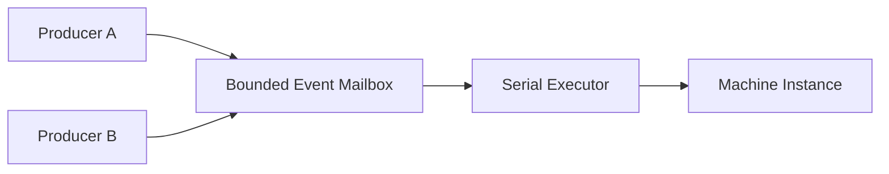
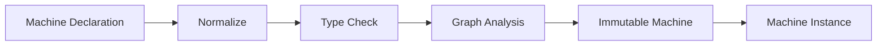

# 第十章：从 Event 到 State Machine——把状态变化变成可验证的执行模型

> **本章路线**
>
> Part II 已经解决了“计算关系”如何被描述、证明和 lowering。Part III 现在处理另一类 C 中很容易失控的问题：长期存在的 mutable state。
>
> 先看一个最普通的连接状态机。很多项目一开始都会写成这样：
>
> ~~~c
> typedef enum connection_state {
>     CONN_DISCONNECTED,
>     CONN_CONNECTING,
>     CONN_CONNECTED,
>     CONN_CLOSING,
>     CONN_CLOSED
> } connection_state;
>
> typedef enum connection_event {
>     EV_CONNECT,
>     EV_CONNECTED,
>     EV_TIMEOUT,
>     EV_DISCONNECT,
>     EV_CLOSED
> } connection_event;
>
> typedef struct connection {
>     connection_state state;
> } connection;
>
> static int connection_step(connection *c, connection_event ev)
> {
>     switch (c->state) {
>     case CONN_DISCONNECTED:
>         if (ev == EV_CONNECT) {
>             c->state = CONN_CONNECTING;
>             return 0;
>         }
>         break;
>
>     case CONN_CONNECTING:
>         if (ev == EV_CONNECTED) {
>             c->state = CONN_CONNECTED;
>             return 0;
>         }
>         if (ev == EV_TIMEOUT) {
>             c->state = CONN_DISCONNECTED;
>             return 0;
>         }
>         break;
>
>     case CONN_CONNECTED:
>         if (ev == EV_DISCONNECT) {
>             c->state = CONN_CLOSING;
>             return 0;
>         }
>         break;
>
>     case CONN_CLOSING:
>         if (ev == EV_CLOSED) {
>             c->state = CONN_CLOSED;
>             return 0;
>         }
>         break;
>
>     case CONN_CLOSED:
>         break;
>     }
>
>     return -1;
> }
> ~~~
>
> 对一个小状态机，这段代码完全可以接受。
>
> 问题随着需求一起出现：
>
> ~~~text
> Event 开始带不同 payload
> transition 开始有 guard / action
> 某些 state 必须 terminal
> 同一 state/event 不能出现歧义
> action 失败时旧 state 不能被半更新
> 多线程事件不能同时修改同一个 state
> build 前最好就发现 unreachable / invalid reference
> ~~~
>
> 这些约束如果继续塞进 `switch`，很快会分散成大量隐式 convention。
>
> 所以本章不从“什么是 State Machine”讲起，而是问：
>
> **能不能把 `state + event + guard + action + transition` 本身变成 typed、可验证的程序数据，再让 runtime 只执行已经通过 admission 的 transition。**
>
> canonical control program 仍然是：
>
> ~~~text
> Disconnected --Connect--------> Connecting
> Connecting   --ConnectedEvent-> Connected
> Connecting   --Timeout--------> Disconnected
> Connected    --Disconnect-----> Closing
> Closing      --ClosedEvent----> Closed
> ~~~
>
> 后面会把这段普通 C switch 逐步拆成 Typed Event、immutable Machine IR、build-time validation、serialized Instance 与 atomic commit；Lean 只在 small-step semantics 已经明确以后证明 determinism / typing / terminal law。

---


## 1. Event 首先应该是 Typed Value

传统事件系统很常见的一种写法是：

```c
enum event_type {
    EVENT_LOGIN,
    EVENT_LOGOUT,
    EVENT_TIMEOUT
};

struct event {
    int type;
    void *payload;
};
```

这种方式非常简单。

但问题也很明显。

例如：

```text
EVENT_LOGIN
```

对应的 payload 可能应该是：

```text
LoginRequest
```

而：

```text
EVENT_TIMEOUT
```

可能根本没有 payload。

如果统一使用：

```c
void *
```

那么：

```text
Event ID
```

和：

```text
Payload Type
```

之间的关系只存在于程序员约定中。

例如：

```c
if (event.type == EVENT_LOGIN) {
    LoginRequest *r = event.payload;
}
```

编译器无法证明：

```text
EVENT_LOGIN
```

真的携带：

```text
LoginRequest
```

所以既然已经有 Type Metadata，就可以进一步让 Event 变成：

```text
Typed Event
    =
Event Identity
+
Payload Type
+
Payload
```

例如：

```text
LoginEvent
    payload : LoginRequest

TimeoutEvent
    payload : TimeoutInfo

StopEvent
    payload : void
```

这样 Event 不再只是：

```text
tag + void *
```

而成为真正的：

```text
typed message
```

---

## 2. 为什么 Event Type 和 Payload Type 应该分开

例如：

```text
DataReceived
```

和：

```text
ConfigLoaded
```

可能都携带：

```text
Buffer
```

但它们显然不是同一种 Event。

所以：

```text
Event Identity
```

不能简单等于：

```text
Payload Type
```

更合理的是：

```text
Event {
    id
    payload_type
    payload
}
```

也就是说：

```text
事件是什么
```

和：

```text
事件携带什么
```

是两个不同维度。

这和函数中的：

```text
Operator
```

与：

```text
Callable Signature
```

非常类似。

---

## 3. 有了 Event 以后，State Machine 几乎自然出现

假设一个连接对象有：

```text
Disconnected
Connecting
Connected
Closing
Closed
```

几个状态。

然后有：

```text
Connect
ConnectedEvent
Disconnect
Timeout
```

几个事件。

它们之间存在：

```text
Disconnected + Connect
    -> Connecting

Connecting + ConnectedEvent
    -> Connected

Connecting + Timeout
    -> Disconnected

Connected + Disconnect
    -> Closing
```

可以画成：



这已经不只是：

```text
一堆 callback
```

而是一个明确的：

```text
Transition Graph
```

所以很自然地再次使用：

```text
IR
```

思想。

---

## 4. State Machine 本身也应该先成为数据

传统状态机常见写法：

```c
switch (state) {
case DISCONNECTED:
    if (event == CONNECT)
        ...
    break;

case CONNECTING:
    if (event == CONNECTED)
        ...
    else if (event == TIMEOUT)
        ...
    break;
}
```

这种代码对于小状态机非常好。

但随着状态越来越多：

```text
State × Event
```

组合会快速膨胀。

而且很多信息被分散在：

```text
switch
if
callback
assignment
```

里面。

如果状态机先表示成：

```text
Machine IR
```

那么就可以保存：

```text
States
Events
Transitions
Guards
Actions
Initial State
Terminal State
```

也就是说：

```text
Program
    ↓
Machine Description
    ↓
Validate
    ↓
Execute
```

这和前面 Graph 的发展路线完全一致。

---

## 5. Transition 应该具有真正的类型

一个 Transition 最简单可以表示：

```text
Source State
+
Event
+
Target State
```

但如果要真正做到 typed machine，还应该包括：

```text
Guard
Action
```

例如：

```text
(SourceState, Event)
        ↓
      Guard
        ↓
      Action
        ↓
   TargetState
```

其中 Guard 可以具有：

```text
State × Event -> bool
```

Action 可以具有：

```text
State × Event -> NewState
```

或者更一般地：

```text
State × Event
    ->
State + Output
```

因此每条 Transition 都可以在构建阶段检查：

```text
Source State Type

Event Payload Type

Guard Signature

Action Signature

Target State Type
```

本版 CFlow 实现 `Machine` IR 就明确保存 State、Event、Guard、Action、Transition，并让 Guard/Action 同样携带 type、effects 和 properties 信息。

---

## 6. Guard 为什么也应该是 Callable

传统 State Machine 里经常会写：

```c
if (balance >= amount) {
    ...
}
```

或者：

```c
if (retry_count < 3) {
    ...
}
```

这些条件本质上就是：

```text
Predicate
```

例如：

```text
can_retry :
    State × ErrorEvent -> bool
```

既然前面已经建立 Callable，就没有理由为 State Machine 再重新发明：

```text
Guard Callback Type
```

它应该直接复用：

```text
Typed Callable
```

这样 Guard 自动拥有：

```text
Signature
Effects
Properties
```

例如一个 Guard 理论上通常应该是：

```text
PURE
DETERMINISTIC
```

如果某个 Guard 被声明成：

```text
IO
STATEFUL
```

系统甚至可以进一步决定：

```text
是否允许
是否警告
是否影响优化/证明
```

---

## 7. Action 同样不需要新函数系统

Action 也是一样。

例如：

```text
on_connect
on_timeout
on_close
```

本质上仍然只是：

```text
Callable
```

区别只在于它承担：

```text
Transition Side Effect
```

所以 Action 可以继续使用：

```text
Effects
Properties
```

描述：

```text
是否 IO
是否 Stateful
是否可能失败
是否产生输出
```

这样 Machine 不需要自己再维护一套：

```text
callback metadata
```

而是直接建立在前面的 Callable 模型上。

这再次验证了一件事情：

> **如果基础 primitive 设计正确，上层功能应该更多是组合，而不是重新实现。**

---

## 8. Machine Build 可以提前发现大量错误

一旦整个状态机已经成为数据，就可以在真正运行之前检查：

```text
未知 State
未知 Event
重复 ID
类型不匹配
无效 Guard Signature
无效 Action Signature
重复 Transition
不可达 State
未使用 Event
Terminal State 仍存在 outgoing edge
歧义 Transition
```

当前 Machine 构建过程就是在发布 immutable Machine 之前完成 normalization 和 validation，并拒绝 duplicate/unknown ID、类型不匹配、歧义、不可达状态、terminal outgoing transition 等非法结构。

这和 Graph 的原则完全一致：

> **越早发现错误越好。**

---

## 9. Ambiguous Transition 是一个非常重要的问题

例如：

```text
State = Connected
Event = Data
```

同时存在：

```text
Transition A:
    guard = x > 0

Transition B:
    guard = x < 10
```

当：

```text
x = 5
```

时：

```text
A = true
B = true
```

应该走哪个 Transition？

如果 Machine 没有明确 coordination semantics：

```text
程序行为就依赖 transition registration order
```

这非常危险。

所以 Machine Build 阶段应该尽可能拒绝：

```text
静态可确认的 ambiguity
```

或者要求显式规定：

```text
priority
first-match
exclusive
```

而不是偷偷选择：

```text
第一个 callback
```

---

## 10. Terminal State 也应该成为结构属性

例如：

```text
Done
Failed
Closed
```

这种状态通常表示：

```text
Machine 已经终止
```

如果它仍然存在：

```text
Done -> Running
```

这样的 outgoing transition，就会造成语义矛盾。

因此：

```text
terminal
```

不应该只是：

```text
状态名字里叫 Done
```

而应该成为：

```text
Machine Metadata
```

然后 Build 阶段验证：

```text
terminal state
    must not have outgoing transitions
```

这使生命周期规则开始进入 IR。

---

## 11. 为什么 Machine 应该 Immutable

Machine 描述的是：

```text
状态机规则
```

而不是：

```text
某一次运行的当前状态
```

例如：

```text
ConnectionMachine
```

可以同时有：

```text
connection A
connection B
connection C
```

三个 instance。

如果 Machine 本身保存：

```text
current_state
```

那么它就不能安全复用。

更合理的是：

```text
Machine
    = immutable definition

Machine Instance
    = mutable execution state
```

也就是：

```text
Definition
≠
Instance
```

这和上一章的：

```text
Graph
≠
Subscription
```

完全相同。

---

## 12. Machine Instance 才拥有真正的状态

例如：

```text
Machine Definition:

Disconnected
Connecting
Connected
Closed
```

而：

```text
Instance A:
    current = Connected

Instance B:
    current = Connecting
```

两个 Instance 共享：

```text
同一个 immutable Machine
```

却拥有自己的：

```text
State Value
Mailbox
Lifecycle
Scratch Storage
```

本版 CFlow 实现 的 Machine runtime 也采用这种划分：Machine 是 immutable IR，而 instance 拥有 initial/current state、bounded Event mailbox 以及执行所需 storage。

---

## 13. State 不一定只是一个 enum

传统 FSM 经常把 State 写成：

```c
enum State {
    IDLE,
    RUNNING,
    DONE
};
```

这对很多问题足够。

但真正复杂的状态往往是：

```text
State ID
+
State Data
```

例如：

```text
Downloading {
    url
    received_bytes
    total_bytes
}
```

或者：

```text
Authenticated {
    user
    token
}
```

因此：

```text
State
```

也可以成为 typed value。

例如：

```text
State ID = AUTHENTICATED
State Type = AuthenticatedState
```

这样 Transition 不只是：

```text
enum -> enum
```

而可以成为真正的：

```text
typed state transformation
```

---

## 14. Event 和 State 都有 Type 后，Transition 才真正安全

例如：

```text
State:
    ConnectingState

Event:
    ConnectedEvent

Action:
    ConnectingState × ConnectedEvent
        ->
    ConnectedState
```

如果错误地把：

```text
TimeoutEvent
```

传进只接受：

```text
ConnectedEvent
```

的 Action，应该在：

```text
Machine Build
```

阶段直接失败。

这与前面 Graph 中：

```text
A.output_type
!=
B.input_type
```

时拒绝 Edge 的思想完全一致。

---

## 15. State Machine 可以看成另一种 Typed Graph

做到这里以后，会发现 Machine 和前面的 Dataflow Graph 有很多相似之处。

Dataflow Graph：

```text
Value
    ↓
Operator
    ↓
Value
```

State Machine：

```text
State + Event
    ↓
Transition
    ↓
New State
```

可以抽象成：

```text
Typed Input
    ↓
Semantic Relation
    ↓
Typed Output
```

两者的重点不同：

```text
Graph
    强调 Data Transformation

Machine
    强调 State Transition
```

但底层：

```text
Type
Callable
Effect
Property
Validation
```

大量能力可以共享。

---

## 16. 为什么 State Machine 不应该直接在 send() 中执行

假设：

```text
Thread A
    send(EventA)

Thread B
    send(EventB)
```

如果：

```text
send()
```

直接执行 Transition，就可能出现：

```text
两个线程同时修改 State
```

于是必须大量加锁。

而前面已经有：

```text
Serial Executor
```

所以一个更简单的模型是：

```text
Producer
   ↓
Event Mailbox
   ↓
Serial Executor
   ↓
Machine Transition
```

即：



这样 Producer 可以并发。

但：

```text
State Mutation
```

只有一个串行 owner。

---

## 17. Serial Executor 在这里第一次成为“状态隔离边界”

这其实比：

```text
少写 mutex
```

更重要。

因为它建立了一个明确 invariant：

> **任何时刻只有一个 Transition 可以拥有并修改 committed state。**

这意味着 Guard、Action、State Commit 可以形成：

```text
deterministic transition boundary
```

而不是：

```text
任意多个线程
    ↓
共同修改 State
```

因此：

```text
Serial Executor
```

不仅是性能策略。

它开始具有：

```text
Concurrency Semantics
```

---

## 18. 为什么 Mailbox 必须 Bounded

和 Executor Queue 一样，Event Mailbox 如果：

```text
永远接受
```

那么 Producer 比 Machine 快时：

```text
内存就会无限增长
```

例如：

```text
Producer:
    1,000,000 Event/s

Machine:
    10,000 Event/s
```

系统必须明确：

```text
capacity
```

并在满时返回：

```text
FULL
```

而不是：

```text
自动无限扩容
```

这样上层才能决定：

```text
retry
drop
coalesce
backpressure
fail
```

所以：

```text
Bounded Mailbox
```

其实和：

```text
Reactive Demand
Bounded Executor
```

是同一个资源哲学的不同表现。

---

## 19. Event Admission 和 Event Execution 必须分开

发送 Event 时，可以分成两个阶段：

```text
Admission
    ↓
Execution
```

例如：

```text
send(event)
```

首先只决定：

```text
能不能进入 Mailbox
```

返回：

```text
ACCEPTED
FULL
CLOSED
INVALID
TYPE_MISMATCH
```

真正执行：

```text
Guard
Action
Transition
```

发生在 Serial Executor 中。

这样：

```text
Producer Latency
```

不会被整个 Transition 的执行时间绑死。

也不会让：

```text
Producer Thread
```

突然承担 Machine callback。

---

## 20. State Commit 应该具有明确边界

假设 Action：

```text
OldState + Event -> NewState
```

执行过程中发生错误。

那么：

```text
Current State
```

应该是什么？

如果 Action 一边执行一边直接修改 committed state，很容易留下：

```text
half-mutated state
```

更可靠的模式是：

```text
Current State
    ↓
Scratch / Candidate State
    ↓
Guard / Action
    ↓
成功
    ↓
Atomic Commit
```

也就是说：

> **State Transition 应该尽量表现成 transaction-like commit。**

即使底层并不是真正数据库 transaction，这种结构也能大幅减少异常路径的复杂性。

---

## 21. Observation 和 Mutation 也可以分开

一个 Transition 可能需要：

```text
改变 State
```

同时还需要：

```text
通知外部
输出 Event
记录日志
```

如果这些全部混在：

```text
Action
```

里面，很难区分：

```text
核心 State Change
```

和：

```text
External Observation
```

因此复杂 Machine 可以进一步区分：

```text
Transition Logic
State Commit
Observation
```

让：

```text
State Correctness
```

和：

```text
外部 Side Effect
```

拥有更清楚的边界。

当前 Machine action metadata 也已经能够描述 observation/effect 等执行属性。

---

## 22. Machine Build 很像一个小型 Compiler Front-end

回头看 Machine 的构建过程：

```text
Declarations
    ↓
Normalize
    ↓
Validate IDs
    ↓
Validate Types
    ↓
Validate Transition Rules
    ↓
Reachability Analysis
    ↓
Publish Immutable Machine
```

它已经非常接近：

```text
Compiler Front-end
```

只是它编译的不是：

```text
C source
```

而是：

```text
State Machine Schema
```

可以表示成：



这与 CFlow Graph 的：

```text
Surface Graph
 ↓
Normalize
 ↓
Analyze
```

是一致的。

## 22.1 当前实现中的 Machine 与 Statechart 不是同一个层次

本章前半描述的 `cflow_machine` 是平面 typed transition IR：State、Event、Guard、Action 和 Transition 都是显式 row。`cflow_machine_build()` 复制并排序这些声明，检查 ID、type contract、歧义、不可达状态、terminal outgoing transition 和未使用声明，再原子发布 immutable Machine。

层次化控制模型由 `cflow_statechart` 单独承载。它进一步表达：

```text
compound / parallel state
initial / final / shallow-history / deep-history pseudo state
event / eventless / completion trigger
state entry/exit action
transition action 与多 target
document order 与 transition domain
```

`cflow_statechart_build()` 同样先复制、归一化和验证，再发布只读 definition；它不会在 build 期间启动线程或执行用户 action。`cflow_statechart_instance` 才拥有活动 configuration、extended state、external/internal event queue、completion queue、timer 和 microstep progress。

Instance 的资源边界是公开配置的一部分：external/internal event capacity、completion capacity 与 microstep limit 必须为正；guard 和 executable 只在 borrowed Serial Executor 上运行；Clock 与 timer capacity 要么同时提供，要么同时省略。这样事件风暴、eventless loop、timer 和 shutdown 都有可计算的上限与终态。

Machine 与 Statechart 最终都可以投影成 Publisher，并由 Actor facade 承载。`cflow_actor_init()` 组合 Machine Instance，`cflow_statechart_actor_init()` 组合 Statechart Instance；二者共享 Actor 的 bounded admission、Subscription、Scheduler、producer reference 与 lifecycle shell，但不共享同一份内部 transition 算法。

---

## 23. 从 Machine 结构进入 SmallStep Contract

前面的设计已经把关键边界分开：Event 是 typed value，Machine 是 immutable/validated definition，Instance 才拥有 mutable state；Guard 只判断 enable，Action 使用已有 Callable，Serial Executor 提供 mutation isolation，Machine 与更高层 Statechart 也不是同一个抽象。

后半章不再继续泛化“Machine 可以扩展到什么”，而是用一个 canonical connection machine 固定一次 Event 如何被 admission、select、guard、stage、commit。Lean small-step semantics 与 C implementation 都围绕同一条 transition contract 展开，最后由 build、typed event、serial mutation、close/cancel race 和 sanitizer evidence 约束实现。

---

## 24. Canonical Machine：把连接状态机变成 Typed Control Program

本章前面已经出现：

~~~text
Disconnected
Connecting
Connected
Closing
Closed
~~~

以及：

~~~text
Connect
ConnectedEvent
Disconnect
Timeout
ClosedEvent
~~~

这非常适合作为 Part III 的贯穿例子。

Plain C baseline 可以直接写成：

~~~c
switch (state) {
case DISCONNECTED:
    if (event.id == CONNECT) {
        state = CONNECTING;
    }
    break;

case CONNECTING:
    if (event.id == CONNECTED_EVENT) {
        state = CONNECTED;
    } else if (event.id == TIMEOUT) {
        state = DISCONNECTED;
    }
    break;

case CONNECTED:
    if (event.id == DISCONNECT) {
        state = CLOSING;
    }
    break;

case CLOSING:
    if (event.id == CLOSED_EVENT) {
        state = CLOSED;
    }
    break;

case CLOSED:
    break;
}
~~~

对于小程序，这仍然是一个非常好的实现。

Machine IR 只在系统需要下面这些能力时才值得出现：

~~~text
typed event payload validation
transition ambiguity detection
guard/action contracts
state-value type changes
terminal-state validation
reachability analysis
bounded mailbox admission
serialized mutation
formal small-step semantics
reusable observation/runtime adapters
~~~

因此本章仍然遵守全书第一原则：

> **Plain C first. Machine IR 不是为了替代简单 switch，而是为了保存 switch 里已经开始分散的程序知识。**

---

## 25. Semantic Contract：一次 Event 到底如何改变 State

把 Machine 变成 IR 后，最重要的不是 struct 长什么样，而是明确一次 transition 的顺序。

本书统一采用：

~~~text
Event Admission
      ↓
Event Typing
      ↓
Transition Selection
      ↓
Guard Evaluation
      ↓
Action Evaluation
      ↓
State Commit
      ↓
Observation Publication
~~~

每一步都有不同的 ownership 和 failure boundary。

## 25.1 Event Admission 不等于 Event Execution

Producer 调用 send 时，首先发生的是：

~~~text
validate event id/payload type
copy event into bounded mailbox
return admission result
~~~

而不是：

~~~text
producer thread directly runs guard/action
and mutates state inline
~~~

这条边界非常重要。

它允许：

~~~text
many producers
      ↓
one bounded mailbox
      ↓
one serialized mutable owner
~~~

同时避免 caller stack 成为 Machine transition stack。

## 25.2 Event identity 与 payload type 必须同时匹配

一个 Event 的合法性至少包含：

~~~text
event id exists
+
declared payload type
=
submitted payload type
~~~

同样是 Buffer payload：

~~~text
DataReceived(Buffer)
ConfigLoaded(Buffer)
~~~

仍然是不同 Event。

因此：

~~~text
payload type alone
~~~

不能取代 event identity。

## 25.3 Transition Selection 必须 deterministic

对于当前：

~~~text
state = Connecting
event = Timeout
~~~

不能有两个同优先级、同时 enabled 的 transition，让 runtime 根据数组顺序“刚好选一个”。

Machine build 应把 ambiguity 提前到 control plane。

如果允许多个 candidate，则 selection policy 必须成为明确 semantic rule，例如：

~~~text
lowest explicit priority wins
~~~

并且 priority key 本身必须唯一到足以避免 unresolved tie。

## 25.4 Guard 只决定 enable，不拥有 commit

Guard 可以读取：

~~~text
current state value
event payload
~~~

并返回：

~~~text
enabled / disabled
~~~

但 guard 不应该偷偷修改 Machine-owned state。

否则：

~~~text
select transition
~~~

本身就产生副作用，后续 determinism、retry、verification 都会变得困难。

所以 guard contract 倾向：

~~~text
PURE
DETERMINISTIC
TOTAL
NO_ALIAS
~~~

注意：

> 这些 metadata 是 admission contract；如果要依赖更强的数学性质，仍需要 trusted implementation/proof。

## 25.5 Action 应先构造 staged target，再 commit

Action 不应该一边运行一边直接覆写 current state。

更安全的事务边界是：

~~~text
current state
+
event
    ↓
action
    ↓
staged target state
+
optional observation
    ↓
validate result
    ↓
atomic commit
~~~

这样 Action failure 可以保持：

~~~text
current Machine state unchanged
~~~

至少对 Machine-owned state 是如此。

外部 I/O side effect 是否可回滚，则属于另一个 contract，不能被 Machine 假装解决。

## 25.6 Commit 是 transition 的线性化点

对于并发 close/cancel 与正在执行的 transition，需要有一个明确问题：

> 到底谁先赢？

如果 commit 先赢：

~~~text
new state/observation
    → visible exactly once
~~~

如果 cancel 在 commit 以前赢：

~~~text
staged state/observation
    → discarded
~~~

这个 linearization boundary 比“用 mutex 包住整个函数”更重要，因为它定义 observable semantics。

## 25.7 Terminal State 必须阻止后续 SmallStep

Closed/Done/Error 等 terminal state 不是普通名字。

一旦 Machine terminal 建立：

~~~text
no later Event may start a state-changing SmallStep
~~~

Producer 可以得到：

~~~text
CLOSED / CANCELLED / terminal status
~~~

但不能重新把 Machine 拉回 active state，除非构造的是一个新的 Instance。

---

## 26. Lean：Machine 已经有真正的 SmallStep semantics

本版 Salts 快照 formal calculus 中：

~~~text
CMetaCFlowCalculus/CFlow/Machine.lean
CMetaCFlowCalculus/Proofs/Machine.lean
~~~

已经把 Machine 从“设计图”推进成了 formal transition system。

核心对象包括：

~~~text
StateDecl
GuardDecl
ActionDecl
Transition
Machine
TypedEvent
Config
ActionResult
MachineObservation
SmallStep
~~~

这和本章 C design 的对应关系非常直接。

## 26.1 Machine.Valid：把 build-time validation 变成 proof premise

formal Machine.Valid 要求：

~~~text
states nonempty
state IDs unique/nonzero
event schema valid
guard IDs unique/nonzero
action IDs unique/nonzero
initial state known
transition source/target known
transition event known
guard types align
action source/event/target types align
active source requirement
priority keys unique
all states reachable
all declared guards/actions used
~~~

这正好对应一个专业 Machine builder 应该在 publish immutable IR 以前做的事情。

于是 runtime theorem 不需要每一步重新问：

~~~text
这个 transition target 到底存在吗？
~~~

因为：

~~~text
Machine.Valid
~~~

已经把它提前付掉了。

这是典型的：

> **Pay Before Execution.**

## 26.2 smallStep_deterministic

当前 theorem：

~~~text
smallStep_deterministic
~~~

表达：

如果同一个：

~~~text
Machine
Guard valuation
Action evaluation
Before Config
Typed Event
~~~

分别得到：

~~~text
first
second
~~~

那么：

~~~text
first = second
~~~

这就是 state-machine determinism 的核心。

注意它并不说：

~~~text
所有 C callback 都天然 deterministic
~~~

而是说：

> 在给定 formal guard/action evaluation 的前提下，Machine transition relation 本身是 deterministic。

这会迫使 C design 把：

~~~text
selection rule
priority
ambiguity
guard/action contract
~~~

说清楚。

## 26.3 smallStep_requires_event_typing

已有 theorem：

~~~text
smallStep_requires_event_typing
~~~

说明任何成功 SmallStep 都蕴含：

~~~text
event id known
+
payload type matches declared event schema
~~~

这让 typed mailbox 不再只是 API ergonomics。

它直接成为 transition semantics 的前置条件。

## 26.4 step_consumes_once

现有：

~~~text
step_consumes_once
~~~

证明每个成功 SmallStep：

~~~text
after.consumedEvents
=
before.consumedEvents + 1
~~~

这是一个很有价值的执行 invariant。

它意味着：

~~~text
one admitted/selected event
    → at most one committed Machine step
~~~

后面把 Machine 放进 Actor mailbox 后，这条性质会成为 message accounting 的基础。

## 26.5 step_preserves_state_typing

现有 theorem：

~~~text
step_preserves_state_typing
~~~

在：

~~~text
Machine.Valid
before.WellTyped
EventTyped
SmallStep
~~~

前提下，证明：

~~~text
after.WellTyped
~~~

也就是说：

> 一次合法 transition 不会把 state value 变成与 target state declaration 不匹配的类型。

这正是 Typed State Machine 相对普通：

~~~text
enum state + void *
~~~

真正增加的价值。

## 26.6 terminal_no_step / terminal_state_no_step

这两个 theorem 说明：

~~~text
terminal Config
or
terminal state kind
    ↓
no next Machine step
~~~

所以 terminal 不是文档约定，而是 transition relation 的结构约束。

## 26.7 Action failure 保持 Machine-owned state

已有 theorem：

~~~text
applyTransition_action_failure
~~~

对于声明 MAY_FAIL 且实际返回 error 的 Action，after 保持：

~~~text
state = before.state
stateValue = before.stateValue
terminal = error(message)
~~~

这精确表达了：

> action 可以失败，但不能留下半提交的 Machine-owned state。

这就是 staged action + atomic commit 为什么值得设计。

---

## 27. Current C Implementation：Machine 定义与 Instance 已经严格分层

对照本版 Salts 实现快照：

~~~text
qigao/salts
snapshot: ad389928b437c0612c1c60844fe53677f3ed27a6
~~~

当前实现明确分成两个层次：

~~~text
cflow_machine
    immutable definition

cflow_machine_instance
    live mutable execution owner
~~~

这比把所有字段塞进一个 Machine struct 清楚很多。

## 27.1 Immutable Machine 是 transactional build artifact

当前 Machine definition 输入：

~~~text
states
events
guards
actions
transitions
initial state
~~~

build API：

~~~text
copy
normalize
validate
atomically publish
~~~

失败时 destination 保持 empty。

这和 Graph normalize/optimize 的“新 artifact 发布”思想一致。

### Build 可以明确拒绝

当前状态码已经覆盖：

~~~text
duplicate id
unknown state/event/guard/action
type mismatch
invalid contract
invalid observation
terminal transition
ambiguous transition
unreachable state
unused declaration
limit exceeded
~~~

这说明大量错误已经真正从 runtime transition 前移到 build/admission。

## 27.2 Transition row 是普通、可检查的数据

当前 transition 直接保存：

~~~text
source
event
guard
action
target
priority
~~~

这是一个非常重要的 representation。

它让：

~~~text
transition relation
~~~

不再藏在 callback control flow 里。

Build、diagnostics、formal model、test tooling 都可以讨论同一个结构。

## 27.3 State / Guard / Action 全部带类型信息

State row：

~~~text
state id
state value type
state kind
~~~

Guard row：

~~~text
state type
event id/type
effects
properties
~~~

Action row：

~~~text
source type
event id/type
target type
effects
properties
observation kind/type
~~~

这使 State Machine 真正继承前几章的 CMeta/Callable vocabulary，而不是重新造一套弱类型 callback system。

## 27.4 Instance 才拥有 mutable state

Machine Instance config 包含：

~~~text
immutable Machine
initial state bytes
guard bindings
action bindings
bounded mailbox capacity
Serial Executor
optional output type
~~~

Instance 自己负责：

~~~text
current state
mailbox
in-flight transition
first error
cancel/close
observations
stats
~~~

这正对应 formal Config / runtime layer。

## 27.5 Instance 明确要求 non-manual SerialExecutor

当前 init contract 要求：

~~~text
executor must be a non-manual SerialExecutor
~~~

这是前一章 Executor 设计在高级模型中的第一次直接兑现。

Machine 不需要知道：

~~~text
which worker thread
thread pool layout
OS scheduling
~~~

它只依赖：

~~~text
serialized execution capability
~~~

从而保证 transition mutation 单 owner。

## 27.6 Mailbox 是 bounded typed admission boundary

当前 Event/Mailbox API 使用有限 schema：

~~~text
event id
payload descriptor
~~~

初始化时固定：

~~~text
schema
capacity
payload stride/storage
~~~

send 时：

~~~text
unknown id
    → INVALID_ARGUMENT

known id + wrong payload type
    → TYPE_MISMATCH

full
    → FULL

closed/cancelled
    → explicit terminal status
~~~

而不是 silent drop。

这会直接成为下一章 Actor message admission 的基础。

---

## 28. Close / Cancel 与正在执行的 Transition

真实 stateful runtime 最难的部分，往往不是正常 transition，而是 shutdown race。

当前 Machine Instance 已经明确区分：

~~~text
close
cancel
~~~

## 28.1 Close

Close：

~~~text
stop new admission
cancel queued Events
preserve an already executing transition commit
~~~

如果 close 与 transition 重叠：

> 正在执行的 transition 如果已经赢得 commit，会 exactly once 可见，然后再 terminal settlement。

这更接近 graceful shutdown。

## 28.2 Cancel

Cancel 同样停止 admission 并取消 queued Events，但与正在执行 transition 的 commit 竞争：

~~~text
cancel wins before commit
    → staged state/observation discarded

commit wins first
    → result remains observable exactly once
~~~

这里的 commit/cancel linearization 是 semantic contract。

Lock 只是实现机制。

## 28.3 External Action Effects 不自动 rollback

当前 contract 也明确：

> Action callback 对 Machine-owned state 之外产生的 effect 不会被自动回滚。

这是非常重要的“不做什么”。

Machine transaction 可以保护：

~~~text
its own staged state
its own observation publication
~~~

但它不能神奇地撤销：

~~~text
network send
database write
file change
external hardware effect
~~~

如果应用需要 compensation，那是更高层 Workflow/transaction policy。

这会在第十三章继续出现。

---

## 29. Evidence：Machine 需要同时验证 build、step、race 和 refinement

## 29.1 Build-time evidence

对每类 invalid Machine，应该有明确测试：

~~~text
duplicate IDs
unknown references
type mismatch
ambiguous transition
transition from terminal source
unreachable state
unused guard/action
invalid observation contract
~~~

并验证：

~~~text
failed build
    → destination remains empty
~~~

## 29.2 Small-step conformance

C tests 应构造与 Lean fixture 对应的 Machine：

~~~text
same state schema
same event schema
same transition rows
same guard/action outcomes
~~~

然后比较：

~~~text
Lean SmallStep expected trace/state
vs
C Instance observed trace/state
~~~

这比只测试某几个业务结果更接近 refinement。

## 29.3 Typed Event evidence

Mailbox tests需要确认：

~~~text
correct event id/type
    → accepted

known id + wrong descriptor
    → TYPE_MISMATCH

unknown id
    → INVALID_ARGUMENT

capacity exhausted
    → FULL
~~~

并且失败不能部分写入 mailbox。

## 29.4 Serial mutation evidence

多 producer 并发发送 Event 时，Machine current state 的 mutation 仍应满足：

~~~text
one transition commit at a time
~~~

可以通过：

~~~text
in-flight instrumentation
transition trace
Serial Executor stats
stress test
~~~

验证，而不是假设用了 mutex 就等价。

## 29.5 Close / cancel race evidence

至少覆盖：

~~~text
close before execution
close during action before commit
close after commit
cancel before commit
cancel after commit
repeated close/cancel
~~~

并检查：

~~~text
state visibility
observation count
queued event cancellation
first error
terminal flags
~~~

## 29.6 Sanitizer evidence

Guard/action binding 和 typed state copy 涉及：

~~~text
borrowed callbacks
user contexts
state buffers
event payload copies
mailbox storage
~~~

必须进入 ASan/UBSan/stress gates。

Lean 证明 WellTyped，不会替 C 发现 buffer lifetime bug。

---

## 30. What We Learned

本章让全书第一次拥有真正的长期 mutable domain state，但仍然没有引入一个“大 runtime”。

State Machine 是已有 primitive 的组合：

~~~text
CMeta Types
    ↓
Typed Event Schema
    ↓
Immutable Transition IR
    +
Guard / Action contracts
    +
Bounded Mailbox
    +
Serial Executor
    ↓
Machine Instance
~~~

Lean 则把最危险的语义问题变成明确 theorem：

~~~text
same before + event
    → same after

successful step
    → event is typed

successful step
    → consumedEvents + 1

WellTyped before
+
Valid Machine
    → WellTyped after

terminal
    → no next step

action failure
    → no partial Machine-state commit
~~~

这正是：

~~~text
Design
   ↓
Semantic Contract
   ↓
Lean
   ↓
Stronger C Runtime Boundary
~~~

的完整例子。

从这一章开始，Part III 的 canonical control example 固定为连接状态机：

~~~text
Disconnected --Connect--------> Connecting
Connecting   --ConnectedEvent-> Connected
Connecting   --Timeout--------> Disconnected
Connected    --Disconnect-----> Closing
Closing      --ClosedEvent----> Closed
~~~

下一章不重新设计状态转换。

它只增加：

~~~text
Identity
Producer Reference
Lifecycle
Failure Boundary
Multi-producer Admission
Scheduling Shell
~~~

把这个 Machine 包装成真正的并发对象。

这就是 Actor。


