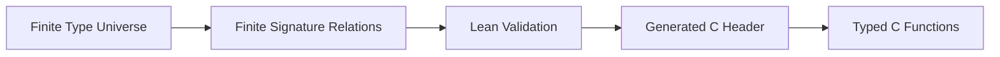
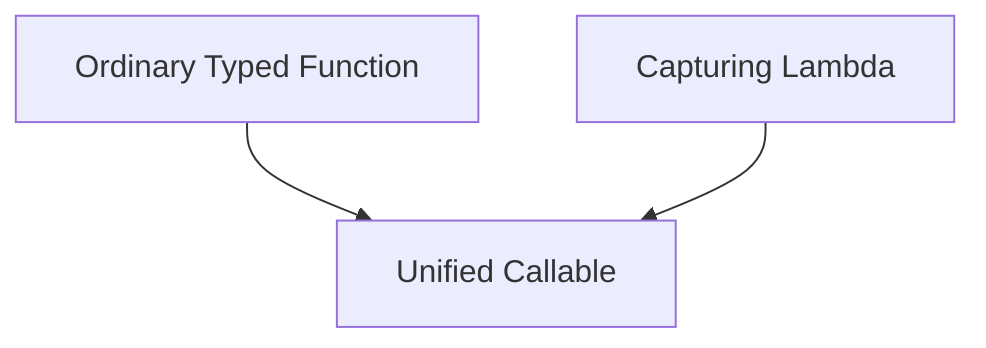
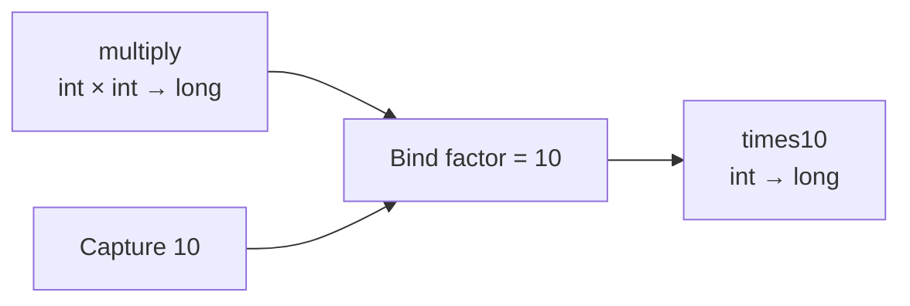

# Chapter 3: From Function Pointers to Executable Objects — Callback, Lambda, and Bind

> **Chapter path**
>
> The first two chapters collapsed repeated type contracts into Generic / typed C. Chapter 3 deals with another common kind of contract loss in C: callbacks.
>
> Start with a completely normal C interface:
>
> ~~~c
> typedef void (*task_fn)(void *ctx);
>
> typedef struct task {
>     task_fn fn;
>     void *ctx;
> } task;
>
> static void task_run(const task *t)
> {
>     t->fn(t->ctx);
> }
> ~~~
>
> This interface is flexible and thoroughly C-like.
>
> But what the caller really means may be:
>
> ~~~c
> typedef struct square_ctx {
>     int value;
>     long *result;
> } square_ctx;
>
> static void square_task(void *ctx)
> {
>     square_ctx *s = ctx;
>     *s->result = (long)s->value * s->value;
> }
> ~~~
>
> Once behavior has been erased into `task_fn + void *`, the library no longer knows:
>
> ~~~text
> What is the input type?
> What is the output type?
> Who owns the capture lifetime?
> Can two callbacks be composed?
> May this callable be used as Filter / Map / Reduce?
> May an optimizer rely on PURE / IDEMPOTENT / ASSOCIATIVE?
> ~~~
>
> So this chapter is not about “inventing Lambda syntax for C.” It solves a concrete problem:
>
> **How can a callback retain enough type, capture, and dispatch contract after it has been stored and composed?**
>
> The evolution remains deliberately finite:
>
> ~~~text
> typed function pointer
>     ↓
> normalized finite signature
>     ↓
> callable representation
>     ↓
> capture / bind / generator
>     ↓
> effects / property claims
>     ↓
> Graph-ready behavior
> ~~~
>
> A Plain C function pointer remains the baseline. Callable is introduced only when composition, storage, or analysis truly needs more information.

This moves the first two chapters from “typed data” to “typed behavior.”

The next chapter will use these Callables directly and preserve the relationships between several behaviors as a Graph.

---

## 1. Ordinary Function Pointers Are Fast but Know Very Little

A plain callback in C can be:

```c
typedef long (*mapper_fn)(int);
```

Then:

```c
long square(int value)
{
    return (long)value * value;
}

mapper_fn fn = square;
```

This is already excellent.

Calling:

```c
long result = fn(10);
```

adds no complicated runtime and no extra object.

But if we hand:

```c
fn
```

to a generic library, that library knows very little about it.

If the type has already been erased by the surrounding API, all that may remain is:

```c
void (*fn)(void *);
```

plus:

```c
void *user;
```

This is one of the most common callback patterns in traditional C.

It is flexible, but its weakness is clear:

```text
the function's real type and semantics
gradually become
a convention between caller and implementation
```

---

## 2. An Execution System Wants More Than a Function Address

For:

```c
long square(int x);
```

we actually know many facts:

```text
name        = square
input       = int
output      = long
arity       = 1
```

If it is a pure mathematical function, we may also know:

```text
PURE
DETERMINISTIC
TOTAL
```

For:

```c
User load(const char *path);
```

we may instead have:

```text
String -> User

IO
MAY_FAIL
```

These facts are unnecessary for a direct function call.

But they become important once we want:

```text
function composition
Graph
Executor
optimization
parallel execution
verification
```

So a function, like a type, needs to become a real described object.

---

## 3. First Step: Normalize Function Signatures

The previous chapter established a finite type universe.

Function types can be built on the same universe.

The simplest forms are:

```text
Unary

T -> U
```

For example:

```text
int -> long
User -> bool
```

Binary:

```text
Binary

T × U -> V
```

For example:

```text
long × long -> long
```

And one especially useful form is:

```text
Generator

T -> 0..N U
```

where one input can produce several outputs.

For example:

```text
String -> Character*
```

A function type is no longer only a C declarator.

It can have a stable:

```text
Signature Identity
```

---

## 4. Why the Signature Universe Must Also Be Finite

Combinatorial explosion appears immediately.

Suppose the system knows:

```text
20 types
```

Generating every possible:

```text
T -> U
```

already gives:

```text
20 × 20
```

Every:

```text
T × U -> V
```

gives:

```text
20³
```

Most of those function types will never exist in the real program.

So we use exactly the same strategy as before:

> **do not generate all theoretically possible functions; describe only the finite relations that the system really admits.**

If the only signatures are:

```text
int  -> int
int  -> bool
int  -> long
long -> double

long × long -> long
```

then generate only those.

This directly reduces:

```text
generated typedef
signature enum
dispatch branch
header size
compile time
ABI surface
```

---

## 5. Lean Can Validate the Finite Function-Type System

Once the signature set grows, it is useful to validate the finite relation formally.

Lean can check:

```text
every input/output type exists
there are no duplicate signatures
relations do not reference unknown types
generation order is stable
```

The validated finite signature manifest can then be emitted as an ordinary C header.

Conceptually:



Lean does not participate in function execution.

Its role is:

> **help determine which function types are valid and exist.**

When the program later executes:

```c
result = fn(value);
```

it is still ordinary C.

---

## 6. From Function Pointer to Callable

Once signatures exist, we can keep:

```text
function address
```

together with:

```text
function semantics
```

Conceptually:

```text
Callable
    ├── Signature
    ├── Function
    ├── Effects
    ├── Properties
    ├── Dispatch
    └── Capture
```

The most basic information is:

```text
Signature
```

such as:

```text
int -> long
```

Then:

```text
Effects
```

describe what external impact the function may have:

```text
PURE
STATEFUL
ASYNC
IO
MAY_FAIL
```

And:

```text
Properties
```

describe positive guarantees:

```text
DETERMINISTIC
TOTAL
NO_ALIAS
IDEMPOTENT
ASSOCIATIVE
```

A callback is no longer merely:

```text
0x7ff12340
```

It can become:

```text
square
    type       = int -> long
    effect     = PURE
    properties = DETERMINISTIC | TOTAL
```

---

## 7. Why Effects and Properties Must Be Separate

These ideas are easy to conflate.

Effects describe:

> **what the function may do.**

For example:

```text
IO
STATEFUL
MAY_FAIL
```

Properties describe:

> **what the function guarantees.**

For example:

```text
DETERMINISTIC
TOTAL
ASSOCIATIVE
```

So:

```text
PURE
```

is primarily about absence of side effects.

Whereas:

```text
ASSOCIATIVE
```

is a positive mathematical property.

They are used differently by later optimization.

For example, Map Fusion may require functions to have no effects that make reordering illegal.

Parallel Reduce may require a reducer to claim:

```text
ASSOCIATIVE
```

The function itself has started to become:

```text
data that can be analyzed
```

---

## 8. First Execution Form: Directly Call an Ordinary C Function

Even after introducing Callable, the most important rule remains:

> **if a function can be called directly, do not add runtime indirection merely for abstraction's sake.**

For:

```c
long square(int x);
```

if the build/control plane already knows the signature, execution should still be allowed to become:

```c
result = square(value);
```

So Callable should preserve a:

```text
Canonical Raw Target
```

Conceptually:

```text
Callable Metadata
      ↓
validated
      ↓
actual execution
      ↓
Typed C Function Pointer
```

Metadata helps us validate and optimize without forcing the hot path through a universal interpreter.

---

## 9. Second Execution Form: Adapter

Not every generic execution context knows the concrete C function type statically.

A generic executor may receive only:

```text
Callable
```

So it needs a unified:

```text
invoke
```

protocol.

Conceptually:

```c
invoke(
    callable,
    out,
    args
);
```

This performs:

```text
erased arguments
    ↓
validated signature
    ↓
recover typed arguments
    ↓
call real C function
    ↓
write output
```

The important rule is still:

> **signature validation should happen ahead of execution, not be derived again for every value.**

A better flow is:

```text
Control Plane

Callable
   ↓
Bind / Validate Signature
   ↓
Select Adapter


Hot Path

Adapter
   ↓
Typed Function
```

---

## 10. One of the Largest Problems in Traditional C Callbacks: Context

When a callback needs external parameters, C often uses:

```c
void callback(void *user, int value);
```

with:

```c
typedef struct {
    int factor;
} context;
```

and:

```c
context ctx = { 10 };

register_callback(callback, &ctx);
```

This pattern has worked for decades and is extremely effective.

Its weakness is equally clear:

```text
function pointer
and
context pointer
```

are independent objects.

The caller must manage:

```text
when context is created
when it is destroyed
whether it is still alive when callback runs
whether it may be shared
whether it may be copied
```

That is manageable for a simple callback.

It becomes much harder when functions are:

```text
stored
composed
copied
inserted into a Graph
compiled into a Plan
```

---

## 11. C++ Lambda Provides a Good Conceptual Answer

C++ can write:

```cpp
int factor = 10;

auto scale = [factor](int x) {
    return x * factor;
};
```

Conceptually, this is simply:

```text
Function
+
Captured Data
```

It can be imagined as:

```cpp
struct Closure {
    int factor;

    int operator()(int x) {
        return x * factor;
    }
};
```

In other words:

> **the function and the context it needs become one complete value.**

Once Callable exists, C can implement the same core idea in a smaller, explicit form.

---

## 12. Building a Finite Lambda in C

Conceptually:

```c
lambda(
    map,
    value,
    long,
    scale,
    int, x,
    int, factor)
{
    return (long)x * factor;
}
```

Then:

```c
scale(10)
```

does not call the function.

It constructs a:

```text
Callable
```

with:

```text
Signature = int -> long
Capture   = 10
Invoke    = scale implementation
```

At invocation time:

```text
input = x
capture = factor
```

and the actual operation remains:

```c
result = x * factor;
```

This is a very small closure model.

---

## 13. Why Capture Uses Inline Storage

If Lambda immediately required:

```text
heap allocation
reference counting
GC
closure object hierarchy
```

the design would become heavy very quickly.

But many real captures are small:

```text
one integer
one threshold
one pointer
a few configuration fields
```

So a simpler design is:

```text
Callable
    └── fixed-size inline capture
```

For example, within:

```text
32 bytes
```

the capture can be copied directly into the Callable value.

Then:

```text
copy Callable
```

means:

```text
copy Function Metadata
+
copy Capture
```

The lifetime stays simple.

There is no hidden allocation.

---

## 14. Multiple Captures Can Be an Ordinary Struct

If a callback needs:

```text
factor
offset
limit
```

there is no reason to invent a second capture grammar.

Use ordinary C:

```c
typedef struct {
    int factor;
    int offset;
    int limit;
} TransformConfig;
```

Then:

```text
Capture = TransformConfig
```

This is another long-term rule:

> **If ordinary C already solves the problem, keep using ordinary C.**

The Meta layer only needs to carry that ordinary C object by value inside the Callable.

It does not need a new object model.

---

## 15. Lambda Is About the Callable Representation, Not the Surface Syntax

A later DSL may provide:

```c
lambda(...)
```

But the important question is not:

```text
does it look like C++ lambda syntax?
```

The important point is that it ends as:

```text
the same Callable
```

Conceptually:



Higher layers should not need a different executor merely because behavior came from a lambda.

Otherwise the abstraction keeps fragmenting.

---

## 16. Third Execution Form: Bind

Once Capture exists, another useful operation follows naturally:

```text
Partial Application
```

Suppose the original function is:

```c
long multiply(int x, int factor);
```

Its type is:

```text
int × int -> long
```

If:

```text
factor = 10
```

is fixed, we can construct:

```text
times10
```

whose type is:

```text
int -> long
```

This solves the same problem as C++:

```cpp
std::bind(
    multiply,
    std::placeholders::_1,
    10);
```

---

## 17. Bind Is Still Just Capture

For:

```text
multiply
    int × int -> long
```

after:

```text
Bind factor = 10
```

we have:

```text
Callable
    function = multiply
    capture  = 10
    exposed signature = int -> long
```

Conceptually:



Bind does not need to become a separate runtime.

It remains:

```text
Callable + Capture
```

---

## 18. Bind Is More Than “Saving an Argument”

It changes the function type.

Originally:

```text
F : A × B -> C
```

Bind:

```text
b : B
```

and obtain:

```text
bind(F, b) : A -> C
```

This is a real:

```text
Type Transformation
```

So the earlier:

```text
Signature
Type Relation
Finite Inference
```

now operate on function composition itself.

The type system is no longer metadata for its own sake. It begins to help construct new program objects.

---

## 19. Fourth Form: Generator

Ordinary functions usually look like:

```text
1 input
    ↓
1 output
```

For example:

```text
Map
```

But many data-processing operations are not one-to-one.

For example:

```text
flatMap
```

can expand:

```text
1 input
```

into:

```text
0..N outputs
```

For example:

```text
"abc"
    ↓
'a'
'b'
'c'
```

So we also need:

```text
Generator Callable
```

Its core is not a single returned value. It maintains a:

```text
cursor
```

and repeated calls may return:

```text
VALUE
VALUE_AND_DONE
DONE
ERROR
```

Such a Callable represents:

```text
T -> 0..N U
```

---

## 20. Why Generator Should Use the Same Callable Model

It is easy to invent a separate:

```text
GeneratorObject
```

But then every higher layer has to understand two function-object systems.

A better design is:

```text
Callable
    ├── invoke
    └── generate
```

Ordinary unary/binary behavior uses:

```text
invoke
```

Generator uses:

```text
generate
```

So the surface gains:

```text
ordinary function
lambda
bind
generator
```

while the underlying representation remains finite.

---

## 21. There Are Only a Few Real Execution Paths

From the user's point of view, behavior may appear as:

```text
ordinary C function
Named Typed Callback
Lambda
Bind
Generator
```

But internally it can converge to:

```text
Raw Call
Adapter Invoke
Generator
```

| User form | Capture | Primary execution |
|---|---:|---|
| ordinary typed function | none | Raw / Adapter |
| Named callable | none | Raw / Adapter |
| Lambda | yes | Adapter |
| Bind | yes | Adapter |
| Generator | optional | Generate |

This is an important complexity-control technique:

> **increase expressive forms without increasing execution mechanisms at the same rate.**

---

## 22. Why Callable Also Needs Effects and Properties

If Callable existed only to call a function:

```text
signature + pointer
```

would be enough.

But later we want:

```text
composition
Graph
optimization
parallel execution
```

and then we need more knowledge.

For:

```text
f : int -> int
```

can it safely be called repeatedly?

Can:

```text
f(g(x))
```

be reordered?

Can it modify external state?

So:

```text
Signature
```

answers:

> Are the types compatible?

while:

```text
Effects / Properties
```

answer:

> What can this function do semantically?

---

## 23. Example: Why PURE Matters

Suppose we have:

```text
Map(f)
Map(g)
```

If:

```text
f
g
```

are pure functions, two stages may be fusible into:

```text
Map(g ∘ f)
```

But if:

```text
f
```

can:

```text
write file
update global state
```

some transformations may change observable behavior.

So:

```text
PURE
```

is not decorative metadata.

It can directly affect:

```text
Graph optimization legality
```

---

## 24. Example: Why ASSOCIATIVE Matters

Suppose:

```c
long add(long a, long b);
```

is used for:

```text
Reduce
```

If:

```text
(a + b) + c
=
a + (b + c)
```

then:

```text
1 2 3 4
```

can be split into:

```text
(1 + 2)
and
(3 + 4)
```

then combined as:

```text
3 + 7
```

This provides the mathematical basis for:

```text
Parallel Reduce
```

So:

```text
ASSOCIATIVE
```

can influence whether an executor is allowed to parallelize.

---

## 25. A Property Declaration Is Not a Mathematical Proof

This boundary is essential.

If a programmer writes:

```text
IDEMPOTENT
```

that does not make the function satisfy:

```text
f(f(x)) = f(x)
```

For example:

```c
int increment(int x)
{
    return x + 1;
}
```

If it is incorrectly marked:

```text
IDEMPOTENT
```

metadata alone cannot prevent the false claim.

So we must distinguish:

```text
Property Declaration
```

from:

```text
Semantic Law
```

---

## 26. Lean Starts to Play a Deeper Role Here

A real idempotent law:

```text
∀x, f(f(x)) = f(x)
```

can be defined precisely in Lean.

Then we can prove:

```text
if f satisfies this Law,
then
f ∘ f
can be safely simplified to
f
```

So:

```text
C Metadata
```

says:

> the program claims to have a property.

Lean says:

> what transformations that property actually authorizes in the mathematical model.

This becomes the foundation for verified optimization later.

---

## 27. From Callable Representation to a Verifiable Contract

At this point, behavior has evolved from a raw address into a finite, checkable Callable representation. Signature defines the type boundary; capture/context carries environment; dispatch authority identifies the real invocation path; effects/properties provide analysis metadata; and a Plain C function pointer remains the baseline.

Composition, Bind, and semantic properties will matter again in Graph and optimizer chapters, so we do not insert another conceptual “Callable Algebra → Graph” detour here. The rest of the chapter tightens these ideas into an implementable contract, then checks Lean laws, the current C representation, lifetime/ABI/performance evidence, and the canonical callables reused by Graph.

---

## 28. Semantic Contract: What Does Callable Promise?

“Callable is convenient” is not a sufficient contract. We need precise, implementable guarantees.

### 28.1 Signature Is the First Gate for Composition

A Callable first has a finite, explicit function type:

~~~text
A -> B
A × B -> C
A -> 0..N B
~~~

When Graph or Stream connects two Callables, the first requirement is:

~~~text
output type of f
    compatible with
input type of g
~~~

If the relation does not hold, failure should occur during:

~~~text
build / admission
~~~

rather than by guessing from `void *` at runtime.

### 28.2 Capture Must Have an Explicit Lifetime

The core of Lambda / Bind is not syntax sugar. It is:

~~~text
invoke code
+
captured environment
~~~

So the design must answer:

- is capture copied, borrowed, or owned?
- what alignment does capture require?
- what is the maximum inline-storage capacity?
- beyond that capacity, is the result compile-time failure, an explicit heap path, or unsupported?
- when a Callable is copied, what happens to capture?
- who destroys it?
- is cross-thread use allowed?

Without these answers, “Lambda” merely hides the old `void *` context problem.

### 28.3 Callable Instance Is Not the Same as Function Address

Two Callables:

~~~text
times10 = bind(multiply, 10)
times20 = bind(multiply, 20)
~~~

may share the same invoke function.

They are still different callable instances.

Therefore:

~~~text
function pointer equality
~~~

must not be treated as:

~~~text
callable semantic equality
~~~

This is the same design pattern as the previous chapter:

~~~text
descriptor address
≠
semantic type identity
~~~

### 28.4 Effects and Properties Are Metadata First

Even when separated into:

~~~text
Effects:
IO
STATEFUL
MAY_FAIL

Properties:
DETERMINISTIC
IDEMPOTENT
ASSOCIATIVE
~~~

we must remain conservative.

If the bits come from programmer declarations, they are first of all:

~~~text
claims
~~~

They may support:

- diagnostics;
- conservative admission;
- scheduling restrictions;
- requiring an additional certificate;

but seeing:

~~~text
ASSOCIATIVE
~~~

does not by itself prove:

~~~text
arbitrary reassociation is semantically equivalent
~~~

Only a semantic law can authorize the rewrite.

---

## 29. Lean: From Property Labels to Verifiable Callable Algebra

Lean becomes more useful here than in the previous chapter.

The previous chapter mainly checked whether finite relations were well formed.

Here we ask:

> **Under which premises may a function relation be safely composed, simplified, or reordered?**

### 29.1 Signature Composition

If:

~~~text
f : A -> B
g : B -> C
~~~

then we can form:

~~~text
compose g f : A -> C
~~~

But:

~~~text
f : A -> B
g : X -> C
B != X
~~~

must not enter a valid graph.

Finite signature modeling and C build-time checks can share responsibility here.

### 29.2 Idempotent Law

The real law is:

~~~text
forall x, f (f x) = f x
~~~

Only then can we prove:

~~~text
f ∘ f
=
f
~~~

The theorem says:

> if `f` satisfies the law, then the rewrite preserves semantics.

It does not prove that every C function tagged IDEMPOTENT actually satisfies the law.

### 29.3 Associative Law

Similarly:

~~~text
op (op a b) c
=
op a (op b c)
~~~

can authorize a specific regrouping of a reduction tree.

But if the real C operation involves:

~~~text
floating-point rounding
overflow
external state
error ordering
~~~

we must first define observable semantics and then decide whether the theorem applies.

This is one way formalization can improve the API itself:

> an overly broad ASSOCIATIVE bit may not be strong enough to describe the execution conditions under which reordering is truly safe.

### 29.4 Proof-Carrying Admission

A later optimizer can increasingly use:

~~~text
metadata claim
      ↓
admission condition
      +
trusted primitive / proof / certificate
      ↓
semantic rewrite enabled
~~~

instead of:

~~~text
bit is set
      ↓
rewrite blindly
~~~

Lean does not enter the hot path, but it changes the safety boundary of the C optimizer.

---

## 30. C Implementation: Rich Surface, Few Execution Paths

The implementation goal is not to create more and more runtime objects.

It is the opposite:

> **surface forms may grow richer, but the underlying execution mechanisms should converge.**

Conceptually, a Callable representation may contain:

~~~c
typedef struct callable {
    const signature_desc *signature;

    callable_invoke_fn invoke;

    effect_set effects;
    property_set claims;

    capture_storage capture;
} callable;
~~~

The field names are not the point.

The important contract is:

~~~text
signature
    → type compatibility

invoke
    → one of a small number of execution paths

capture
    → explicit bounded environment

effects / claims
    → analysis metadata, not automatic proof
~~~

### 30.1 Raw Function Remains the Baseline

If the user has only:

~~~c
long square(int x);
~~~

and the system does not need to store, compose, or analyze it, then it should simply call:

~~~c
square(x);
~~~

Callable should not become an object layer through which every function must pass.

### 30.2 Adapter Cost Must Be Explainable

Erased dispatch or capture uses an adapter only when needed:

~~~text
typed call
    ↓
adapter
    ↓
capture + input
    ↓
ordinary C function
~~~

We should know:

- is there an extra indirect call?
- how large is the capture copy?
- is there any allocation?
- is alignment statically known?
- is there a destructor?

### 30.3 Inline Capture Must Be Bounded

Inline storage is not valuable because it “looks more like lambda.”

Its value is:

~~~text
no hidden allocation
+
known maximum object size
+
predictable ownership
~~~

Crossing the bound must be explicit.

This is the same design philosophy later used by bounded mailboxes and bounded executor queues.

### 30.4 The Salts Snapshot: Callable Is Already an Explicit C Value Representation

To ground the design in the current implementation:

~~~text
qigao/salts
snapshot: ad389928b437c0612c1c60844fe53677f3ed27a6
~~~

The central object in that snapshot is `cmeta_callable`. To emphasize responsibilities first, the following is a **simplified shape**, not a copy-paste source excerpt; exact typedef names remain defined by the snapshot headers:

~~~text
cmeta_callable {
    cmeta_fn meta
    resolve callback
    invoke callback
    generate callback
    dispatch authority
    capture_size
    inline capture storage
}
~~~

Its metadata continues to store:

~~~text
finite signature id
typed raw target
effects
properties
~~~

So the earlier design has become a real representation:

~~~text
Typed Function
+
Semantic Metadata
+
Explicit Dispatch
+
Bounded Capture
~~~

rather than four incompatible runtime hierarchies such as FunctionObject, LambdaObject, BindObject, and GeneratorObject.

The inline-capture limit in that snapshot is explicitly:

~~~text
CMETA_CAPTURE_INLINE = 32 bytes
~~~

Small closures can therefore be copied together with the Callable value, while larger objects are not silently converted into hidden heap allocation.

This is a concrete example of:

> **bounded representation makes runtime cost visible**

### 30.5 Dispatch Authority Must Be Data, Not Guesswork

The snapshot representation stores an explicit dispatch tag.

This small choice matters.

If the object may contain:

~~~text
raw typed target
adapter invoke
generator entry
captured state
~~~

the runtime should not follow a rule like:

~~~text
if this pointer is non-null, maybe call it
~~~

A stronger design is:

~~~text
construction / admission
      ↓
resolve metadata
validate semantic contract
select authoritative dispatch
      ↓
execution
      ↓
follow one known path
~~~

Complexity is paid before the hot path.

### 30.6 The Later Direct Path Already Consumes This Knowledge

The current CFlow direct-admission path already uses structural information from Callable.

A simple direct candidate may care about:

~~~text
signature admitted?
capture_size == 0?
effects are pure?
required properties present?
dispatch/target supports direct execution?
~~~

This validates an important claim from this chapter:

> **adding metadata to Callable is not about doing more work on every call; it is about giving Graph/Plan enough knowledge to remove dynamic work before execution.**

From Chapter 3 onward, the reader should keep this counterintuitive but recurring principle in mind:

~~~text
richer control-plane object
        ↓
stronger admission knowledge
        ↓
simpler execution path
~~~

---

## 31. Evidence: Compare Callable Against the Plain C Baseline

The evidence cannot stop at “it can be invoked.”

### 31.1 Compile-Time Evidence

Validate:

~~~text
signature match
    → accepted

signature mismatch
    → fail early

unsupported capture form
    → explicit failure
~~~

### 31.2 Lifetime Evidence

At minimum test:

- capture copy;
- capture destroy;
- alignment;
- multiple Callable instances sharing one invoke function;
- lifetime boundaries of borrowed capture;
- no use-after-free under sanitizers.

### 31.3 Multi-TU / ABI Evidence

Named Callable or generated signature information should work across Translation Units without depending on a header-local object's address.

### 31.4 Performance Evidence

At minimum compare:

~~~text
direct C call
typed wrapper
adapter/erased callable
capturing callable
~~~

Record:

- compiler;
- optimization level;
- hot/cold call context;
- whether inlining occurred;
- capture size.

The goal is not to prove that “Callable is always zero-cost.”

The goal is to tell the reader:

> **when it is equivalent to a direct call, and when expressiveness really costs an extra dispatch/capture operation.**

### 31.5 Contract-Admission Evidence

In addition to checking output correctness, test that metadata itself cannot create contradictory states.

For example:

~~~text
TOTAL + MAY_FAIL
invalid signature
invalid dispatch
oversized capture
~~~

should fail at construction/admission instead of entering Graph execution.

The current CMeta implementation already has a shared effect/property consistency boundary. Such tests are direct evidence that “semantic metadata” is not merely a bag of bits.

### 31.6 Runtime Invocation Evidence

The same Callable contract should cover:

~~~text
ordinary typed raw target
adapter-only path
capturing path
generator path
invalid metadata path
~~~

The point is not that these implementations are internally identical. The point is:

> **different surface representations follow the same observable invocation contract.**

That is what later allows Graph to treat them uniformly as node behavior.

---

## 32. Canonical Example: Three Callables Ready for Graph

From this chapter onward, we establish the data-flow example reused throughout Part II:

~~~text
is_even : int -> bool
square  : int -> int
sum     : int × int -> int
~~~

Plain C can simply declare:

~~~c
bool is_even(int x);
int square(int x);
int sum(int a, int b);
~~~

After they enter the Callable layer we additionally know:

~~~text
signature
effects
property claims
optional certificate / trusted law
~~~

The functions themselves may still be ordinary C.

The next chapter stops looking at them individually and saves their relationship:

~~~text
Source<int>
    ↓
Filter(is_even)
    ↓
Map(square)
    ↓
Reduce(sum)
~~~

That is the Graph.

---

## 33. What We Learned

This chapter crosses from:

~~~text
typed data
~~~

to:

~~~text
typed behavior
~~~

The point is not the surface syntax of Lambda or Bind. It is:

1. **Plain function pointer remains the baseline.**
2. **Signature makes behavior type-aware.**
3. **Capture makes environment explicit.**
4. **Finite dispatch prevents surface features from multiplying runtime mechanisms.**
5. **Effects / Properties are not automatically proofs.**
6. **Semantic laws are what authorize verified rewrites.**
7. **Lean lives in the control/trust plane, not the call hot path.**
8. **Costs such as indirect dispatch and capture storage must be measured, not hidden.**

Graph no longer looks like “adding another framework.”

It is simply the next natural question:

> **If a Callable can become data, why cannot the computation relationship between several Callables become data too?**

---

**Summary: A Function Becomes a Program Object Instead of Only a Code Address**

A traditional C callback is:

~~~text
Function Pointer
+
void * Context
~~~

That is simple and efficient.

But once the system needs:

~~~text
type checking
composition
derivation
optimization
asynchrony
Graph
Executor
~~~

more information must be retained.

So a function becomes:

~~~text
Callable
    =
Typed Function
+
Signature
+
Effects
+
Properties
+
Optional Capture
+
Dispatch
~~~

On top of the same representation we can naturally build:

~~~text
capture similar to C++ Lambda
partial application similar to std::bind
Generator Callback
~~~

while still converging to a few simple C invocation mechanisms.

Lean does not execute callbacks. It helps validate:

~~~text
finite Signature Universe
function relations
Semantic Laws
allowed derivations and optimizations
~~~

From this chapter onward, Meta describes not only:

~~~text
"what data is"
~~~

but also:

~~~text
"what behavior is"
~~~

The next chapter asks the larger question:

> **If a Callable can become data, can several Callables become a larger, inspectable, derivable, executable data object?**

The answer is:

**Graph**

and Graph is where CFlow truly begins.
