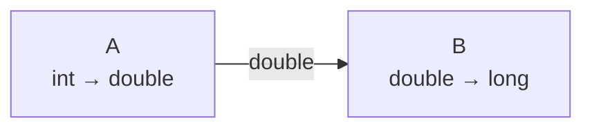
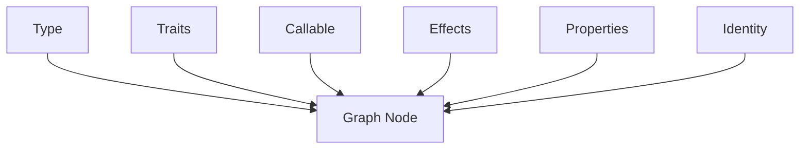
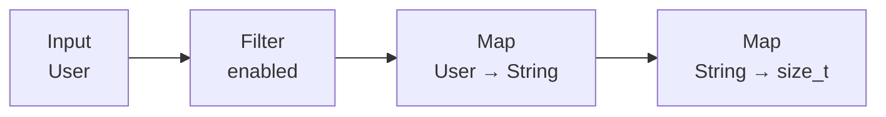
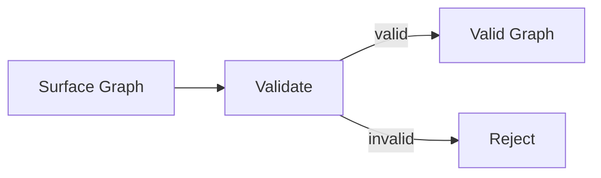
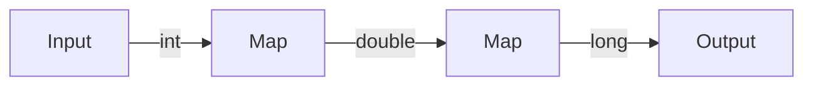
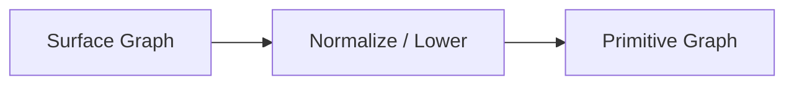

# Chapter 4: From Callable to Graph — Make the Computation Itself Data

> **Chapter path**
>
> The first three chapters solved “write each fact once”: type contracts converged through Generic, and behavior contracts converged through Callable.
>
> Part II begins with a different question:
>
> **Why save a correct C computation as a Graph at all?**
>
> Start with ordinary C:
>
> ~~~c
> static bool is_even(int x)
> {
>     return (x & 1) == 0;
> }
>
> static int square(int x)
> {
>     return x * x;
> }
>
> long sum_even_squares(const int *xs, size_t n)
> {
>     long total = 0;
>
>     for (size_t i = 0; i < n; ++i) {
>         int x = xs[i];
>         if (!is_even(x))
>             continue;
>         total += square(x);
>     }
>
>     return total;
> }
> ~~~
>
> There is nothing wrong with this code. For a one-off local computation it is often the best implementation.
>
> The issue is that **once it is expressed only as control flow, the relationship Filter → Map → Reduce disappears.**
>
> Before execution, a library can no longer inspect, type-check, normalize, rewrite, or compile the computation as an object, nor prove that a transformation preserves the observable result.
>
> Graph exists not to replace the for-loop, but to preserve the whole computation before execution.
>
> The chapter keeps using one canonical pipeline:
>
> ~~~text
> Source<int>
>     ↓
> Filter(is_even)
>     ↓
> Map(square)
>     ↓
> Reduce(sum)
> ~~~
>
> This chapter first establishes a typed program object. Lean is not the reason Graph exists; Lean enters only after we ask whether normalize / rewrite / optimization preserves semantics.

## 1. The Plain C Problem Is Not “It Cannot Compute,” but “We Cannot See the Whole Computation Before It Runs”

Split the loop slightly and the business relationship becomes clearer:

~~~c
for (size_t i = 0; i < n; ++i) {
    int x = xs[i];

    /* Filter */
    if (!is_even(x))
        continue;

    /* Map */
    int y = square(x);

    /* Reduce */
    total += y;
}
~~~

The stable knowledge is really only:

~~~text
Source<int>
Filter(int -> bool)
Map(int -> int)
Reduce(int × int -> int)
~~~

But in ordinary C these facts are scattered across `for`, `if`, `continue`, a temporary, and accumulator updates.

If all we want is to execute the computation, Graph is unnecessary.

If we want to ask:

~~~text
Can two Maps be fused?
Can this Filter move earlier?
Can this pipeline be compiled once and executed many times?
Does this execution plan still correspond to the original computation?
~~~

then the library first needs one thing:

> **a structured representation of the computation before execution.**

That is the starting point of a CFlow Graph.

Graph saves a relationship that previously existed only in control flow as ordinary C data. Stream, Optimizer, Plan, and Direct/AOT then consume the same facts instead of independently reinterpreting user intent.

---

## 2. A Node Should Not Be Only a Callback

The simplest Graph Node might be:

```c
struct Node {
    function_pointer fn;
};
```

But then all the type and semantic knowledge from previous chapters is lost.

A stronger Node should know:

```text
Operator
Input Type
Output Type
Callable
Effects
Properties
```

For example:

```text
Map Node

Input Type  = User
Output Type = String
Callable    = user_name
Effects     = PURE
Properties  = DETERMINISTIC | TOTAL
```

Or:

```text
Filter Node

Input Type  = User
Output Type = User
Predicate   = enabled : User -> bool
```

A Node is no longer merely:

> call a function.

It is:

> **a computation unit with explicit input, output, and semantics.**

---

## 3. Edge Also Gains Type Meaning

In an ordinary graph:

```text
A -> B
```

means only “connected.”

In a Typed Graph the edge also means:

```text
A.output_type
    ==
B.input_type
```

For example:

```text
A
int -> double

B
double -> long
```

can connect:



But:

```text
A
int -> double

B
String -> User
```

cannot connect directly.

So Graph itself already contains a:

```text
Type Constraint System
```

instead of waiting until B executes to discover:

```text
the incoming value has the wrong type
```

---

## 4. Errors Can Move Forward to Construction Time

A traditional callback pipeline can easily look like:

```text
Callback A
    ↓
void *
    ↓
Callback B
```

If both sides accept:

```text
void *
```

the compiler has little help to offer for the real payload.

The problem often appears only at:

```text
runtime
```

A Typed Graph can check during:

```text
Graph Build
```

that:

```text
Node A output type
Node B input type
```

are compatible.

If not:

```text
the Graph is invalid
```

and execution never begins.

This creates an important rule used throughout the rest of the book:

> **reject at construction time whatever can be rejected at construction time.**

---

## 5. Graph Is the First Real Composition of All Earlier Meta Capabilities

At this point the capabilities from the previous chapters enter one complex object together.



`Type` tells Graph:

```text
what the data is
```

`Callable` tells Graph:

```text
what to execute
```

`Effects / Properties` tell Graph:

```text
what semantics the operation claims
```

`Type Identity` keeps these facts comparable across:

```text
multiple Translation Units
Library
Generated Metadata
```

This makes Graph an excellent test of whether the earlier design really composes.

---

## 6. The First Natural Graph Use Case Is Complex Data Transformation

With:

```text
Typed Node
+
Typed Edge
```

the most natural first use is:

```text
Data Transformation
```

For example:

```text
User
 ↓
check enabled
 ↓
User
 ↓
get name
 ↓
String
 ↓
take length
 ↓
size_t
```

can be represented as:



The structure describes:

```text
how data changes step by step
```

instead of:

```text
how a loop variable advances
what temporary variables are called
where continue appears
```

Business code can focus more on:

```text
Transformation
```

and less on:

```text
Iteration Mechanics
```

---

## 7. Ordinary C Loops Are Not the Problem

This needs to be explicit.

For example:

```c
for (size_t i = 0; i < count; ++i) {
    if (!enabled(&users[i]))
        continue;

    names[out++] = user_name(&users[i]);
}
```

This is:

```text
simple
direct
efficient
```

There is no reason to replace every loop merely because Graph exists.

Graph solves a different problem.

As transformations accumulate:

```text
Filter
Map
FlatMap
Limit
Skip
Reduce
Collect
```

and the same execution mechanics repeat across the program, we begin to see:

```text
repeated loops
repeated intermediate buffers
repeated error handling
repeated type conversion
```

Only then does separating:

```text
the transformation relationship
```

from:

```text
the execution mechanism
```

become valuable.

---

## 8. Graph Makes Relationships More Important Than Procedures

Suppose the user really wants to express:

```text
keep enabled Users
        ↓
take their names
        ↓
keep only the first 100
```

Graph can store:

```text
Filter(enabled)
Map(name)
Limit(100)
```

instead of:

```text
for
if
continue
counter++
break
```

A useful distinction is:

```text
Imperative C
    describes "how"

Graph
    describes "what"
```

Execution must eventually return to “how,” but that part can be handled later by an Executor or compiler.

---

## 9. Once Program Structure Is Data, We Can See the Whole Program

This is one of Graph's most important properties.

If:

```c
x = f(input);
y = g(x);
z = h(y);
```

has already executed, it is difficult for the system to suddenly ask while `h` runs:

```text
what was the complete computation before this point?
```

Graph owns:

```text
f
g
h
```

from the beginning.

So before execution it can ask:

```text
How many Nodes exist?
How do types propagate?
Are there invalid connections?
Is any Subgraph unreachable?
Can two Maps be fused?
Does an intermediate value need to exist at all?
```

That is the foundation of a small compiler.

---

## 10. Graph Naturally Introduces Validation

The first direct control-plane operation is:

```text
Validate
```

For example:

```text
Are all Nodes valid?
Do all Edges reference existing Nodes?
Are input/output Types continuous?
Does Callable Signature match Operator?
Do referenced Subgraphs exist?
Are illegal connections present after terminal Nodes?
```

Conceptually:



This is entirely:

```text
Control Plane
```

and happens before data is processed.

---

## 11. Graph Also Introduces Type Propagation

Suppose:

```text
Input
    output = int
```

Then:

```text
Map
    int -> double
```

changes the flow type to:

```text
double
```

Then:

```text
Map
    double -> long
```

produces:

```text
long
```

So `Type` is no longer only per-node metadata.

It flows through the Graph.



This is:

```text
Type Propagation
```

and becomes the basis of inference.

---

## 12. Some Operator Output Types Can Be Derived

For:

```text
Filter<T>
```

the predicate type is:

```text
T -> bool
```

but the stream output remains:

```text
T
```

So:

```text
Node output
```

is not always identical to:

```text
Callable return type
```

`FlatMap`, `Reduce`, and `Collect` also have their own type rules.

That means the earlier:

```text
Finite Relation
Inference
```

can be reused directly.

In other words:

```text
Operator
+
Callable Signature
+
Input Type
        ↓
Output Type
```

can itself be a finite derivation.

---

## 13. Graph Starts to Become a Typed IR

At this point Graph is no longer merely:

```text
runtime callback graph
```

It is closer to an:

```text
Intermediate Representation
```

because it stores:

```text
computation semantics
type relations
structural relations
```

rather than concrete machine-execution steps.

A high-level Node such as:

```text
Filter
```

does not require:

```text
an if statement specifically
one independent callback call
a runtime node object
```

It means only:

> **retain values that satisfy the predicate.**

How that happens is a later concern.

---

## 14. High-Level Semantics and Low-Level Execution Become Separate

For example:

```text
Map
```

has one Graph meaning:

```text
T -> U
```

but may later:

```text
run in an interpreter
```

or:

```text
be compiled into a Plan
```

or even:

```text
be lowered to an ordinary C loop
```

So:

```text
Graph
```

answers:

> What does the computation mean?

and:

```text
Executor / Backend
```

answers:

> How will this instance execute?

This separation becomes one of the central layers of CFlow.

---

## 15. Why Not Let Graph Execute Itself Forever?

A simple first implementation can certainly do:

```c
for each node {
    switch (node->op) {
        case MAP:
            ...
        case FILTER:
            ...
    }
}
```

That is a perfectly reasonable first working version.

But if execution always works this way, every value may pay for:

```text
load Node
decode Operator
load Descriptor
check Signature
find next Edge
dynamic Dispatch
```

Much of this information stops changing as soon as the Graph is built.

For example:

```text
Node type
topology
Callable Signature
next Node
```

So it should not be recomputed for:

```text
every value
```

This leads to:

> **Control Plane and Execution Plane should be separated.**

---

## 16. Graph Construction May Do Complex Work

Graph Build can perform:

```text
Type Validation
Signature Validation
Topology Validation
Inference
Effect Analysis
Property Analysis
```

These operations may be relatively complex, but they run:

```text
once
```

or:

```text
a small number of times
```

and produce a:

```text
Validated Graph
```

The later hot path can then be much simpler.

This is:

```text
Build once
Execute many
```

For large data transformations, that trade-off is often exactly what we want.

---

## 17. Normalize / Lower Follows Naturally

A Surface Graph should first optimize for:

```text
expressiveness
```

not necessarily:

```text
ease of execution
```

A user-facing API may include higher-level Structured Operators that are convenient to understand but awkward for a runtime to execute directly.

So we add:

```text
Lower
```

or Normalize.



The high-level API owns:

```text
expressiveness
```

Primitive IR owns:

```text
execution simplicity
```

This is analogous to:

```text
Source Language
 ↓
IR
```

in a compiler.

---

## 18. From Typed Graph to Verifiable IR

The first seventeen sections establish the essential change: Node/Edge carry type and operator/callable knowledge; construction can validate and propagate types; Graph becomes a typed IR; and it may Normalize/Lower into a primitive representation that is easier to analyze and execute.

A unified IR will later support multiple frontends, optimizer passes, Plan, Reactive execution, and more, but those topics have their own chapters. This chapter stops before them and uses the canonical Callables from Chapter 3 to build one Graph, then defines topology/type/operator/snapshot contracts, Lean proof obligations, the current owning C IR, and verification/performance evidence.

Chapter 4 therefore answers one question only: **How do several typed Callables become inspectable and transformable program data without committing to an execution strategy?**

---

## 19. Canonical Example: Connect the Three Callables from Chapter 3

Chapter 3 prepared:

~~~text
is_even : int -> bool
square  : int -> int
sum     : int × int -> int
~~~

The most direct Plain C version is still good:

~~~c
long total = 0;
bool has_value = false;

for (size_t i = 0; i < n; ++i) {
    int x = input[i];

    if (!is_even(x))
        continue;

    int y = square(x);

    if (!has_value) {
        total = y;
        has_value = true;
    } else {
        total = sum(total, y);
    }
}
~~~

There is nothing wrong with it.

If the program has only this one fixed pipeline, ordinary C may still be the best implementation.

Graph becomes useful not because “for-loops are not modern,” but because the system wants to know before execution:

~~~text
Which stages exist?
What are their input/output types?
Which stages can drop values?
Which stages change cardinality?
Which Callables have effects/properties?
Which connections are invalid?
May the graph be normalized / optimized / compiled?
~~~

So the same computation can first be saved as:

~~~text
Input<int>
    ↓
Filter<int>(is_even)
    ↓
Map<int,int>(square)
    ↓
Reduce<int>(sum)
~~~

The essence is:

> **promote relationships that existed only in control flow into data that can be inspected and transformed.**

### 19.1 Graph Is Knowledge Before It Is an Execution Result

Once the relationships are saved, we simultaneously have:

~~~text
topology
types
operators
callables
effects
properties
parameters
nested subgraphs
~~~

Later stages can use this knowledge before any input value arrives.

So:

~~~text
Graph construction
    ↓
pay semantic/structural cost early

Graph execution
    ↓
use already-admitted structure
~~~

This is the **Pay Before Execution** pattern repeated throughout the book.

---

## 20. Semantic Contract: What Counts as a Valid Typed Graph?

Graph is not merely “an array of nodes.”

It needs at least four classes of contract.

### 20.1 Topology Well-Formedness

Every Edge must reference existing nodes/ports.

There must be no:

~~~text
dangling endpoint
invalid port
invalid nested subgraph reference
impossible entry/tail
~~~

This is structural validity.

### 20.2 Type Preservation Across Edges

If:

~~~text
node A output : T
node B input  : U
~~~

then:

~~~text
A -> B
~~~

must satisfy the semantic type-compatibility relation.

The connection is not valid merely because both payloads fit into `void *`.

For the canonical example:

~~~text
Input<int>
  -> Filter<int>
  -> Map<int,int>
  -> Reduce<int>
~~~

every type transition is part of admission, not a runtime cast guess.

### 20.3 Operator Contract

A Node does not only store a Callable.

The Operator itself has semantics:

~~~text
FILTER
    cardinality: 0..1
    output type: same as input

MAP
    cardinality: 1
    output type: callable return

FLAT_MAP
    cardinality: 0..N

REDUCE
    cardinality: N..1
~~~

So type derivation depends on:

~~~text
operator schema
+
callable signature
+
input type
~~~

rather than only on a function pointer.

### 20.4 Mutation / Snapshot Boundary

The owning IR may be mutated during Graph construction.

But once a Graph is handed to:

~~~text
normalize
optimize
compile
verify
execute
~~~

those stages must bind to a specific structural version.

If Graph structure changes behind their backs while Plan/Certificate continues using old assumptions, the trust boundary breaks.

Graph version is therefore not merely a debug counter.

It means:

> **which concrete IR snapshot does this downstream knowledge belong to?**

---

## 21. Lean / Proof Obligation: What Should the Graph Layer Prove First?

Chapter 4 does not need to prove all optimizer correctness at once.

The important work here is to establish Graph semantics.

### 21.1 Well-Formed Graph

Define a predicate:

~~~text
WellFormed(g)
~~~

covering at least:

~~~text
all node references valid
all edges reference valid ports
all edge types compatible
operator signatures admitted
nested graphs well formed
root/entry/exit valid
~~~

Later theorems can share the premise:

~~~text
WellFormed(g) → ...
~~~

instead of reproving structural validity for every rewrite.

### 21.2 Graph Observable Semantics

We must answer:

> What does it mean for two Graphs to have the same semantics?

A minimal model can treat a pure synchronous Graph as:

~~~text
input sequence
    ↓
zero or more output values / terminal result
~~~

and define:

~~~text
observe(g, input)
~~~

Later normalize/optimize theorems can state:

~~~text
observe(surface, input)
=
observe(normalized, input)
~~~

or a more general ObsEq.

Without observable semantics, “the structure is simpler” does not imply “the program is equivalent.”

### 21.3 Normalize Preservation

The first theorem Normalize should own is not “it is faster.” It is:

~~~text
WellFormed(surface)
→
ObsEq(surface, normalize(surface))
~~~

This law matters because:

~~~text
Surface Graph
~~~

and:

~~~text
Primitive / Normalized Graph
~~~

may be different physical representations while still denoting the same semantic program.

### 21.4 Lean Does Not Prove Graph Storage Layout

The proof boundary remains explicit.

Lean does not pretend to prove:

~~~text
malloc always succeeds
C struct ABI is identical on every compiler
cache layout is always faster
pointer lifetimes are always correct
~~~

Those are C implementation / toolchain / runtime evidence questions.

Formalization here proves:

~~~text
IR meaning
type relation
structural invariant
semantic preservation
~~~

---

## 22. Current C Implementation: Graph Is a Real Owning IR

Using the current Salts snapshot:

~~~text
qigao/salts
snapshot: ad389928b437c0612c1c60844fe53677f3ed27a6
~~~

the current CFlow Graph is not pseudocode.

It has explicit structure:

~~~text
cflow_graph
  owns subgraphs

cflow_subgraph
  owns nodes + edges

cflow_node
  stores op/callable/types/params/nested refs

cflow_edge
  stores typed topology coordinates
~~~

### 22.1 Edge Is an Explicit IR Row

In the snapshot, the public `cflow_edge` definition explicitly includes ports:

~~~c
typedef struct cflow_edge {
    cflow_node_id from;
    uint16_t from_port;
    cflow_node_id to;
    uint16_t to_port;
} cflow_edge;
~~~

Graph is therefore not limited to “the next operator in a linear array.”

Branch, Relation, and Subgraph can all use explicit topology in the same IR.

### 22.2 Node Stores Operator Semantics + Callable + Type Knowledge

A node's responsibility in the same snapshot can be summarized as:

~~~text
operator
optional callable
optional fused callable chain
input type
output type
nested subgraph references
typed semantic parameters
relation policy
~~~

This creates the real connection to the previous three chapters:

~~~text
CMeta Type
   +
CMeta Callable
   +
CFlow Operator Schema
   ↓
Typed Graph Node
~~~

Graph is the integration point of earlier Meta capabilities, not a second type system.

### 22.3 Graph Is an Owning Handle, but Rows Are Read-Only Introspection

The API draws a strong boundary:

~~~text
Graph builder functions
    → supported mutation API

node/edge/subgraph rows
    → read-only introspection
~~~

Direct mutation of storage/capacity is not a public contract.

This resolves a common C-library ambiguity:

> a public struct does not mean every field is freely writable by callers.

### 22.4 Version Binds Downstream Artifacts to a Specific Graph State

The owning Graph contains a process-local nonzero mutation token.

Successful mutation / clone / initialization updates the version; destroy returns it to zero.

So:

~~~text
optimizer trace
certificate
compiled plan
runtime admission
~~~

can explicitly answer:

> Am I still bound to the same unchanged Graph?

### 22.5 Normalize / Optimize Produce New Graphs

The current optimizer contract is:

~~~text
src = immutable normalized Graph
dst = new owned optimized Graph
~~~

rather than modifying the source while executing.

This is a strong engineering boundary:

~~~text
source meaning remains inspectable
+
transformation result owns new IR
+
verification can compare both sides
~~~

It also fits naturally with formal preservation proofs.

---

## 23. Evidence: A Complete C-Side Verification Chain

Chapter 4 needs more than “Graph validate returned true.”

The current code already supports a fuller verification pipeline:

~~~text
validate surface
    ↓
normalize + validate
    ↓
normalize(normalized)
    ↓
check structural idempotence
    ↓
optimize + validate
    ↓
optimize(optimized)
    ↓
check structural idempotence
    ↓
execute surface / normalized / optimized
    ↓
compare observable output
    ↓
when eligible:
compile direct plan
    ↓
compare output again
~~~

This separates several kinds of evidence.

### 23.1 Structural Evidence

Check whether:

~~~text
topology
node descriptors
relation schema
fused chains
~~~

match expectations.

### 23.2 Differential Semantic Evidence

Run the same input through:

~~~text
surface
normalized
optimized
compiled plan
~~~

If observable results differ, the transformation chain has a real regression.

### 23.3 Formal Evidence

Lean proves that:

~~~text
a class of transformation
under explicit premises
preserves observable semantics
~~~

### 23.4 Runtime Evidence

C differential tests then check whether:

~~~text
the real implementation
conforms to the formalized transformation contract
~~~

Together they are stronger than either one alone.

---

## 24. Performance Evidence: Graph Must Account for Its Own Cost

Graph is control-plane IR, but that does not mean Graph traversal cost can be ignored.

The current CFlow implementation has dedicated graph-path benchmarks across operator counts:

~~~text
1
16
256
4096
~~~

and compares different successor representations / traversal strategies.

This gives the book a useful rule:

> **If an abstraction may enter the hot path, measure it; if it should not enter the hot path, show how to compile/lower it away.**

So Chapter 4 does not need to claim:

~~~text
Graph is zero-cost
~~~

A more accurate statement is:

~~~text
Graph is analyzable control-plane IR

and

later execution paths should avoid repeated Graph interpretation when possible
~~~

This naturally leads to Chapter 7's Plan / Direct / AOT.

---

## 25. What We Learned

Chapter 4 completes a third transition:

~~~text
Typed Data
    ↓
Typed Behavior
    ↓
Typed Program Structure
~~~

The value of Graph is not replacing the for-loop.

It gives us:

1. **Topology becomes data.**
2. **Types survive across computation boundaries.**
3. **Operator semantics become explicit.**
4. **Construction/admission can fail before execution.**
5. **Normalize / Optimize / Compile can work on immutable snapshots.**
6. **Lean finally has a program structure on which to state preservation theorems.**
7. **C verification can compare surface/normalized/optimized/compiled observations.**
8. **Execution can later remove Graph knowledge instead of repeatedly interpreting it.**

The canonical example has now moved from:

~~~text
three independent Callable
~~~

to:

~~~text
Source<int>
    ↓
Filter(is_even)
    ↓
Map(square)
    ↓
Reduce(sum)
~~~

Chapter 5 does not invent another data-processing runtime.

It asks only:

> **If Graph already expresses this pipeline, can ordinary C users get a lighter, more natural façade for constructing it?**

The answer is Stream.

---

**Summary: Graph Turns Behavior into Program Structure**

The previous chapter transformed:

~~~text
Function
    ↓
Callable
~~~

so a function became:

~~~text
typed, semantic data
~~~

rather than merely a code address.

This chapter continues:

~~~text
Callable
    ↓
Graph
~~~

so relationships between behaviors also become:

~~~text
ordinary data
~~~

For the first time we can:

~~~text
see the whole computation before execution
~~~

and apply:

~~~text
Validation
Type Propagation
Inference
Lowering
Optimization
Compilation
~~~

This is where CFlow truly appears.

Once Graph exists, it becomes clear that it is especially good at expressing:

~~~text
Filter
Map
FlatMap
Reduce
Collect
~~~

data transformations.

That naturally raises the next question:

> **If Graph already expresses data transformation well, can we place a Java-Stream-like surface on top so complex data processing can be written in C declaratively and with types?**

The next chapter continues from there: **from Graph to Stream — why an advanced data-transformation API can remain a thin Graph façade instead of becoming another heavyweight runtime.**
