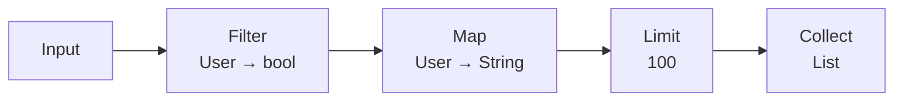
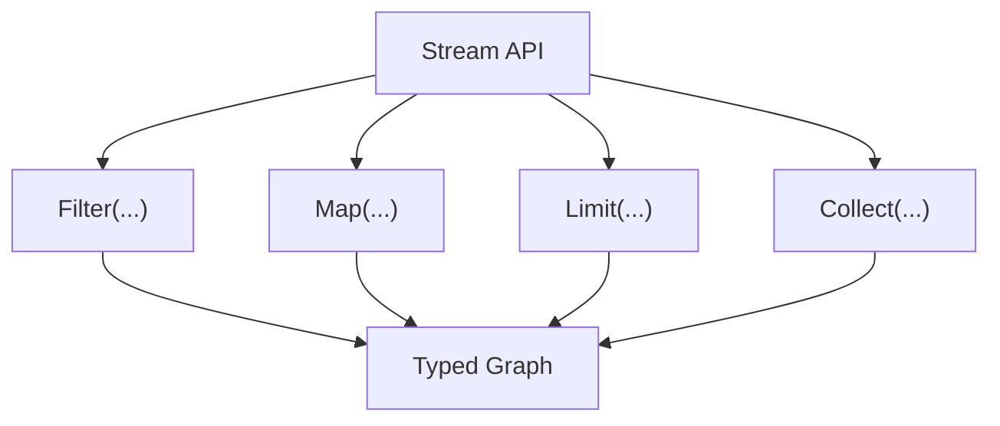
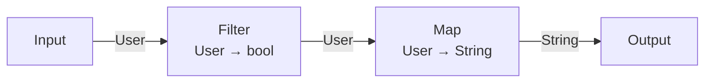
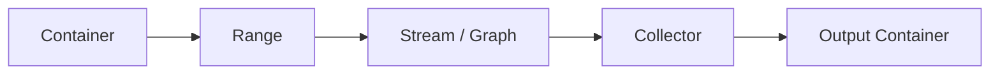
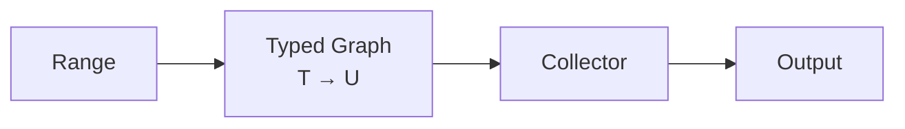

# Chapter 5: From Graph to Stream — Use a High-Level Interface for Data Transformation

> **Chapter path**
>
> Chapter 4 preserved Filter → Map → Reduce from control flow as a typed Graph.
>
> This chapter asks one engineering question:
>
> **Must an ordinary C user create Node / Edge objects by hand to use this computation model?**
>
> First, the original C:
>
> ~~~c
> long total = 0;
>
> for (size_t i = 0; i < n; ++i) {
>     int x = input[i];
>     if (!is_even(x))
>         continue;
>     total += square(x);
> }
> ~~~
>
> Then the same computation through a Stream façade:
>
> ~~~c
> cflow_stream s = {0};
>
> cflow_stream_init(&s, &cmeta_type_int);
>
> s.filter(&s, is_even)
>  ->map(&s, square)
>  ->reduce(&s, sum);
> ~~~
>
> The value of the second form is not “prettier chaining.”
>
> The important point is that these calls do **not** create a second Stream runtime. They construct the same typed Graph from Chapter 4.
>
> ~~~text
> C Stream surface
>       ↓
> typed Graph
>       ↓
> normalize / optimize / compile
>       ↓
> Plan / Direct / other execution
> ~~~
>
> LINQ-like here therefore means more than copying syntax: C can treat a whole data computation as an inspectable, transformable, compilable program object.

## 1. From a Hand-Written Loop to a LINQ-Like Surface: The Description Changes, Not the Result

Keep the same example:

~~~c
long plain_sum_even_squares(const int *input, size_t n)
{
    long total = 0;

    for (size_t i = 0; i < n; ++i) {
        int x = input[i];
        if (!is_even(x))
            continue;
        total += square(x);
    }

    return total;
}
~~~

Plain C is already direct.

If this runs only once, it usually needs no abstraction.

Stream becomes useful when a computation is reused, composed, checked, optimized, or moved between execution backends.

At that point the weakness of the hand-written loop is not performance. It is that the library cannot see the relation between:

~~~text
Filter(is_even)
Map(square)
Reduce(sum)
~~~

Stream gives users an interface close to the business computation while Graph stores the semantic facts.

This chapter therefore keeps three boundaries explicit:

~~~text
Stream != second type system
Stream != second optimizer
Stream != mandatory runtime interpreter
~~~

It only maps a friendlier C surface onto the same Graph.

---

## 2. Graph Already Expresses the Relationship

The Graph from Chapter 4 already contains:

```text
Node
Edge
Type
Callable
```

so it can naturally represent:



Each step has precise semantics.

`Filter` is not merely:

```text
call a bool callback
```

It means:

```text
input type = T
Predicate = T -> bool
output flow type remains T
Cardinality = 0..1
```

`Map` means:

```text
input = T
Callable = T -> U
output = U
Cardinality = 1
```

`FlatMap` means:

```text
input = T
Generator = T -> 0..N U
output = U
```

Once those meanings are in Graph, data transformation becomes a structure that can be handled uniformly.

---

## 3. But the Graph API Is Too Low-Level for Ordinary Data Processing

Graph is powerful because it is general.

It can express:

```text
Node
Edge
Subgraph
Relation
Branch
Join
```

But if a user only wants:

```text
filter
map
reduce
```

then writing:

```text
create_node
connect
set_exit
```

is too mechanical.

Compiler IR is powerful too, but users do not normally write SSA by hand.

So a higher-level façade is useful.

For linear data transformation, a natural façade is:

**Stream**

---

## 4. Stream Exists to Construct Graph More Conveniently

This boundary must remain explicit.

Stream should not own a second:

```text
Type System
Operator System
Runtime
Optimizer
```

It should be a:

```text
Graph Builder
```

If a user writes:

```text
stream
    .filter(enabled)
    .map(name)
    .limit(100)
    .collect(...)
```

the implementation still constructs:

```text
Graph
    + Filter Node
    + Map Node
    + Limit Node
    + Collect Node
```

Conceptually:



So:

> **Stream is user experience; Graph is the semantic fact.**

---

## 5. Why This Is Better Than Building a Stream Runtime First

If we begin with a dedicated:

```text
Stream Runtime
```

it is easy to turn every operator into a runtime object:

```text
FilterStage
MapStage
LimitStage
ReduceStage
```

with every value passing through:

```text
Stage
 ↓
virtual dispatch
 ↓
Stage
 ↓
virtual dispatch
```

That can work.

But the high-level API is then tied to one execution implementation.

If Stream only constructs Graph:

```text
Stream
    ↓
Graph
```

execution can be selected later.

The same Graph can be:

```text
interpreted directly
```

or:

```text
compiled into a Plan
```

or:

```text
statically lowered into ordinary C
```

or later use:

```text
Reactive execution
```

Now:

```text
High-level API
```

and:

```text
Execution Strategy
```

are genuinely separate.

---

## 6. Java Stream Mainly Inspires the Way We Express the Computation

One strength of Java Stream is the way it presents data processing:

```java
source.stream()
    .filter(...)
    .map(...)
    .limit(...)
    .collect(...);
```

The reader sees:

```text
data transformation
```

rather than:

```text
iteration control
```

That is useful in C too.

For example:

```text
users
  -> filter(enabled)
  -> map(name)
  -> collect(names)
```

shows directly:

```text
what the input is
which transformations happen
what the result is
```

So what we want is:

> **the high-level expressiveness of Java Stream.**

We do not need to copy:

> Java Stream's entire language, object model, or runtime.

---

## 7. A C Implementation Can Make the Type Chain Explicit

Because the lower layer already has a type system:

```text
Input<User>
```

followed by:

```text
Filter<User>
```

and:

```text
Map<User, String>
```

creates the explicit chain:

```text
User
 ↓
User
 ↓
String
```

Conceptually:



If a later stage is:

```text
Map<int, double>
```

construction should fail before execution because:

```text
String != int
```

rather than leaving the error to a runtime `void *` cast.

---

## 8. Filter, Map, and Reduce Have Formal Type Rules

Stream operators are not only method names.

They have explicit type rules.

### 8.1 Filter

```text
Input Flow Type = T

Predicate:
    T -> bool

Output Flow Type:
    T
```

### 8.2 Map

```text
Input Flow Type = T

Mapper:
    T -> U

Output Flow Type:
    U
```

### 8.3 FlatMap

```text
Input Flow Type = T

Generator:
    T -> 0..N U

Output Flow Type:
    U
```

### 8.4 Reduce

```text
Input Flow Type = T

Reducer:
    T × T -> T

Output:
    T
```

### 8.5 Collect

```text
Input Flow Type = T

Collector:
    T* -> Container<T>

Output:
    Container<T>
```

These rules can reuse the existing:

```text
Signature
Finite Relation
Type Inference
```

machinery.

---

## 9. Stream Methods Can Therefore Enforce Type Constraints During Construction

Suppose:

```text
enabled : User -> bool
name    : User -> String
```

Then:

```text
stream<User>
    .filter(enabled)
    .map(name)
```

is valid.

But:

```text
stream<User>
    .filter(name)
```

must fail because:

```text
Filter<User>
```

requires:

```text
User -> bool
```

while `name` is:

```text
User -> String
```

This is why typed Callable from the previous chapter matters.

If callbacks were still only:

```text
void *
```

Stream could not be a genuinely typed API.

---

## 10. Stream Should Not Own the Data

Another important boundary is:

> Stream should describe data processing, not become another container.

For:

```text
Vec<User>
```

the data still belongs to Vec.

A:

```text
Range<User>
```

provides traversal.

Stream describes:

```text
how values from the Range are processed
```

So the architecture is closer to:



Container ownership and computation remain separate.

---

## 11. Range Is the Natural Input Protocol for Stream

CMeta can already provide a:

```text
Range
```

to unify reading from:

```text
Vec
List
Set
Map
```

and other structures.

A Range may describe:

```text
value type
size
iteration
capabilities
```

such as:

```text
SIZED
ORDERED
SORTED
UNIQUE
CONTIGUOUS
RANDOM_ACCESS
```

Stream therefore does not need separate:

```text
VecStream
ListStream
SetStream
```

implementations.

It can consume:

```text
Range<T>
```

as one input protocol.

---

## 12. Collector Is the Natural Output Protocol

At the other end, `Collect` should not hard-code:

```text
Vec_push_back
```

or every new output container would require Stream-specific logic.

A more general:

```text
Collector
```

can unify:

```text
begin
accept
finish
abort
```

Then:

```text
Stream<T>
```

may collect into:

```text
Vec<T>
List<T>
Set<T>
other destinations
```

as long as the target provides:

```text
Collector<T>
```

---

## 13. Range + Graph + Collector Form a Complete Data-Transformation Model

The combination:

```text
Range
    ↓
Graph
    ↓
Collector
```

answers three separate questions:

```text
Range
    Where are values read from?

Graph
    How do values change?

Collector
    Where are values written?
```

Conceptually:



The transformation system is no longer tied to one input or output container.

---

## 14. Many Common Data-Processing Problems Now Share One Model

### 14.1 Filtering

```text
Users
 ↓
Filter(enabled)
 ↓
EnabledUsers
```

### 14.2 Projection

```text
User
 ↓
Map(name)
 ↓
String
```

### 14.3 One-to-Many Transformation

```text
Sentence
 ↓
FlatMap(words)
 ↓
Word
```

### 14.4 Aggregation

```text
Numbers
 ↓
Reduce(sum)
 ↓
Number
```

### 14.5 Collection

```text
Value Stream
 ↓
Collect
 ↓
Vec / List / Set
```

Business modules no longer have to reimplement the whole traversal mechanism for each of these patterns.

---

## 15. The More Interesting Result: Graph Can Optimize the Whole Chain

For example:

```text
Map(f)
 ↓
Map(g)
```

may, under the right conditions, become:

```text
Map(g ∘ f)
```

The intermediate:

```text
B
```

may never need to become a materialized object.

Instead of:

```c
B b = f(a);
C c = g(b);
```

execution can become:

```c
C c = g(f(a));
```

A C compiler may optimize away a local variable too, but Graph sees the higher-level semantic relationship explicitly.

---

## 16. Filter and Map Can Also Collapse into One Loop

For:

```text
Filter(enabled)
 ↓
Map(name)
 ↓
Limit(100)
```

a Direct path may lower all the way to:

```c
size_t out = 0;

for (size_t i = 0; i < count && out < 100; ++i) {
    if (!enabled(users[i]))
        continue;

    names[out++] = name(users[i]);
}
```

So:

```text
high-level Stream API
```

does not imply:

```text
three runtime stage objects
```

It may become:

```text
one ordinary C loop
```

This is a central performance direction of the design.

---

## 17. High-Level Interfaces and Low-Cost Execution Are Not Opposites

C programmers often distrust abstractions such as:

```text
Stream
Graph
Lambda
```

because they are often associated with:

```text
allocation
virtual dispatch
temporary objects
runtime type erasure
```

But a system with enough compile-time and control-plane information can take a different route:

```text
high-level expression
    ↓
Graph
    ↓
Validate
    ↓
Optimize
    ↓
Lower
    ↓
ordinary C
```

In other words:

> **the high-level interface makes the program easier for humans to write; Graph makes it understandable to the system; Lowering makes it simple for the machine to execute.**

---

## 18. Stream Can Be a Façade Instead of a Cost Center

Ideally:

```text
stream.filter(...).map(...)
```

mostly incurs:

```text
Graph Construction Cost
```

rather than:

```text
Per-item Runtime Cost
```

The distinction matters enormously.

If one Graph is built once and processes:

```text
1,000,000 values
```

then spending some extra work on:

```text
type checking
signature lookup
optimization
```

during construction may be entirely worthwhile because that cost is paid once.

---

## 19. From Stream Façade to Verifiable Execution

At this point Stream's role is clear. It makes Graph construction more natural for typed data transformation, but it does not reinvent execution semantics and does not own source data. Range, Collector, Callable, and Graph keep their separate responsibilities.

The rest of the chapter therefore returns to the canonical pipeline and checks surface-to-Graph construction correctness, type-chain preservation, description/execution ownership, the real C representation, and reusable evidence.

Performance discussion also targets execution paths rather than chaining syntax.

---

## 20. Canonical Example: The Same Graph Through a User-Friendly Entry Point

Chapter 4 already had:

~~~text
Input<int>
    ↓
Filter(is_even)
    ↓
Map(square)
    ↓
Reduce(sum)
~~~

If users must call low-level Graph builders every time, the API is unnecessarily mechanical.

Stream lets construction resemble the data transformation:

~~~c
cflow_stream s = {0};

cflow_stream_init(&s, &cmeta_type_int);

s.filter(&s, is_even)
 ->map(&s, square)
 ->reduce(&s, sum);
~~~

The important part is not fluent syntax.

The important part is:

> **these calls still construct the same Graph IR.**

Stream does not own a separate:

~~~text
StreamNode
StreamExecutor
StreamOptimizer
StreamTypeSystem
~~~

It is only:

~~~text
user-friendly construction surface
        ↓
same typed Graph
~~~

A high-level interface is not the same thing as a new runtime.

---

## 21. Semantic Contract: What the Stream Façade Must Not Change

### 21.1 Operator Semantics Must Match Graph

If Graph defines:

~~~text
FILTER
    output type = input type
    cardinality = 0..1

MAP
    output type = callable return
    cardinality = 1

REDUCE
    homogeneous fold
    cardinality = N..1
~~~

Stream cannot redefine those rules because it has a different surface.

A Stream method should therefore be:

~~~text
typed Graph builder wrapper
~~~

not:

~~~text
second semantic authority
~~~

### 21.2 Stream Owns the Description, Not Source Data

Stream may own:

~~~text
Graph description
copied Range view
evaluation options
builder/admission state
~~~

but the real input object/container remains owned by its original owner.

So:

~~~text
Stream lifetime
    ≠
container lifetime
~~~

For a borrowed Range, the owner must remain alive and satisfy the Range contract throughout evaluation.

### 21.3 Evaluation State Must Be Separate from Reusable Graph

One critical contract is:

> the same Stream/Graph description may execute repeatedly when allowed, but each execution gets fresh cursor/operator state.

Do not write live facts such as:

~~~text
reduce accumulator
skip counter
take counter
publisher cursor
~~~

back into Graph.

Otherwise:

~~~text
Build Once, Execute Many
~~~

fails immediately.

### 21.4 Chainable Does Not Mean Unbounded Deferred Runtime Objects

Stream handles construction.

At execution time the program can choose:

~~~text
direct synchronous evaluation
normalized Graph
compiled Plan
Reactive Subscription
~~~

So chained syntax is not itself a cost model.

Cost depends on:

> **the execution backend actually selected.**

---

## 22. Lean / Proof Obligation: What Should Stream Prove?

Stream does not need a second complex formal semantics.

A better proof target is:

### 22.1 Surface-to-Graph Construction Correctness

If Stream methods:

~~~text
filter f
map g
reduce h
~~~

construct:

~~~text
FILTER(f)
MAP(g)
REDUCE(h)
~~~

then Stream's observable meaning should inherit Graph's meaning directly.

Conceptually:

~~~text
BuildStream(ops) = g
→
StreamSemantics(ops, input)
=
GraphSemantics(g, input)
~~~

If Stream is a deterministic builder, this theorem should be thin.

That is a strength:

> **the thinner the façade, the less independent semantics must be proved.**

### 22.2 Type-Chain Preservation

For:

~~~text
T
  --filter--> T
  --map f--> U
  --reduce--> U
~~~

surface methods must not bypass Graph admission.

If:

~~~text
map : T -> U
next filter expects V
U != V
~~~

construction/admission should fail.

### 22.3 Reusable Description / Fresh Execution Separation

The formal model should distinguish:

~~~text
Program Description
~~~

from:

~~~text
Execution State
~~~

This becomes even more important in the next Reactive chapter.

If cursor/demand/cancel state is placed inside Graph itself, control plane and execution plane become entangled.

---

## 23. Current C Implementation: Stream Really Is a Graph Façade

Against the current Salts snapshot:

~~~text
qigao/salts
snapshot: ad389928b437c0612c1c60844fe53677f3ed27a6
~~~

the central `cflow_stream` shape is straightforward:

~~~c
struct cflow_stream {
    cflow_graph graph;

    cmeta_range input_range;
    bool has_input_range;

    cflow_eval_options eval_options;
    bool failed;

    /* generated explicit-self operator methods */
    ...
};
~~~

The representation answers several questions directly.

### 23.1 Graph Is Stream's Core Owned Description

Stream is not a pointer to a hidden Stream runtime.

It directly owns:

~~~text
cflow_graph graph
~~~

Operator methods mainly extend that Graph.

So:

~~~text
Stream
    ↓
Graph
~~~

is not only an architectural diagram. It is reflected in the data layout.

### 23.2 Range Is an Input Protocol, Not Part of Graph

`input_range` and `has_input_range` say:

~~~text
which input view this Stream is currently bound to
~~~

but they do not change operator semantics.

That lets:

~~~text
array
container Range
channel-like publisher
other source
~~~

reuse the same computation description.

### 23.3 Method Fields Are ISO C11 Explicit-Self Façade Functions

Current Stream methods are not C++ member functions.

They are C function-pointer fields:

~~~text
stream.filter(&stream, ...)
stream.map(&stream, ...)
~~~

This preserves:

1. ISO C11;
2. a fluent-looking surface without an object runtime.

### 23.4 Public Graph View Is Read-Only Introspection

The current API makes:

~~~text
cflow_stream_graph()
    → borrowed read-only Graph view
~~~

explicit.

Users should not mutate:

~~~text
stream.graph.nodes[...] = ...
~~~

to bypass the builder contract.

This continues Chapter 4's rule:

> **public visibility does not imply arbitrary mutability.**

---

## 24. Evidence: The Canonical Pipeline Already Exists in Real Tests

Current CFlow certificate tests use almost exactly the canonical pipeline from this book:

~~~text
filter even
    ↓
map square
    ↓
reduce add
~~~

The test continues through:

~~~text
Stream
    ↓
Surface Graph
    ↓
Normalize
    ↓
Optimize
    ↓
Compile Plan
    ↓
Build Certificate
    ↓
Check Certificate
~~~

So the canonical example is not a toy invented only for the book.

It is already part of a real trusted execution path.

### 24.1 Surface/API Evidence

Validate:

~~~text
filter/map/reduce method
    ↓
Graph rows appear with expected operators/types
~~~

### 24.2 Reuse Evidence

Repeated evaluation of one Stream description under a valid Range contract should use independent execution state.

In particular:

~~~text
reduce accumulator
take/skip counters
temporary value storage
~~~

must not leak back into Graph description.

### 24.3 Ownership Evidence

Tests must distinguish:

~~~text
Stream destroys its Graph

but

Stream does not destroy borrowed container/Range owner
~~~

### 24.4 Certificate / Verification Evidence

Once Stream has built the Graph, trusted transformations should target:

~~~text
Graph / Plan / Certificate
~~~

not surface syntax.

Again:

> **Stream is not the semantic center; Graph is.**

---

## 25. Performance: Benchmark the Execution Path, Not the Chaining Syntax

Stream API work is mostly construction/control-plane work.

So a useful performance question is not:

~~~text
How much slower is stream.map() than plain C?
~~~

It is:

~~~text
How does the same pipeline finally execute?
~~~

Compare:

~~~text
hand-written C loop
surface Graph interpreter
normalized/optimized Graph
compiled Plan
direct/AOT path
~~~

If lowering produces an execution form equivalent to the hand-written loop, then high-level Stream expression and hot-path cost can be separated.

That is one of the book's central ideas:

> **the cost of a high-level API should not automatically become a per-value execution cost.**

---

## 26. What We Learned

Chapter 5 does not merely “add chaining to C.”

It establishes a more important architectural relation:

~~~text
Friendly Surface Syntax
        ↓
Typed Graph IR
        ↓
Independent Execution Backends
~~~

Therefore:

1. **Stream is a façade, not a second runtime.**
2. **Operator semantics belong to Graph/operator schema.**
3. **Input Range ownership remains explicit.**
4. **Program description and execution state are separate.**
5. **A reusable Stream can create fresh execution state each time.**
6. **Formal reasoning should target Graph meaning, not surface syntax.**
7. **Performance evidence must compare execution backends, not API aesthetics.**

The canonical pipeline now has two views:

~~~text
user view:
    filter → map → reduce

compiler/control-plane view:
    typed Graph
~~~

The next chapter does not change the operators.

It changes one assumption:

> **the data may not be available yet.**

When a source may answer:

~~~text
WAIT
~~~

Graph semantics acquire time, Wake, Demand, and Backpressure.

That is Reactive.

---

**Summary: Stream Is Graph's First High-Level Application, Not Its Foundation**

The key relationship is:

~~~text
Graph
    describes computation

Stream
    provides a convenient data-transformation interface

Range
    provides input

Collector
    provides output

Executor
    later decides how to execute
~~~

Conceptually:

~~~mermaid
flowchart LR
    A["Range"]
    B["Stream façade"]
    C["Typed Graph"]
    D["Executor"]
    E["Collector"]

    A --> B
    B --> C
    C --> D
    D --> E
~~~

The main advantage is:

> **high-level interfaces and low-level execution are no longer bound together.**

Users can get:

~~~text
declarative data transformation similar to Java Stream
~~~

while the system remains free to lower it to:

~~~text
ordinary C loop
precompiled Plan
other execution forms
~~~

The value of Stream is not making C look like Java.

It is proving that once C has Type, Callable, and Graph, it can express data transformation at a high level **without giving up the simple, efficient execution model that made C valuable in the first place.**

The next chapter asks:

> **What happens when a Graph Publisher does not necessarily have data immediately?**

The answer is the transition from synchronous Stream to **Reactive, WAIT, Wake, Demand, and Backpressure**.
