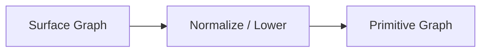

# Chapter 7: From Graph to Plan and Direct — Move Complexity Earlier and Return the Hot Path to Ordinary C

> **Chapter path**
>
> Chapters 4–6 have answered three questions:
>
> ~~~text
> How do we save a computation as a Graph?
> How do we give it a LINQ-like surface?
> How do we prove that some rewrites preserve observable semantics?
> ~~~
>
> One engineering question remains:
>
> **When we process every value, do we still need to traverse the Graph, decode the operator, and inspect the Callable again?**
>
> Start with three execution shapes. The following C snippets are conceptual hot-path shapes used to explain where cost lives; they are not source excerpts.
>
> **1. Interpret the Graph directly:**
>
> ~~~c
> while (node_id != END) {
>     const node *n = graph_node(graph, node_id);
>
>     switch (n->op) {
>     case FILTER:
>         value = run_filter(n->callable, value);
>         break;
>     case MAP:
>         value = run_map(n->callable, value);
>         break;
>     }
>
>     node_id = next_edge(graph, node_id);
> }
> ~~~
>
> Every value may pay again for topology lookup / operator decode / dispatch selection.
>
> **2. Compile to a Plan:**
>
> ~~~c
> for (size_t i = 0; i < plan->step_count; ++i) {
>     const plan_step *s = &plan->steps[i];
>     value = s->handler(s->callable, value);
> }
> ~~~
>
> The Graph has already been resolved into sequential steps / indices / handlers during compilation; execution no longer has to understand topology again.
>
> **3. Under stricter eligibility, lower directly to ordinary C:**
>
> ~~~c
> for (size_t i = 0; i < n; ++i) {
>     int x = input[i];
>     if (!is_even(x))
>         continue;
>     int y = square(x);
>     output[out_count++] = y;
> }
> ~~~
>
> This is what the book means by:
>
> **Know More Before Execution, Do Less During Execution.**
>
> This is not a marketing claim that “high-level APIs are always faster.” It only moves repeatable structural decisions out of the per-value hot path and into build / normalize / compile.
>
> This chapter also keeps the implementation boundary precise: a complete Filter → Map → Reduce pipeline can enter a compiled Plan, while the current closed Direct/AOT path mainly covers Filter/Map stages. We do not pretend Reduce already has the same direct lowering.

## 1. The Expensive Part of a High-Level Abstraction Should Usually Not Happen for Every Value

Suppose a user writes:

```text
Input<int>
    ↓
Filter(even)
    ↓
Map(square)
    ↓
Map(to_double)
    ↓
Reduce(sum)
```

The system may know:

```text
Input Type
Filter Predicate Signature
Map Input / Output Type
Effects
Properties
Topology
Reducer Properties
```

This information certainly needs analysis.

But ask one question:

> **How often does this information change?**

Usually:

```text
after Graph construction
it does not change for every processed value
```

For example, the signature of:

```text
Map(square)
```

such as:

```text
int -> long
```

does not change because today's input is:

```text
1
```

and tomorrow's is:

```text
2
```

Likewise:

```text
Node A
connects to Node B
```

does not need to be rediscovered for every value.

So if every value repeats:

```text
type lookup
signature lookup
edge traversal
operator decode
```

the runtime is repeatedly paying for:

```text
knowledge it already has
```

---

## 2. Build Once, Execute Many

The execution architecture should therefore follow one simple economic principle:

```text
Build Once
Execute Many
```

For example:

```text
construct Graph
    ↓
validate Type
    ↓
resolve Callable
    ↓
analyze Effects / Properties
    ↓
select execution path
    ↓
generate Plan
    ↓
execute 1,000,000 Values
```

If the analysis cost is:

```text
O(Graph Size)
```

while execution processes:

```text
N values
```

then the up-front cost is amortized across:

```text
N
```

executions.

This is close to ordinary compiler economics:

> a compiler may spend significant effort understanding a program because the machine may execute that program countless times.

---

## 3. Graph Should Be an Analysis Object, Not Necessarily the Final Execution Object

Graph is valuable because it can represent:

```text
Operator
Type
Callable
Edge
Subgraph
Relation
Effects
Properties
```

But precisely because it contains rich information, it may not be the best hot-path representation.

A Graph Node may contain:

```text
operator id
callable
input descriptor
output descriptor
edge list
relation
subgraph metadata
```

This is excellent for:

```text
Validate
Optimize
Debug
Inspection
```

But when executing:

```text
y = square(x);
```

the CPU does not need to know:

```text
this function came from Node 17
it belongs to Graph version 42
its operator name is Map
```

So Graph should be allowed to be:

```text
Lowered
Compiled
Erased
```

rather than forced to survive at every call site.

---

## 4. First Layer: Separate Surface Graph from Primitive Graph

The Graph most convenient for users and the Graph easiest for a runtime to execute need not be the same.

A surface may express:

```text
higher-level Relation
Nested Subgraph
Structured Operator
```

while a runtime prefers:

```text
few primitive nodes
explicit edges
explicit execution relation
```

So we need:

```text
Normalize / Lower
```

The current CFlow implementation's `cflow_graph_normalize()` creates an independent primitive IR snapshot from a Surface Graph and explicitly limits itself to static IR rewriting rather than runtime scheduling or resource acquisition.

Conceptually:



Surface Graph optimizes for:

```text
ease of expression
```

Primitive Graph optimizes for:

```text
ease of analysis and execution
```

---

## 5. Why Normalize Should Produce an Independent Snapshot

Suppose:

```text
the original Graph
```

is modified in place during normalization.

Then it becomes difficult to answer:

```text
which version does the user hold?
which version does the Optimizer see?
which version does the Plan represent?
which version does the Debug Tool inspect?
```

A simpler model is:

```text
Surface Graph v10
    ↓ normalize
Primitive Snapshot v10
```

Primitive IR then exists independently.

Later:

```text
Analyze
Optimize
Compile
```

operate against a stable snapshot.

The control plane becomes:

```text
Mutable Construction
      ↓
Immutable-ish Snapshot
      ↓
Transformation
```

instead of many components mutating one shared Graph.

---

## 6. Second Layer: Optimize Using Existing Semantic Knowledge

Once Primitive Graph exists, we can:

```text
Analyze / Optimize
```

For example:

```text
Map(f)
 ↓
Map(g)
```

may be fused if allowed.

Or:

```text
Map(identity)
```

may be eliminated.

Some:

```text
Relation
```

nodes may be simplified.

Unused Subgraphs may be removed.

The current CFlow optimizer includes passes such as canonicalization, dead-subgraph elimination, map fusion, relation simplification, and property-based rewrites.

This is the first systematic point where earlier:

```text
Effects
Properties
Type
Callable
```

knowledge serves:

```text
Execution Performance
```

---

## 7. The Optimizer Must Not Rewrite Merely Because Shapes Look Similar

Suppose:

```text
Map(f)
 ↓
Map(f)
```

The shape is duplicated.

That does not mean it can be simplified to:

```text
Map(f)
```

unless:

```text
f(f(x)) = f(x)
```

holds.

For:

```c
int f(int x) {
    return x + 1;
}
```

we have:

```text
f(f(1)) = 3
```

while:

```text
f(1) = 2
```

So:

```text
Graph Pattern
```

only identifies a candidate.

Legality comes from:

```text
Semantic Law
```

---

## 8. Property Bit and Semantic Law Must Stay Separate

A Callable can claim:

```text
IDEMPOTENT
```

but that is:

```text
Metadata Claim
```

The mathematical property is:

```text
∀x, f(f(x)) = f(x)
```

These are not the same thing.

Safe optimization therefore needs two layers:

```text
C-side metadata
    ↓
identify candidates cheaply

Formal semantic law
    ↓
explain why the rewrite is valid
```

The current optimizer already has a stable:

```text
Idempotent Map Elimination
```

rule and an owned proof trace that records how the rewrite relates source and optimized Graph versions.

The Optimizer is therefore not merely a:

```text
Graph Mutator
```

It is becoming a:

```text
Semantic Transformation Engine
```

---

## 9. One of the Optimizer's Most Important Jobs Is to Delete Knowledge Before Execution

This sounds counterintuitive.

Previous chapters kept adding:

```text
Type
Metadata
Effects
Properties
Graph
```

Why delete knowledge now?

Because one of the purposes of that information is:

> **make decisions before execution, then freeze the results of those decisions.**

For example:

```text
Can Map f use a direct call?
```

The control plane answers:

```text
YES
```

The hot path should not then repeat:

```text
if (can_direct_call(f))
```

It should simply:

```text
call f
```

Likewise:

```text
Can the Reducer run in parallel?
```

Analysis resolves that to:

```text
Sequential
```

or:

```text
Parallel Reduce
```

and execution follows the result.

An ultimate purpose of Meta is therefore not:

```text
make runtime know more and more
```

but:

> **make runtime ask fewer questions.**

---

## 10. Third Layer: Direct Execution

For a sufficiently simple and well-understood Graph, the ideal result is:

```text
lower directly to ordinary C calls
```

For:

```text
Filter
 ↓
Map
 ↓
Map
```

if:

```text
types are continuous
Callables are known
copy/destroy is simple enough
effects/properties permit it
```

the system can form a Direct Stage IR.

The current `direct.h` AOT stage IR records stage kind, dispatch, input/output type, callable, and target name, and distinguishes forms such as:

```text
STATIC_TARGET
CANONICAL_RAW_BATCH
ADAPTER
```

A:

```text
Graph Node
```

can therefore become:

```text
a Stage whose invocation strategy is already decided
```

---

## 11. The Direct Path Is Not “a Faster Interpreter.” Its Goal Is Not to Interpret

If Direct only means:

```text
switch(op)
    ↓
a little faster
```

then it is still an interpreter.

The stronger goal is:

```text
Graph Semantic Node
      ↓
build-time resolution
      ↓
direct C target
```

So execution becomes:

```c
if (!even(x))
    continue;

long y = square(x);
double z = to_double(y);
```

instead of:

```c
node = graph_next(node);

switch (node->op) {
case CFLOW_MAP:
    descriptor = ...
    callable = ...
    invoke(...)
}
```

A high-level Graph does not require the Runtime to “run a Graph.”

---

## 12. Direct Eligibility Must Be Strict

Direct must not be enabled merely because a pipeline:

```text
looks simple
```

Safety depends on:

```text
copy semantics
destroy semantics
aliasing
effects
signature continuity
```

and more.

Current Direct eligibility explicitly checks trivial copy/destroy, constraints such as:

```text
PURE
DETERMINISTIC
TOTAL
NO_ALIAS
```

and signature continuity.

Optimization is therefore not:

```text
we hope this works
```

It is:

```text
enter only when the required conditions are proved/checked
```

---

## 13. Ineligible for Direct Does Not Mean “Fall Back to a Heavy Graph Interpreter”

Many Graphs cannot be made completely static.

A complex structure may still require some runtime routing.

In that case we can use a second path:

**Compiled Plan**

That is:

```text
Graph
 ↓
Compile
 ↓
Plan
 ↓
Execute
```

Plan should not retain every Graph fact.

Its purpose is:

> **decode execution-relevant information ahead of time.**

---

## 14. What Work Can Plan Eliminate Ahead of Time?

Direct Graph execution may require:

```text
read Node
inspect Operator
find Callable
check Signature
find Edge
choose Handler
```

Much of this can happen during:

```text
Plan Compile
```

The resulting Plan can pre-store:

```text
step handler
callable
input/output info
execution order
topology
```

and the hot path executes:

```text
Step 0
Step 1
Step 2
```

The current `cflow_plan_compile()` compiles a direct synchronous collection plan from an already normalized primitive Graph. Plan pre-resolves topology and execution handlers, and execution no longer queries Graph, Node, Edge, or Subgraph.

This is a concrete implementation of:

```text
Rich Control Plane
    ↓
Simple Execution Plane
```

---

## 15. Graph vs. Plan Is Like “Program” vs. “Program Prepared for This Machine”

Graph is good at answering:

```text
What does this computation mean?
```

Plan is closer to answering:

```text
Exactly what do we call, and in what order?
```

Roughly:

```text
Graph

Node A
   ↓
Node B
   ↓
Node C

rich metadata
```

compiles to:

```text
Plan

Step0(handler0, callable0)
Step1(handler1, callable1)
Step2(handler2, callable2)
```

The executor does not need to rediscover:

```text
why Step1 is Map
```

because compile already made that decision.

---

## 16. Plan Is Not Another Graph

If Plan merely copies:

```text
Graph Node
```

under another name, its value is small.

A real Plan should:

```text
pre-resolve
pre-bind
pre-decode
```

That is:

```text
turn a choice into a result
```

For example:

```text
Graph:
    callable may be raw or adapter

Plan:
    this step has already been resolved as raw
```

Graph asks:

```text
is parallel execution possible?
```

Plan stores:

```text
execution_mode = SEQUENTIAL
```

or:

```text
execution_mode = PARALLEL_REDUCE
```

Execution should not ask again.

---

## 17. Parallel Execution Should Also Be an Explicit Plan Decision

Providing a:

```text
Concurrent Executor
```

must not automatically make every Plan parallel.

Parallel legality belongs to:

```text
Semantic Analysis
```

Plan compilation should explicitly produce a mode such as:

```text
SEQUENTIAL
```

or:

```text
PARALLEL_REDUCE
```

The current Plan API distinguishes sequential and parallel-reduce modes. Parallel options explicitly include executor, max_tasks, min_items, and related configuration, and unmet conditions do not silently fall back to another execution semantic.

That “no silent fallback” rule matters.

---

## 18. Why Silent Fallback Is Wrong

Suppose the caller requests:

```text
Parallel Reduce
```

but the reducer does not satisfy the requirements.

If the runtime says:

```text
fine, I'll quietly execute sequentially
```

the numerical result may remain correct.

But the system has hidden an important fact:

```text
the requested execution contract was not honored
```

That can hide:

```text
performance regressions
invalid resource configuration
incorrect test conclusions
```

A stronger behavior is:

```text
Unsupported
```

and explicit rejection.

This continues the design rule used throughout the system:

```text
Do not guess.
Do not silently fallback.
```

---

## 19. From Principle to the Complete Pipeline

At this point the boundaries are clear enough: Graph describes and supports analysis; Plan freezes already-made choices; Direct/AOT removes runtime abstraction only under stricter eligibility. The control plane may do more work, while the execution plane must not rediscover facts that are already decided.

We can call this **Pay Before Execution**, but it is not an unmeasured performance claim. It only specifies where costs should live: signature, topology, effect, property, dispatch, and execution mode should be resolved during build/admission/compile whenever possible; actual benefit still requires benchmark and toolchain evidence.

The rest of the chapter therefore stops repeating “the control plane should be smarter” and instead walks one canonical pipeline through Normalize, Rewrite, Plan, Direct/AOT, Parallel Reduce, Certificate, Proof Trace, and cost evidence. We also keep the implementation boundary honest: the full Filter → Map → Reduce pipeline can use compiled Plan, while the current closed Direct/AOT path mainly covers Filter/Map.

---

## 20. End-to-End Case: Canonical Pipeline from Surface API to Plan

Return to the Part II pipeline:

~~~text
Source<int>
    ↓
Filter(is_even)
    ↓
Map(square)
    ↓
Reduce(sum)
~~~

The user-facing surface may be:

~~~c
stream.filter(&stream, is_even)
      ->map(&stream, square)
      ->reduce(&stream, sum);
~~~

This API is not an execution strategy.

It first creates a:

~~~text
Surface Graph
~~~

that records:

~~~text
operator identity
callable
input/output type
effects/properties
topology
cardinality
parameters
~~~

The real execution chain starts here.

### 20.1 Step 1 — Surface Graph

Surface Graph must:

~~~text
faithfully record user meaning
~~~

It may retain higher-level operators or structure.

Its key properties are:

~~~text
easy to construct
easy to inspect
easy to diagnose
~~~

not:

~~~text
fastest per-value execution representation
~~~

### 20.2 Step 2 — Normalize

Current CFlow:

~~~text
cflow_graph_normalize(dst, src)
~~~

requires:

~~~text
src
    borrowed immutable Surface Graph

dst
    separate empty destination
~~~

Normalize:

~~~text
validates input
performs only static IR rewriting
validates output
publishes independent primitive snapshot
~~~

It does not own:

~~~text
Subscription scheduling
live demand
runtime buffers
Executor state
~~~

So:

> **Normalization is a pure control-plane IR transformation, not partial execution.**

This boundary is crucial.

### 20.3 Step 3 — Optimize

Optimizer continues from an:

~~~text
normalized immutable source
      ↓
new optimized Graph
~~~

Current passes include:

~~~text
canonicalize
dead subgraphs
map fusion
relation simplify
property rewrites
~~~

and record:

~~~text
nodes before/after
map fusion count
blocked transformations
idempotent map eliminations
~~~

Especially useful are counters such as:

~~~text
effect_blocked_*
property_blocked_*
~~~

because they express the correct optimizer attitude:

> **If a rewrite cannot be proved/admitted, explicitly do not perform it instead of using silent best effort.**

### 20.4 Step 4 — Compile Plan

The full canonical pipeline ends with Reduce.

A compiled Plan is therefore its natural execution artifact.

Plan compile precomputes:

~~~text
decode topology
resolve execution handlers
bind type/callable metadata
record terminal reduce
resolve instruction sequence
~~~

Execution explicitly promises:

> **no Graph / Node / Edge / Subgraph topology lookup.**

So:

~~~text
Graph
    is source program description

Plan
    is pre-decoded execution representation
~~~

Plan is not another Graph.

Its purpose is:

~~~text
remove repeated topology decisions from execution
~~~

### 20.5 Step 5 — Execute

Sequential Plan evaluation receives:

~~~text
borrowed input
compiled instructions
pre-resolved callables/types
owned output result
~~~

and runs.

Ideally, the per-value path no longer does:

~~~text
walk arbitrary Graph topology
lookup operator schema
infer types
choose backend
validate signature
decide rewrite
~~~

Those costs have already been paid.

This is:

> **Pay Before Execution.**

---

## 21. A Real Rewrite: Why a Metadata Bit Is Not Enough

The canonical pipeline has only one Map, so it is not a good rewrite example by itself.

Use a local variant:

~~~text
Source<int>
    ↓
Map(clamp)
    ↓
Map(clamp)
    ↓
...
~~~

Suppose:

~~~text
clamp : int -> int
~~~

and really satisfies:

~~~text
forall x,
clamp (clamp x) = clamp x
~~~

Then:

~~~text
Map(clamp)
Map(clamp)
    ↓
Map(clamp)
~~~

is valid.

The current CFlow optimizer has a stable semantic rewrite id:

~~~text
IDEMPOTENT_MAP_ELIMINATION
~~~

and traced optimization can record:

~~~text
input subgraph
retained node/callable index
removed node/callable index
~~~

This is the division between:

~~~text
Proof of Rule
+
Trace of Instance
~~~

### 21.1 Property Claim Only Handles Admission

A C callable may claim:

~~~text
IDEMPOTENT
~~~

but that is only:

~~~text
claim / admission metadata
~~~

Rewrite correctness comes from the semantic law.

If a C function falsely claims:

~~~text
IDEMPOTENT
~~~

Lean does not magically prove that arbitrary machine code satisfies the law.

The trust chain must therefore include:

~~~text
implementation identity
+
metadata claim
+
trusted/verified semantic meaning
+
rewrite theorem
+
rewrite trace
~~~

Chapter 6 established this trusted chain.

### 21.2 Lean Already Has the Corresponding Theorem

The current formal Rewrite proof includes:

~~~text
map_idempotent_elimination
certified_rewrite_preserves_observations
~~~

So the book no longer has to say:

~~~text
"in theory, one day we could prove the optimizer"
~~~

Instead it can discuss:

> **how an existing rewrite theorem authorizes an existing optimizer rule.**

That is the professional loop between Modern C and Lean.

---

## 22. Direct / AOT: The Simplest Path Should Not Need Plan at All

Plan is already much simpler than Graph interpretation.

But for a very simple, closed, synchronous:

~~~text
Filter / Map pipeline
~~~

even Plan may be unnecessary.

The current CFlow Direct/AOT path supports a bounded Stage IR:

~~~text
Filter
Map
~~~

with an explicit stage-count limit.

Each stage must satisfy strict eligibility.

### 22.1 Direct Eligibility Is Permission to Delete Runtime Abstraction

Current direct-stage eligibility checks:

~~~text
type is direct-eligible
callable can bind
capture_size = 0
effects = PURE
required properties:
    DETERMINISTIC
    TOTAL
    NO_ALIAS
signature protocol/type chain matches
~~~

Filter also requires:

~~~text
return bool
output type = input type
~~~

Map requires:

~~~text
return type itself direct-eligible
~~~

These checks answer:

> **When are we entitled to skip the generic invoke/runtime layer completely?**

### 22.2 AOT Dispatch Has Several Authorities

The current Stage IR can represent:

~~~text
STATIC_TARGET
CANONICAL_RAW_BATCH
ADAPTER
~~~

A:

~~~text
surface callable
~~~

therefore does not imply every path can become:

~~~text
direct static C call
~~~

Eligibility must match the real dispatch authority.

### 22.3 The Important Promise of the Direct Macro Path

The generated Direct array path explicitly promises:

~~~text
no indirect stage callback
no allocation
no scheduler operation
~~~

while validating:

~~~text
input/output storage
capacity
overflow
aliasing/range overlap
type chain
~~~

Failure returns explicit statuses:

~~~text
INVALID_ARGUMENT
INELIGIBLE
CAPACITY_EXCEEDED
~~~

and does not:

~~~text
silently fall back to Plan
silently fall back to Kernel
~~~

This anticipates Chapter 14's No Silent Fallback discipline.

### 22.4 Current Direct Does Not Mean Full Reduce Lowering

The current closed direct pipeline focuses on:

~~~text
Filter / Map
~~~

For the canonical:

~~~text
Filter → Map → Reduce
~~~

Reduce should currently use:

~~~text
compiled Plan
~~~

We do not overstate Direct/AOT as:

~~~text
arbitrary Graph always becomes one ordinary loop
~~~

A professional book should describe support boundaries more clearly than marketing material.

---

## 23. Parallel Reduce: Parallelism Is an Execution Refinement, Not a Graph Rewrite

Reduce is a useful example.

The semantic Graph can remain:

~~~text
Reduce(sum)
~~~

while execution chooses:

~~~text
sequential reduce
~~~

or, under strict premises:

~~~text
ordered parallel reduce
~~~

These are different classes of transformation.

### 23.1 Separate Semantic Rewrite from Physical Execution Refinement

For example:

~~~text
Map(identity)
    → remove
~~~

changes semantic IR shape, while a theorem proves observations remain equal.

But:

~~~text
Reduce sequential
    → Parallel Reduce
~~~

can keep the same semantic operator and only change physical execution.

The formal calculus explicitly distinguishes:

~~~text
rewrite rule
vs
execution refinement rule
~~~

This is a mature separation.

### 23.2 Parallel Reduce Needs a Full Admission Contract

At minimum:

~~~text
homogeneous reducer
PURE
TOTAL
ASSOCIATIVE semantic law
required order model
CONCURRENT Executor capability
supported value storage
valid task/chunk bounds
~~~

A worker pool existing is not sufficient reason to parallelize Reduce.

### 23.3 Unsupported Parallel Mode Must Not Quietly Retry Sequentially

The current Plan contract explicitly makes:

~~~text
unsupported plan
insufficient nonempty chunks
invalid options
rejected tasks
    ↓
false / explicit failure
~~~

rather than:

~~~text
parallel failed
    ↓
quietly rerun sequentially
~~~

Why?

Because silent fallback can:

~~~text
change latency/resource behavior
hide admission bugs
violate caller policy
distort benchmarks
~~~

Fallback should itself be an explicit policy in a higher layer.

---

## 24. Certificate: Why an Execution Artifact Still Needs to Be Bound to Its Graph

After Plan has decoded execution, Graph topology leaves the hot path.

How do we know:

~~~text
Plan
~~~

still corresponds to:

~~~text
the approved normalized Graph
~~~

The current certificate records:

~~~text
version
certified path
order
required capabilities
graph version
graph fingerprint
semantic rows
~~~

Each row contains:

~~~text
opcode
instruction index
callable index
effects
properties
input/output type
callable
typed parameter
~~~

So a certificate is not:

~~~text
"trust me, this plan was compiled"
~~~

It is a checkable execution witness.

### 24.1 Certificate Is Not a Wire Format

The current implementation explicitly includes:

~~~text
pointer-bearing rows
process-local Graph identity
execution-only witness
~~~

Therefore it must not be:

~~~text
serialized to disk
shipped to another process
treated as stable identity through raw pointer/address
~~~

This follows the earlier semantic-identity principle.

### 24.2 Version + Fingerprint Prevent Stale Artifacts

After Graph mutation:

~~~text
version changes
~~~

and certificate binding fails.

When stronger structural binding is needed:

~~~text
fingerprint
~~~

helps ensure rows/topology/callables still correspond.

The purpose is not cryptographic signing.

It is:

> **prevent an execution artifact from remaining “trusted” after the source program has changed.**

### 24.3 Lean Already Proves Certificate / Refinement Observation Preservation

The formal proof includes:

~~~text
certificate_preserves_observation
parallel_certificate_preserves_observation
execution_refinement_preserves_semantics
~~~

Importantly, `parallel_certificate_preserves_observation` is not unconditional. It requires premises such as:

~~~text
CertificateValid(...)
certificate.path = orderedParallelReduce
ParallelReducePremises Γ K ty
~~~

Under those premises it establishes both:

~~~text
Graph-to-Plan observation equality
+
Reduce → ParallelReduce physical refinement
    ↓
same semantic result
~~~

Certificate is therefore more than a runtime validation feature.

It is a bridge between:

~~~text
formal theorem
    ↕
C runtime witness
~~~

---

## 25. Proof Trace: Why Record Which Rewrite Happened?

Certificate primarily answers:

~~~text
Is this Plan / execution path
bound to this Graph?
~~~

Proof Trace answers:

~~~text
Why is this optimized Graph
allowed to come from that source Graph?
~~~

The traced optimizer transactionally produces:

~~~text
optimized Graph
+
owned rewrite trace
~~~

and binds:

~~~text
exact source Graph object/version
exact optimized Graph object/version
~~~

The trusted chain becomes:

~~~text
Lean:
    proves rewrite rule

Optimizer:
    emits rewrite instance trace

Checker/AOT matcher:
    verifies this trace matches concrete Graphs

Plan Certificate:
    binds execution artifact to approved optimized Graph
~~~

This is far stronger than:

~~~text
optimizer says success
~~~

---

## 26. Cost Model: Lean Should Not “Prove Benchmark Numbers” Either

Formalization can describe:

~~~text
representation/refinement cost dimensions
~~~

such as:

~~~text
graph queries
scheduler hops
buffering
dispatch layers
~~~

The current formal Cost proof includes:

~~~text
direct_excludes_kernel_trigger
plan_excludes_kernel_trigger
direct_cost_dominates_plan
plan_cost_dominates_kernel
costed_refinement_preserves_semantics
~~~

But these theorems must be read precisely.

For example, `direct_cost_dominates_plan` also requires:

~~~text
0 < workload.items * workload.operators
~~~

meaning the workload actually contains callback work. It is not a universal “better even for empty workloads” claim.

The theorem says:

> under a given abstract cost model and premises, one representation removes certain cost dimensions while preserving semantics.

It does not prove:

~~~text
17.3% faster on this CPU
Clang 19 will always inline
L1 cache misses drop by an exact amount
Windows is faster than Linux
~~~

Real wall-clock/perf claims require benchmarks.

Again:

~~~text
formal evidence
≠
empirical evidence
~~~

---

## 27. Performance Evidence: This Chapter Needs Measurement Discipline

The current CFlow implementation has dedicated benchmarks:

~~~text
cflow_direct_benchmark
cflow_parallel_reduce_benchmark
cflow_graph_path_benchmark
cflow_branching_csr_benchmark
cflow_reactive_benchmark
cflow_machine_hierarchy_benchmark
~~~

Any concrete performance claim in the book should record:

~~~text
commit
compiler
compiler version
optimization flags
platform / CPU
input size
operator count
warmup
repetition count
statistic
baseline
~~~

### 27.1 The Canonical Data-Flow Benchmark Should Compare at Least

~~~text
hand-written C loop
Graph/kernel execution
compiled Plan
eligible Direct Filter/Map prefix
~~~

For the full pipeline containing Reduce:

~~~text
hand-written sequential loop
sequential compiled Plan
ordered parallel reduce Plan
~~~

Paths not supported by Direct must be marked:

~~~text
not eligible
~~~

rather than assigned a fallback number.

### 27.2 Measure Control-Plane Cost Too

Build Once, Execute Many does not mean build cost is zero.

Measure separately:

~~~text
Graph build
normalize
optimize
plan compile
certificate build/check
execution
~~~

Then answer the real engineering question:

> How many executions are needed before the up-front control-plane cost is amortized?

That is more useful than only reporting one hot-loop ns/op number.

### 27.3 Do Not Write “X Times Faster” Without Fresh Measurement

The book can explain:

~~~text
which dynamic steps Direct removes in theory
why Plan no longer performs topology queries
what additional work Graph interpretation performs
~~~

But concrete numbers belong only after a canonical benchmark runs at a fixed commit.

This editorial discipline prevents an engineering book from becoming performance marketing.

---

## 28. What We Learned

This chapter compresses many components into one principle:

~~~text
CMeta
    gives knowledge

CFlow Graph/Machine
    makes program structure explicit

Lean
    proves selected semantic laws/refinements

Control Plane
    validates, normalizes, optimizes, compiles, certifies

Execution Plane
    consumes pre-decided artifacts
~~~

The canonical data-flow pipeline can now complete the full path:

~~~text
Stream API
    ↓
Surface Graph
    ↓
Normalize
    ↓
Optimize
    ↓
Compiled Plan
    ↓
Certificate
    ↓
Sequential / admitted parallel execution
~~~

A simple Filter/Map pipeline can go further:

~~~text
typed AOT Stage IR
    ↓
strict eligibility
    ↓
equivalence witness
    ↓
generated direct C path
~~~

Rewrite correctness is established through:

~~~text
Semantic Law
+
Lean theorem
+
Concrete proof trace
~~~

So:

~~~text
Rich Control Plane
→
Simple Execution Plane
~~~

becomes a real engineering chain rather than only an architectural slogan.

Part II is complete.

The next question is not:

~~~text
"What else can we optimize?"
~~~

but:

> **What exactly belongs to the trusted base? What can a Lean theorem, a metadata claim, an optimizer trace, a certificate, or a C differential test prove — and what can each not prove?**

Chapter 6 already established that trusted boundary.

At this point Part II forms a complete loop from Graph representation and Stream surface through Lean-backed semantic law to Plan / Direct lowering. The next chapter begins Part III and applies the same foundation to Reactive and asynchronous execution.
