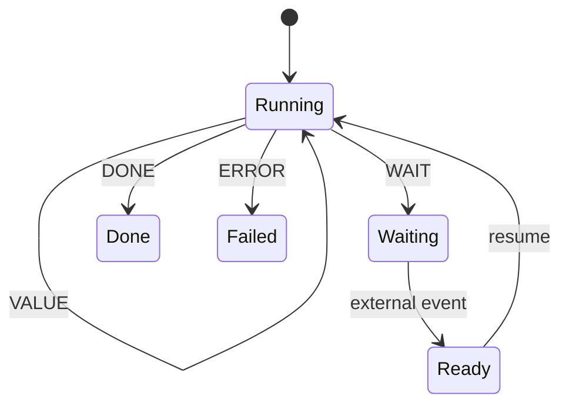
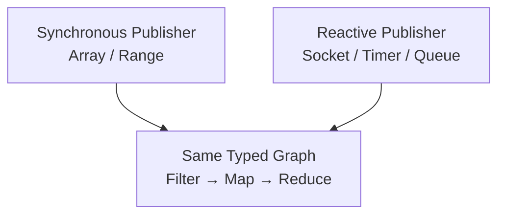
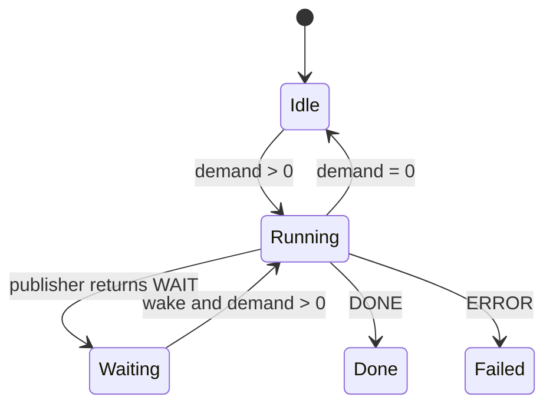
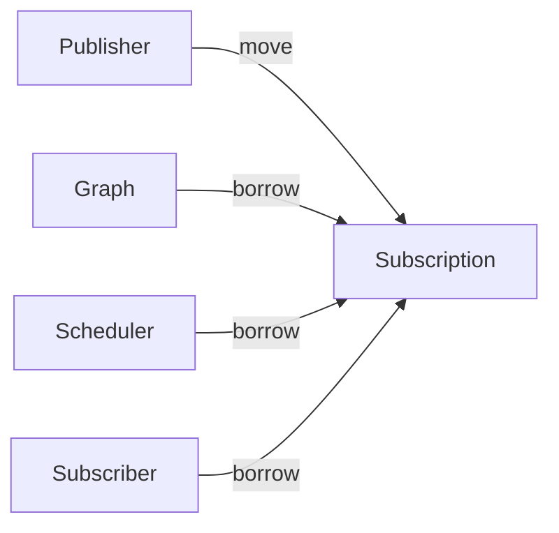

# Chapter 8: From Stream to Reactive — WAIT, Wake, Demand, and Backpressure

> **Part III begins with real I/O.**
>
> The previous chapters established that complex data transformation can be saved as Graph, constructed through a LINQ-like surface, proved and optimized before execution, and lowered into simpler execution forms.
>
> Now consider a different problem:
>
> **What if the next value comes from a file, Socket, or Timer and is not ready yet?**
>
> Plain C blocking I/O is simple:
>
> ~~~c
> FILE *fp = fopen(path, "rb");
> if (fp == NULL)
>     return -1;
>
> unsigned char buffer[4096];
> size_t n = fread(buffer, 1, sizeof(buffer), fp);
>
> fclose(fp);
> ~~~
>
> There is nothing wrong with this code. The key fact is that until `fread()` returns, the current thread is the progress owner.
>
> In the edition Salts snapshot, the same problem can be expressed through a bounded asynchronous file façade:
>
> ~~~c
> typedef struct read_probe {
>     bool done;
>     cflow_io_completion completion;
> } read_probe;
>
> static void on_read(void *user, cflow_io_request_id request_id,
>                     cflow_io_lease_id lease_id,
>                     cflow_io_native_file_operation_kind operation,
>                     const cflow_io_completion *completion)
> {
>     read_probe *probe = user;
>     (void)request_id;
>     (void)lease_id;
>     (void)operation;
>     probe->completion = *completion;
>     probe->done = true;
> }
>
> cflow_io_file file = {0};
> read_probe probe = {0};
> unsigned char buffer[4096];
>
> cflow_io_file_config config = {
> #if defined(_WIN32)
>     .backend_kind = CFLOW_IO_NATIVE_IOCP,
> #elif defined(__linux__)
>     .backend_kind = CFLOW_IO_NATIVE_IO_URING,
> #else
>     .backend_kind = CFLOW_IO_NATIVE_POLL,
> #endif
>     .request_capacity = 8u,
>     .command_capacity = 8u,
>     .completion_batch_capacity = 8u,
>     .open_flags = CFLOW_IO_FILE_READ,
>     .completion = on_read,
>     .completion_user = &probe,
> };
>
> if (cflow_io_file_open(&file, path, &config) != SALTS_OK)
>     return -1;
>
> cflow_io_file_submit_result submitted =
>     cflow_io_file_try_read_at(&file, 1u, buffer, sizeof(buffer), 0u);
>
> if (submitted.status != CFLOW_IO_FILE_SUBMIT_ACCEPTED)
>     return -1;
>
> while (!probe.done) {
>     size_t progressed = 0;
>     if (cflow_io_file_run_ready(&file, 32u, &progressed) != SALTS_OK)
>         return -1;
> }
> ~~~
>
> The important change is not simply “we used a callback.”
>
> The real change is:
>
> ~~~text
> operation accepted
>     ↓
> caller no longer owns completion timing
>     ↓
> later terminal completion
>     ↓
> computation may continue
> ~~~
>
> When that completion becomes a Publisher, the Graph's `Filter / Map / Reduce` semantics do not need to change at all; source progression only expands from `VALUE / DONE` to `VALUE / WAIT / DONE / ERROR`.
>
> That is the engineering starting point of Reactive.

## 1. A Synchronous Publisher Hides a Strong Assumption

A traditional iterator can be modeled as:

```c
bool next(void *out);
```

After:

```text
next()
```

there are usually only two outcomes:

```text
has value
no value
```

and typically:

```text
has value
    = continue

no value
    = done
```

That is reasonable for Array, Vec, and List.

But for a Socket:

```text
no data right now
```

does not mean:

```text
there will never be data again
```

Likewise for a Timer:

```text
the deadline has not arrived yet
```

does not mean:

```text
the Timer is finished
```

The simple:

```text
VALUE / DONE
```

model is therefore insufficient for real asynchronous systems.

We need a third state:

**WAIT**

meaning:

> **There is no result now, but the computation remains valid and should continue later.**

---

## 2. WAIT Is the Key Step from Synchronous Iteration to Asynchronous Execution

A Publisher step therefore expands from:

```text
VALUE
DONE
ERROR
```

to:

```text
VALUE
VALUE_AND_DONE
WAIT
DONE
ERROR
```

The current CFlow runtime explicitly models these five outcomes.

Their meanings are:

```text
VALUE
    produce one value; more may follow

VALUE_AND_DONE
    produce the final value and finish

WAIT
    cannot progress now; must wait for an external event

DONE
    normal completion

ERROR
    terminal failure
```

For the first time, “no Value” splits into two distinct semantics:

```text
WAIT
    may continue later

DONE
    will never continue
```

That distinction is fundamental to Reactive execution.

---

## 3. WAIT Must Not Mean “Block the Current Thread”

The simplest asynchronous-looking implementation is still:

```c
read(socket, ...);
```

and if no data is available:

```text
block the thread
```

until data arrives.

That can be entirely appropriate for some programs.

But with:

```text
1000 Sockets
1000 Timers
1000 waiting tasks
```

a model where:

```text
every WAIT
    =
occupy one Thread
```

becomes expensive.

So WAIT should not mean:

> leave a thread parked there.

It should mean:

> **save the computation state, return the thread to the execution system, and resume only when something relevant happens.**

Conceptually:



This is:

```text
Suspend
+
Resume
```

rather than:

```text
Block
+
Unblock
```

---

## 4. Once WAIT Exists, Who Says “You Can Continue Now”?

If a Publisher returns:

```text
WAIT
```

the executor stops calling it.

When data eventually arrives, something must say:

```text
you can continue now
```

That is:

```text
Wake
```

WAIT therefore usually comes with a:

```text
Waitable
```

A Waitable can remain small.

It only needs operations conceptually like:

```text
arm(waker)
cancel()
```

Execution becomes:

```text
Publisher.resume()
      ↓
     WAIT
      ↓
  Waitable.arm(waker)
      ↓
execution thread leaves
      ↓
external event occurs
      ↓
   waker.wake()
      ↓
reschedule Subscription
      ↓
Publisher.resume()
```

The current CFlow `cflow_waitable` follows this small-interface model with `arm` and `cancel`; `cflow_waker` itself is only a `wake(user)` callback.

---

## 5. Publisher Therefore Evolves from Iterator to Resumable

A synchronous Iterator looks like:

```text
next()
```

A Reactive Publisher is closer to:

```text
resume()
```

The naming captures an important shift.

Each call is no longer assumed to start an independent operation from scratch.

Instead it means:

> **continue a computation that may have stopped before completion.**

A Publisher may therefore own internal state such as:

```text
cursor
socket state
parser state
timer state
partial frame
```

One:

```text
resume()
```

may produce a value, or may reach a waiting point and return later.

The current CFlow layer abstracts the underlying model as `cflow_resumable`, while `cflow_publisher` adds name, output type, terminal polling, and Publisher semantics on top.

---

## 6. Most Importantly: Graph Does Not Change

Suppose the synchronous data flow is:

```text
Array<int>
    ↓
Filter(even)
    ↓
Map(square)
    ↓
Reduce(sum)
```

Replace the Publisher with:

```text
Socket<int>
```

The semantics of:

```text
Filter
Map
Reduce
```

do not change.

Only this changes:

```text
when can the Publisher produce the next int?
```

Conceptually:



Graph reveals an important fact:

> **Stream and Reactive differ mainly in execution progression, not in data-transformation semantics.**

There is no need to reinvent:

```text
ReactiveMap
ReactiveFilter
ReactiveReduce
```

---

## 7. Reactive Is Not Another Operator Framework

Without Graph, it is easy to design separate:

```text
Stream API
```

and:

```text
Reactive API
```

both with:

```text
map
filter
flatMap
reduce
```

and end up with two copies of:

```text
Operator
Type Rule
Callback Rule
Optimization Rule
```

With Graph unified:

```text
Map
```

is still Map.

```text
Filter
```

is still Filter.

The difference is only:

```text
synchronous:
    Publisher answers immediately

Reactive:
    Publisher may WAIT
```

The stronger architecture is:

```text
Typed Graph
    ↓
different Execution Models
```

not:

```text
different Frameworks
    ↓
each with its own Graph
```

---

## 8. The Same Boundary Applies to Networking: NativeIO / CNet Change the Source, Not the Graph

File I/O is only the first example.

The edition snapshot's NativeIO exposes fixed-capacity backends, generation-checked endpoints/requests, and a `submit → observe terminal` protocol.

A stream socket that has already been created and attached can conceptually submit receive work like this:

~~~c
native_io_backend backend = {0};
native_io_backend_config backend_config = {
    .kind = NATIVE_IO_BACKEND_EPOLL,
    .endpoint_capacity = 64u,
    .request_capacity = 128u,
    .completion_batch_capacity = 32u,
};

native_io_endpoint endpoint = {0};
native_io_request request = {0};
unsigned char buffer[4096];

native_io_backend_init(&backend, &backend_config);
native_io_backend_attach_socket(&backend, native_socket, &endpoint);

native_io_operation op = {
    .kind = NATIVE_IO_OPERATION_STREAM_RECV,
    .endpoint = endpoint,
    .buffer = buffer,
    .length = sizeof(buffer),
};

native_io_backend_submit(&backend, &op, &request);

native_io_completion events[32];
size_t count = 0;
native_io_backend_observe(&backend, events, 32u, 0u, &count);
~~~

This API exposes important facts:

~~~text
backend creates no hidden worker thread
endpoint/request capacity is fixed at init
after submit is accepted, payload borrow lasts until terminal completion
cancel requests cancellation; real terminal truth still comes from completion
unsupported backend does not silently fall back
~~~

CNet continues to own connection / TLS / datagram / session semantics above NativeIO; CFlow can project I/O completion into a typed Publisher through `cflow_publisher_from_io_actor()`.

The layers are:

~~~text
NativeIO
    owns OS operation progress

CNet
    owns connection / transport protocol meaning

CFlow Reactive Publisher
    owns WAIT / Wake / Demand / typed emission

Graph
    still owns Filter / Map / Reduce meaning
~~~

This is a central theme of Part III:

> **advanced applications do not require a second runtime; they compose existing semantic owners across explicit boundaries.**

---

## 9. Once WAIT Exists, Merely “Being Able to Resume” Is Not Enough

Suppose a Socket is very fast:

```text
Producer
 ↓↓↓↓↓↓↓↓↓↓↓
```

while the downstream:

```text
Consumer
```

is slow.

If the Publisher wakes and then produces without bound:

```text
value
value
value
value
...
```

the system can only:

```text
queue without bound
```

or:

```text
drop data
```

So the next Reactive question is not:

> How do we make it asynchronous?

It is:

> **How do we control the rate of flow?**

That is:

**Backpressure**

---

## 10. The Simplest Backpressure Mechanism: Demand

A very clear design is:

```text
Consumer tells upstream explicitly:

I am currently willing to accept this many Values.
```

For example:

```text
request(10)
```

means:

```text
downstream permits 10 more emitted values
```

That is:

```text
Demand
```

The current CFlow `cflow_subscription_request(subscription, n)` follows this explicit model.

Execution becomes:

```text
Demand = 0
    ↓
do not emit further downstream values

request(10)
    ↓
Demand = 10

each successful downstream emission
    ↓
Demand -= 1
```

---

## 11. Critical Semantic Point: Demand Is Not Publisher Pull Count

This is easy to get wrong.

Suppose:

```text
Publisher<int>
    ↓
Filter(even)
    ↓
Subscriber
```

The Subscriber requests:

```text
request(1)
```

The Publisher produces:

```text
1
3
5
7
8
```

The first four values are dropped by Filter.

If Demand decreased every time the Publisher was called, then:

```text
request(1)
```

would reach zero after reading `1`, and the Subscriber would never receive the value it asked for.

Correct semantics are:

```text
Publisher item
≠
Downstream value
```

So:

```text
1 -> filtered
Demand still 1

3 -> filtered
Demand still 1

5 -> filtered
Demand still 1

7 -> filtered
Demand still 1

8 -> emitted
Demand becomes 0
```

The current CFlow runtime constrains this explicitly:

> Demand always means downstream-value demand, not publisher-item demand.

This is one of the most basic and easiest-to-miss rules in the execution model.

---

## 12. Executor Must Therefore Know When to Continue Pulling

Once Demand exists, execution cannot simply be:

```text
while publisher has value:
    process
```

It must consider:

```text
Subscription State
Publisher State
Demand
Terminal State
WAIT State
```

For example:

```text
Demand > 0
Publisher ready
    ↓
resume is allowed
```

But with:

```text
Demand = 0
```

even a ready Publisher should not produce unbounded output.

Execution now resembles:



`Subscription` becomes a real execution instance.

---

## 13. Why Subscription Exists Instead of Storing Live State in Graph

Graph represents:

```text
what the computation is
```

such as:

```text
Filter
Map
Reduce
```

and should remain as:

```text
immutable
reusable
```

as practical.

Facts such as:

```text
remaining Demand
whether Publisher is WAITing
whether execution is Cancelled
where execution is currently paused
```

belong to:

```text
one execution
```

So separate:

```text
Graph
    = computation definition

Subscription
    = one execution instance
```

The same Graph may have:

```text
Subscription A
Subscription B
Subscription C
```

running over different data.

This is the same pattern later used by:

```text
Machine Definition
```

and:

```text
Machine Instance
```

---

## 14. Subscription Makes Ownership Explicit

Asynchronous execution easily creates lifetime ambiguity.

Who owns:

```text
Publisher
Graph
Scheduler
Subscriber
```

?

Without explicit rules, `cancel`, `close`, `destroy`, and `wake` can produce:

```text
double free
use after free
stale wake
```

The current CFlow model is intentionally clear:

```text
Publisher
    move into Subscription

Graph
    borrowed by Subscription

Scheduler
    borrowed by Subscription

Subscriber
    borrowed protocol
```

After `cflow_subscribe()` succeeds, Publisher ownership moves into Subscription; Graph, Scheduler, Subscriber, and callback state remain borrowed until `cflow_subscription_close()` completes.

Conceptually:



Ownership of Publisher destruction is no longer an informal convention.

---

## 15. WAIT Must Handle Lost Wakeup Correctly

A classic asynchronous race is:

```text
Publisher checks:
    no data now

at the same time external event arrives

then Publisher registers a Waiter
```

If handled poorly:

```text
event already happened
but nobody received the wake
```

and execution remains forever in:

```text
WAIT
```

This is:

```text
Lost Wakeup
```

A typical interleaving:

```text
Thread A                   External Event

check: no data

                           data arrives
                           tries to wake
                           not armed yet

begin arm

wait forever
```

So WAIT is not just a return code.

It requires a precise:

```text
arm / wake protocol
```

that makes:

```text
signal-before-arm
```

and:

```text
signal-concurrent-with-arm
```

safe from permanent suspension.

---

## 16. This Is Where Lean Starts to Matter for Execution State

For:

```text
Enum
Struct
Generic
```

unit tests are highly effective.

But for:

```text
WAIT / Wake race
```

a few tests cannot establish that:

> every possible state interleaving is safe.

So Lean can model:

```text
Wait State
Arm Step
Wake Step
Runtime State
```

and prove facts such as:

```text
if the event already occurred,
arm cannot leave the system permanently WAITing
```

or:

```text
a valid wake token cannot be consumed twice
```

Lean therefore expands from:

```text
validating finite type relations
```

to:

```text
validating runtime state transitions
```

This is the second major expansion of formal reasoning in the system.

---

## 17. Scheduler Appears Naturally Here

If an external event calls:

```text
wake()
```

and that immediately calls:

```text
resume()
```

then one question becomes unavoidable:

```text
on which thread does resume run?
```

Socket completion may come from:

```text
I/O thread
```

Timer may come from:

```text
timer thread
```

UI events may come from:

```text
UI thread
```

If every `wake()` directly runs the Graph, execution context becomes unpredictable.

A better path is:

```text
wake
    ↓
Scheduler
    ↓
reschedule Subscription
```

That is:

> **Wake means “continuation is ready,” not “run the whole Graph on this callback stack right now.”**

---

## 18. Scheduler Answers “When Does It Execute?”

We have already seen:

```text
Executor
```

as the abstraction concerned with how a task executes.

Reactive Scheduler additionally owns:

```text
time
delay
timer
cancel
```

The current CFlow Scheduler protocol exposes operations such as:

```text
post_after
cancel
run_one
run_ready
advance
now
wait_idle
```

and capabilities for delayed scheduling, manual clock, concurrency, and more.

A useful first distinction is:

```text
Executor
    = how a Task executes

Scheduler
    = when that Task gets an execution opportunity
```

The next chapter develops Executor in detail.

---

## 19. Manual Clock Matters Especially for Tests

A real Timer depends on:

```text
wall clock
```

and often produces tests such as:

```text
sleep(100ms)
```

These tests are:

```text
slow
scheduler-sensitive
flaky
```

If Scheduler supports:

```text
Manual Clock
```

then:

```text
post_after(100)
advance(99)
    -> not executed

advance(1)
    -> executed
```

Time behavior becomes deterministic state progression instead of real waiting.

This is one reason Scheduler should not merely be an alias for a thread pool.

---

## 20. From Reactive Primitives to State Semantics

The first sections introduced the truly new pieces of this chapter: WAIT, arm/wake, Demand, Subscription, bounded scheduling, and Scheduler/time control. Graph and operator semantics did not become another framework.

The rest of the chapter fixes those meanings through one canonical timed source: WAIT does not mean already armed; wake does not create demand; source VALUE is not the same as downstream emission; terminal/cancel must be unique and explicit; Subscription owns live execution state. Then we map these rules to Lean small-step semantics, the current C implementation, and race/resource evidence.

We also keep safety and liveness separate: a formal invariant is not presented as proof that OS fairness holds or a future wake must occur.

---

## 21. Canonical Example: Graph Is Unchanged, Source Acquires Time

The previous synchronous Stream is:

~~~text
input array / Range
      ↓
Source<int>
      ↓
Filter(is_even)
      ↓
Map(square)
      ↓
Reduce(sum)
~~~

A synchronous source hides the assumption:

> every query immediately produces a value or immediately completes.

Reactive changes only that assumption.

Graph remains:

~~~text
Filter(is_even)
Map(square)
Reduce(sum)
~~~

Source protocol changes to:

~~~text
resume()
   ↓
VALUE
VALUE_AND_DONE
WAIT
DONE
ERROR
~~~

WAIT means:

> **There is no value now, but this continuation is still valid; when external conditions change, the system may wake and retry.**

It is not:

~~~text
sleep current thread
~~~

nor:

~~~text
treat as DONE
~~~

nor:

~~~text
spin until something appears
~~~

That one distinction lets the same Graph extend from:

~~~text
already-materialized input
~~~

to:

~~~text
timer
channel
readiness
socket / pipe / file completion
custom asynchronous publisher
~~~

without redesigning operator semantics.

---

## 22. Semantic Contract: Reactive Adds Execution State, Not Graph State

The most important separation is:

~~~text
Graph
    = immutable/reusable program description

Subscription
    = one live execution
~~~

### 22.1 WAIT Is a Source Outcome, Not “Arm Already Succeeded”

When a source returns WAIT, it says only:

~~~text
continuation saved
+
waitable available
~~~

A separate step still exists:

~~~text
arm(waitable, waker)
~~~

Therefore:

~~~text
WAIT
    ≠
SUSPENDED
~~~

A more accurate transition is:

~~~text
READY
  ↓ resume returns WAIT
PENDING_ARM
  ↓ arm succeeds quietly
SUSPENDED
  ↓ matching wake
READY
~~~

Separating WAIT from armed suspension is the key to lost-wakeup correctness.

### 22.2 Wake Does Not Produce Demand

Wake means:

> external conditions may have changed, so rescheduling the continuation is appropriate.

It does not mean:

~~~text
one more downstream value is allowed
~~~

Wake must preserve demand.

This matters because:

~~~text
readiness
    = can retry

demand
    = downstream permits output
~~~

They come from different sources of truth.

### 22.3 Demand Means Downstream Values, Not Publisher Pull Count

This remains one of the easiest Reactive mistakes.

For:

~~~text
Source<int>
    ↓
Filter(is_even)
    ↓
Map(square)
~~~

if downstream requests:

~~~text
demand = 1
~~~

that does not mean:

~~~text
source.resume() exactly once
~~~

The first input may be filtered away.

Producing one downstream value may require several source resumes.

So:

> **Demand is consumed only when one value is actually emitted downstream.**

Source VALUE does not automatically consume downstream demand.

This lets:

~~~text
Filter
FlatMap
Relation
other cardinality-changing operators
~~~

share one consistent demand meaning.

### 22.4 Terminal Must Have One Source of Truth

Reactive termination should not be assembled from many booleans such as:

~~~text
done
cancelled
failed
maybe_source_done
~~~

A clearer model is:

~~~text
RUNNING
DONE
ERROR(message)
CANCELLED
~~~

Once terminal state exists, no new kernel small-step may begin.

We must also distinguish:

~~~text
source done
~~~

from:

~~~text
whole run done
~~~

because after source completion the Graph may still need:

~~~text
reduce finalization
buffer drain
pending terminal emission
~~~

So:

~~~text
source completion
    ↓
draining
    ↓
whole-run DONE
~~~

cannot be collapsed into one state.

### 22.5 Cancel Is an Explicit Semantic, Not an Alias for Error

Cancel should:

- stop new execution progress;
- unarm/cancel the active wait registration;
- establish CANCELLED terminal state;
- release or settle live state according to ownership contracts.

It is not:

~~~text
ERROR("cancelled")
~~~

because cancellation is a control-plane decision, while error is a computation/source failure.

### 22.6 Subscription Is the Single Owner of Live State

Graph should not store:

~~~text
demand
wait registration
cancelled flag
reduce accumulator
slice counter
live temporary value
opened backend state
~~~

Those belong to one execution.

A Subscription ownership contract is therefore approximately:

~~~text
owns:
    moved Publisher
    demand
    wait state
    continuation/live slots
    per-node mutable state
    cancellation/terminal/error state

borrows:
    immutable Graph
    Scheduler
    Subscriber
    backend/interface tables
~~~

This boundary is what later allows Executor, Machine, and Actor to compose safely.

---

## 23. Lean: A Real Reactive Small-Step Calculus Already Exists

We do not need to invent a hypothetical model.

The edition Salts snapshot contains:

~~~text
formal/cmeta_cflow_calculus/
  CMetaCFlowCalculus/CFlow/Execution.lean
  CMetaCFlowCalculus/Proofs/Execution.lean
~~~

It explicitly models:

~~~text
SourceState
Demand
WaitState
Terminal
SourceTerminal
DrainState
RuntimeState
Config
SourceResult
SourceStep
ArmStep
WakeStep
EmitStep
DrainStep
FinishStep
CancelStep
~~~

This is a good example of Lean clarifying C design.

### 23.1 `Demand.consume`: Zero Demand Cannot Emit

The formal model defines demand as a finite remaining quantity:

~~~text
consume(0)
    = none

consume(n + 1)
    = some(n)
~~~

A downstream emission therefore requires a successful consume witness.

Existing theorem:

~~~text
step_value_decrements_demand
~~~

states:

> each actual downstream value emission consumes exactly one demand.

And:

~~~text
zero_demand_no_value
~~~

states:

> when demand is zero, no value-emitting kernel step can occur.

This directly models the core C runtime backpressure safety property.

### 23.2 Source VALUE Does Not Directly Consume Downstream Demand

The theorem:

~~~text
source_value_preserves_demand
~~~

proves:

~~~text
SourceStep VALUE
    ↓
demand unchanged
~~~

because the source value may still pass through:

~~~text
Filter
FlatMap
other cardinality-changing computation
~~~

Demand is consumed at downstream EmitStep.

That is the formal version of “Demand is not Publisher pull count.”

### 23.3 WAIT → Arm → Wake Preserves Continuation and Demand

The theorem:

~~~text
wait_arm_wake_preserves_source
~~~

states that after quiet arm + matching wake:

~~~text
saved continuation preserved
wait returns READY
ownership preserved
demand preserved
source terminal preserved
drain state preserved
run terminal preserved
wake generation advances exactly once
~~~

This is valuable because:

> Wake is neither data consumption nor state reconstruction; it safely resumes the same continuation.

### 23.4 Lost Wakeup Is More Than “Add a Lock”

The formal model distinguishes:

~~~text
noSignal
signalBeforeArm
signalConcurrentWithArm
~~~

and proves:

~~~text
signal_before_arm_is_ready
signal_concurrent_with_arm_is_ready
~~~

so that readiness observed before or concurrently with registration cannot become a false suspended state.

Also:

~~~text
arm_issues_fresh_token
~~~

ensures each arm uses the current generation and advances generation exactly once.

Stale wake can therefore be distinguished from the current registration.

This is much stronger than simply saying:

~~~text
avoid lost wakeup
~~~

It turns the race into an explicit state-machine contract.

### 23.5 Terminal Is Absorbing

The theorem:

~~~text
terminal_no_step
~~~

says:

~~~text
terminal != RUNNING
    ↓
no kernel Step can start
~~~

and:

~~~text
cancel_unarms_and_terminates
~~~

says Cancel performs:

~~~text
wait -> READY
terminal -> CANCELLED
~~~

This gives the C implementation a direct refinement target.

### 23.6 Safety and Liveness Must Remain Separate

Most theorems above are safety properties:

~~~text
no emission under zero demand
no step after terminal
no permanent lost suspension for already-observed arm races
wake does not mutate demand
~~~

They do not automatically prove:

~~~text
external device eventually becomes ready
Scheduler eventually runs a task
OS eventually returns I/O completion
threads are never starved
~~~

Those require environment fairness or platform liveness assumptions.

So:

> **Lean can prove how the state machine changes safely if an event occurs; it cannot manufacture the event in the real world.**

---

## 24. Current C Implementation: Formal State Has Clear C Counterparts

Against the edition Salts snapshot:

~~~text
qigao/salts
snapshot: ad389928b437c0612c1c60844fe53677f3ed27a6
~~~

### 24.1 Source Outcome Is a Five-State Protocol

The C API defines:

~~~text
CFLOW_STEP_VALUE
CFLOW_STEP_VALUE_AND_DONE
CFLOW_STEP_WAIT
CFLOW_STEP_DONE
CFLOW_STEP_ERROR
~~~

matching the formal SourceResult.

WAIT also carries a waitable:

~~~text
arm(waker)
cancel()
~~~

Waiting is therefore a protocol object, not a boolean.

### 24.2 Publish Context Carries an Exact Downstream-Demand Snapshot

The current publish context stores:

~~~text
scheduler
downstream_demand
~~~

and documents downstream_demand as:

> the exact outstanding downstream-value demand before Subscription calls resume.

A source may use it for bounded read/window admission, but cannot redefine its meaning.

For example an I/O publisher can set:

~~~text
target window
=
min(downstream demand, configured capacity)
~~~

This connects backpressure to bounded resources.

### 24.3 Subscription Is an Opaque Execution Owner

Graph deliberately keeps concrete IR rows for introspection and verification.

Subscription does the opposite:

~~~c
typedef struct cflow_subscription {
    void *impl;
} cflow_subscription;
~~~

because it owns:

~~~text
live mutable execution state
locks / scheduling state
demand
wait registration
continuations
mutable node state
terminal state
~~~

These details need freedom to evolve and must not be directly mutated by callers.

Thus:

~~~text
Graph
    concrete read-only IR rows

Subscription
    opaque mutable execution owner
~~~

is not inconsistent style; it follows different ownership roles.

### 24.4 Subscribe Uses Move-Style Publisher Ownership

Current contract:

~~~text
before success:
    caller owns Publisher

subscribe succeeds:
    Subscription takes Publisher
    caller Publisher is cleared

admission fails:
    ownership remains with caller
~~~

while:

~~~text
Graph
Scheduler
Subscriber
~~~

remain borrowed.

This makes recovery and destruction order easier to reason about.

### 24.5 Request Retains Demand Even If Scheduling Admission Temporarily Fails

The request API explicitly requires:

~~~text
demand accepted
    ↓
pump scheduling may fail immediately
    ↓
outstanding demand remains retained
    ↓
later wake/request may retry
~~~

So:

~~~text
scheduler queue full
~~~

must not be interpreted as:

~~~text
downstream no longer wants the value
~~~

Demand is a semantic fact. Scheduler admission is a resource fact.

They are separate.

### 24.6 Wake May Be Called from Any Driver/Event-Loop Callback

`cflow_subscription_wake()` is an advanced integration hook that external event loops / driver callbacks may invoke.

Wake re-enters Subscription pump admission rather than letting the driver mutate Graph execution state directly.

The boundary remains:

~~~text
external readiness
    ↓
wake notification
    ↓
Subscription / Scheduler
    ↓
Graph execution
~~~

---

## 25. Scheduler: Time and Execution Context Are Capabilities, Not an Inheritance Tree

Scheduler is also a small Interface rather than a class hierarchy.

It declares capabilities such as:

~~~text
DELAYED
MANUAL_CLOCK
CONCURRENT
CALLER_DRIVEN_ZERO_DELAY
~~~

with several execution strategies.

### 25.1 Inline Scheduler

~~~text
accepted zero-delay task
    ↓
executes before admission returns
~~~

No:

~~~text
queue
clock
timer storage
~~~

This is useful for explicitly zero-hop boundaries.

### 25.2 Manual Scheduler

~~~text
bounded ready queue
+
caller-driven run_one / run_ready / run_until_idle
~~~

with no timer clock.

Useful for:

~~~text
external event loop
deterministic batch processing
tests
~~~

### 25.3 Test Scheduler / Manual Clock

Supports:

~~~text
post_after
advance(ticks)
run_until_idle
~~~

so time does not depend on:

~~~text
sleep(...)
wall clock race
~~~

and temporal tests can be deterministic.

### 25.4 Worker Scheduler

Moves dispatch to worker threads and exposes bounded ready/timer capacity plus statistics.

Therefore:

> Scheduler answers when/where execution runs; it does not own Graph semantics.

This prepares the next chapter's Executor boundary.

---

## 26. Evidence: Reactive Must Validate Demand, Wait, Races, and Bounded Resources Together

One async demo is not enough.

We need several forms of evidence.

### 26.1 Demand Conformance

Current Reactive tests check:

~~~text
request result
outstanding demand retained/decremented
scheduler admission failure does not silently discard demand
~~~

Calculus-conformance tests directly observe:

~~~text
demand = 1
...
emit
...
demand = 0
~~~

matching `step_value_decrements_demand`.

### 26.2 WAIT / Waitable Evidence

Reactive, Temporal, I/O, and Machine-adapter tests all exercise:

~~~text
resume
    ↓
CFLOW_STEP_WAIT
    ↓
waitable valid
    ↓
arm(waker)
~~~

WAIT is therefore a shared subsystem protocol rather than a special socket state.

### 26.3 Wake Race / Quiescence Evidence

Readiness tests include concrete concurrency cases such as:

~~~text
cancel waits until old callback waker is quiescent
~~~

These are C implementation race tests.

Lean ArmTiming theorems give the state-machine safety model;

real readiness tests verify:

> whether callback/lock/lifetime implementation follows that model.

Neither replaces the other.

### 26.4 Bounded Scheduler Evidence

Scheduler tests check bounded admission, for example:

~~~text
capacity = 1
second admission rejected_full
drain/advance
capacity reused
~~~

Backpressure is therefore more than a demand counter.

It also includes:

~~~text
bounded scheduling
bounded buffers
bounded publisher windows
bounded operator state
~~~

### 26.5 Temporal Determinism

Timer/temporal tests use controllable Scheduler/Clock paths to check:

~~~text
WAIT
advance time
wake
resume
terminal
cancel
~~~

This is a stronger semantic regression gate than wall-clock sleep-based testing.

---

## 27. What We Learned

This chapter did more than:

~~~text
Stream
    ↓
Async Stream
~~~

It introduced an independent live execution state machine:

~~~text
Program Description:
    immutable Typed Graph

Live Execution:
    Subscription
      owns Publisher
      owns demand
      owns wait registration
      owns mutable operator state
      owns terminal/cancel/error state

Execution Policy:
    Scheduler

External World:
    Waitable / Waker / readiness / timer / I/O
~~~

Lean also moved from static relation proofs into execution-step proofs.

The existing calculus turns key engineering constraints into theorems:

~~~text
zero demand → no emitted value

emit → demand decreases exactly once

source value → demand unchanged

WAIT + quiet arm + matching wake
    → same continuation, same demand

signal-before/concurrent-arm
    → cannot become lost suspension

terminal
    → no further kernel step

cancel
    → unarm + CANCELLED
~~~

This is the Lean usage the book wants to demonstrate:

> **not “build an async framework first and add proofs later,” but define the semantics of races, demand, and terminal states clearly enough that they shape the C runtime design.**

The next chapter decomposes execution policy further.

Subscription needs something to run pump tasks;

Machine later needs serialized transition execution;

parallel reduce needs to submit work;

but none of those upper-level semantics belong in the same low-level execution primitive.

The next question is:

> **Can a low-level object understand only Task, while knowing nothing about Graph, Stream, Reactive, Machine, or Actor?**

That object is Executor.

---

**Summary: Reactive Adds Time and Flow Control to Graph**

Stream mostly lives in:

~~~text
Value
    ↓
Transformation
~~~

Reactive adds:

~~~text
Value
+
Time
+
Demand
~~~

`WAIT / Wake` answers:

> There is no data now; how do we continue later?

`Scheduler` answers:

> When and in which scheduling context do we continue?

`Demand` answers:

> How many Values may downstream currently accept?

`Backpressure` answers:

> How do we keep resources bounded when Producer and Consumer rates differ?

Reactive therefore does not reinvent a data-processing system.

It extends one Typed Graph from synchronous:

~~~text
data transformation
~~~

into execution that is:

~~~text
suspendable
resumable
flow-controlled
explicit about terminal semantics
~~~

One of the most important discoveries here is:

> **advanced asynchronous behavior does not require one giant async Runtime.**

If:

~~~text
Publisher
Waitable
Scheduler
Demand
Subscription
~~~

remain small, explicit protocols, then synchronous Stream and Reactive can share most computation semantics.

The next chapter continues by reducing the execution model to its smallest primitive: **Executor — why understanding only Task is enough to support Stream, Reactive, State Machine, Actor, and parallel computation.**
