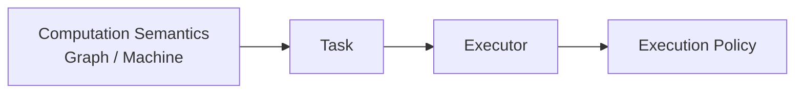
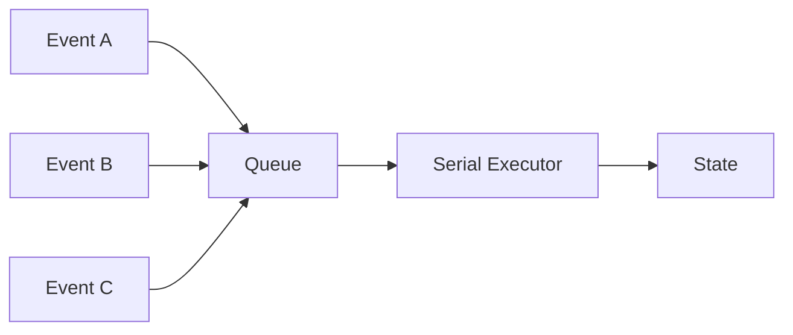
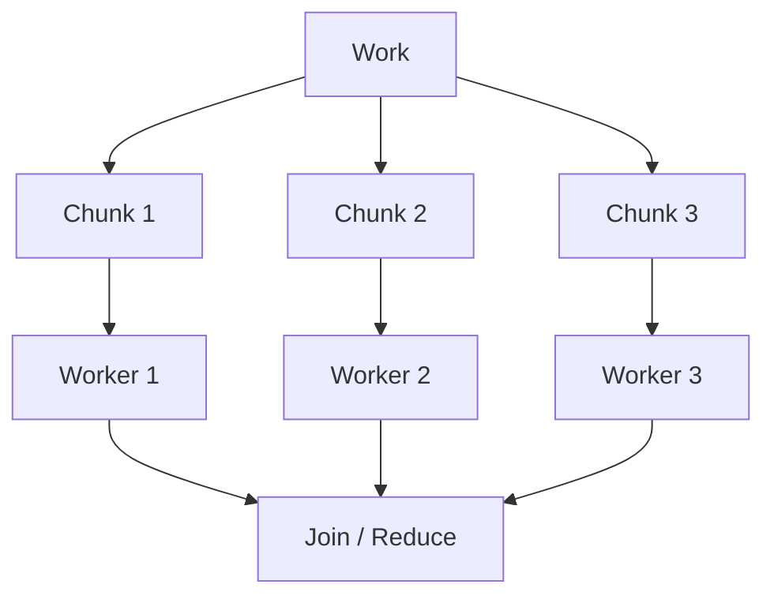
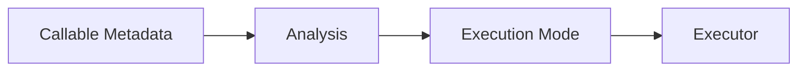
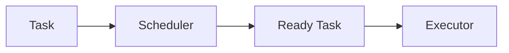
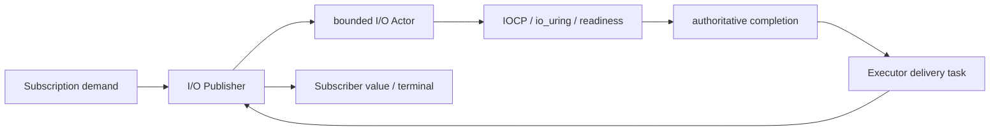

# Chapter 9: Executor — Separate Execution Policy from Computation Semantics

> **Chapter path**
>
> Reactive has already reduced one live execution to Subscription, but Subscription still needs a smaller primitive that actually runs Tasks. This chapter decomposes the execution layer further:
>
> ~~~text
> Graph / Reactive / Machine / Actor
>            ↓
>          Task
>            ↓
>        Executor
>            ↓
> Manual / Serial / Worker
> ~~~
>
> Executor answers only four classes of questions:
>
> ~~~text
> admission
> execution ordering
> bounded capacity
> lifecycle / shutdown
> ~~~
>
> It does not understand Graph operators, Reactive demand, Machine transitions, or Actor messages.
>
> The professional boundary of this chapter is that **Task ledger, capacity, serial ownership, shutdown, and self-callback deadlock behavior already have a concrete Lean protocol model that can constrain the C implementation directly.**

After the previous Reactive chapter, the system can already answer many questions:

```text
Graph
    describes what computation means

Publisher
    describes where data comes from

WAIT / Wake
    describes when progress is temporarily impossible

Demand
    describes how much data downstream can currently receive

Subscription
    describes the current state of one computation
```

But one basic question is still unresolved:

> **Who actually executes the work?**

For example:

```text
after Wake
    who runs the Subscription again?

Parallel Reduce becomes several Tasks
    who runs those Tasks?

State Machine receives an Event
    who guarantees Transition serialization?

tests should not create threads
    who lets us advance work manually, one step at a time?

Actor has many Producers
    who actually mutates its internal state?
```

These look like different problems.

But if we keep decomposing them, they all depend on one simple capability:

> **submit a Task to some execution environment.**

That is why Executor exists.

---

## 1. Executor Should Not Know Graph

The easiest mistake is to design:

```text
StreamExecutor
GraphExecutor
ReactiveExecutor
ActorExecutor
MachineExecutor
```

so that every new high-level model gets a new executor.

But eventually all of these systems need to run something reducible to:

```text
Task
```

such as:

```c
void task(void *user);
```

Executor does not need to know whether the Task came from:

```text
Map
Actor
Timer
State Transition
```

It only needs to answer:

```text
Can I accept it?
When will it run?
Under what concurrency semantics will it run?
What happens when capacity is full?
What happens after shutdown?
```

That lets Executor remain small.

The current CFlow Executor interface centers on `try_post`, `post`, `run_one`, `run_ready`, `wait_idle`, `pending`, `shutdown`, `get_stats`, and `destroy`, and distinguishes `MANUAL`, `SERIAL`, and `CONCURRENT` capabilities.

---

## 2. Why Separate Task Execution at All?

Without Executor, Stream runtime may create its own thread pool.

Reactive runtime may maintain another event loop.

State Machine may create another serial queue.

Actor may create another worker.

The system becomes:

```text
Stream
    └── Thread Pool A

Reactive
    └── Scheduler B

Machine
    └── Serial Queue C

Actor
    └── Worker D
```

Each subsystem independently solves:

```text
task admission
queue
thread
shutdown
statistics
```

This looks much like the macro duplication from Part I.

The duplicated artifact is no longer macro code. It is:

```text
execution infrastructure
```

The same method applies again:

> **find the smallest common mechanism and reuse it.**

---

## 3. Executor Answers “How Does Work Run?”, Not “What Is the Work?”

This boundary matters.

For example:

```text
Map(f)
```

belongs to Graph.

It means:

```text
apply f to a Value
```

Whether:

```text
f runs on the current thread
or on a worker thread
```

is not part of Map semantics.

Likewise:

```text
State Transition
```

means:

```text
State + Event -> NewState
```

Whether the Transition executes through:

```text
Serial Queue
```

or:

```text
manual caller-driven stepping
```

is execution policy.

Conceptually:



So:

```text
Graph / Machine
    decides what to do

Executor
    decides how that work gets an execution opportunity
```

---

## 4. First Executor: Manual

The simplest Executor may have no threads at all.

It can maintain a bounded task queue:

```text
post(task)
    ↓
Queue

run_one()
    ↓
execute one

run_ready()
    ↓
execute all ready tasks
```

Manual Executor has one especially important use:

**testing**

Suppose we want to test:

```text
Event A
    ↓
Transition
    ↓
Event B
```

If a background thread executes automatically, the test must deal with:

```text
race
sleep
condition variable
timing
```

With Manual Executor:

```text
submit Event A

assert(state == before)

run_one()

assert(state == after)
```

Part of a concurrent program becomes:

```text
a deterministic state-machine test
```

The current Manual Executor is exactly a fixed-capacity FIFO task array driven by caller calls to `run_one` / `run_ready`.

---

## 5. Manual Executor Also Integrates with an Existing Event Loop

Many programs already own:

```text
UI Loop
libuv
epoll loop
game loop
embedded main loop
```

One of the worst choices is to force the framework to create a second execution system.

If Executor is caller-driven:

```text
while (...) {
    process_ui();
    process_io();

    executor.run_ready();
}
```

the execution system can be embedded into the existing host loop.

Manual Executor is therefore not merely a test utility.

It also represents:

```text
Host-driven execution
```

---

## 6. Second Executor: Serial

Many systems need not “go faster.” They need:

> **one logical object's mutations to remain strictly serialized.**

Suppose a State Machine owns:

```text
State S
```

and receives:

```text
Event A
Event B
```

at the same time.

If two Transitions run concurrently:

```text
Thread 1:
    read S
    compute S1

Thread 2:
    read S
    compute S2
```

and then both commit:

```text
which state wins?
```

The simplest answer is often not:

```text
lock every field
```

but:

```text
all State Transitions
    ↓
Serial Executor
```

Conceptually:



The current Serial Executor reuses the same thread-pool substrate but fixes worker count to one, exposing an explicit `SERIAL` capability.

---

## 7. Serial Executor Means “Single Mutable Owner”

This is an important concurrency principle.

Instead of:

```text
many threads
directly mutate one complex object
```

prefer:

```text
many Producers
    ↓
submit immutable / copied work
    ↓
one execution sequence
    ↓
single mutation owner
```

This reduces the complexity of:

```text
lock ordering
fine-grained synchronization
partial state visibility
```

That is why later:

```text
State Machine
Actor
```

fit naturally on top of Serial Executor.

---

## 8. Third Executor: Concurrent Worker

Other work has no shared mutable state.

For example:

```text
Map a pure function over 1,000,000 numbers
```

If chunks are independent:

```text
Chunk 1
Chunk 2
Chunk 3
Chunk 4
```

they can run on several workers.

A different Executor can therefore expose:

```text
CONCURRENT
```

Conceptually:



The current Worker Executor uses a multi-worker thread pool while sharing admission and statistics protocols with Serial Executor.

---

## 9. Executor Does Not Decide Parallel Legality

This is critical.

Executor may say:

```text
I support concurrent task execution
```

It must not decide:

> this Graph is parallelizable.

Executor does not know:

```text
whether Tasks have data dependencies
whether Callables are Pure
whether Reducer is Associative
whether values alias
whether order must be preserved
```

Those belong to:

```text
Graph / Plan Semantic Analysis
```

The correct relation is:

```text
CMeta / CFlow Analysis
    ↓
prove/admit an execution mode as legal
    ↓
Executor
    runs the resulting tasks
```

not:

```text
Executor has 8 threads
    ↓
everything becomes parallel
```

---

## 10. This Is Where Effects / Properties Start to Influence Executor for Real

Suppose:

```text
reduce : T × T -> T
```

should run in parallel as:

```text
Chunk A -> partial A
Chunk B -> partial B

partial A + partial B
```

The semantic layer needs guarantees such as:

```text
ASSOCIATIVE
```

and perhaps:

```text
PURE
TOTAL
NO_ALIAS
ORDER preservation
```

depending on the execution contract.

Conceptually:



Executor performs no semantic inference.

It executes tasks already admitted by the semantic layer.

---

## 11. Executor Must Be Bounded

If:

```text
post(task)
```

always succeeds, an implementation often needs:

```text
an unbounded queue
```

But real systems often have:

```text
Producer speed > Consumer speed
```

For example:

```text
network requests arrive
    100k/s

Workers process
    10k/s
```

If Executor exposes no capacity boundary:

```text
memory grows without bound
```

Executor should therefore expose:

```text
capacity
pending
```

and allow:

```text
try_post()
```

to return:

```text
ACCEPTED
FULL
CLOSED
INVALID
```

The current implementation also records `capacity`, `pending`, `peak_pending`, `rejected_full`, and `rejected_closed`.

---

## 12. FULL Is Information, Not an Exception

When:

```text
Queue Full
```

occurs, the primitive should not silently choose:

```text
block Producer
drop Task
grow without bound
retry
```

These are different application policies.

A Web Server may:

```text
return 503
```

Telemetry may:

```text
drop low-priority event
```

A financial system may:

```text
never drop; apply backpressure
```

A UI may:

```text
coalesce duplicate updates
```

Executor should therefore report only:

```text
FULL
```

and let the higher layer decide.

This is the same philosophy as Reactive Demand:

> **resource limits are facts in the protocol, not implementation details to hide.**

---

## 13. Why Both `try_post` and `post` Exist

They express different policies.

`try_post` is:

```text
non-blocking admission
```

and immediately reports:

```text
accepted / full / closed
```

A concrete `post` may provide:

```text
a more convenient submission semantic
```

but systems needing precise resource policy must be able to use:

```text
try_post
```

rather than only a vague:

```text
submit()
```

whose implementation may secretly:

```text
block
retry
drop
```

---

## 14. Executor Shutdown Must Be an Explicit State

Another common concurrency bug is:

```text
object is being destroyed
while someone is still submitting
```

Executor needs an explicit lifecycle:

```text
OPEN
    ↓
shutdown
    ↓
CLOSED
```

Afterward:

```text
try_post
```

returns:

```text
CLOSED
```

instead of quietly accepting new work.

Resource lifecycle becomes part of the verifiable protocol.

---

## 15. Statistics Are Not an Optional Decoration

A bounded executor without:

```text
pending
peak_pending
rejected_full
```

makes production diagnosis difficult.

If:

```text
peak_pending approaches capacity
```

the system has sustained high load.

If:

```text
rejected_full grows quickly
```

backpressure policy is actively triggering.

Executor statistics are therefore not merely debug convenience.

They are:

```text
observability of the runtime resource model
```

---

## 16. Executor Is a Good Fit for a Small Interface

We already have:

```text
Manual
Serial
Concurrent Worker
```

Future providers may include:

```text
UI Executor
IO Executor
Embedded Executor
External Thread Pool Adapter
```

Their internals differ.

But to upper layers they implement:

```text
one task-execution protocol
```

A small Interface shaped like:

```text
{ self, vtable, capabilities }
```

is therefore appropriate.

This is a real use of CMeta Interface.

Not to build:

```text
class hierarchy
```

but:

> **to let different execution providers satisfy the same C protocol.**

The current `cflow_executor` itself is generated through the CMeta interface mechanism.

---

## 17. Capability Matters More Than Concrete Executor Type

Upper layers should not normally write:

```text
if executor == WorkerExecutor
```

They should ask:

```text
executor supports CONCURRENT?
```

or:

```text
supports SERIAL?
```

For example, State Machine may require:

```text
SERIAL
```

rather than:

```text
must use a concrete type named SerialExecutor
```

A future:

```text
UI Main Thread Executor
```

may provide the same:

```text
SERIAL
```

capability and therefore be valid.

This is exactly the earlier Traits principle:

```text
depend on capability
rather than concrete type
```

---

## 18. Why Scheduler Is Not Just Executor

Reactive already showed that after:

```text
wake()
```

a Subscription needs to run again.

If every Task is:

```text
run immediately
```

Executor is enough.

Real asynchronous systems also need:

```text
run after 100ms
Timer expiration
cancel a timer that has not run yet
```

Those are not core Executor responsibilities.

Scheduler can use a similar Task abstraction while additionally owning:

```text
Time
Timer Queue
Delayed Dispatch
```

---

## 19. Executor and Scheduler Are Orthogonal, Not an Inheritance Relationship

A useful distinction is:

```text
Executor
    owns execution

Scheduler
    owns scheduling
```

or:

```text
Executor
    "How does this Task run?"

Scheduler
    "When does this Task become ready?"
```

Conceptually:



An implementation may reuse one thread pool.

But Time should not be forced into every Executor; otherwise a simple State Machine would carry timer machinery unnecessarily.

### 19.1 From Thread and Coroutine to Readiness and Native Async I/O

Advanced Executor applications follow the same design rule as CMeta: do not absorb every concept into the core. Let higher-level models reuse a stable primitive.

First distinguish ownership of five classes of state:

| Concept | State it really owns | What it should not impersonate |
|---|---|---|
| Executor | admission, execution, cancellation, settlement of ready Tasks | Timer or I/O completion source |
| Scheduler | when Tasks become ready, delayed queue, time progression | business state machine |
| Thread | OS execution resource | identity of one Actor or one I/O request |
| Coroutine | suspended control-flow position and frame | I/O truth source or Executor queue |
| Readiness / Native I/O | resource registration, request progress, terminal completion | Graph operator or business callback policy |

The current `cflow_executor_task` is a copied descriptor. Once admitted successfully, it must enter exactly one of `run` or `cancel`, followed by optional `finalize`; rejected tasks invoke no callback. Manual, Serial, and Worker implementations share `CMETA_EXEC_CAP_MANUAL`, `CMETA_EXEC_CAP_SERIAL`, and `CMETA_EXEC_CAP_CONCURRENT`, and expose FULL, CLOSED, and WOULD_BLOCK under fixed capacity instead of secretly growing.

#### Thread: Execution Resource, Not Upper-Level Identity

Worker Executor uses threads to run ready Tasks; Worker Scheduler sends expired timer tasks to an internal Worker Executor. A Thread is therefore only a backend resource. Actor, Subscription, Statechart Instance, and I/O Actor do not need one-thread-per-object identity. They preserve their real state through mailbox, demand, Serial Executor, or request slots.

#### Coroutine: Preserve Execution Position, Do Not Take Ownership of Completion

`Salts::Coroutine` provides a stackful coroutine primitive over minicoro, a single-owner bounded reuse pool, and an optional multi-shard `salts_coro_executor_t`. A running frame may voluntarily yield with `salts_coro_executor_yield()`. To wait for external work, it first obtains a generation-checked token through `await_begin`; failed submission closes through `await_abort`, and successful submission calls `await` to suspend. An external completion thread calls `await_complete` only to publish a terminal signal; the original shard owner performs the actual resume. The frame records only “where execution stopped,” not a second copy of “whether the operation completed.”

The generic coroutine Executor separates user threads from scheduling threads explicitly. Each fixed shard exclusively owns one scheduler, one `salts_coro_pool_t`, one bounded MPSC task queue, and one completion-wake queue whose capacity is not shared with new task admission. User threads submit copied task descriptors; running frames never migrate across shards. Normal submission uses round robin, while `submit_to` provides explicit affinity for connections, sessions, or Actors. Queue full, closed admission, and self-blocking on the same Executor are exposed as `SALTS_ENOBUFS`, `SALTS_ESHUTDOWN`, and `SALTS_EBUSY` instead of being hidden by unbounded growth.

A frame holds at most one await slot at a time. Wake-queue capacity is at least the maximum active frame count for the shard, so every valid await has reserved budget for exactly one terminal wake. Completion may arrive before `await`, or after `shutdown` closes task admission; the former reads already-published state without suspension, while the latter is still accepted to finish draining. Executor does not fabricate cancellation results for external systems: once a NativeIO request, timer, or user operation has been successfully submitted, its owner must eventually publish one completion and must stop completion callers before Executor destruction.

The composition therefore is:

```text
Native request / readiness registration
    = operation progress and terminal truth

Coroutine frame
    = suspended control-flow position

Scheduler / Executor
    = resume task becomes ready and runs
```

Coroutine Executor and CFlow Executor still represent different execution semantics: the former schedules cooperative frames on fixed shards, while the latter carries typed-flow task/admission contracts. The generic await token solves “how does a completion thread safely wake the original shard,” but mapping a NativeIO completion to a token and deciding when to cancel/drain remains an upper-level adapter responsibility. CFlow core should not depend backward on a network-specific coroutine context, and a generic coroutine Executor should not become the I/O truth source.

#### Readiness: Translate Platform Events into WAIT/Wake

Platform `salts_readiness_reactor` owns registration and backend state. When `cflow_publisher_from_readiness_registration()` succeeds, the registration moves into shared Publisher/owner state; the read callback remains the only producer of values and terminal data semantics. Readiness callbacks publish only coalescible wake edges. Subscription then resumes the Publisher according to demand instead of re-entering the whole Graph on the platform callback stack.

Close order is part of the interface contract: cancel and destroy the Publisher first so registration becomes quiescent; then call `cflow_readiness_publisher_owner_close()` on the external owner. Closing while the Publisher is still live returns busy instead of trading convenience for a dangling callback.

#### Native Async I/O: Executor Delivers, Request Slot Owns Truth

`cflow_io_actor` models asynchronous I/O as a bounded request state machine. `request_capacity` and `command_capacity` are hard limits. Successful submit moves operation ownership. The native backend must publish exactly one authoritative terminal completion for every submitted request. Best-effort cancel is not proof of completion; duplicate or late completions are recognized as stale.

The backend may be IOCP, io_uring, or a readiness adapter. `cflow_publisher_from_io_actor()` turns Subscription demand into a bounded operation window and encodes completion as typed values. Executor owns only the completion-delivery Task; it does not own the native request and does not choose retry, fallback, or business error policy.

The full path is:



This follows the CMeta design discipline: Executor core retains only stable Task/Admission/Lifecycle contracts; Thread, Coroutine, Readiness, and Native I/O remain advanced applications with their own ownership and state machines.

---

## 20. From Execution Mechanism to Protocol Verification

Executor no longer needs to justify itself by saying “it can serve Stream, Reactive, Machine, and Actor.” Manual, Serial, and Concurrent Worker share a smaller protocol: explicit admission/ownership, bounded capacity, FULL/CLOSED, shutdown settlement, single mutable owner, and separation between capability and scheduling policy.

The rest of the chapter validates that protocol. Lean models finite state and the task ledger; C implementation handles real queues, thread/callback context, and lifecycle; CI/tests verify capacity, serial safety, self-callback boundaries, shutdown, and ownership. Whether parallel execution is semantically legal remains an upper-layer admission decision, not something Worker infers by itself.

---

## 21. Semantic Contract: Executor Is Small, Not Vague

Executor API may be small, but its contract must be precise.

### 21.1 Task Admission Is an Explicit Ownership Boundary

The smallest task can still be:

~~~c
void task(void *user);
~~~

but real tasks often also need:

~~~text
run
cancel
finalize
user
~~~

because if shutdown chooses:

~~~text
cancel pending
~~~

“the task did not run” does not mean:

~~~text
nothing needs cleanup
~~~

The task may still need to:

~~~text
release retained user state
return buffer to pool
settle promise/future
decrement outstanding ownership
~~~

A task descriptor is therefore closer to:

~~~text
accepted
    ↓
exactly one of:
    run
    cancel
    ↓
optional finalize
~~~

Rejected admission must:

> invoke no task callback and not steal caller ownership.

This turns FULL/CLOSED from vague error codes into an ownership protocol.

### 21.2 Capacity Is a Semantic Boundary, Not a Performance Hint

If Executor declares:

~~~text
capacity = N
~~~

then queued work must satisfy:

~~~text
queued <= N
~~~

It cannot secretly allocate an overflow queue when full.

Otherwise the visible backpressure contract is false.

FULL means:

> **the current resource boundary is reached; higher layers choose the next policy.**

Executor itself does not automatically:

~~~text
drop
retry forever
block any caller
spill to heap
create new worker
~~~

### 21.3 Serial Means Single Mutable Owner, Not “One Dedicated Thread”

The real Serial guarantee is:

~~~text
running <= 1
~~~

not:

~~~text
must have a dedicated thread
~~~

Serial may be implemented through:

~~~text
manual caller-driven queue
single worker
external event loop adapter
~~~

This lets State Machine / Actor depend on serial semantics without depending on a concrete thread topology.

### 21.4 Worker Provides Concurrent Capability, Not Permission for Semantic Parallelism

Worker Executor can run multiple tasks concurrently.

That does not mean:

~~~text
any Graph node
any State transition
any Actor message
~~~

is allowed to run in parallel.

The real admission relation remains:

~~~text
semantic layer says parallelism is legal
        +
Executor provides CONCURRENT capability
        ↓
parallel execution admitted
~~~

Mechanism does not choose policy.

### 21.5 Lifecycle Must Move Explicitly from OPEN to CLOSED

Executor lifecycle needs at least:

~~~text
OPEN
    ↓ shutdown
CLOSING
    ↓ all accepted work settles
CLOSED
~~~

Once no longer OPEN:

~~~text
new post
    → CLOSED / rejected
~~~

How already accepted tasks settle depends on explicit policy:

~~~text
DRAIN
CANCEL_PENDING
~~~

This is much safer than:

~~~text
destroy() then hope callbacks stop
~~~

### 21.6 A Same-Executor Callback Must Not Synchronously Wait on Itself

This is an easy deadlock boundary to overlook.

If currently inside a callback on the same Executor:

~~~text
queue is full
~~~

and the callback calls a blocking post that waits for capacity, or:

~~~text
wait_idle()
~~~

that waits for itself to complete, self-deadlock results.

The contract must therefore allow explicit:

~~~text
WOULD_BLOCK
~~~

This is part of the execution model, not an implementation detail.

---

## 22. Lean: Executor Already Has a Complete Protocol Model

The edition Salts snapshot contains:

~~~text
CMetaCFlowCalculus/CFlow/ExecutorProtocol.lean
CMetaCFlowCalculus/Proofs/ExecutorProtocol.lean
~~~

The model starts from protocol facts rather than thread APIs.

It defines:

~~~text
ExecutorKind
    manual
    serial
    worker

ShutdownPolicy
    drain
    cancelPending

Lifecycle
    open
    closing
    closed

TaskPhase
    queued
    running
    completed
    cancelled

AdmissionResult
    accepted
    full
    closed
    wouldBlock
~~~

This closely matches the C API boundary.

### 22.1 Bounded: Queue Never Exceeds Capacity

Formal state defines:

~~~text
Bounded(state)
:=
queued <= capacity
~~~

and theorem:

~~~text
accepted_post_is_bounded_and_conserved
~~~

proves that when room exists, accepted post gives:

~~~text
queued' = queued + 1
accepted' = accepted + 1
Safe(state')
~~~

More generally:

~~~text
tryPost_preserves_safe
~~~

proves ACCEPTED/FULL/CLOSED do not violate the Safe invariant.

This constrains C directly:

> if a C backend secretly stores a task after returning FULL, it is not merely “implemented differently”; it violates the model.

### 22.2 Task Ledger Conservation: Accepted Tasks Do Not Disappear

The formal model defines:

~~~text
accepted
=
queued
+
running
+
completed
+
cancelled
~~~

and proves:

~~~text
state_conserved
~~~

and, after settlement:

~~~text
accepted
=
completed + cancelled
~~~

through:

~~~text
settled_tasks_have_exactly_one_terminal_outcome
~~~

This gives shutdown a strong engineering target:

> every accepted task must eventually have exactly one terminal outcome.

Not:

~~~text
maybe ran
maybe disappeared during destroy
~~~

### 22.3 SerialSafe: Manual / Serial Have at Most One Running Task

Formal definition:

~~~text
manual / serial:
    running <= 1

worker:
    no such restriction
~~~

and:

~~~text
start_preserves_safe
~~~

ensures a start transition preserves that property.

This is the mathematical form of single mutable owner.

### 22.4 FULL and CLOSED Preserve the Task Ledger

Theorems:

~~~text
full_post_preserves_task_ledger
post_shutdown_rejected
~~~

show rejected posts do not append a task, only update rejection observations.

This matches the ownership rule:

~~~text
rejected admission
    ↓
caller still owns task/user
~~~

### 22.5 Same-Callback Blocking Operations Fail Fast

The theorem:

~~~text
self_blocking_operations_fail_fast
~~~

states that when:

~~~text
caller = callback of same Executor
queue full
~~~

then:

~~~text
blockingPost
    → WOULD_BLOCK

waitIdle
    → WOULD_BLOCK
~~~

This is a practical example of Lean improving API design.

Without a model, a “convenient” blocking API can survive until production reveals self-deadlock.

### 22.6 Shutdown Settlement

The formal model distinguishes:

~~~text
drain
cancelPending
~~~

and proves:

~~~text
beginShutdown_preserves_safe
settleShutdown_settled
settleShutdown_quiescent
close_produces_closed_quiescent
~~~

So CLOSED does not merely mean:

~~~text
a bool was set true
~~~

It means:

~~~text
lifecycle = CLOSED
+
queued = 0
+
running = 0
~~~

That is ClosedQuiescent.

### 22.7 This Still Does Not Prove OS Fairness

Formal `settleShutdown` is a summary transition and explicitly relies on the external premise that running tasks eventually finish and drain-mode queued tasks are eventually driven.

Lean proves:

~~~text
if accepted work is driven/settled
then protocol accounting is correct
~~~

It does not prove:

~~~text
worker thread can never hang
OS always schedules
user task always returns
~~~

This is the same safety/liveness boundary as Chapter 8.

---

## 23. Current C Implementation: Task Protocol Is Richer Than `fn/user`

Against the edition Salts snapshot:

~~~text
qigao/salts
snapshot: ad389928b437c0612c1c60844fe53677f3ed27a6
~~~

the built-in task descriptor is:

~~~c
typedef struct cflow_executor_task {
    cflow_task_fn run;
    cflow_task_fn cancel;
    cflow_task_fn finalize;
    void *user;
} cflow_executor_task;
~~~

Its contract is:

~~~text
successful admission
    ↓
exactly one of run/cancel
    ↓
finalize if present

rejected admission
    ↓
no task callback
~~~

This aligns closely with the Lean task ledger's “exactly one terminal outcome.”

### 23.1 Manual Executor Is an Explicit Caller-Driven Queue

Current Manual implementation owns:

~~~text
bounded task array
count
settling
capacity
accepted/completed/cancelled counters
rejection counters
lifecycle
shutdown policy
running flag
~~~

It is not a “test fake.”

It represents a real execution policy:

> task admission and task driving are separate; the owner decides when to call run_one/run_ready.

That makes it useful for:

~~~text
deterministic test
external batch/event loop
single-thread ownership boundary
~~~

### 23.2 FULL Is Counted, Not Hidden by Automatic Growth

Manual `try_post` behaves conceptually as:

~~~text
if count >= capacity
    rejected_full++
    return FULL
~~~

There is no hidden fallback allocation.

This directly refines formal Bounded.

### 23.3 Shutdown Policy Is Selected Once

The implementation records:

~~~text
shutdown_policy_selected
~~~

The first shutdown selects:

~~~text
DRAIN
or
CANCEL_PENDING
~~~

Later attempts to redefine shutdown meaning with another policy fail.

This prevents:

~~~text
begin closing
then application changes semantics halfway through
~~~

### 23.4 CANCEL_PENDING Executes Cancel/Finalize

When pending tasks are cancelled:

~~~text
cancel(user)
finalize(user)
cancelled++
~~~

The queue row is not merely discarded.

This is ownership protocol in actual code.

### 23.5 Callback Context Is Tracked Across a Thread-Local Boundary

Manual implementation records which Executor state is currently running.

Therefore:

~~~text
post that would need waiting
wait_idle
~~~

can return WOULD_BLOCK from a same-executor callback instead of self-deadlocking.

This is the C counterpart of `self_blocking_operations_fail_fast`.

---

## 24. Manual / Serial / Worker Share a Protocol, Not a Structure

We should not describe these as three frameworks.

They share:

~~~text
Task admission
capacity
lifecycle
settlement
statistics
capabilities
~~~

### 24.1 Manual

~~~text
CAP_MANUAL
caller drives work
running <= 1
~~~

Best for deterministic control.

### 24.2 Serial

~~~text
CAP_SERIAL
execution may be automatically driven
semantic guarantee: single running task
~~~

Useful for:

~~~text
Machine mutation
Actor state
single-owner callbacks
~~~

### 24.3 Worker

~~~text
CAP_CONCURRENT
multiple accepted tasks may run concurrently
~~~

Useful for:

~~~text
parallel Plan
independent work
I/O/computation dispatch
~~~

but only after upper-level semantic admission allows parallelism.

---

## 25. Why Executor and Scheduler Still Need Separate Objects

Chapter 8 showed Scheduler also needs:

~~~text
delay
clock
cancel by task id
advance virtual time
timer queue
~~~

Executor needs only:

~~~text
accept Task
run Task
bound work
settle lifecycle
~~~

So:

~~~text
Executor
    = execution resource / ordering primitive

Scheduler
    = temporal dispatch policy
~~~

Scheduler may internally use Executor without becoming the same interface.

A typical relation is:

~~~text
timer/readiness
    ↓
Scheduler
    ↓
Executor / posting context
    ↓
Task
~~~

or:

~~~text
Manual Scheduler
    ↓
Manual Executor
~~~

This is composition, not inheritance.

---

## 26. Evidence: Validate the Protocol, Not Only “the Task Ran”

This chapter needs several kinds of evidence.

### 26.1 Capacity Evidence

For capacity=N:

~~~text
accept up to N queued work
N+1
    → FULL
drain one
    → capacity reusable
~~~

and check:

~~~text
peak_pending
rejected_full
~~~

### 26.2 Ledger Evidence

After:

~~~text
normal completion
cancel-pending shutdown
drain shutdown
~~~

check:

~~~text
accepted
=
completed + cancelled
~~~

matching the Lean theorem.

### 26.3 Serial Evidence

Submit multiple tasks and prove:

~~~text
running never exceeds 1
~~~

using instrumentation / atomic counters, not only final output order.

### 26.4 Self-Callback Evidence

Inside a task callback test:

~~~text
wait_idle(same executor)
    → WOULD_BLOCK

blocking post when full
    → WOULD_BLOCK
~~~

Happy-path tests would not reveal this deadlock boundary.

### 26.5 Shutdown Evidence

Test separately:

~~~text
DRAIN
    queued work runs/finalizes

CANCEL_PENDING
    queued work cancels/finalizes

after closing
    new post rejected
~~~

and repeated/invalid shutdown-policy behavior.

### 26.6 Sanitizer / Ownership Evidence

The most dangerous task-user ownership paths include:

~~~text
accepted then cancelled
run callback recursively posts
finalize releases last ref
destroy races with pending work
~~~

These need:

~~~text
ASan / UBSan
stress / race-focused tests
~~~

Lean does not find use-after-free.

---

## 27. What We Learned

This chapter completes the execution-mechanism decomposition in Part III:

~~~text
Graph
    = computation description

Stream
    = construction façade

Reactive Subscription
    = live execution state

Scheduler
    = when / where to resume

Executor
    = bounded Task execution primitive
~~~

Executor is powerful not because it knows many high-level concepts.

It is powerful because:

> **it is small enough to be reused by many high-level models.**

The Lean protocol turns rules that are often only comments into theorems:

~~~text
queued <= capacity

accepted
=
queued + running + completed + cancelled

Serial:
running <= 1

FULL/CLOSED:
no task admitted

same callback:
blocking operations → WOULD_BLOCK

shutdown settled:
accepted = completed + cancelled

CLOSED:
queued = 0 and running = 0
~~~

This is the book's method again:

~~~text
find the smallest useful C primitive
      ↓
state its semantic contract
      ↓
formalize the dangerous boundaries
      ↓
make C implementation refine that model
      ↓
test runtime/ownership parts Lean does not cover
~~~

The chain now reads:

~~~text
Callable
   ↓
Typed Graph
   ↓
Stream façade
   ↓
Reactive live execution
   ↓
Executor primitive
~~~

The next step enters a different kind of advanced program:

> **When inputs become Typed Events rather than only Values, and the system must own State over time, how do these primitives compose into a State Machine?**
