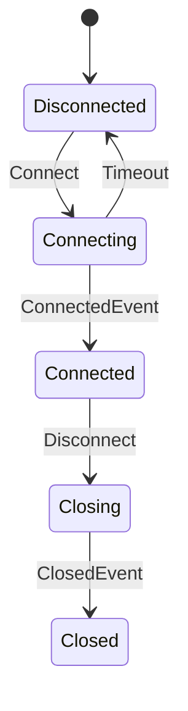
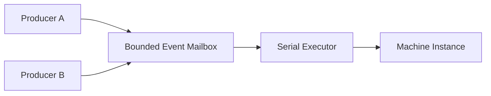
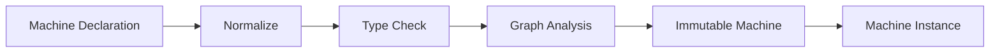

# Chapter 10: From Event to State Machine — Turn State Change into a Verifiable Execution Model

> **Chapter path**
>
> Part II established how computation relations can be described, proved, and lowered. Part III now tackles another class of C problem that easily becomes difficult to control: long-lived mutable state.
>
> Start with an ordinary connection state machine. Many projects begin with code like this:
>
> ~~~c
> typedef enum connection_state {
>     CONN_DISCONNECTED,
>     CONN_CONNECTING,
>     CONN_CONNECTED,
>     CONN_CLOSING,
>     CONN_CLOSED
> } connection_state;
>
> typedef enum connection_event {
>     EV_CONNECT,
>     EV_CONNECTED,
>     EV_TIMEOUT,
>     EV_DISCONNECT,
>     EV_CLOSED
> } connection_event;
>
> typedef struct connection {
>     connection_state state;
> } connection;
>
> static int connection_step(connection *c, connection_event ev)
> {
>     switch (c->state) {
>     case CONN_DISCONNECTED:
>         if (ev == EV_CONNECT) {
>             c->state = CONN_CONNECTING;
>             return 0;
>         }
>         break;
>
>     case CONN_CONNECTING:
>         if (ev == EV_CONNECTED) {
>             c->state = CONN_CONNECTED;
>             return 0;
>         }
>         if (ev == EV_TIMEOUT) {
>             c->state = CONN_DISCONNECTED;
>             return 0;
>         }
>         break;
>
>     case CONN_CONNECTED:
>         if (ev == EV_DISCONNECT) {
>             c->state = CONN_CLOSING;
>             return 0;
>         }
>         break;
>
>     case CONN_CLOSING:
>         if (ev == EV_CLOSED) {
>             c->state = CONN_CLOSED;
>             return 0;
>         }
>         break;
>
>     case CONN_CLOSED:
>         break;
>     }
>
>     return -1;
> }
> ~~~
>
> For a small state machine, this is perfectly acceptable C.
>
> The problem appears as requirements accumulate:
>
> ~~~text
> Events begin to carry different payloads
> transitions gain guards / actions
> some states must be terminal
> the same state/event pair must not be ambiguous
> action failure must not leave state half-committed
> events from multiple threads must not mutate state concurrently
> unreachable / invalid references should be caught before runtime
> ~~~
>
> If these constraints remain embedded in `switch` statements, they quickly spread into implicit conventions.
>
> So this chapter does not begin by asking “what is a State Machine?” It asks:
>
> **Can `state + event + guard + action + transition` become typed, verifiable program data, so the runtime executes only transitions already admitted by the control plane?**
>
> The canonical control program remains:
>
> ~~~text
> Disconnected --Connect--------> Connecting
> Connecting   --ConnectedEvent-> Connected
> Connecting   --Timeout--------> Disconnected
> Connected    --Disconnect-----> Closing
> Closing      --ClosedEvent----> Closed
> ~~~
>
> We will turn the plain-C switch into Typed Event, immutable Machine IR, build-time validation, serialized Instance execution, and atomic commit. Lean enters only after small-step semantics are explicit, to prove determinism, typing, and terminal laws.

---

## 1. Event Should First Be a Typed Value

A common traditional event system is:

```c
enum event_type {
    EVENT_LOGIN,
    EVENT_LOGOUT,
    EVENT_TIMEOUT
};

struct event {
    int type;
    void *payload;
};
```

This is simple.

Its weakness is also obvious.

For example:

```text
EVENT_LOGIN
```

may require a:

```text
LoginRequest
```

payload, while:

```text
EVENT_TIMEOUT
```

may require no payload at all.

If every event carries:

```c
void *
```

then the relation between:

```text
Event ID
```

and:

```text
Payload Type
```

exists only as programmer convention.

For example:

```c
if (event.type == EVENT_LOGIN) {
    LoginRequest *r = event.payload;
}
```

The compiler cannot prove that:

```text
EVENT_LOGIN
```

really carries:

```text
LoginRequest
```

Once Type Metadata exists, Event can become:

```text
Typed Event
    =
Event Identity
+
Payload Type
+
Payload
```

For example:

```text
LoginEvent
    payload : LoginRequest

TimeoutEvent
    payload : TimeoutInfo

StopEvent
    payload : void
```

Event is no longer only:

```text
tag + void *
```

It becomes a real:

```text
typed message
```

---

## 2. Event Identity and Payload Type Must Be Separate

For example:

```text
DataReceived
```

and:

```text
ConfigLoaded
```

may both carry:

```text
Buffer
```

but they are not the same Event.

Therefore:

```text
Event Identity
```

cannot simply equal:

```text
Payload Type
```

A stronger model is:

```text
Event {
    id
    payload_type
    payload
}
```

That separates:

```text
what happened
```

from:

```text
what data accompanied it
```

This is similar to separating:

```text
Operator
```

from:

```text
Callable Signature
```

in Graph.

---

## 3. Once Event Exists, State Machine Appears Naturally

Suppose a connection object has:

```text
Disconnected
Connecting
Connected
Closing
Closed
```

and events:

```text
Connect
ConnectedEvent
Disconnect
Timeout
```

with transitions:

```text
Disconnected + Connect
    -> Connecting

Connecting + ConnectedEvent
    -> Connected

Connecting + Timeout
    -> Disconnected

Connected + Disconnect
    -> Closing
```

Conceptually:



This is no longer merely:

```text
a collection of callbacks
```

It is an explicit:

```text
Transition Graph
```

So the IR idea from Part II applies naturally again.

---

## 4. State Machine Should First Become Data

A traditional state machine often uses:

```c
switch (state) {
case DISCONNECTED:
    if (event == CONNECT)
        ...
    break;

case CONNECTING:
    if (event == CONNECTED)
        ...
    else if (event == TIMEOUT)
        ...
    break;
}
```

For a small machine, this is good code.

As the number of states grows, however:

```text
State × Event
```

combinations grow quickly.

Knowledge becomes scattered across:

```text
switch
if
callback
assignment
```

If the machine first becomes:

```text
Machine IR
```

it can explicitly store:

```text
States
Events
Transitions
Guards
Actions
Initial State
Terminal State
```

The execution model becomes:

```text
Program
    ↓
Machine Description
    ↓
Validate
    ↓
Execute
```

This follows the same development path as Graph.

---

## 5. Transition Should Be Truly Typed

The simplest Transition is:

```text
Source State
+
Event
+
Target State
```

A typed Machine also needs:

```text
Guard
Action
```

Conceptually:

```text
(SourceState, Event)
        ↓
      Guard
        ↓
      Action
        ↓
   TargetState
```

Guard may have:

```text
State × Event -> bool
```

Action may have:

```text
State × Event -> NewState
```

or more generally:

```text
State × Event
    ->
State + Output
```

Every Transition can therefore be checked during construction for:

```text
Source State Type
Event Payload Type
Guard Signature
Action Signature
Target State Type
```

The current CFlow Machine IR explicitly stores State, Event, Guard, Action, and Transition rows, and Guard/Action carry type, effect, and property information as well.

---

## 6. Guard Should Reuse Callable

Traditional state machines often contain:

```c
if (balance >= amount) {
    ...
}
```

or:

```c
if (retry_count < 3) {
    ...
}
```

These are predicates.

For example:

```text
can_retry :
    State × ErrorEvent -> bool
```

Since Callable already exists, State Machine should not invent another:

```text
Guard Callback Type
```

It should reuse:

```text
Typed Callable
```

and automatically inherit:

```text
Signature
Effects
Properties
```

A Guard will often want:

```text
PURE
DETERMINISTIC
```

If it claims:

```text
IO
STATEFUL
```

the system may decide whether to reject, warn, or constrain proof/optimization.

---

## 7. Action Does Not Need a New Function System Either

The same is true of Action.

For example:

```text
on_connect
on_timeout
on_close
```

are still:

```text
Callable
```

but with:

```text
Transition Side Effect
```

semantics.

Action can keep using:

```text
Effects
Properties
```

to describe:

```text
whether it performs IO
whether it is Stateful
whether it may fail
whether it emits output
```

Machine does not need another callback metadata system.

Again:

> **if the lower-level primitive is designed well, higher-level features should mostly compose it rather than reimplement it.**

---

## 8. Machine Build Can Catch Many Errors Before Runtime

Once the whole state machine is data, build can reject:

```text
unknown State
unknown Event
duplicate ID
type mismatch
invalid Guard Signature
invalid Action Signature
duplicate Transition
unreachable State
unused Event
outgoing edge from Terminal State
ambiguous Transition
```

The current Machine build performs normalization and validation before publishing an immutable Machine and rejects duplicate/unknown IDs, type mismatches, ambiguity, unreachable states, terminal outgoing transitions, and other invalid structure.

This follows the Graph principle:

> **the earlier an error can be found, the better.**

---

## 9. Ambiguous Transition Is a Serious Problem

Suppose:

```text
State = Connected
Event = Data
```

has:

```text
Transition A:
    guard = x > 0

Transition B:
    guard = x < 10
```

When:

```text
x = 5
```

both are true.

Which Transition wins?

Without explicit coordination semantics:

```text
behavior depends on registration order
```

That is dangerous.

Machine Build should reject statically detectable ambiguity or require an explicit policy such as:

```text
priority
first-match
exclusive
```

instead of quietly selecting:

```text
the first callback
```

---

## 10. Terminal State Should Be a Structural Property

States such as:

```text
Done
Failed
Closed
```

usually mean:

```text
Machine has terminated
```

If a terminal state still has:

```text
Done -> Running
```

then semantics are contradictory.

`terminal` should therefore be Machine metadata, not merely a state name, and build should validate:

```text
terminal state
    must not have outgoing transitions
```

Lifecycle rules enter the IR itself.

---

## 11. Why Machine Should Be Immutable

Machine describes:

```text
state-transition rules
```

not:

```text
current state of one execution
```

A:

```text
ConnectionMachine
```

may have:

```text
connection A
connection B
connection C
```

instances simultaneously.

If Machine itself stores:

```text
current_state
```

it cannot be safely reused.

A stronger separation is:

```text
Machine
    = immutable definition

Machine Instance
    = mutable execution state
```

That is:

```text
Definition
≠
Instance
```

exactly like:

```text
Graph
≠
Subscription
```

---

## 12. Machine Instance Owns the Real State

For a definition:

```text
Disconnected
Connecting
Connected
Closed
```

we may have:

```text
Instance A:
    current = Connected

Instance B:
    current = Connecting
```

Both share one immutable Machine but own their own:

```text
State Value
Mailbox
Lifecycle
Scratch Storage
```

The current CFlow Machine runtime follows this separation: Machine is immutable IR, while an instance owns initial/current state, bounded Event mailbox, and execution storage.

---

## 13. State Need Not Be Only an Enum

Traditional FSM often uses:

```c
enum State {
    IDLE,
    RUNNING,
    DONE
};
```

That is sufficient for many cases.

More complex state is often:

```text
State ID
+
State Data
```

For example:

```text
Downloading {
    url
    received_bytes
    total_bytes
}
```

or:

```text
Authenticated {
    user
    token
}
```

State can therefore be a typed value:

```text
State ID = AUTHENTICATED
State Type = AuthenticatedState
```

Transition becomes a real:

```text
typed state transformation
```

instead of only:

```text
enum -> enum
```

---

## 14. Once Event and State Are Typed, Transition Can Be Truly Safe

For example:

```text
State:
    ConnectingState

Event:
    ConnectedEvent

Action:
    ConnectingState × ConnectedEvent
        ->
    ConnectedState
```

Passing:

```text
TimeoutEvent
```

to an Action that accepts only:

```text
ConnectedEvent
```

should fail during:

```text
Machine Build
```

This is the same idea as rejecting a Graph edge when:

```text
A.output_type
!=
B.input_type
```

---

## 15. State Machine Can Be Seen as Another Typed Graph

Machine and data-flow Graph now look structurally similar.

Data-flow Graph:

```text
Value
    ↓
Operator
    ↓
Value
```

State Machine:

```text
State + Event
    ↓
Transition
    ↓
New State
```

Both can be understood as:

```text
Typed Input
    ↓
Semantic Relation
    ↓
Typed Output
```

Their emphasis differs:

```text
Graph
    emphasizes Data Transformation

Machine
    emphasizes State Transition
```

But they can reuse:

```text
Type
Callable
Effect
Property
Validation
```

---

## 16. Why State Machine Should Not Execute Directly Inside `send()`

Suppose:

```text
Thread A
    send(EventA)

Thread B
    send(EventB)
```

If:

```text
send()
```

runs the Transition directly, both threads may mutate State concurrently.

That requires increasingly complex locking.

But we already have:

```text
Serial Executor
```

A simpler model is:

```text
Producer
   ↓
Event Mailbox
   ↓
Serial Executor
   ↓
Machine Transition
```

Conceptually:



Producers may be concurrent.

State mutation has one serial owner.

---

## 17. Serial Executor Becomes a State-Isolation Boundary

This is more important than:

```text
write fewer mutexes
```

It establishes an invariant:

> **At any moment, only one Transition may own and mutate committed state.**

Guard, Action, and State Commit can form a:

```text
deterministic transition boundary
```

rather than many threads sharing mutation.

Serial Executor is therefore not only a performance strategy.

It now carries:

```text
Concurrency Semantics
```

---

## 18. Why Mailbox Must Be Bounded

Like an Executor queue, an Event Mailbox that:

```text
always accepts
```

grows without bound when Producers outpace the Machine.

For example:

```text
Producer:
    1,000,000 Events/s

Machine:
    10,000 Events/s
```

The system needs an explicit:

```text
capacity
```

and should return:

```text
FULL
```

when exhausted rather than automatically expanding.

Upper layers can then choose:

```text
retry
drop
coalesce
backpressure
fail
```

Bounded Mailbox is therefore the same resource philosophy as:

```text
Reactive Demand
Bounded Executor
```

---

## 19. Event Admission and Event Execution Must Be Separate

Sending an Event can be split into:

```text
Admission
    ↓
Execution
```

For example:

```text
send(event)
```

first decides only:

```text
can this Event enter the Mailbox?
```

and returns:

```text
ACCEPTED
FULL
CLOSED
INVALID
TYPE_MISMATCH
```

The actual:

```text
Guard
Action
Transition
```

runs through Serial Executor.

Producer latency is no longer tied to the full transition duration, and a Producer thread does not suddenly become the Machine callback stack.

---

## 20. State Commit Needs an Explicit Boundary

Suppose an Action computes:

```text
OldState + Event -> NewState
```

and fails.

What is:

```text
Current State
```

afterward?

If Action mutates committed state in place while it runs, failure can leave:

```text
half-mutated state
```

A safer model is:

```text
Current State
    ↓
Scratch / Candidate State
    ↓
Guard / Action
    ↓
success
    ↓
Atomic Commit
```

State Transition should behave like a transaction-like commit even if the underlying runtime is not a database.

This drastically reduces exceptional-path complexity.

---

## 21. Observation and Mutation Can Be Separated Too

A Transition may both:

```text
change State
```

and:

```text
notify external systems
emit Event
write log
```

If all of this is mixed into Action, it becomes difficult to separate:

```text
core State Change
```

from:

```text
External Observation
```

A more complex Machine can separate:

```text
Transition Logic
State Commit
Observation
```

so State Correctness and external Side Effects have clearer boundaries.

Current Machine action metadata can already describe observation/effect execution properties.

---

## 22. Machine Build Resembles a Small Compiler Front-End

The build path is:

```text
Declarations
    ↓
Normalize
    ↓
Validate IDs
    ↓
Validate Types
    ↓
Validate Transition Rules
    ↓
Reachability Analysis
    ↓
Publish Immutable Machine
```

This resembles a:

```text
Compiler Front-end
```

except it compiles:

```text
State Machine Schema
```

rather than C source.

Conceptually:



This mirrors CFlow Graph:

```text
Surface Graph
 ↓
Normalize
 ↓
Analyze
```

### 22.1 Machine and Statechart Are Different Layers in the Current Implementation

The `cflow_machine` described above is a flat typed transition IR: State, Event, Guard, Action, and Transition are explicit rows. `cflow_machine_build()` copies and sorts declarations, checks IDs, type contracts, ambiguity, unreachable states, terminal outgoing transitions, and unused declarations, then atomically publishes an immutable Machine.

Hierarchical control is handled separately by `cflow_statechart`. It additionally models:

```text
compound / parallel state
initial / final / shallow-history / deep-history pseudo state
event / eventless / completion trigger
state entry/exit action
transition action and multiple targets
document order and transition domain
```

`cflow_statechart_build()` also copies, normalizes, validates, and then publishes a read-only definition; it does not start threads or execute user actions during build. `cflow_statechart_instance` owns active configuration, extended state, external/internal event queues, completion queue, timers, and microstep progress.

Resource bounds are public configuration: external/internal event capacity, completion capacity, and microstep limit must be positive; guards and executables run only on a borrowed Serial Executor; Clock and timer capacity are either both provided or both omitted. Event storms, eventless loops, timers, and shutdown therefore have calculable bounds and terminal states.

Both Machine and Statechart may eventually project to Publisher and be hosted by the Actor façade. `cflow_actor_init()` composes a Machine Instance, while `cflow_statechart_actor_init()` composes a Statechart Instance. They share Actor bounded admission, Subscription, Scheduler, producer-reference, and lifecycle shell, but not the same internal transition algorithm.

---

## 23. From Machine Structure to SmallStep Contract

The design now separates the critical boundaries: Event is a typed value; Machine is immutable/validated definition; Instance owns mutable state; Guard only determines enablement; Action reuses Callable; Serial Executor isolates mutation; Machine and Statechart remain distinct abstractions.

The rest of the chapter fixes one canonical connection-machine transition contract: Event is admitted, typed, selected, guarded, staged, and committed. Lean small-step semantics and C implementation both target the same contract, and build tests, typed-event tests, serial-mutation tests, close/cancel race tests, and sanitizers constrain the implementation.

---

## 24. Canonical Machine: Turn the Connection FSM into a Typed Control Program

The chapter already uses:

~~~text
Disconnected
Connecting
Connected
Closing
Closed
~~~

and:

~~~text
Connect
ConnectedEvent
Disconnect
Timeout
ClosedEvent
~~~

The Plain C baseline remains excellent:

~~~c
switch (state) {
case DISCONNECTED:
    if (event.id == CONNECT) {
        state = CONNECTING;
    }
    break;

case CONNECTING:
    if (event.id == CONNECTED_EVENT) {
        state = CONNECTED;
    } else if (event.id == TIMEOUT) {
        state = DISCONNECTED;
    }
    break;

case CONNECTED:
    if (event.id == DISCONNECT) {
        state = CLOSING;
    }
    break;

case CLOSING:
    if (event.id == CLOSED_EVENT) {
        state = CLOSED;
    }
    break;

case CLOSED:
    break;
}
~~~

Machine IR becomes worthwhile only when we need:

~~~text
typed event payload validation
transition ambiguity detection
guard/action contracts
state-value type changes
terminal-state validation
reachability analysis
bounded mailbox admission
serialized mutation
formal small-step semantics
reusable observation/runtime adapters
~~~

So the chapter continues the book's first rule:

> **Plain C first. Machine IR does not replace a simple switch; it preserves program knowledge once that switch begins scattering it.**

---

## 25. Semantic Contract: How Exactly Does One Event Change State?

Once Machine becomes IR, the important issue is not the struct layout but the order of a transition:

~~~text
Event Admission
      ↓
Event Typing
      ↓
Transition Selection
      ↓
Guard Evaluation
      ↓
Action Evaluation
      ↓
State Commit
      ↓
Observation Publication
~~~

Each stage has a different ownership and failure boundary.

### 25.1 Event Admission Is Not Event Execution

When a Producer calls send, the first steps are:

~~~text
validate event id/payload type
copy event into bounded mailbox
return admission result
~~~

not:

~~~text
producer thread directly runs guard/action
and mutates state inline
~~~

This permits:

~~~text
many producers
      ↓
one bounded mailbox
      ↓
one serialized mutable owner
~~~

and keeps caller stack separate from transition execution stack.

### 25.2 Event Identity and Payload Type Must Both Match

Valid Event requires:

~~~text
event id exists
+
declared payload type
=
submitted payload type
~~~

Even if both carry Buffer:

~~~text
DataReceived(Buffer)
ConfigLoaded(Buffer)
~~~

they remain different Events.

Payload type alone does not replace event identity.

### 25.3 Transition Selection Must Be Deterministic

For:

~~~text
state = Connecting
event = Timeout
~~~

there must not be two equal-priority enabled transitions with runtime choosing one by array order.

Machine build should move ambiguity to the control plane.

If multiple candidates are allowed, selection policy must be explicit, for example:

~~~text
lowest explicit priority wins
~~~

and priority keys must be unique enough to avoid unresolved ties.

### 25.4 Guard Determines Enablement; It Does Not Own Commit

Guard may read:

~~~text
current state value
event payload
~~~

and return:

~~~text
enabled / disabled
~~~

but should not secretly mutate Machine-owned state.

Otherwise transition selection itself has side effects and determinism, retry, and verification become much harder.

Guard contract therefore tends toward:

~~~text
PURE
DETERMINISTIC
TOTAL
NO_ALIAS
~~~

These remain admission metadata; stronger mathematical claims still require trusted implementation/proof.

### 25.5 Action Builds a Staged Target Before Commit

Action should not overwrite current state while executing.

A safer transactional boundary is:

~~~text
current state
+
event
    ↓
action
    ↓
staged target state
+
optional observation
    ↓
validate result
    ↓
atomic commit
~~~

Then Action failure can preserve:

~~~text
current Machine state unchanged
~~~

at least for Machine-owned state.

Whether external I/O effects can be rolled back is another contract and must not be pretended away by Machine.

### 25.6 Commit Is the Linearization Point of the Transition

When close/cancel races with an executing transition, we need one precise question:

> Which operation wins first?

If commit wins first:

~~~text
new state/observation
    → visible exactly once
~~~

If cancel wins before commit:

~~~text
staged state/observation
    → discarded
~~~

This linearization boundary defines observable semantics more importantly than “the whole function is protected by a mutex.”

### 25.7 Terminal State Blocks Further SmallStep

Closed/Done/Error terminal states are not merely names.

Once Machine terminal is established:

~~~text
no later Event may start a state-changing SmallStep
~~~

Producer may receive:

~~~text
CLOSED / CANCELLED / terminal status
~~~

but may not reactivate the same Instance; a new active run requires a new Instance.

---

## 26. Lean: Machine Has Real SmallStep Semantics

The edition Salts snapshot contains:

~~~text
CMetaCFlowCalculus/CFlow/Machine.lean
CMetaCFlowCalculus/Proofs/Machine.lean
~~~

which model Machine as a formal transition system.

Core objects include:

~~~text
StateDecl
GuardDecl
ActionDecl
Transition
Machine
TypedEvent
Config
ActionResult
MachineObservation
SmallStep
~~~

The mapping to this chapter's C design is direct.

### 26.1 `Machine.Valid`: Build-Time Validation Becomes a Proof Premise

Formal `Machine.Valid` requires:

~~~text
states nonempty
state IDs unique/nonzero
event schema valid
guard IDs unique/nonzero
action IDs unique/nonzero
initial state known
transition source/target known
transition event known
guard types align
action source/event/target types align
active source requirement
priority keys unique
all states reachable
all declared guards/actions used
~~~

These are exactly the facts a professional Machine builder should establish before publishing immutable IR.

Runtime theorems then do not repeatedly ask:

~~~text
does this target state even exist?
~~~

because `Machine.Valid` paid that cost before execution.

This is another:

> **Pay Before Execution.**

### 26.2 `smallStep_deterministic`

The theorem:

~~~text
smallStep_deterministic
~~~

states that for the same:

~~~text
Machine
Guard valuation
Action evaluation
Before Config
Typed Event
~~~

if we obtain two results:

~~~text
first
second
~~~

then:

~~~text
first = second
~~~

This is the core State Machine determinism property.

It does not say arbitrary C callbacks are deterministic.

It says:

> given the formal guard/action evaluations, the Machine transition relation itself is deterministic.

That forces the C design to make:

~~~text
selection rule
priority
ambiguity
guard/action contract
~~~

explicit.

### 26.3 `smallStep_requires_event_typing`

The theorem:

~~~text
smallStep_requires_event_typing
~~~

states that any successful SmallStep implies:

~~~text
event id known
+
payload type matches declared event schema
~~~

Typed mailbox is therefore not merely API ergonomics.

It is a precondition of transition semantics.

### 26.4 `step_consumes_once`

The theorem:

~~~text
step_consumes_once
~~~

proves every successful SmallStep satisfies:

~~~text
after.consumedEvents
=
before.consumedEvents + 1
~~~

This gives a valuable execution invariant:

~~~text
one admitted/selected event
    → at most one committed Machine step
~~~

When Machine later sits behind an Actor mailbox, this becomes part of message accounting.

### 26.5 `step_preserves_state_typing`

Under:

~~~text
Machine.Valid
before.WellTyped
EventTyped
SmallStep
~~~

the theorem:

~~~text
step_preserves_state_typing
~~~

proves:

~~~text
after.WellTyped
~~~

A legal transition cannot leave state bytes with a type that disagrees with the target-state declaration.

This is a real advantage over:

~~~text
enum state + void *
~~~

### 26.6 `terminal_no_step` / `terminal_state_no_step`

These prove:

~~~text
terminal Config
or
terminal state kind
    ↓
no next Machine step
~~~

Terminal behavior is a structural constraint of the transition relation, not a documentation convention.

### 26.7 Action Failure Preserves Machine-Owned State

The theorem:

~~~text
applyTransition_action_failure
~~~

states that when a MAY_FAIL Action actually returns an error, the after-state preserves:

~~~text
state = before.state
stateValue = before.stateValue
terminal = error(message)
~~~

That precisely captures:

> action may fail, but it must not leave a partial Machine-state commit.

This is the formal justification for staged action + atomic commit.

---

## 27. Current C Implementation: Machine Definition and Instance Are Strictly Layered

Against the edition Salts snapshot:

~~~text
qigao/salts
snapshot: ad389928b437c0612c1c60844fe53677f3ed27a6
~~~

the implementation clearly separates:

~~~text
cflow_machine
    immutable definition

cflow_machine_instance
    live mutable execution owner
~~~

This is much clearer than one giant mutable Machine struct.

### 27.1 Immutable Machine Is a Transactional Build Artifact

Machine definition input includes:

~~~text
states
events
guards
actions
transitions
initial state
~~~

Build performs:

~~~text
copy
normalize
validate
atomically publish
~~~

and leaves the destination empty on failure.

This follows the same “publish a new artifact” discipline as Graph normalize/optimize.

Build can explicitly reject:

~~~text
duplicate id
unknown state/event/guard/action
type mismatch
invalid contract
invalid observation
terminal transition
ambiguous transition
unreachable state
unused declaration
limit exceeded
~~~

Many errors have genuinely moved from runtime transition into build/admission.

### 27.2 Transition Row Is Ordinary Inspectable Data

A transition stores:

~~~text
source
event
guard
action
target
priority
~~~

The transition relation no longer hides inside callback control flow.

Build, diagnostics, formal model, and testing tools can all talk about the same structure.

### 27.3 State / Guard / Action All Carry Type Information

State row:

~~~text
state id
state value type
state kind
~~~

Guard row:

~~~text
state type
event id/type
effects
properties
~~~

Action row:

~~~text
source type
event id/type
target type
effects
properties
observation kind/type
~~~

Machine therefore reuses the CMeta/Callable vocabulary rather than inventing a weakly typed callback system.

### 27.4 Instance Owns Mutable State

Machine Instance configuration includes:

~~~text
immutable Machine
initial state bytes
guard bindings
action bindings
bounded mailbox capacity
Serial Executor
optional output type
~~~

Instance owns:

~~~text
current state
mailbox
in-flight transition
first error
cancel/close
observations
stats
~~~

matching the formal Config / runtime layer.

### 27.5 Instance Explicitly Requires a Non-Manual SerialExecutor

Current init contract requires:

~~~text
executor must be a non-manual SerialExecutor
~~~

This is the first direct payoff of the previous Executor chapter.

Machine does not need to know:

~~~text
which worker thread
thread pool layout
OS scheduling
~~~

It depends only on:

~~~text
serialized execution capability
~~~

so transition mutation has a single owner.

### 27.6 Mailbox Is a Bounded Typed Admission Boundary

Current Event/Mailbox API uses a finite schema:

~~~text
event id
payload descriptor
~~~

Initialization fixes:

~~~text
schema
capacity
payload stride/storage
~~~

Send returns explicit statuses:

~~~text
unknown id
    → INVALID_ARGUMENT

known id + wrong payload type
    → TYPE_MISMATCH

full
    → FULL

closed/cancelled
    → explicit terminal status
~~~

No silent drop.

This becomes the foundation of Actor message admission in the next chapter.

---

## 28. Close / Cancel Versus a Running Transition

The hardest parts of stateful runtime are usually shutdown races.

Machine Instance distinguishes:

~~~text
close
cancel
~~~

### 28.1 Close

Close:

~~~text
stop new admission
cancel queued Events
preserve an already executing transition commit
~~~

If close overlaps a transition:

> once the running transition has won commit, its result remains visible exactly once before terminal settlement.

This is graceful shutdown behavior.

### 28.2 Cancel

Cancel also stops admission and cancels queued Events, but races against commit:

~~~text
cancel wins before commit
    → staged state/observation discarded

commit wins first
    → result remains observable exactly once
~~~

Commit/cancel linearization is the semantic contract.

The lock is only the implementation mechanism.

### 28.3 External Action Effects Do Not Automatically Roll Back

The contract is explicit:

> effects produced by Action outside Machine-owned state are not automatically rolled back.

Machine transaction can protect:

~~~text
its own staged state
its own observation publication
~~~

It cannot magically undo:

~~~text
network send
database write
file change
external hardware effect
~~~

If compensation is required, that belongs to a higher-level Workflow/transaction policy.

Chapter 13 returns to this boundary.

---

## 29. Evidence: Machine Needs Build, Step, Race, and Refinement Tests Together

### 29.1 Build-Time Evidence

Every invalid-Machine class should have explicit tests:

~~~text
duplicate IDs
unknown references
type mismatch
ambiguous transition
transition from terminal source
unreachable state
unused guard/action
invalid observation contract
~~~

and verify:

~~~text
failed build
    → destination remains empty
~~~

### 29.2 Small-Step Conformance

C tests should construct the same fixture as Lean:

~~~text
same state schema
same event schema
same transition rows
same guard/action outcomes
~~~

and compare:

~~~text
Lean SmallStep expected trace/state
vs
C Instance observed trace/state
~~~

This approaches refinement more directly than only checking a few business outputs.

### 29.3 Typed Event Evidence

Mailbox tests need:

~~~text
correct event id/type
    → accepted

known id + wrong descriptor
    → TYPE_MISMATCH

unknown id
    → INVALID_ARGUMENT

capacity exhausted
    → FULL
~~~

and failure must not partially write the mailbox.

### 29.4 Serial Mutation Evidence

With multiple producers sending concurrently, current-state mutation must still satisfy:

~~~text
one transition commit at a time
~~~

Use:

~~~text
in-flight instrumentation
transition trace
Serial Executor stats
stress test
~~~

rather than assuming “there is a mutex” is equivalent.

### 29.5 Close / Cancel Race Evidence

Cover at least:

~~~text
close before execution
close during action before commit
close after commit
cancel before commit
cancel after commit
repeated close/cancel
~~~

and check:

~~~text
state visibility
observation count
queued event cancellation
first error
terminal flags
~~~

### 29.6 Sanitizer Evidence

Guard/action binding and typed-state copying involve:

~~~text
borrowed callbacks
user contexts
state buffers
event payload copies
mailbox storage
~~~

They belong in ASan/UBSan/stress gates.

Lean proves WellTyped; it does not find C buffer lifetime bugs.

---

## 30. What We Learned

This chapter gives the book its first long-lived mutable domain state without introducing one giant runtime.

State Machine is a composition of existing primitives:

~~~text
CMeta Types
    ↓
Typed Event Schema
    ↓
Immutable Transition IR
    +
Guard / Action contracts
    +
Bounded Mailbox
    +
Serial Executor
    ↓
Machine Instance
~~~

Lean turns the dangerous semantic questions into explicit theorems:

~~~text
same before + event
    → same after

successful step
    → event is typed

successful step
    → consumedEvents + 1

WellTyped before
+
Valid Machine
    → WellTyped after

terminal
    → no next step

action failure
    → no partial Machine-state commit
~~~

This is a complete example of:

~~~text
Design
   ↓
Semantic Contract
   ↓
Lean
   ↓
Stronger C Runtime Boundary
~~~

From this chapter onward, Part III's canonical control example is fixed as:

~~~text
Disconnected --Connect--------> Connecting
Connecting   --ConnectedEvent-> Connected
Connecting   --Timeout--------> Disconnected
Connected    --Disconnect-----> Closing
Closing      --ClosedEvent----> Closed
~~~

The next chapter does not redesign state transitions.

It adds only:

~~~text
Identity
Producer Reference
Lifecycle
Failure Boundary
Multi-producer Admission
Scheduling Shell
~~~

and wraps this Machine into a real concurrent object.

That object is Actor.
