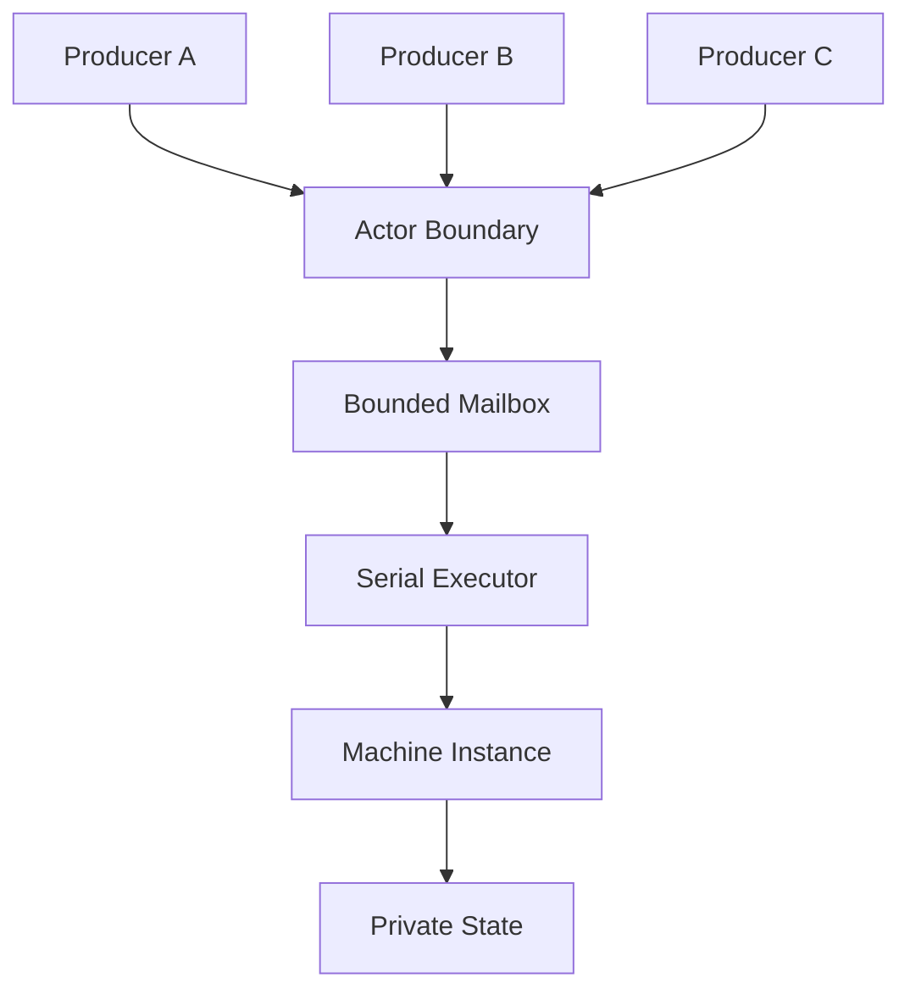
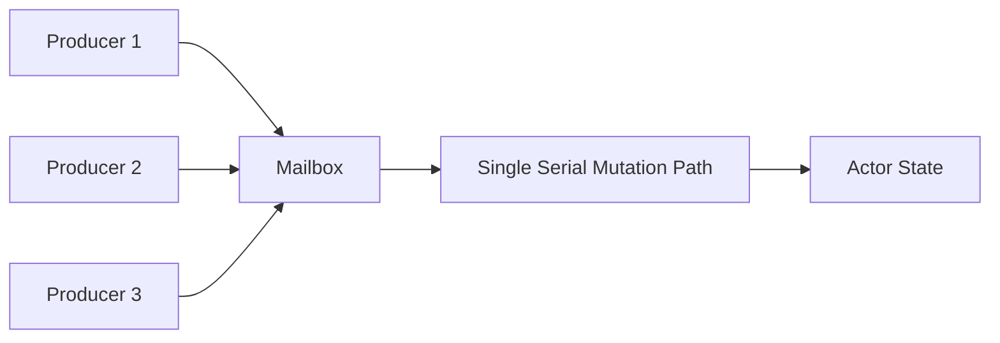
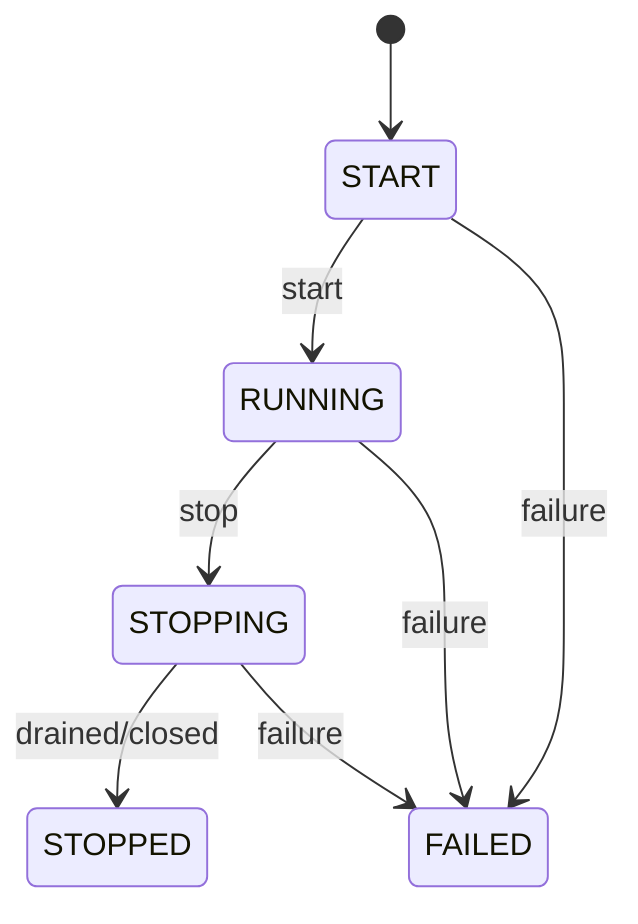
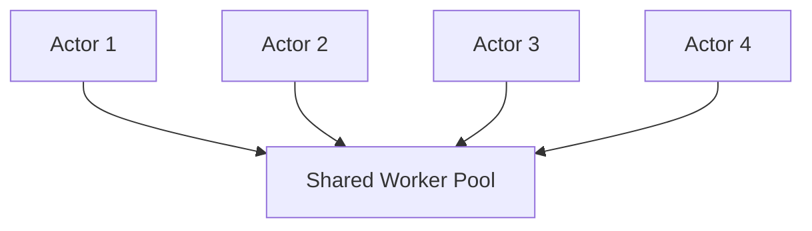

# Chapter 11: From State Machine to Actor — Compose Concurrent Objects with Mailbox, Serialized Execution, and Lifecycle

> **Chapter path**
>
> Chapter 10 already placed mutable domain state inside a serialized Machine Instance.
>
> Now consider the more common concurrency pattern: several threads share one object directly and protect it with a mutex.
>
> ~~~c
> #include <threads.h>
>
> typedef struct account {
>     mtx_t lock;
>     long balance;
>     bool stopping;
> } account;
>
> static bool account_deposit(account *a, long amount)
> {
>     bool accepted = false;
>
>     mtx_lock(&a->lock);
>     if (!a->stopping) {
>         a->balance += amount;
>         accepted = true;
>     }
>     mtx_unlock(&a->lock);
>
>     return accepted;
> }
>
> static bool account_withdraw(account *a, long amount)
> {
>     bool accepted = false;
>
>     mtx_lock(&a->lock);
>     if (!a->stopping && a->balance >= amount) {
>         a->balance -= amount;
>         accepted = true;
>     }
>     mtx_unlock(&a->lock);
>
>     return accepted;
> }
> ~~~
>
> This is not “wrong C” either.
>
> The difficulty appears at scale, when every public operation must repeatedly get these rules right:
>
> ~~~text
> locking order
> lifecycle gate
> stale owner/reference
> bounded admission
> shutdown race
> error/failure state
> callback execution context
> ~~~
>
> Add network callbacks, timer callbacks, and worker threads, and state ownership becomes increasingly difficult to infer from function signatures.
>
> Actor is valuable not because it replaces a mutex with a fashionable name, but because it changes the mutation model to:
>
> ~~~text
> many producers
>      ↓
> bounded typed mailbox
>      ↓
> one serialized mutable owner
>      ↓
> Machine transition
> ~~~
>
> So the only genuinely new pieces in this chapter are the outer concurrency contracts: mailbox, admission, lifecycle, producer reference, stale identity, and failure boundary.
>
> **Actor does not redefine domain transition semantics; it reuses the Machine semantics from Chapter 10.**

This also explains why Actor does not need “one object, one thread.” What matters is one mutation owner. Execution resources can still be shared through Executor / Scheduler.

---

## 1. What Matters Most About Actor Is Not “Thread”

A common first impression of the Actor Model is:

```text
one Actor
=
one object
+
one Mailbox
+
one thread
```

But the essential semantic is not:

```text
Thread
```

It is:

> **an Actor's private state may be modified only through its own serialized message-processing sequence.**

That is:

```text
Private State
+
Message Passing
+
Serialized State Mutation
```

The question:

```text
who actually executes these messages?
```

belongs to another layer.

That is exactly what the earlier separation between:

```text
Machine
```

and:

```text
Executor
```

already solved.

So Actor does not need:

```text
one OS Thread per Actor
```

It needs only:

```text
logical serialized execution ownership
```

---

## 2. Why State Machine Already Provides the Core of Actor

A Machine Instance already owns:

```text
Private Mutable State
```

such as:

```text
AccountState
ConnectionState
SessionState
WorkerState
```

External code cannot directly write:

```text
state->field = ...
```

Instead it sends an:

```text
Event
```

that triggers a:

```text
Transition
```

For example:

```text
BalanceState
+
DepositEvent
    ↓
Transition
    ↓
New BalanceState
```

This already satisfies one of Actor's most important rules:

> **state changes are driven by messages rather than direct shared mutation from outside threads.**

Allow:

```text
multiple Producers
```

to send Events concurrently, and most Actor execution semantics already exist.

---

## 3. Actor Is Best Understood as a Lifecycle / Admission Boundary Around Machine

A stronger definition is not:

```text
Actor = another runtime
```

but:

```text
Actor
    =
Machine Instance
+
Bounded Mailbox
+
Serial Execution
+
Producer References
+
Lifecycle
+
Failure Boundary
```

The current CFlow Actor follows this direction. Actor is a lifecycle/admission boundary that can host a Machine Instance or Statechart Instance, with identity Graph and one Subscription, rather than implementing a second actor-specific state-machine runtime.

Conceptually:



Actor adds the outer shell.

It does not reinvent Transition.

---

## 4. Message and Event Can Share One Type Model

Actor literature often says:

```text
Message
```

while State Machine says:

```text
Event
```

There is no need to create two infrastructures here.

A Message can simply be a:

```text
Typed Event
```

For example:

```text
Deposit {
    amount : Money
}

Withdraw {
    amount : Money
}

CloseAccount {
    reason : CloseReason
}
```

Actor mailbox therefore need not store:

```text
void *
```

It can know:

```text
Event ID
Payload Type
Payload Value
```

Before Machine processes anything, the system can check:

```text
Does this Actor accept this message?
Is the payload type correct?
```

---

## 5. The First Phase of Send Should Be Admission Only

Suppose:

```c
actor_send(actor, event);
```

A simple implementation might directly execute the Event.

That creates many problems.

The caller may be:

```text
network thread
UI thread
Worker thread
Timer Callback
another Actor
```

If `send()` directly enters Transition:

```text
Producer Thread
    ↓
Guard
    ↓
Action
    ↓
State Mutation
```

Actor execution context becomes unpredictable.

A better design separates:

```text
send
```

into:

```text
Admission
```

and:

```text
Execution
```

phases.

```text
Producer
   ↓
send(message)
   ↓
Mailbox Admission
   ↓
return
```

Actual execution is:

```text
Mailbox
   ↓
Serial Executor
   ↓
Machine Transition
```

Message sender and message executor are now decoupled.

---

## 6. Send Should Be Bounded and Non-Blocking

If Actor Mailbox can:

```text
grow without bound
```

then Actor has no real resource boundary.

Suppose:

```text
Producer
    1,000,000 messages/s

Actor
    10,000 messages/s
```

An unlimited Mailbox turns rate mismatch into:

```text
Memory Growth
```

So Mailbox should have:

```text
fixed capacity
```

or at least be explicitly:

```text
bounded
```

and:

```text
send()
```

may return:

```text
ACCEPTED
FULL
```

The current Actor send contract is bounded and non-blocking: send does not retry, wait, resize, overwrite, or silently drop. It returns explicit admission status.

This is the same resource philosophy as:

```text
Executor FULL
Reactive Demand
```

---

## 7. Why the Primitive Must Never Silently Drop Messages

When Mailbox is full, many policies are possible:

```text
drop newest
drop oldest
retry
block caller
disconnect producer
coalesce
route elsewhere
fail system
```

No one policy is correct for every Actor.

```text
UI repaint
```

may be coalesced.

```text
Telemetry
```

may drop low-priority messages.

But:

```text
Payment
```

must never silently disappear.

So the Actor mechanism should report:

```text
FULL
```

and let higher-level policy decide what to do.

Again:

```text
Mechanism
≠
Policy
```

---

## 8. Multiple Producers Do Not Mean Multiple State Owners

Actor's key concurrency structure is:



Producer side may be concurrent.

State side still has one logical owner.

So we get:

```text
Concurrent Admission
+
Serialized Mutation
```

rather than:

```text
Concurrent Shared-State Mutation
```

This is an important conversion of complexity.

---

## 9. One Value of Actor Is Turning Locking Problems into Queueing Problems

A shared object may use:

```c
mutex_lock(&account->lock);

account->balance += amount;

mutex_unlock(&account->lock);
```

As logic grows, we may accumulate:

```text
multiple mutexes
lock ordering
condition variable
nested lock
reader/writer lock
```

Actor can instead express:

```text
Deposit(amount)
    ↓
Mailbox
    ↓
Serialized Transition
```

Synchronization has not disappeared.

Its boundary has become clearer.

We move from:

```text
many code paths arbitrarily acquire locks
```

to:

```text
all mutation enters through mailbox admission
```

This is often easier to reason about.

---

## 10. Actor Does Not Mean Every Problem Should Become a Message

This matters.

A local variable or short-lived Vec obviously does not need Actor wrapping.

Actor is more appropriate for:

```text
long-lived object
private mutable state
concurrent access
event-driven behavior
clear ownership boundary
```

Examples include:

```text
Connection
Session
Device
Game Entity
Workflow Instance
Service Coordinator
```

Actor is an upper-layer composition model, not the new default object model.

---

## 11. Why Actor Lifecycle Must Be Explicit

A function call has a simple lifecycle:

```text
enter
execute
return
```

Actor may live for a long time.

It must answer:

```text
When may callers send?
When does execution begin?
When does it stop accepting messages?
When is it fully stopped?
Can it recover after failure?
```

So Actor needs explicit lifecycle:

```text
START
RUNNING
STOPPING
STOPPED
FAILED
```

The current implementation distinguishes these states explicitly.

Conceptually:



---

## 12. Lifecycle Directly Controls Admission

Lifecycle should not be:

```text
a debug field
```

It should affect:

```text
send()
```

For example:

```text
START
    → NOT_STARTED

RUNNING
    → ACCEPTED / FULL

STOPPING
    → STOPPING

STOPPED
    → STOPPED

FAILED
    → FAILED
```

Lifecycle is part of Actor protocol.

The sender can know exactly why a message was not accepted rather than receiving only:

```text
false
```

---

## 13. STOPPING and STOPPED Must Remain Different

This is easy to overlook.

```text
STOPPING
```

usually means:

```text
do not accept new normal work
but already accepted work may still be draining
```

while:

```text
STOPPED
```

means:

```text
execution is fully finished
```

Collapsing them makes graceful shutdown difficult to express.

For example:

```text
RUNNING
    ↓ stop requested

STOPPING
    ↓
drain accepted mailbox
    ↓
STOPPED
```

is not the same semantic as immediate cancel.

---

## 14. Actor Owner and Producer Reference Should Be Separate

If everyone holding:

```text
Actor *
```

can call:

```text
destroy(actor)
```

concurrent Producers create lifecycle races.

A clearer model separates:

```text
Actor Owner
```

which controls:

```text
start
stop
destroy
```

from:

```text
Producer Reference
```

which can only:

```text
send
```

Conceptually:

```text
Owner
    = lifecycle authority

Producer Ref
    = admission capability
```

This is a lightweight capability-based ownership design.

---

## 15. Why STALE Exists

After Actor destruction, other threads may still retain old Producer References.

If an old reference is only:

```text
Actor *
```

then:

```text
send()
```

may become:

```text
use-after-free
```

A safer protocol is:

```text
old reference
    ↓
identity / generation is no longer valid
    ↓
STALE
```

Current Actor producer refs explicitly support `STALE`: after owner destruction, an old producer reference cannot send to a new or nonexistent Actor instance.

This changes a lifecycle bug from:

```text
memory corruption
```

into:

```text
protocol error
```

---

## 16. Identity Is Not Merely a Logging Name

Actor Identity can distinguish:

```text
two Actor instances
that occupy the same address
at different lifetimes
```

For example:

```text
Actor generation 42
```

is destroyed and memory is reused for:

```text
Actor generation 43
```

An old Producer Ref must not conclude:

```text
same address
    ↓
same Actor
```

This is the same principle as:

```text
descriptor pointer
≠
semantic type identity
```

> **address is not semantic identity.**

---

## 17. Actor Does Not Need Its Own Thread

Suppose there are:

```text
100,000 Actors
```

If:

```text
1 Actor
=
1 Thread
```

then we need:

```text
100,000 OS Threads
```

which is usually unacceptable.

If Actor is only:

```text
Mailbox
+
Machine Instance
+
Logical Serial Execution
```

then many Actors can share:

```text
N Worker Threads
```

Conceptually:



The real guarantee is:

```text
two transitions of Actor 1
must not execute concurrently
```

while:

```text
Actor 1
```

and:

```text
Actor 2
```

may execute in parallel.

---

## 18. Concurrency and Parallelism Become Fully Separate

An Actor system can be highly:

```text
Concurrent
```

because:

```text
many Actors
many Producers
many Messages
```

can progress.

Within one Actor:

```text
State Mutation
```

remains:

```text
Serial
```

Different Actors may run:

```text
in Parallel
```

So:

```text
Concurrency
```

describes:

> how many independent computations are making progress.

```text
Parallelism
```

describes:

> how many computations physically execute at the same moment.

Actor does not require a one-to-one relation between them.

---

## 19. From Actor Shell to Lifecycle / Admission Contract

The first eighteen sections give the minimal Actor definition: not “a thread,” but bounded mailbox, non-blocking admission, single mutable owner, explicit lifecycle, and owner/reference/stale-identity boundaries around existing Machine semantics. Multiple Producers increase concurrent admission only; they do not introduce parallel state mutation.

The rest of the chapter therefore uses one canonical Actor to examine exactly what this shell adds: only RUNNING accepts send, rejected send preserves the queue, STOPPING closes admission first, FAILED/STOPPED are terminal, and accepted handoff continues to refine the original Machine transition. Then we verify the Lean model, C ownership, identity, and concurrency/lifecycle evidence.

---

## 20. Canonical Actor: Add a Concurrent Shell Around the Same Connection Machine

Chapter 10's Machine already solved:

~~~text
Event typing
Transition selection
Guard / Action
Atomic commit
State typing
Terminal semantics
~~~

Actor should not reimplement any of that.

It adds:

~~~text
Who may send?
When is send allowed?
Where do messages wait?
Which execution owner mutates state?
What happens to old producer refs after owner destruction?
How does runtime failure enter lifecycle?
~~~

Connection Actor can therefore be understood as:

~~~text
many producer refs
      ↓
Actor admission gate
      ↓
bounded typed mailbox
      ↓
single Machine Instance
      ↓
Serial Executor
      ↓
Connection Machine SmallStep
~~~

This differs from the traditional “one Actor, one thread” intuition.

The non-negotiable rule is:

> **Machine-owned mutable state inside one Actor has only one transition owner at a time.**

Dedicated OS thread or shared workers are execution policy.

---

## 21. Semantic Contract: Actor Adds Lifecycle / Admission, Not Transition Meaning

### 21.1 Lifecycle Is New Actor Semantics

Machine has domain terminal state.

Actor additionally needs:

~~~text
START
RUNNING
STOPPING
STOPPED
FAILED
~~~

Why not reuse Machine state?

Because:

~~~text
Machine state
    = application/domain control state

Actor lifecycle
    = runtime ownership/admission state
~~~

A Connection Machine may be:

~~~text
Connected
~~~

while Actor lifecycle is already:

~~~text
STOPPING
~~~

Domain state and runtime admission must coexist independently.

### 21.2 First Phase of Send Is Actor-Gated Admission Only

Producer-ref send should not run Machine transition directly.

It only checks:

~~~text
is ref live?
is Actor RUNNING?
is event id/type valid?
is mailbox capacity available?
      ↓
copy into mailbox
      ↓
return exact status
~~~

Send can distinguish:

~~~text
ACCEPTED
INVALID_ARGUMENT
TYPE_MISMATCH
FULL
NOT_STARTED
STOPPING
STOPPED
FAILED
STALE
~~~

These are not “error strings.”

They are policy inputs for Producers.

### 21.3 Rejected Send Must Preserve the Queue

If send returns:

~~~text
FULL
STOPPING
STOPPED
FAILED
STALE
TYPE_MISMATCH
~~~

the primitive must not:

~~~text
partially write
overwrite an old message
silently drop another message
retry automatically
change Machine state
~~~

The key contract is:

~~~text
mailbox after
=
mailbox before
~~~

This mirrors rejected-task ownership in Executor.

### 21.4 Multiple Producers Do Not Change FIFO / Single-Consumer Semantics

Multiple Producers mean only:

~~~text
many threads may attempt admission
~~~

not:

```text
many threads may execute transitions concurrently
```

Mailbox commit may support MPMC admission;

Machine execution remains:

```text
one consumer
one serialized transition stream
```

The problem changes from “lock the whole domain object” to:

```text
concurrent enqueue
+
serialized mutation
```

### 21.5 Actor Owner and Producer Ref Must Be Separate

If producer holds Actor owner pointer directly, owner destruction creates:

```text
old producer still calls send
    ↓
use-after-free
```

So separate:

```text
Actor owner
    owns root reference and lifecycle control

Actor ref
    independently retained producer capability
```

Destroying owner need not immediately free the small control block.

The runtime can:

```text
mark refs stale
close runtime
release root
wait until last producer ref released
    ↓
reclaim control block
```

STALE becomes a semantic status rather than wild-pointer behavior.

### 21.6 Stale Classification Should Precede Event Validation

If a stale producer ref sends:

```text
unknown event id
wrong payload type
```

the most important fact is first:

```text
this reference no longer targets a live Actor
```

STALE should therefore classify before schema errors.

The caller should not keep inferring schema/lifecycle state from an invalid runtime capability.

### 21.7 STOPPING Must Close Admission First

The first effect of `request_stop` should be:

```text
no new messages admitted
```

Then:

```text
cancel/close queued runtime
settle in-flight work
transition to STOPPED
```

Otherwise Producers can keep adding messages during shutdown and there is no finite settlement boundary.

### 21.8 FAILED Is Terminal Lifecycle, Not Implicit Restart

If Machine/Subscription/runtime fails:

```text
Actor -> FAILED
```

later send returns:

```text
FAILED
```

rather than:

```text
silently create a new Machine Instance
retry the message
restart with old/new state
```

Automatic restart belongs to Supervisor/Application policy, not Actor primitive.

---

## 22. Lean: Actor Model Adds Only Lifecycle Gate and Reuses Machine Semantics

The edition formal calculus contains:

~~~text
CMetaCFlowCalculus/CFlow/Actor.lean
CMetaCFlowCalculus/Proofs/Actor.lean
~~~

Its state follows this chapter closely:

~~~text
Actor.State
    lifecycle
    mailbox
    live
~~~

Importantly:

> Actor formal state does not copy Machine transition state.

That emphasizes:

~~~text
Machine/Mailbox remain authoritative
Actor adds lifecycle admission boundary
~~~

### 22.1 `State.Valid`: Lifecycle and Mailbox Terminal Must Agree

Formal `Actor.Valid` requires:

~~~text
mailbox.Valid
+
mailbox.terminal
=
lifecycle.expectedMailboxTerminal
~~~

where:

~~~text
START/RUNNING
    → mailbox OPEN

STOPPING/STOPPED/FAILED
    → mailbox CANCELLED
~~~

Lifecycle is therefore not a flag unrelated to Mailbox.

It constrains the admission substrate directly.

### 22.2 Start / RequestStop / Settle / Fail Preserve Validity

Existing theorems:

~~~text
start_preserves_valid
requestStop_preserves_valid
settle_preserves_valid
fail_preserves_valid
~~~

show lifecycle transitions cannot create contradictory combinations such as:

~~~text
Actor STOPPED
+
Mailbox OPEN
~~~

### 22.3 `requestStop_cancels_pending`

For START/RUNNING:

~~~text
requestStop
    ↓
mailbox queue = []
mailbox terminal = CANCELLED
~~~

This precisely models shutdown admission boundary.

Actor stop is more than:

~~~text
state = STOPPING
~~~

It must terminate the message entrance too.

### 22.4 `send_accepted_only_running`

The theorem:

~~~text
send_accepted_only_running
~~~

proves that if send returns ACCEPTED, the previous state must satisfy:

~~~text
live = true
lifecycle = RUNNING
~~~

That gives Producer API a strong semantic statement.

### 22.5 `send_accepted_appends_once`

The theorem:

~~~text
send_accepted_appends_once
~~~

proves:

~~~text
queue_after
=
queue_before ++ [event]
~~~

for accepted send.

That expresses:

~~~text
no overwrite
no duplicate insertion
no hidden reordering at abstract admission layer
~~~

### 22.6 `send_rejected_preserves_queue`

Correspondingly:

~~~text
send_rejected_preserves_queue
~~~

proves every non-ACCEPTED result satisfies:

~~~text
queue_after
=
queue_before
~~~

This is the core correctness property of bounded non-blocking admission.

### 22.7 STOPPED / FAILED Are Absorbing

Theorems include:

~~~text
stopped_cannot_restart
failed_cannot_restart
stopped_is_terminal
failed_is_terminal
~~~

Actor primitive has no implicit resurrection.

Restart means:

> create a new Actor or use a higher-level Supervisor protocol.

### 22.8 `accepted_handoff_refines_machine`: Actor Does Not Invent a New Transition

The most important theorem is:

~~~text
accepted_handoff_refines_machine
~~~

It defines Actor handoff as:

~~~text
Actor send accepted
      ↓
Mailbox receives exact same Event
      ↓
existing Machine RuntimeStep
~~~

and proves:

~~~text
Actor was live/running
event appended once
same event received
Machine after.trace
=
before.trace ++ Machine traceSuffix
~~~

This theorem makes the architecture very clear:

> **Actor is only an admission/lifecycle shell; real domain state transition remains the Machine semantics from Chapter 10.**

There is no Actor-specific “second commit state.”

That is a strong validation of composition.

---

## 23. Current C Implementation: Actor Ownership and Producer Ref Are Separate

Current CFlow Actor API explicitly has:

~~~text
cflow_actor
    owner handle

cflow_actor_ref
    independently retained producer handle
~~~

Both are opaque handles, but with different ownership.

### 23.1 Actor Owns the Runtime Shell

Actor owner holds:

~~~text
Machine or Statechart Instance
bounded Mailbox
identity Graph
Subscription
lifecycle control block
root reference
~~~

and borrows:

~~~text
immutable definition
SerialExecutor
concurrent Scheduler
guard/action bindings
callback contexts
type descriptors
~~~

This lets destruction order be specified precisely.

### 23.2 Scheduler Requires CONCURRENT Capability

Why is Actor's outer Scheduler concurrent while Machine transition remains Serial?

They solve different problems:

~~~text
Scheduler
    → many Actors / async wakeups share execution resources

Machine SerialExecutor
    → one Actor's state mutation remains serialized
~~~

So:

~~~text
concurrency outside
serialization inside
~~~

is not a contradiction.

It is the core of Actor scalability.

### 23.3 Actor Send Explicitly Forbids Hidden Behavior

Current Producer send contract says:

~~~text
never blocks
never retries
never overwrites
never resizes
never silently drops
never allocates
~~~

This is a strong bounded-runtime promise.

FULL really means FULL.

If the application wants:

~~~text
retry later
drop newest
drop oldest
fail request
apply upstream backpressure
~~~

it decides explicitly.

### 23.4 Owner Destroy Marks Refs Stale Before Reclaiming Root

Destroy contract is:

~~~text
mark producer refs stale
      ↓
synchronously close selected instance/Subscription
      ↓
clear owner handle
      ↓
release root reference
      ↓
last producer ref releases
      ↓
control block reclaimed
~~~

Producer can safely observe:

~~~text
STALE
~~~

instead of touching a freed owner object.

---

## 24. Identity: Why Actor Cannot Rely on Pointer Address

Actor identity has at least two layers.

### 24.1 Runtime Object Identity

A Producer Ref must know whether it still targets:

~~~text
the same live Actor generation/control block
~~~

After owner destroy:

~~~text
pointer-shaped capability
~~~

must not continue to represent a valid identity.

STALE is the combined result of identity and lifetime.

### 24.2 Domain Identity

Higher-level systems may also need domain keys such as:

~~~text
user actor
device actor
connection actor
order actor
~~~

These should not equal runtime address.

Actor runtime may be replaced/rebuilt; whether domain identity continues is Supervisor/Application policy.

So the book keeps the same principle:

> **address is representation location, not semantic identity.**

This is the same thread as Type descriptor, Callable identity, and Graph certificate identity.

---

## 25. Evidence: Actor Must Validate Concurrent Admission + Serialized Mutation + Lifecycle

### 25.1 Bounded Multi-Producer Admission

Concurrent Producers sending simultaneously must satisfy:

~~~text
accepted count <= capacity available
FULL does not alter queue
accepted events each appear exactly once
no silent drop
~~~

Queue order should follow the documented mailbox commit/FIFO contract, not assumed producer call-start order.

### 25.2 Single Mutable Owner

Machine transition instrumentation should validate:

~~~text
in-flight transition count <= 1
~~~

even under:

~~~text
many producers
concurrent scheduler
shared worker pool
~~~

This proves Actor semantic isolation more directly than “it did not crash.”

### 25.3 Lifecycle Admission Matrix

Test:

~~~text
START
    send → NOT_STARTED

RUNNING
    send → ACCEPTED/FULL/type error

STOPPING
    send → STOPPING

STOPPED
    send → STOPPED

FAILED
    send → FAILED

owner destroyed + retained ref
    send → STALE
~~~

### 25.4 Ref Lifetime / Stale Stress

Cover:

~~~text
acquire many refs
concurrent send
owner destroy
refs observe STALE
release refs in arbitrary order
last ref frees control block
~~~

under sanitizer/stress gates.

This is one of the easiest areas for Actor C implementation to produce use-after-free.

### 25.5 Actor-to-Machine Refinement Evidence

Use the Chapter 10 Connection Machine and send:

~~~text
Connect
ConnectedEvent
Disconnect
ClosedEvent
~~~

through both:

~~~text
direct Machine Instance
Actor mailbox/ref path
~~~

Compare:

~~~text
Machine state
observation trace
consumed event count
first error
~~~

They should agree.

This is the C-side differential counterpart of `accepted_handoff_refines_machine`.

### 25.6 Failure Evidence

Force:

~~~text
Machine action fail
Subscription fail
Scheduler admission fail
~~~

and verify Actor:

~~~text
enters FAILED once
rejects later sends
retains first failure
does not implicit restart
settles ownership
~~~

---

## 26. What We Learned

Actor looks like a large concurrency model, but after decomposition it adds relatively little:

~~~text
Machine
    already owns domain transition semantics

Mailbox
    already owns bounded typed admission

Serial Executor
    already owns serialized mutation

Scheduler
    already owns dispatch context

Reactive Subscription
    already owns long-lived execution
~~~

Actor adds:

~~~text
lifecycle gate
producer references
stale classification
root/ref lifetime
failure boundary
identity shell
~~~

Formalization confirms this.

The key theorem is not:

~~~text
Actor has a new transition semantics
~~~

but:

~~~text
accepted Actor handoff
    ↓
same Mailbox Event
    ↓
same existing Machine RuntimeStep
~~~

So:

> **advanced models are built not by endlessly adding new mechanisms, but by composing small primitives whose contracts are already understood and verified.**

The next chapter therefore should not invent another framework.

The next question is engineering closure:

> **How do these Type, Callable, Graph, Reactive, Machine, and Actor contracts survive ABI, Multi-TU, packaging, and installed-library boundaries?**
