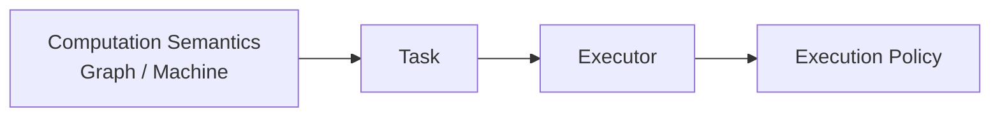
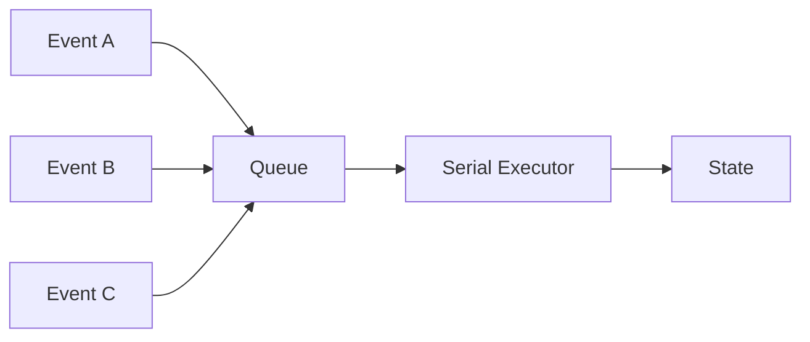
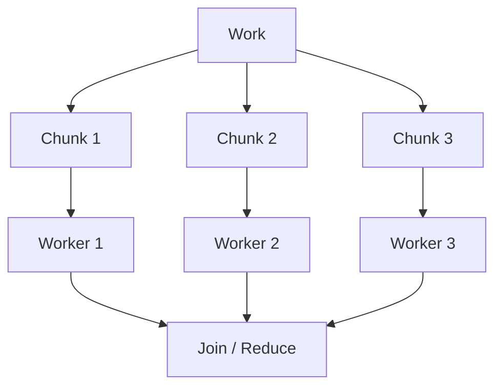
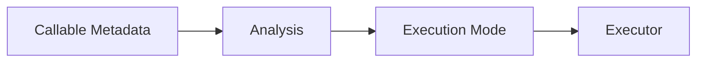
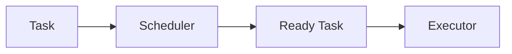
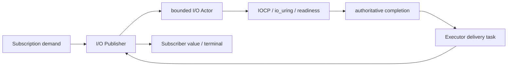
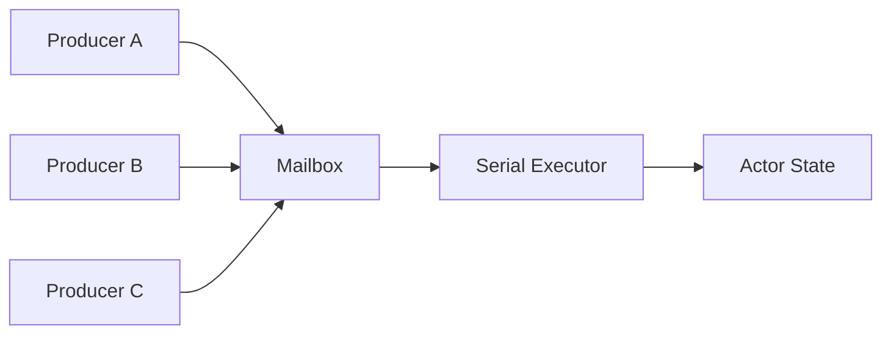
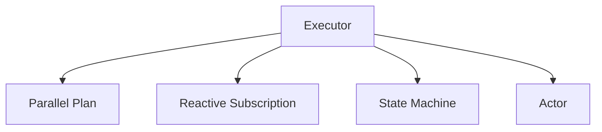

# 第七章：Executor——把执行策略从计算语义中拆出来


> **本章路线**
>
> Reactive 已经把一次 live execution 收敛到 Subscription，但 Subscription 仍然需要一个更小的 primitive 来“真正执行 Task”。本章继续向下拆：
>
> ~~~text
> Graph / Reactive / Machine / Actor
>            ↓
>          Task
>            ↓
>        Executor
>            ↓
> Manual / Serial / Worker
> ~~~
>
> Executor 只回答四类问题：
>
> ~~~text
> admission
> execution ordering
> bounded capacity
> lifecycle / shutdown
> ~~~
>
> 它不理解 Graph operator、Reactive demand、Machine transition 或 Actor message。
>
> 这一章的专业性关键在于：**Task ledger、capacity、serial ownership、shutdown 和 self-callback deadlock boundary 都已经有现成 Lean protocol model，可以直接约束 C implementation。**

上一章做到 Reactive 以后，系统已经能够回答很多问题：

```text
Graph
    描述计算是什么

Publisher
    描述数据从哪里来

WAIT / Wake
    描述什么时候暂时不能继续

Demand
    描述下游现在允许接收多少数据

Subscription
    描述一次计算当前执行到什么状态
```

但还有一个非常基础的问题没有被真正回答：

> **这些计算到底由谁来执行？**

例如：

```text
Wake 发生以后
    谁重新执行 Subscription？

Parallel Reduce 被拆成几个 Task
    谁执行这些 Task？

State Machine 收到 Event
    谁保证 Transition 串行？

测试时不想创建线程
    谁让我们一步一步手工推进？

Actor 有多个 Producer
    最终谁负责真正修改内部状态？
```

这些问题表面上属于不同领域。

但如果继续向下抽象，会发现它们共同依赖一个非常简单的能力：

> **把一个 Task 提交给某种执行环境。**

这就是 Executor 出现的原因。

---

## 1. Executor 不应该知道 Graph

最容易犯的错误，是把 Executor 直接设计成：

```text
StreamExecutor
GraphExecutor
ReactiveExecutor
ActorExecutor
MachineExecutor
```

这样每出现一种高级模型，就产生一个新的执行器。

但仔细看这些系统，它们最终真正需要执行的东西都可以降低成：

```text
Task
```

也就是一个最简单的：

```c
void task(void *user);
```

Executor 并不需要知道：

```text
这个 Task 来自 Map
还是来自 Actor
还是来自 Timer
还是来自 State Transition
```

它只需要回答：

```text
能不能接收？

什么时候执行？

按什么并发语义执行？

队列满了怎么办？

关闭以后怎么办？
```

于是 Executor 可以保持非常小。

本版 CFlow 实现 的 Executor 接口就围绕 `try_post`、`post`、`run_one`、`run_ready`、`wait_idle`、`pending`、`shutdown`、`get_stats` 和 `destroy` 这些最基本的任务执行能力展开，并通过 capability 区分 `MANUAL`、`SERIAL` 和 `CONCURRENT`。

---

## 2. 为什么把 Task Execution 单独抽出来

假设没有 Executor。

那么 Stream runtime 可能自己创建线程池。

Reactive runtime 又自己维护一个 event loop。

State Machine 自己再加一个串行队列。

Actor 再创建自己的 worker。

最后系统变成：

```text
Stream
    └── Thread Pool A

Reactive
    └── Scheduler B

Machine
    └── Serial Queue C

Actor
    └── Worker D
```

这些系统各自都在解决：

```text
task admission
queue
thread
shutdown
statistics
```

同一个问题。

这和最开始宏大量重复的情况非常像。

只是这一次重复的不是：

```text
宏代码
```

而是：

```text
执行基础设施
```

所以再次采用同样的方法：

> **找到共同的最小机制，然后复用它。**

---

## 3. Executor 回答的是“怎样执行”，而不是“执行什么”

这条边界非常重要。

例如：

```text
Map(f)
```

属于 Graph。

它表达：

```text
对 Value 应用 f
```

但：

```text
f 在当前线程执行
还是 worker thread 执行
```

不是 Map 的语义。

同样：

```text
State Transition
```

表达：

```text
State + Event -> NewState
```

至于 Transition 通过：

```text
Serial Queue
```

还是：

```text
调用者手工推进
```

也是执行策略。

所以可以明确分开：



也就是说：

```text
Graph / Machine
    决定做什么

Executor
    决定这个 work 怎样获得执行机会
```

---

## 4. 第一种 Executor：Manual

最简单的 Executor 甚至不需要线程。

可以维护一个 bounded task queue：

```text
post(task)
    ↓
Queue

run_one()
    ↓
执行一个

run_ready()
    ↓
执行所有 ready task
```

这种 Manual Executor 有一个非常重要的用途：

## 测试

例如希望测试：

```text
Event A
    ↓
Transition
    ↓
Event B
```

如果后台线程自动执行，测试必须处理：

```text
race
sleep
condition variable
timing
```

而 Manual Executor 可以：

```text
submit Event A

assert(state == before)

run_one()

assert(state == after)
```

于是并发程序的一部分可以变成：

```text
确定性的状态机测试
```

当前实现中的 Manual Executor 正是一个有固定 capacity 的 FIFO task array，由调用者通过 `run_one` / `run_ready` 主动推进。

---

## 5. Manual Executor 还有另一个意义：与外部 Event Loop 集成

很多程序已经有自己的：

```text
UI Loop
libuv
epoll loop
game loop
embedded main loop
```

这时最糟糕的做法之一是：

> Framework 强制再创建一套线程。

如果 Executor 可以由调用者手工推进：

```text
while (...) {
    process_ui();
    process_io();

    executor.run_ready();
}
```

就可以把执行系统嵌入已有主循环。

因此 Manual Executor 不只是测试工具。

它还代表：

```text
Host-driven execution
```

---

## 6. 第二种 Executor：Serial

很多系统真正需要的不是“快”，而是：

> **保证同一个逻辑对象的 mutation 永远串行。**

例如 State Machine：

```text
State S
```

同时收到：

```text
Event A
Event B
```

如果两个 Transition 同时执行：

```text
Thread 1:
    read S
    compute S1

Thread 2:
    read S
    compute S2
```

然后同时 commit：

```text
最终状态是谁？
```

问题马上复杂起来。

最简单的办法之一不是：

```text
给每一个字段上锁
```

而是：

```text
所有 State Transition
    ↓
Serial Executor
```

于是：



当前 Serial Executor 的实现复用同一个 thread-pool substrate，但固定为一个 worker，因此向上暴露的是明确的 `SERIAL` capability。

---

## 7. Serial Executor 的价值是“Single Mutable Owner”

这是一个非常重要的并发设计原则。

与其让：

```text
很多线程
直接修改一个复杂对象
```

不如让：

```text
很多 Producer
    ↓
提交 immutable / copied work
    ↓
一个执行序列
    ↓
唯一 mutation owner
```

这可以极大降低：

```text
lock ordering
fine-grained synchronization
partial state visibility
```

等复杂度。

所以后面的：

```text
State Machine
Actor
```

都非常适合建立在 Serial Executor 上。

---

## 8. 第三种 Executor：Concurrent Worker

另一些任务本身没有共享 mutation。

例如：

```text
对 1,000,000 个数做纯 Map
```

如果每个 chunk 彼此独立：

```text
Chunk 1
Chunk 2
Chunk 3
Chunk 4
```

就可以交给多个 worker 并行。

因此另一个 Executor 可以暴露：

```text
CONCURRENT
```

能力。

例如：



当前 Worker Executor 就使用多 worker thread pool，而与 Serial Executor 共用相同的 admission/statistics 协议。

---

## 9. 并行不是 Executor 自己决定的

这一点非常重要。

Executor 可以说：

```text
我支持 concurrent task execution
```

但它不应该自己决定：

> 这段 Graph 可以并行。

因为 Executor 并不知道：

```text
Task 之间是否有数据依赖
Callable 是否 Pure
Reducer 是否 Associative
数据是否 Alias
顺序是否必须保留
```

这些属于：

```text
Graph / Plan Semantic Analysis
```

因此正确关系应该是：

```text
CMeta / CFlow Analysis
    ↓
证明某个 execution mode 合法
    ↓
Executor
    负责实际执行 task
```

而不是：

```text
Executor 有 8 个线程
    ↓
所以所有事情自动并行
```

---

## 10. 这就是 Effects / Properties 开始真正影响 Executor 的地方

例如一个 reducer：

```text
reduce : T × T -> T
```

如果希望并行：

```text
Chunk A -> partial A
Chunk B -> partial B

partial A + partial B
```

至少需要知道某些语义保证。

例如：

```text
ASSOCIATIVE
```

以及执行策略所要求的其他：

```text
PURE
TOTAL
NO_ALIAS
ORDER preservation
```

因此完整关系更接近：



Executor 不做语义推断。

它只是执行经过上层批准的任务。

---

## 11. Executor 必须是 Bounded 的

如果：

```text
post(task)
```

永远成功，唯一实现方式往往就是：

```text
Queue 无限增长
```

但真实系统中：

```text
Producer speed > Consumer speed
```

是很常见的。

例如：

```text
网络请求到达
    100k/s

Worker 处理
    10k/s
```

如果 Executor 不暴露容量：

```text
内存会不断增长
```

所以 Executor 应该明确：

```text
capacity
pending
```

并允许：

```text
try_post()
```

返回：

```text
ACCEPTED
FULL
CLOSED
INVALID
```

当前实现也明确统计 `capacity`、`pending`、`peak_pending`、`rejected_full` 和 `rejected_closed`。

---

## 12. FULL 是信息，不是异常

当：

```text
Queue Full
```

发生时，底层不应该自动决定：

```text
阻塞 Producer
丢掉 Task
无限扩容
重试
```

因为这些是完全不同的业务 policy。

例如：

### Web Server

可能：

```text
返回 503
```

### Telemetry

可能：

```text
drop low-priority event
```

### Financial System

可能：

```text
绝不能丢，必须 backpressure
```

### UI

可能：

```text
coalesce duplicate updates
```

因此 Executor 最应该做的只是：

```text
FULL
```

告诉上层：

> 资源边界已经到达。

这和 Reactive 中 Demand 的思想完全一致：

> **资源限制是协议中的事实，而不是实现应该隐藏的事情。**

---

## 13. 为什么要同时存在 `try_post` 和 `post`

两者实际上表达不同的 policy。

`try_post`：

```text
non-blocking admission
```

上层立即知道：

```text
accepted / full / closed
```

而 `post` 可以由具体实现提供：

```text
更方便的提交语义
```

但关键是：

```text
需要精确控制 resource policy 的系统
```

应该能够使用：

```text
try_post
```

而不是只能调用一个模糊的：

```text
submit()
```

然后不知道它：

```text
是否 block
是否 retry
是否 drop
```

---

## 14. Executor 的 Shutdown 也必须是明确状态

并发系统另一个常见 bug 来源是：

```text
对象已经准备销毁
但仍然有人继续 submit
```

所以 Executor 需要明确：

```text
OPEN
    ↓
shutdown
    ↓
CLOSED
```

之后：

```text
try_post
```

应该返回：

```text
CLOSED
```

而不是继续偷偷接受 work。

这样 resource lifecycle 才能成为可验证协议的一部分。

---

## 15. Statistics 不是附属功能

一个 bounded executor 如果没有：

```text
pending
peak_pending
rejected_full
```

生产环境很难知道：

> 是业务慢，还是 executor 饱和？

因此 statistics 实际上属于 execution contract 的观测面。

例如：

```text
peak_pending 接近 capacity
```

说明：

```text
长期处于高负载
```

而：

```text
rejected_full 快速增长
```

说明：

```text
backpressure policy 已经开始触发
```

所以 executor stats 不只是 debug convenience。

它是：

```text
运行时资源模型的可观测性
```

---

## 16. 为什么 Executor 使用 Interface 非常合适

现在已经有：

```text
Manual
Serial
Concurrent Worker
```

以后还可能有：

```text
UI Executor
IO Executor
Embedded Executor
External Thread Pool Adapter
```

这些实现都不同。

但它们对上层提供的是：

```text
同一种 task execution protocol
```

所以：

```text
{ self, vtable, capabilities }
```

形式的小型 Interface 非常适合。

这正是 CMeta Interface 的一个真实应用。

不是为了构造：

```text
class hierarchy
```

而是：

> **让不同 execution provider 可以满足同一个 C protocol。**

当前 `cflow_executor` 本身就是由 CMeta interface 机制生成。

---

## 17. Capability 比“具体 Executor 类型”更重要

上层通常不应该写：

```text
if executor == WorkerExecutor
```

而应该问：

```text
executor supports CONCURRENT?
```

或者：

```text
supports SERIAL?
```

例如 State Machine 的 requirement 可以是：

```text
requires SERIAL
```

而不是：

```text
必须使用某个名叫 SerialExecutor 的具体实现
```

以后完全可以有另一个实现：

```text
UI Main Thread Executor
```

它同样满足：

```text
SERIAL
```

那么 State Machine 也可以使用它。

这和前面 Traits 的思路完全一样：

```text
依赖能力
而不是依赖具体类型
```

---

## 18. Scheduler 为什么不能直接等于 Executor

Reactive 中我们已经看到：

```text
wake()
```

以后需要重新安排 Subscription。

如果所有 Task 都是：

```text
现在立即执行
```

Executor 已经够了。

但真实异步系统还需要：

```text
100ms 后执行
```

或者：

```text
Timer 到期
```

以及：

```text
取消一个尚未执行的 timer
```

这些都不是普通 Executor 的职责。

因此 Scheduler 应该建立在相似的 Task abstraction 上，但额外拥有：

```text
Time
Timer Queue
Delayed Dispatch
```

---

## 19. Executor 和 Scheduler 是正交而不是继承关系

可以简单理解：

```text
Executor
    负责 execution

Scheduler
    负责 scheduling
```

或者更具体：

```text
Executor
    “这个 Task 怎样运行？”

Scheduler
    “这个 Task 什么时候变成 ready？”
```

可以画成：



实际实现可以复用线程池。

但概念上不应该把：

```text
时间
```

强行加入所有 Executor。

否则简单 State Machine 也会被迫携带 timer 系统。

## 19.1 从 Thread、Coro、Readiness 到 Native Async I/O

Executor 的高级应用与 CMeta 的高级应用很相似：不是把所有概念吸进 core，而是让多个上层模型复用一个稳定 primitive。这里最重要的是先区分五种状态归属：

| 概念 | 它真正拥有的状态 | 它不应该冒充什么 |
|---|---|---|
| Executor | ready Task 的 admission、执行、取消与 settle | Timer、I/O completion source |
| Scheduler | Task 何时 ready、延迟队列和时间推进 | 业务状态机 |
| Thread | OS execution resource | 一个逻辑 Actor 或一次 I/O request |
| Coroutine | 可挂起的控制流位置与 frame | I/O 事实源、Executor queue |
| Readiness / Native I/O | resource registration、request progress、terminal completion | Graph operator 或业务 callback policy |

当前 `cflow_executor_task` 是一个会被复制的 descriptor。一次成功 admission 必须恰好进入 `run` 或 `cancel`，之后调用可选的 `finalize`；被拒绝的 task 不执行任何 callback。Manual、Serial 与 Worker 实现共享 `CMETA_EXEC_CAP_MANUAL`、`CMETA_EXEC_CAP_SERIAL`、`CMETA_EXEC_CAP_CONCURRENT`，并以固定 capacity 暴露 FULL、CLOSED 与 WOULD_BLOCK，而不是偷偷扩容。

### Thread：执行资源，不是上层对象的身份

Worker Executor 使用线程执行 ready Task；Worker Scheduler 则把 timer queue 中到期的 task 交给内部 Worker Executor。Thread 因此只是 backend resource：Actor、Subscription、Statechart Instance 和 I/O Actor 都不需要“一对象一线程”。它们依靠 mailbox、demand、Serial Executor 或 request slot 保存自己的事实状态。

### Coro：保存执行位置，不接管 completion

`Salts::Coroutine` 对 minicoro 提供 stackful coroutine primitive、单 owner 有界复用池，以及可选的多 shard `salts_coro_executor_t`。运行中的 frame 可以用 `salts_coro_executor_yield()` 主动让出；需要等待外部操作时，则先以 `await_begin` 获取 generation-checked token，提交失败以 `await_abort` 收尾，提交成功后调用 `await` 挂起。外部完成线程调用 `await_complete` 只发布 terminal signal，原 shard owner 才执行 resume。frame 仍只保存“代码停在哪里”，不能成为“操作是否已经完成”的第二份事实源。

通用 coroutine Executor 把用户线程与调度线程明确分开。每个固定 shard 独占一个 scheduler、一个 `salts_coro_pool_t`、一个有界 MPSC task queue 和一个不与新任务争抢容量的 completion wake queue；用户线程提交复制后的 task descriptor，运行中的 frame 不跨 shard 迁移。普通 submit 采用 round-robin，`submit_to` 则为 connection、session 或 Actor 提供显式 affinity。queue full、closed admission 与同 Executor 自阻塞分别暴露为 `SALTS_ENOBUFS`、`SALTS_ESHUTDOWN` 与 `SALTS_EBUSY`，不会通过无界扩容隐藏背压。

一个 frame 同时最多保留一个 await slot，wake queue 的容量至少等于该 shard 的最大 active frame 数，所以每个合法 await 的唯一 terminal wake 都有保留预算。completion 可以早于 `await` 到达，也可以晚于 `shutdown` 关闭 task admission；前者直接读取已保存状态而不挂起，后者仍被接受以完成 drain。Executor 不会替外部系统虚构取消结果：若 NativeIO request、timer 或用户 operation 已成功提交，其 owner 必须最终发布一次 completion，并在 Executor destroy 前停止 completion caller。

因此组合关系应该是：

```text
Native request / readiness registration
    = operation progress and terminal truth

Coroutine frame
    = suspended control-flow position

Scheduler / Executor
    = resume task becomes ready and runs
```

Coroutine Executor 与 CFlow Executor 仍是不同的执行语义：前者调度固定 shard 上的 cooperative frame，后者承载 typed flow 的 task/admission contract。通用 await token 已经解决“完成线程怎样安全唤醒原 shard”，但把 NativeIO request completion 映射为哪个 token、何时 cancel/drain，仍是上层 adapter 的职责。不应让 CFlow core 反向依赖某个网络协程 context，也不应让通用 coroutine Executor 自己成为 I/O 事实源。

### Readiness：把平台事件翻译成 WAIT/Wake

Platform `salts_readiness_reactor` 拥有 registration 与 backend 状态。`cflow_publisher_from_readiness_registration()` 成功时把 registration 移入共享的 Publisher/owner state；read callback 仍是值与 terminal data semantics 的唯一生产者。Readiness callback 只发出可合并的唤醒边，Subscription 再按 demand 恢复 Publisher，而不是在平台 callback 栈上重入整张 Graph。

这条路径的关闭顺序也属于接口语义：先取消并销毁 Publisher，使 registration quiescent；再调用 `cflow_readiness_publisher_owner_close()` 关闭外部 owner。Publisher 仍存活时提前 close 返回 busy，不通过悬空 callback 换取“方便”。

### Native Async I/O：Executor 负责交付，request slot 负责事实

`cflow_io_actor` 把异步 I/O 表达为有界 request state machine：`request_capacity` 和 `command_capacity` 是硬上限；submit 成功移动 operation ownership；native backend 必须为每个已提交 request 发布且只发布一次权威 terminal completion。best-effort cancel 不是完成证据，重复或迟到 completion 会被识别为 stale。

底层 backend 可以是 IOCP、io_uring 或 readiness adapter。上层 `cflow_publisher_from_io_actor()` 再把 Subscription demand 转成有界 operation window，并把 completion 编码为 typed values。Executor 只负责 completion delivery task；它既不拥有 native request，也不决定 retry、fallback 或业务错误策略。

于是完整路径是：



这和 CMeta 的设计之道一致：Executor core 只保存稳定的 Task/Admission/Lifecycle 协议；Thread、Coro、Readiness 和 Native I/O 作为高级应用各自保留自己的所有权与状态机。

---

## 20. Executor 如何服务 Stream

对于同步 Stream：

```text
Array
 ↓
Filter
 ↓
Map
 ↓
Reduce
```

最简单执行方式甚至不一定需要 Task Queue。

但当开始支持：

```text
Parallel Reduce
```

以后，可以把 input 拆分成多个 chunk：

```text
Chunk 1
Chunk 2
Chunk 3
```

然后：

```text
Executor.try_post(chunk_task)
```

并行计算。

因此 Executor 为 Stream 提供的是：

```text
可选的 execution backend
```

而不是 Stream 的必需 runtime。

---

## 21. Executor 如何服务 Reactive

Reactive Subscription 在：

```text
WAIT
```

以后被：

```text
wake
```

唤醒。

正确行为通常不是：

```text
wake callback 直接重新进入整条 Graph
```

而是：

```text
wake
 ↓
schedule Subscription task
 ↓
Executor
 ↓
pump Graph
```

这样外部 callback 与 Graph execution stack 解耦。

它可以减少：

```text
reentrancy
unexpected callback nesting
thread-context drift
```

问题。

---

## 22. Executor 如何服务 State Machine

State Machine 则主要需要：

```text
Serial
```

例如：

```text
Event
 ↓
enqueue transition work
 ↓
Serial Executor
 ↓
Guard
 ↓
Action
 ↓
Commit State
```

这样：

```text
Producer 可以并发
```

但：

```text
State mutation 串行
```

这是一种非常强的组合。

---

## 23. Executor 如何服务 Actor

Actor 可以有很多 Producer：



多个线程可以同时：

```text
send(Event)
```

但真正修改 Actor state 的逻辑：

```text
永远由 Serial Executor 串行执行
```

因此 Actor 不需要：

```text
一个 Actor 一个 Thread
```

只需要：

```text
一个 Actor 一个串行语义
```

这比传统 thread-per-actor 模型更容易扩展。

---

## 24. 这也是为什么 Actor 可以共享线程池

假设有：

```text
100,000 Actors
```

如果：

```text
1 Actor = 1 OS Thread
```

显然不现实。

但如果：

```text
Actor
    只是 Mailbox + State + Serial Logical Execution
```

那么多个 Actor 可以共享：

```text
少量 Worker Threads
```

只要保证：

```text
同一个 Actor 的 Task 不并发 commit
```

即可。

因此：

```text
Concurrency
```

和：

```text
Parallelism
```

被真正分开。

Actor 可以是：

```text
concurrent
```

但每个 actor state update：

```text
serial
```

而不同 actor 之间：

```text
parallel
```

---

## 25. Executor 也让 Machine 与 Actor 不需要重新发明线程系统

这是整个分层设计非常重要的结果。

如果没有 Executor：

```text
Machine
    自己管理 thread

Actor
    自己管理 thread

Reactive
    又管理 thread
```

如果有 Executor：

```text
Machine
    使用 Serial Executor

Actor
    组合 Machine + Executor + Scheduler

Reactive
    使用 Scheduler / Executor

Plan
    可选使用 Concurrent Executor
```

可以表示成：



Executor 因而成为一个真正的：

```text
shared execution primitive
```

---

## 26. Executor 其实也是对 CMeta 设计的一次验证

为什么？

因为 Executor 本身就使用了很多前面形成的能力：

```text
Interface
Capabilities
Enum / Status
Bounded Protocol
Explicit Lifecycle
```

而它又反过来成为：

```text
Stream
Reactive
Machine
Actor
```

的基础。

这说明整个系统开始形成：

```text
小 Primitive
    ↓
组合
    ↓
复杂模型
```

而不是：

```text
一个巨大的 Framework
    ↓
所有东西都只能在 Framework 里面工作
```

---

## 27. 从 Executor 又自然走向 Event

做到这里以后，一个很有意思的事情发生了。

Executor 的输入本质上是：

```text
Task
```

而 Reactive 的输入可能是：

```text
Wake Event
```

State Machine 的输入则很明显是：

```text
Business Event
```

Actor 的输入也是：

```text
Message / Event
```

所以接下来的一个自然问题就是：

> **既然 Type System 已经能够描述 Value，能不能把 Event 也变成 Typed Value？**

例如：

```text
LoginEvent
TimeoutEvent
DataEvent
```

每个 Event 都可以拥有：

```text
Event ID
Payload Type
Payload Value
```

这样 Executor 上层就能够进一步构造：

```text
Event Processing
```

---

## 28. Event 一旦加入 State，就自然变成 Machine

例如：

```text
State
+
Event
+
Guard
+
Action
```

就形成：

```text
Transition
```

也就是：

```text
(State, Event)
    ↓
Guard
    ↓
Action
    ↓
New State
```

而前面已经有：

```text
Type
Callable
Executor
```

所以这一模型不需要从零开始。

这也是下一章的主题：

## Event 与 State Machine

---

## 29. 这一阶段真正得到的设计原则

从 Executor 的演进中，可以总结出几条非常重要的原则。

### 第一，执行机制应该独立于计算语义

```text
Graph
≠
Executor
```

---

### 第二，能力比具体实现重要

```text
SERIAL
CONCURRENT
MANUAL
```

比：

```text
某个具体 class / struct
```

更值得上层依赖。

---

### 第三，资源必须有界

```text
bounded queue
explicit FULL
```

比：

```text
hidden unbounded growth
```

更可靠。

---

### 第四，Mechanism 不替 Application 决定 Policy

```text
FULL
```

以后：

```text
retry / drop / block / fail
```

由上层决定。

---

### 第五，复杂系统应该由小模型组合

```text
Executor
```

不需要知道：

```text
Stream
Reactive
Actor
```

但它可以全部服务。

---

## 30. 完整演进链继续向前

到目前为止，我们已经得到：

```text
Macro
 ↓
Type
 ↓
Generic / Inference
 ↓
CMeta
 ↓
Callable
 ↓
Lambda / Bind
 ↓
Graph
 ↓
Stream
 ↓
Reactive
 ↓
Executor
```

而 Executor 进一步暴露出一个新的统一对象：

```text
Event
```

因为：

```text
Reactive wake
State transition
Actor message
External input
```

从某种意义上都可以被理解成：

> **一个被执行系统接收并处理的 typed event。**

下一章将继续沿着这个方向展开：

> **怎样利用 Type、Callable 和 Serial Executor 构造一个真正有类型的 Event / State Machine 模型，并把传统 callback table 提升成可验证的状态转换 IR。**

---


## 31. Semantic Contract：Executor 最小但并不模糊

Executor 的 API 可以很小，但它的 contract 必须非常精确。

## 31.1 Task admission 是一次明确的 ownership boundary

最简单的 task 仍然可以是：

~~~c
void task(void *user);
~~~

但真实工程中，一个 accepted task 往往还需要：

~~~text
run
cancel
finalize
user
~~~

原因很直接。

如果 Executor 在 shutdown 时选择：

~~~text
cancel pending
~~~

那么“这个 task 没执行”并不意味着：

~~~text
什么都不用做
~~~

它可能仍然需要：

~~~text
release retained user state
return buffer to pool
settle promise/future
decrement outstanding ownership
~~~

因此一个 task descriptor 更接近：

~~~text
accepted
    ↓
exactly one of:
    run
    cancel
    ↓
optional finalize
~~~

Rejected admission 则必须：

> 不调用任何 task callback，也不偷走 caller ownership。

这条规则让 FULL/CLOSED 不再是模糊错误码，而是 ownership protocol。

## 31.2 Capacity 是语义边界，不是性能 hint

如果 Executor 声明：

~~~text
capacity = N
~~~

那么 queued work 必须满足：

~~~text
queued <= N
~~~

不能在满了以后：

~~~text
偷偷 malloc 一个 overflow queue
~~~

否则上层看到的 backpressure contract 就是假的。

因此 FULL 的意义是：

> **当前 resource boundary 已经到达；下一步 policy 由上层决定。**

Executor 本身不自动：

~~~text
drop
retry forever
block any caller
spill to heap
create new worker
~~~

## 31.3 Serial 的核心不是“一条线程”，而是 single mutable owner

Serial Executor 真正保证的是：

~~~text
running <= 1
~~~

不是：

~~~text
must have a dedicated thread
~~~

所以 Serial 可以由：

~~~text
manual caller-driven queue
single worker
external event loop adapter
~~~

实现。

这也是为什么 State Machine / Actor 可以依赖 serial semantics，而不依赖某个具体 thread topology。

## 31.4 Worker 只提供 concurrent capability，不授权语义并行

Worker Executor 能并行运行 task，并不意味着：

~~~text
任意 Graph node
任意 State transition
任意 Actor message
~~~

都允许并行。

真正的决定关系仍然是：

~~~text
semantic layer says parallelism is legal
        +
Executor provides CONCURRENT capability
        ↓
parallel execution admitted
~~~

Mechanism 不替 policy 决策。

## 31.5 Lifecycle 必须从 OPEN 明确走向 CLOSED

Executor lifecycle 至少需要：

~~~text
OPEN
    ↓ shutdown
CLOSING
    ↓ all accepted work settles
CLOSED
~~~

一旦不再 OPEN：

~~~text
new post
    → CLOSED / rejected
~~~

而已经 accepted 的 task 如何处理，取决于 explicit shutdown policy：

~~~text
DRAIN
CANCEL_PENDING
~~~

这比：

~~~text
destroy() then hope callbacks stop
~~~

安全得多。

## 31.6 Same-executor callback 不能同步等待自己

这是一个很容易被 API 忽略的 deadlock boundary。

如果当前正在某 Executor callback 内：

~~~text
queue is full
~~~

然后调用一个可能等待 capacity 的 blocking post，或者：

~~~text
wait_idle()
~~~

要求“等到自己也执行完”，就会形成 self-deadlock。

所以 contract 必须允许显式返回：

~~~text
WOULD_BLOCK
~~~

这不是实现细节。

这是执行模型的一部分。

---

## 32. Lean：Executor 已经有完整协议模型

本版 Salts 快照 formal calculus 已经包含：

~~~text
CMetaCFlowCalculus/CFlow/ExecutorProtocol.lean
CMetaCFlowCalculus/Proofs/ExecutorProtocol.lean
~~~

模型不是从 thread API 出发，而是从协议事实出发。

它定义：

~~~text
ExecutorKind
    manual
    serial
    worker

ShutdownPolicy
    drain
    cancelPending

Lifecycle
    open
    closing
    closed

TaskPhase
    queued
    running
    completed
    cancelled

AdmissionResult
    accepted
    full
    closed
    wouldBlock
~~~

这与 C API 的边界非常接近。

## 32.1 Bounded：队列永远不越过 capacity

formal state 定义：

~~~text
Bounded(state)
:=
queued <= capacity
~~~

而 theorem：

~~~text
accepted_post_is_bounded_and_conserved
~~~

证明只要当前还有 room，一次 accepted post 后：

~~~text
queued' = queued + 1
accepted' = accepted + 1
Safe(state')
~~~

更一般的：

~~~text
tryPost_preserves_safe
~~~

证明 ACCEPTED/FULL/CLOSED 都不会破坏 Safe invariant。

这直接约束 C：

> 如果 C backend 在 FULL 时仍然偷偷存入 task，那么它不是“实现不同”，而是违反模型。

## 32.2 Task ledger conservation：accepted task 不会凭空消失

formal model 定义：

~~~text
accepted
=
queued
+
running
+
completed
+
cancelled
~~~

并证明：

~~~text
state_conserved
~~~

以及最终 settlement 后：

~~~text
accepted
=
completed + cancelled
~~~

对应 theorem：

~~~text
settled_tasks_have_exactly_one_terminal_outcome
~~~

这给 shutdown 一个非常强的工程目标：

> 每个 accepted task 最终必须拥有且只拥有一个 terminal outcome。

不是：

~~~text
maybe ran
maybe got lost during destroy
~~~

## 32.3 SerialSafe：Manual / Serial 同时最多一个 running task

formal definition：

~~~text
manual / serial:
    running <= 1

worker:
    no such restriction
~~~

并且：

~~~text
start_preserves_safe
~~~

保证 start transition 不破坏这个约束。

这就是 single mutable owner 的数学形式。

## 32.4 FULL 与 CLOSED 不改变 task ledger

已有 theorem：

~~~text
full_post_preserves_task_ledger
post_shutdown_rejected
~~~

说明 rejected post：

~~~text
does not append a task
~~~

只更新相应 rejection observation。

这和 ownership contract 完全一致：

~~~text
rejected admission
    ↓
caller still owns task/user
~~~

## 32.5 Same-callback blocking operation 必须 fail fast

现有 theorem：

~~~text
self_blocking_operations_fail_fast
~~~

直接表达：

当：

~~~text
caller = callback of same Executor
queue full
~~~

时：

~~~text
blockingPost
    → WOULD_BLOCK

waitIdle
    → WOULD_BLOCK
~~~

这是 Lean 很实际地帮助 API 设计的例子。

如果没有模型，很容易写出一个“看起来方便”的 blocking API，直到 production 遇到 callback self-deadlock。

## 32.6 Shutdown settlement

formal model区分：

~~~text
drain
cancelPending
~~~

并证明：

~~~text
beginShutdown_preserves_safe
settleShutdown_settled
settleShutdown_quiescent
close_produces_closed_quiescent
~~~

于是 CLOSED 的含义不是：

~~~text
一个 bool 被设成 true
~~~

而是：

~~~text
lifecycle = CLOSED
+
queued = 0
+
running = 0
~~~

这就是 ClosedQuiescent。

## 32.7 这里仍然不证明 OS fairness

formal settleShutdown 是一个 summary transition，并明确写着：

> running task 最终结束、drain-mode queued task 最终被驱动，是外部 premise，不是 OS-liveness theorem。

所以 Lean 证明：

~~~text
if accepted work is driven/settled
then protocol accounting is correct
~~~

它不证明：

~~~text
worker thread 一定永不挂死
OS 一定调度
user task 一定 return
~~~

这一点和第六章 safety/liveness 边界完全一致。

---

## 33. Current C Implementation：Task protocol 已经比简单 fn/user 更完整

对照本版 Salts 实现快照：

~~~text
qigao/salts
snapshot: ad389928b437c0612c1c60844fe53677f3ed27a6
~~~

当前 built-in Executor 的 task descriptor 已经明确为：

~~~c
typedef struct cflow_executor_task {
    task_fn run;
    task_fn cancel;
    task_fn finalize;
    void *user;
} cflow_executor_task;
~~~

其 contract 是：

~~~text
successful admission
    ↓
exactly one of run/cancel
    ↓
finalize if present

rejected admission
    ↓
no task callback
~~~

这与 Lean task ledger 的“exactly one terminal outcome”非常吻合。

## 33.1 Manual Executor 是显式 caller-driven queue

当前 Manual implementation 持有：

~~~text
bounded task array
count
settling
capacity
accepted/completed/cancelled counters
rejection counters
lifecycle
shutdown policy
running flag
~~~

它不是一个“测试专用假对象”。

它表达了一种真实 execution policy：

> task admission 与 task driving 分离，何时 run_one/run_ready 由 owner 决定。

这非常适合：

~~~text
deterministic test
external batch/event loop
single-thread ownership boundary
~~~

## 33.2 FULL 被直接统计，而不是自动扩容

Manual try_post：

~~~text
if count >= capacity
    rejected_full++
    return FULL
~~~

没有 hidden fallback allocation。

这正好实现了 formal Bounded。

## 33.3 Shutdown policy 只选择一次

当前实现会记录：

~~~text
shutdown_policy_selected
~~~

第一次 shutdown 决定：

~~~text
DRAIN
or
CANCEL_PENDING
~~~

后续如果尝试用另一个 policy 重写 shutdown meaning，会失败。

这避免：

~~~text
closing halfway
then application changes semantics
~~~

## 33.4 CANCEL_PENDING 会执行 cancel/finalize

pending task 被 cancel 时：

~~~text
cancel(user)
finalize(user)
cancelled++
~~~

不是单纯丢弃 queue row。

这就是 ownership protocol 真正落地的地方。

## 33.5 callback context 通过 thread-local 边界识别

Manual implementation 记录当前正在执行哪个 Executor state。

因此：

~~~text
post that would need waiting
wait_idle
~~~

在 same-executor callback 中可以返回 WOULD_BLOCK，而不是自锁。

这是 formal self_blocking_operations_fail_fast 的现实 counterpart。

---

## 34. Manual / Serial / Worker：三种实现共享的是协议，不是结构

本章应该避免把三种 Executor 讲成三套 framework。

真正共享的是：

~~~text
Task admission
capacity
lifecycle
settlement
statistics
capabilities
~~~

## 34.1 Manual

~~~text
CAP_MANUAL
caller drives work
running <= 1
~~~

最适合 deterministic control。

## 34.2 Serial

~~~text
CAP_SERIAL
execution may be automatically driven
semantic guarantee: single running task
~~~

适合：

~~~text
Machine mutation
Actor state
single-owner callbacks
~~~

## 34.3 Worker

~~~text
CAP_CONCURRENT
multiple accepted tasks may run concurrently
~~~

适合：

~~~text
parallel Plan
independent work
I/O/computation dispatch
~~~

但只有上层 semantic admission 已经允许时才应该使用并行。

---

## 35. Executor 与 Scheduler 为什么仍然不是同一个对象

第六章已经看到 Scheduler 还需要：

~~~text
delay
clock
cancel by task id
advance virtual time
timer queue
~~~

Executor 则只需要：

~~~text
accept Task
run Task
bound work
settle lifecycle
~~~

所以：

~~~text
Executor
    = execution resource / ordering primitive

Scheduler
    = temporal dispatch policy
~~~

Scheduler 可以内部使用 Executor，但上层不应该因此把二者混为一个 interface。

典型关系是：

~~~text
timer/readiness
    ↓
Scheduler
    ↓
Executor / posting context
    ↓
Task
~~~

也可能：

~~~text
Manual Scheduler
    ↓
Manual Executor
~~~

但这是组合，不是继承。

---

## 36. Evidence：Executor 必须验证协议，而不仅是“task 跑了”

这一章至少需要以下证据。

## 36.1 Capacity evidence

对于 capacity=N：

~~~text
accept up to N queued work
N+1
    → FULL
drain one
    → capacity reusable
~~~

并检查：

~~~text
peak_pending
rejected_full
~~~

## 36.2 Ledger evidence

在：

~~~text
normal completion
cancel-pending shutdown
drain shutdown
~~~

之后检查：

~~~text
accepted
=
completed + cancelled
~~~

这与 Lean theorem 一一对应。

## 36.3 Serial evidence

同时提交多个 task，必须证明：

~~~text
running never exceeds 1
~~~

这里可以用 instrumentation / atomic counter 测试，而不是只检查最终输出顺序。

## 36.4 Self-callback evidence

在 task callback 内测试：

~~~text
wait_idle(same executor)
    → WOULD_BLOCK

blocking post when full
    → WOULD_BLOCK
~~~

这类测试非常重要，因为普通 happy-path test 根本看不出 deadlock risk。

## 36.5 Shutdown evidence

分别测试：

~~~text
DRAIN
    queued work runs/finalizes

CANCEL_PENDING
    queued work cancels/finalizes

after closing
    new post rejected
~~~

以及 repeated/invalid shutdown policy behavior。

## 36.6 Sanitizer / ownership evidence

Task user ownership 最容易出错的路径恰恰是：

~~~text
accepted then cancelled
run callback recursively posts
finalize releases last ref
destroy races with pending work
~~~

这些需要：

~~~text
ASan / UBSan
stress / race-focused tests
~~~

作为 C implementation evidence。

Lean 不会替你发现 use-after-free。

---

## 37. What We Learned

第七章完成了 Part II 最后一层拆分：

~~~text
Graph
    = computation description

Stream
    = construction façade

Reactive Subscription
    = live execution state

Scheduler
    = when / where to resume

Executor
    = bounded Task execution primitive
~~~

Executor 的高级之处并不是它知道很多。

恰恰相反：

> **它足够小，所以才能被很多高级模型复用。**

现有 Lean protocol 进一步把几个经常只写在注释里的规则变成了 theorem：

~~~text
queued <= capacity

accepted
=
queued + running + completed + cancelled

Serial:
running <= 1

FULL/CLOSED:
no task admitted

same callback:
blocking operations → WOULD_BLOCK

shutdown settled:
accepted = completed + cancelled

CLOSED:
queued = 0 and running = 0
~~~

这正是这本书的方法：

~~~text
find the smallest useful C primitive
      ↓
state its semantic contract
      ↓
formalize the dangerous boundaries
      ↓
make C implementation refine that model
      ↓
test the runtime/ownership parts Lean does not cover
~~~

Part II 到这里形成完整链：

~~~text
Callable
   ↓
Typed Graph
   ↓
Stream façade
   ↓
Reactive live execution
   ↓
Executor primitive
~~~

下一步开始进入另一类高级程序：

> **当输入不再只是 Value，而是 Typed Event；当系统必须长期拥有 State 时，怎样从这些 primitive 组合出 State Machine？**

这就是 Part III。

