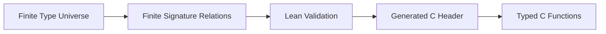
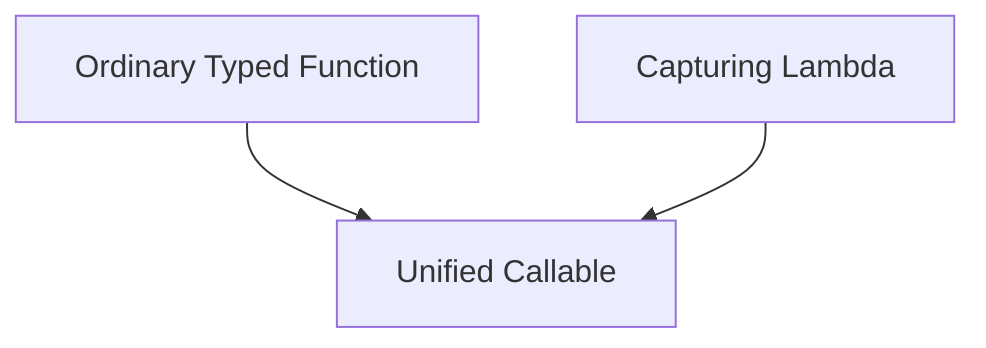
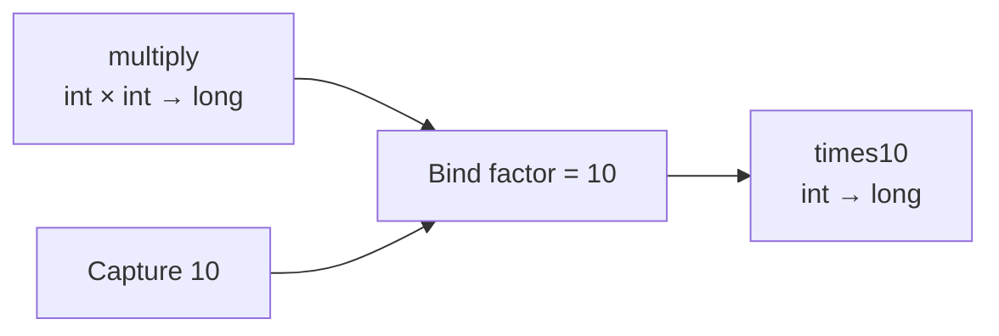

# 第三章：从函数指针到可执行对象——Callback、Lambda 与 Bind


> **本章路线**
>
> 前两章让“数据”拥有了类型和有限推导能力。这一章开始处理“行为”：从最普通的 function pointer 出发，只在确实需要组合、捕获环境和语义分析时，逐步增加 Callable。
>
> ~~~text
> Function Pointer
>    → Normalized Signature
>    → Callable Representation
>    → Capture / Lambda / Bind
>    → Effects / Property Claims
>    → Semantic Laws
>    → Lean-checked Composition
>    → Graph-ready Computation
> ~~~
>
> 本章的关键不是模仿 C++ Lambda 语法，而是建立一个以后 Graph、Stream、Executor 和 Optimizer 都能共同消费的**有限可执行对象模型**。

前两章解决了两个问题。

第一步，是让宏从简单的文本复用逐渐变成：

```text
结构化的编译期描述
```

第二步，是让这些描述真正获得：

```text
Type
Traits
Generic
Identity
Finite Relation
Inference
```

走到这里以后，数据已经不再只是：

```text
一块不知道含义的内存
```

而可以成为：

```text
一个具有类型、能力和语义身份的对象
```

接下来很自然会遇到另一个更重要的问题：

> **函数怎么办？**

C 当然有函数。

而且 C 的函数调用非常简单、高效。

问题不在于：

```text
C 能不能执行函数？
```

而在于：

> **一个函数一旦被当成 callback 保存、传递和组合以后，我们还能不能知道它是什么？**

这一步最终把系统从：

```text
Typed Data
```

推进到了：

```text
Typed Behavior
```

也是以后 Graph、Flow 和 Executor 能够出现的直接前提。

---

## 1. 普通函数指针非常快，但知道得太少

C 中最普通的 callback 可以写成：

```c
typedef long (*mapper_fn)(int);
```

然后：

```c
long square(int value)
{
    return (long)value * value;
}

mapper_fn fn = square;
```

这已经很好。

调用：

```c
long result = fn(10);
```

没有复杂运行时，也没有额外对象。

但如果我们把：

```c
fn
```

交给一个通用 library，它真正知道的事情非常有限。

如果类型已经在 typedef 中被擦掉，甚至可能最后只剩：

```c
void (*fn)(void *);
```

再加：

```c
void *user;
```

这是传统 C callback 最常见的模式。

它非常灵活，但有一个明显问题：

```text
函数真正的类型和语义
逐渐退化成
调用方和实现方之间的约定
```

---

## 2. 一个执行系统真正想知道的，不只是函数地址

例如：

```c
long square(int x);
```

我们实际上知道很多事实：

```text
name        = square
input       = int
output      = long
arity       = 1
```

如果这是一个纯数学函数，还可能知道：

```text
PURE
DETERMINISTIC
TOTAL
```

再例如：

```c
User load(const char *path);
```

可能具有：

```text
String -> User

IO
MAY_FAIL
```

这些信息对于普通的直接调用并不是必需的。

但是一旦我们想做：

```text
函数组合
Graph
Executor
优化
并行
验证
```

它们就非常重要。

于是函数也需要像类型一样，被描述成一个真正的对象。

---

## 3. 第一步：把 Function Signature 正规化

前面已经建立了有限类型宇宙。

因此函数类型也可以建立在这个宇宙上。

最基本的几种形式可以是：

```text
Unary

T -> U
```

例如：

```text
int -> long
User -> bool
```

二元函数：

```text
Binary

T × U -> V
```

例如：

```text
long × long -> long
```

还有一种非常有用的形式：

```text
Generator

T -> 0..N U
```

也就是一个输入可以连续产生多个输出。

例如：

```text
String -> Character*
```

这样，函数类型不再只是某个 C declarator。

它可以拥有一个稳定的：

```text
Signature Identity
```

---

## 4. 为什么 Signature 也必须是有限的

这里很快会再次遇到组合爆炸。

假设系统知道：

```text
20 个类型
```

如果自动生成所有：

```text
T -> U
```

已经是：

```text
20 × 20
```

所有：

```text
T × U -> V
```

则会迅速变成：

```text
20³
```

绝大多数这些函数类型实际上永远不会出现。

所以仍然采用与前面完全相同的策略：

> **不生成理论上所有可能的函数，而只描述系统中真正允许的有限关系。**

例如只存在：

```text
int  -> int
int  -> bool
int  -> long
long -> double

long × long -> long
```

那就只生成这些。

这会直接减少：

```text
generated typedef
signature enum
dispatch branch
header size
compile time
ABI surface
```

---

## 5. Lean 在这里第一次直接帮助“函数类型系统”

当函数 signature 变多以后，很适合让 Lean 检查这套有限关系。

Lean 可以确认：

```text
每一个 input/output type 都存在
没有重复 signature
relation 没有引用未知类型
生成顺序稳定
```

然后把已经验证过的有限 signature manifest 输出成普通 C header。

整个过程可以理解为：



这里 Lean 并不参与函数执行。

它做的是：

> **帮助我们确定“哪些函数类型是合法且存在的”。**

真正运行：

```c
result = fn(value);
```

时，仍然是普通 C。

---

## 6. 从 Function Pointer 到 Callable

有了 signature 后，就可以进一步把：

```text
函数地址
```

和：

```text
函数语义
```

放在一起。

概念上可以变成：

```text
Callable
    ├── Signature
    ├── Function
    ├── Effects
    ├── Properties
    ├── Dispatch
    └── Capture
```

其中最基础的信息是：

```text
Signature
```

例如：

```text
int -> long
```

然后是：

```text
Effects
```

描述函数会产生什么外部影响。

例如：

```text
PURE
STATEFUL
ASYNC
IO
MAY_FAIL
```

再有：

```text
Properties
```

描述函数具有哪些正向保证：

```text
DETERMINISTIC
TOTAL
NO_ALIAS
IDEMPOTENT
ASSOCIATIVE
```

于是一个 callback 不再只是：

```text
0x7ff12340
```

而可以成为：

```text
square
    type       = int -> long
    effect     = PURE
    properties = DETERMINISTIC | TOTAL
```

---

## 7. Effects 和 Properties 为什么必须分开

这两个概念很容易混在一起。

Effects 描述的是：

> **这个函数可能做什么。**

例如：

```text
IO
STATEFUL
MAY_FAIL
```

而 Properties 描述的是：

> **这个函数保证什么。**

例如：

```text
DETERMINISTIC
TOTAL
ASSOCIATIVE
```

因此：

```text
PURE
```

更像“没有副作用”。

而：

```text
ASSOCIATIVE
```

则是一条正面的数学性质。

两者在后续优化中用途也不同。

例如：

```text
Map Fusion
```

可能要求函数没有不允许重排的 Effect。

而：

```text
Parallel Reduce
```

则可能要求 reducer 声明：

```text
ASSOCIATIVE
```

这已经开始让函数本身成为：

```text
可以被分析的数据
```

---

## 8. 第一种执行形式：直接调用普通 C 函数

虽然现在已经有 Callable，但最重要的原则仍然是：

> **如果一个函数可以直接调用，就不要为了抽象而增加无意义的 runtime。**

例如：

```c
long square(int x);
```

如果构建阶段已经确定它的 signature，那么执行阶段最好仍然可以变成：

```c
result = square(value);
```

所以 Callable 需要保留：

```text
Canonical Raw Target
```

可以理解成：

```text
Callable Metadata
      ↓
已验证
      ↓
真正执行
      ↓
Typed C Function Pointer
```

这样 Meta 信息帮助我们验证和优化。

却不会强制 hot path 进入一个通用 interpreter。

---

## 9. 第二种执行形式：Adapter

并不是每一个场景都可以在编译时直接知道具体 C function type。

例如一个通用执行器可能只拿到：

```text
Callable
```

那么就需要统一：

```text
invoke
```

协议。

概念上：

```c
invoke(
    callable,
    out,
    args
);
```

它需要完成：

```text
erased arguments
    ↓
validated signature
    ↓
恢复 typed arguments
    ↓
调用真实 C function
    ↓
写入 output
```

关键仍然在于：

> **signature 检查应该提前完成，而不是每个 value 到来以后重新推导一次。**

更合理的流程是：

```text
Control Plane

Callable
   ↓
Bind / Validate Signature
   ↓
Select Adapter


Hot Path

Adapter
   ↓
Typed Function
```

---

## 10. 传统 C callback 最大的问题之一：context

当 callback 需要外部参数时，C 通常写成：

```c
void callback(void *user, int value);
```

然后：

```c
typedef struct {
    int factor;
} context;
```

使用时：

```c
context ctx = { 10 };

register_callback(callback, &ctx);
```

这套方案已经使用了几十年，而且非常有效。

但它的问题也很明确：

```text
function pointer
和
context pointer
```

是两个独立对象。

调用者必须自己保证：

```text
context 什么时候创建
什么时候销毁
callback 运行时它是否还活着
是否可以共享
是否可以复制
```

对于简单 callback 没问题。

但当函数开始被：

```text
保存
组合
复制
加入 Graph
编译成 Plan
```

以后，这种 lifetime 管理会迅速复杂。

---

## 11. C++ Lambda 给了一个很好的答案

C++ 可以写：

```cpp
int factor = 10;

auto scale = [factor](int x) {
    return x * factor;
};
```

从概念上看，它其实只是：

```text
Function
+
Captured Data
```

可以想象成：

```cpp
struct Closure {
    int factor;

    int operator()(int x) {
        return x * factor;
    }
};
```

也就是说：

> **函数和它需要的上下文，被组合成了一个完整的值。**

既然已经有 Callable，就可以在 C 中用更有限、更明确的方式实现同样的核心思想。

---

## 12. 在 C 中构造一个有限 Lambda

例如概念上：

```c
lambda(
    map,
    value,
    long,
    scale,
    int, x,
    int, factor)
{
    return (long)x * factor;
}
```

然后：

```c
scale(10)
```

并不是调用函数。

而是构造一个：

```text
Callable
```

其中：

```text
Signature = int -> long
Capture   = 10
Invoke    = scale implementation
```

调用时：

```text
input = x
capture = factor
```

然后实际执行：

```c
result = x * factor;
```

这就是一个非常小型的 closure。

---

## 13. 为什么 Capture 使用 Inline Storage

如果为了 lambda 立刻引入：

```text
heap allocation
reference counting
GC
closure object hierarchy
```

会让整个设计迅速变重。

而实际系统中大量 capture 其实很小：

```text
一个整数
一个阈值
一个指针
几个配置字段
```

因此一个更简单的方案是：

```text
Callable
    └── fixed-size inline capture
```

例如：

```text
32 bytes
```

以内直接复制到 callable 本身。

于是：

```text
copy Callable
```

就等价于：

```text
copy Function Metadata
+
copy Capture
```

生命周期非常简单。

没有隐藏 allocation。

---

## 14. 多个 Capture 可以先组成普通 Struct

如果 callback 需要：

```text
factor
offset
limit
```

不需要为了 lambda 再发明另一种复杂 capture grammar。

可以直接：

```c
typedef struct {
    int factor;
    int offset;
    int limit;
} TransformConfig;
```

然后：

```text
Capture = TransformConfig
```

这再次体现一个长期原则：

> **已有的普通 C 能解决的问题，就继续用普通 C。**

Meta 层只负责把这个普通 C object：

```text
按值带进 Callable
```

而不是创造新的对象模型。

---

## 15. Lambda 的重点不是语法，而是 Callable Representation

例如以后可能提供：

```c
lambda(...)
```

这样的 DSL。

但真正重要的并不是：

```text
看起来像不像 C++ lambda
```

而是它最后应该落到：

```text
同一个 Callable
```

也就是说：



上层代码不应该因为函数来自 lambda，就需要另外一个执行器。

否则抽象会不断分裂。

---

## 16. 第三种执行形式：Bind

当 Capture 已经存在以后，又会自然发现另一个非常实用的操作：

```text
Partial Application
```

例如原函数：

```c
long multiply(int x, int factor);
```

它的类型是：

```text
int × int -> long
```

如果：

```text
factor = 10
```

已经固定，那么就可以构造：

```text
times10
```

其类型变成：

```text
int -> long
```

这与 C++：

```cpp
std::bind(
    multiply,
    std::placeholders::_1,
    10);
```

解决的是同一个问题。

---

## 17. Bind 本质上仍然只是 Capture

例如：

```text
multiply
    int × int -> long
```

进行：

```text
Bind factor = 10
```

以后：

```text
Callable
    function = multiply
    capture  = 10
    exposed signature = int -> long
```

可以表示成：



因此 Bind 没有必要成为一个独立 runtime。

它仍然只是：

```text
Callable + Capture
```

---

## 18. Bind 比单纯“保存参数”更有意思

因为它实际上改变了：

```text
函数类型
```

原来：

```text
F : A × B -> C
```

绑定一个：

```text
b : B
```

之后：

```text
bind(F, b) : A -> C
```

这已经是一个真正的：

```text
Type Transformation
```

所以从这里开始，之前建立的：

```text
Signature
Type Relation
Finite Inference
```

开始能够作用于函数组合本身。

这也说明：

> 类型系统不是为了 metadata 而存在，它开始真正帮助构造新的程序对象。

---

## 19. 第四种形式：Generator

普通函数通常是：

```text
1 input
    ↓
1 output
```

例如：

```text
Map
```

但是很多数据处理操作不是这样。

例如：

```text
flatMap
```

可以把：

```text
1 input
```

展开成：

```text
0..N outputs
```

例如：

```text
"abc"
    ↓
'a'
'b'
'c'
```

因此还需要：

```text
Generator Callable
```

它的核心不是返回一个普通值，而是维护一个：

```text
cursor
```

多次调用后返回：

```text
VALUE
VALUE_AND_DONE
DONE
ERROR
```

这样一个 callable 就可以表示：

```text
T -> 0..N U
```

---

## 20. Generator 为什么也要使用同一个 Callable 模型

很容易为 Generator 再造：

```text
GeneratorObject
```

但这样上层系统又需要理解两种函数对象。

更好的方式是：

```text
Callable
    ├── invoke
    └── generate
```

普通 unary/binary callback 使用：

```text
invoke
```

Generator 使用：

```text
generate
```

因此表面能力增加了：

```text
ordinary function
lambda
bind
generator
```

底层 representation 仍然保持非常有限。

---

## 21. 最终只有少数真正的执行路径

从用户角度，可以有很多形式：

```text
普通 C 函数
Named Typed Callback
Lambda
Bind
Generator
```

但底层可以收敛成：

```text
Raw Call
Adapter Invoke
Generator
```

也就是：

| 用户形式 | Capture | 主要执行方式 |
|---|---:|---|
| 普通 typed function | 无 | Raw / Adapter |
| Named callable | 无 | Raw / Adapter |
| Lambda | 有 | Adapter |
| Bind | 有 | Adapter |
| Generator | 可有 | Generate |

这是一种非常重要的控制复杂度方法：

> **增加表达形式，但不要等比例增加执行机制。**

---

## 22. 为什么还要给 Callable 加 Effect 和 Property

如果 Callable 只是为了调用函数：

```text
signature + pointer
```

已经足够。

但是后面一旦要：

```text
组合
Graph
优化
并行
```

就必须知道更多。

例如：

```text
f : int -> int
```

是否能够重复调用？

是否可以：

```text
f(g(x))
```

重新排序？

是否可能修改外部状态？

因此：

```text
Signature
```

解决：

> 类型对不对？

而：

```text
Effects / Properties
```

解决：

> 这个函数在语义上能做什么？

---

## 23. 一个例子：为什么 PURE 很重要

假设：

```text
Map(f)
Map(g)
```

如果：

```text
f
g
```

都是纯函数，那么有可能把两个 stage 组合成：

```text
Map(g ∘ f)
```

但是如果：

```text
f
```

会：

```text
write file
update global state
```

那么某些优化就可能改变可观察行为。

所以：

```text
PURE
```

不是一个装饰标签。

它可能直接影响：

```text
Graph optimization legality
```

---

## 24. 一个例子：为什么 ASSOCIATIVE 很重要

假设：

```c
long add(long a, long b);
```

用于：

```text
Reduce
```

如果满足：

```text
(a + b) + c
=
a + (b + c)
```

那么输入：

```text
1 2 3 4
```

可以分成：

```text
(1 + 2)
和
(3 + 4)
```

然后：

```text
3 + 7
```

这就为：

```text
Parallel Reduce
```

提供了理论基础。

所以：

```text
ASSOCIATIVE
```

可以影响执行器是否允许并行。

---

## 25. 但 Property 声明不是数学证明

这里有一个非常重要的边界。

假设程序员写：

```text
IDEMPOTENT
```

并不意味着函数真的满足：

```text
f(f(x)) = f(x)
```

例如：

```c
int increment(int x)
{
    return x + 1;
}
```

如果错误地标记：

```text
IDEMPOTENT
```

metadata 本身并不能阻止这个谎言。

所以必须区分：

```text
Property Declaration
```

和：

```text
Semantic Law
```

---

## 26. Lean 在这里开始承担更深的角色

例如真正的 Idempotent Law：

```text
∀x, f(f(x)) = f(x)
```

可以在 Lean 中被精确定义。

然后证明：

```text
如果 f 满足这个 Law
那么
f ∘ f
可以安全简化成
f
```

这样：

```text
C Metadata
```

负责：

> 程序声明自己具有什么性质。

而：

```text
Lean
```

负责：

> 这种性质在数学模型中究竟允许什么推导。

这是后面 verified optimization 的基础。

---

## 27. Callable Algebra 开始出现

到了这里，函数已经不再只是：

```text
可以调用
```

而开始可以：

```text
构造
绑定
组合
分析
推导
```

例如：

```text
f : A -> B
g : B -> C
```

可以组成：

```text
g ∘ f : A -> C
```

一个：

```text
F : A × B -> C
```

可以通过 Bind 得到：

```text
F_b : A -> C
```

一个普通函数：

```text
A -> B
```

可以通过 capture 变成：

```text
带状态的 A -> B Callable
```

这已经逐渐形成：

```text
Callable Algebra
```

---

## 28. 这一步为什么非常关键

前面处理的是：

```text
Data
```

例如：

```text
User
Vec<int>
Map<Key,Value>
```

现在开始处理：

```text
Behavior
```

例如：

```text
User -> bool
User -> String
String × String -> String
```

可以把这次变化理解为：


只有完成这一步以后，才能真正考虑：

> **多个 Callable 能不能连接起来？**

---

## 29. 从 Callable 到 Graph 已经只差一步

假设现在有两个 Callable：

```text
enabled : User -> bool
```

和：

```text
name : User -> String
```

如果只是单独调用：

```c
enabled(user);
name(user);
```

没有什么特别。

但如果开始描述：

```text
先用 enabled 决定是否保留 User
然后用 name 转成 String
```

那么已经产生：

```text
计算关系
```

也就是：

```text
User
   ↓
Filter(enabled)
   ↓
User
   ↓
Map(name)
   ↓
String
```

这时我们真正需要保存的不再只是：

```text
一个 Callable
```

而是：

```text
多个 Callable 之间的连接关系
```

这就是 Graph 出现的地方。

---

## 30. 完整演进路线开始变得清晰

到这里，前面的发展可以连成：

```text
Macro
 ↓
Structured Facts
 ↓
Type
 ↓
Traits
 ↓
Generic
 ↓
Finite Inference
 ↓
CMeta
 ↓
Typed Function
 ↓
Callable
 ↓
Lambda / Bind
 ↓
Callable Algebra
 ↓
Graph
```

Graph 并不是突然增加的一个 feature。

而是一个很自然的结论：

> **既然函数已经成为有类型、有语义、可以被保存和组合的数据，那么多个函数之间的计算关系，也应该可以成为数据。**

---

## 31. Semantic Contract：Callable 到底承诺什么

到这里，需要把“Callable 很方便”进一步收紧成可实现、可验证的 contract。

### 31.1 Signature 是可组合性的第一道门

一个 Callable 首先拥有有限、明确的函数类型：

~~~text
A -> B
A × B -> C
A -> 0..N B
~~~

Graph 或 Stream 在连接两个 Callable 时，首先依赖的是：

~~~text
output type of f
    compatible with
input type of g
~~~

如果类型关系不成立，错误应该发生在：

~~~text
build / admission
~~~

而不是等到运行时拿 void * 猜。

### 31.2 Capture 必须拥有明确的生命周期

Lambda / Bind 的核心不是语法糖，而是：

~~~text
invoke code
+
captured environment
~~~

因此必须回答：

- capture 是 copy、borrow 还是 owned；
- capture 的 alignment 是什么；
- inline storage 最大容量是多少；
- 超过容量是 compile-time failure、explicit heap path，还是 unsupported；
- Callable copy 时 capture 怎样处理；
- destroy 谁负责；
- 跨线程使用是否允许。

如果这些问题没有答案，所谓“Lambda”只是把传统 void * context 的问题藏了起来。

### 31.3 Callable Instance 不等于 Function Address

例如两个 Callable：

~~~text
times10 = bind(multiply, 10)
times20 = bind(multiply, 20)
~~~

可能共享同一个 invoke function。

但是它们显然不是同一个 callable instance。

因此：

~~~text
function pointer equality
~~~

不能被当成：

~~~text
callable semantic equality
~~~

这一点与上一章的：

~~~text
descriptor address
≠
semantic type identity
~~~

是同一个设计模式。

### 31.4 Effects 与 Properties 都首先是 metadata

即使我们把它们分开：

~~~text
Effects:
IO
STATEFUL
MAY_FAIL

Properties:
DETERMINISTIC
IDEMPOTENT
ASSOCIATIVE
~~~

也仍然要保持谨慎。

如果这些 bit 来自程序员声明，那么它们首先只是：

~~~text
claims
~~~

它们可以用于：

- diagnostics；
- conservative admission；
- scheduling restriction；
- 要求额外 certificate；

但不能因为看见：

~~~text
ASSOCIATIVE
~~~

就自动得出：

~~~text
任意重排都语义等价
~~~

真正授权 rewrite 的必须是 semantic law。

---

## 32. Lean：从“属性标签”进入可验证 Callable Algebra

这一章 Lean 的价值比上一章更进一步。

上一章主要验证有限 relation 是否 well formed。

这一章开始验证：

> **一个函数关系在什么前提下可以安全组合、简化或重排。**

### 32.1 Signature composition

如果：

~~~text
f : A -> B
g : B -> C
~~~

可以建立：

~~~text
compose g f : A -> C
~~~

而：

~~~text
f : A -> B
g : X -> C
B != X
~~~

则 composition 不应该进入合法 graph。

这部分可以由 finite signature model + C build-time checks共同承担。

### 32.2 Idempotent law

真正的 law 是：

~~~text
forall x, f (f x) = f x
~~~

然后才能证明：

~~~text
f ∘ f
=
f
~~~

注意证明的是：

> 如果 f 满足 law，那么 rewrite preserve semantics。

它不是证明任意被标记 IDEMPOTENT 的 C function 真的满足这个 law。

### 32.3 Associative law

类似：

~~~text
op (op a b) c
=
op a (op b c)
~~~

可以授权特定 reduction tree 的重组。

但如果真实 C operation 存在：

~~~text
floating-point rounding
overflow
external state
error ordering
~~~

就必须先定义 observable semantics，再决定 theorem 是否真的适用。

这正是 Lean 能反过来改善 API 的地方：

> 一个过于宽泛的 ASSOCIATIVE bit，可能根本不足以描述真正可安全重排的执行条件。

### 32.4 Proof-carrying admission

后面的 Optimizer 可以逐渐采用这样的思路：

~~~text
metadata claim
      ↓
admission condition
      +
trusted primitive / proof / certificate
      ↓
semantic rewrite enabled
~~~

而不是：

~~~text
bit is set
      ↓
rewrite blindly
~~~

这样 Lean 不进入 hot path，却真正改变了 C optimizer 的安全边界。

---

## 33. C Implementation：有限表达形式，少数执行路径

这一章的实现目标不是创造越来越多 Runtime object。

恰恰相反：

> **Surface form 可以丰富，底层执行机制必须收敛。**

概念上，一个 Callable representation 可以包含：

~~~c
typedef struct callable {
    const signature_desc *signature;

    callable_invoke_fn invoke;

    effect_set effects;
    property_set claims;

    capture_storage capture;
} callable;
~~~

这里字段名字不是重点。

真正重要的 contract 是：

~~~text
signature
    → type compatibility

invoke
    → one of a small number of execution paths

capture
    → explicit bounded environment

effects / claims
    → analysis metadata, not automatic proof
~~~

### 33.1 Raw function remains the baseline

如果用户只有：

~~~c
long square(int x);
~~~

而系统根本不需要保存、组合或分析它，就应该直接调用：

~~~c
square(x);
~~~

Callable 不应该成为“所有函数必须经过的对象层”。

### 33.2 Adapter path 必须可解释成本

当需要 erased dispatch 或 capture 时，才进入 adapter：

~~~text
typed call
    ↓
adapter
    ↓
capture + input
    ↓
ordinary C function
~~~

这里需要知道：

- 多一次 indirect call 吗；
- capture copy 多大；
- 有没有 allocation；
- alignment 是否静态已知；
- destructor 是否存在。

### 33.3 Inline capture 必须 bounded

Inline storage 的价值不是“更像 lambda”。

它的价值是：

~~~text
no hidden allocation
+
known maximum object size
+
predictable ownership
~~~

超过边界必须 explicit。

这与后面的 bounded mailbox、bounded executor queue 是同一设计哲学。

---

## 34. Evidence：Callable 必须和 Plain C baseline 比较

本章的证据不能只有“能调用”。

### 34.1 Compile-time evidence

验证：

~~~text
signature match
    → accepted

signature mismatch
    → fail early

unsupported capture form
    → explicit failure
~~~

### 34.2 Lifetime evidence

至少测试：

- capture copy；
- capture destroy；
- alignment；
- multiple callable instances sharing one invoke function；
- borrowed capture 的生命周期边界；
- sanitizer 下无 use-after-free。

### 34.3 Multi-TU / ABI evidence

Named Callable 或 generated signature information 应该能够跨 TU 使用，而不是依赖某个 header-local object address。

### 34.4 Performance evidence

至少比较：

~~~text
direct C call
typed wrapper
adapter/erased callable
capturing callable
~~~

需要记录：

- compiler；
- optimization level；
- hot/cold call context；
- 是否 inline；
- capture size。

目标不是证明“Callable 永远 zero-cost”。

目标是告诉读者：

> **什么时候它等价于普通调用，什么时候确实为表达能力付出了一次 dispatch/capture 成本。**

---

## 35. Canonical Example：为 Graph 准备三个 Callable

从这一章开始，我们建立后面会持续复用的数据流例子。

~~~text
is_even : int -> bool
square  : int -> int
sum     : int × int -> int
~~~

Plain C 可以直接写：

~~~c
bool is_even(int x);
int square(int x);
int sum(int a, int b);
~~~

当它们进入 Callable 层以后，我们额外拥有：

~~~text
signature
effects
property claims
optional certificate / trusted law
~~~

但执行函数本身仍然可以是普通 C。

下一章不再单独看它们，而是保存它们之间的关系：

~~~text
Source<int>
    ↓
Filter(is_even)
    ↓
Map(square)
    ↓
Reduce(sum)
~~~

这就是 Graph。

---

## 36. What We Learned

这一章完成了从：

~~~text
typed data
~~~

到：

~~~text
typed behavior
~~~

的跨越。

关键不是 Lambda 或 Bind 的表面语法，而是：

1. **Plain function pointer remains the baseline.**
2. **Signature makes behavior type-aware.**
3. **Capture makes environment explicit.**
4. **Finite dispatch prevents surface features from multiplying runtime mechanisms.**
5. **Effects / Properties are not automatically proofs.**
6. **Semantic laws are what authorize verified rewrites.**
7. **Lean lives in the control/trust plane, not the call hot path.**
8. **Costs such as indirect dispatch and capture storage must be measured, not hidden.**

因此 Graph 的出现不再像“添加一个 framework”。

它只是下一步自然的问题：

> **既然一个 Callable 已经可以成为数据，那么多个 Callable 之间的计算关系为什么不能也成为数据？**

---

# 小结：函数第一次从“代码地址”变成“程序对象”

传统 C callback 的核心是：

```text
Function Pointer
+
void * Context
```

它足够简单，也足够高效。

但当系统开始需要：

```text
类型检查
组合
推导
优化
异步
Graph
Executor
```

以后，需要保留更多信息。

于是函数逐渐变成：

```text
Callable
    =
Typed Function
+
Signature
+
Effects
+
Properties
+
Optional Capture
+
Dispatch
```

在这个基础上，又可以自然实现：

```text
类似 C++ Lambda 的 Capture
类似 std::bind 的 Partial Application
Generator Callback
```

但它们最终仍然收敛成少数几种简单的 C 调用方式。

Lean 则不参与 callback 的实际执行，而帮助验证：

```text
有限 Signature Universe
函数关系
Semantic Law
允许的推导和优化
```

从这一章开始，Meta 系统已经不只是描述：

```text
“数据是什么”
```

还开始描述：

```text
“行为是什么”
```

下一章就可以继续回答一个更大的问题：

> **如果一个 Callable 已经可以成为数据，那么多个 Callable 能不能组成一个更大的、可检查、可推导、可执行的数据对象？**

答案就是：

# Graph

而 Graph 也将成为 CFlow 真正出现的起点。