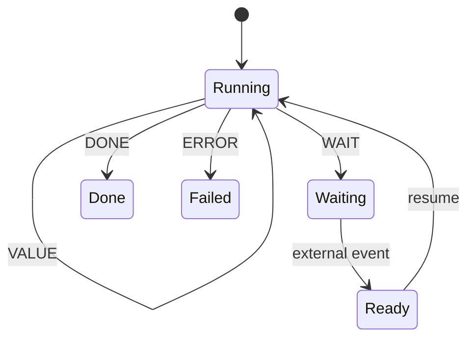
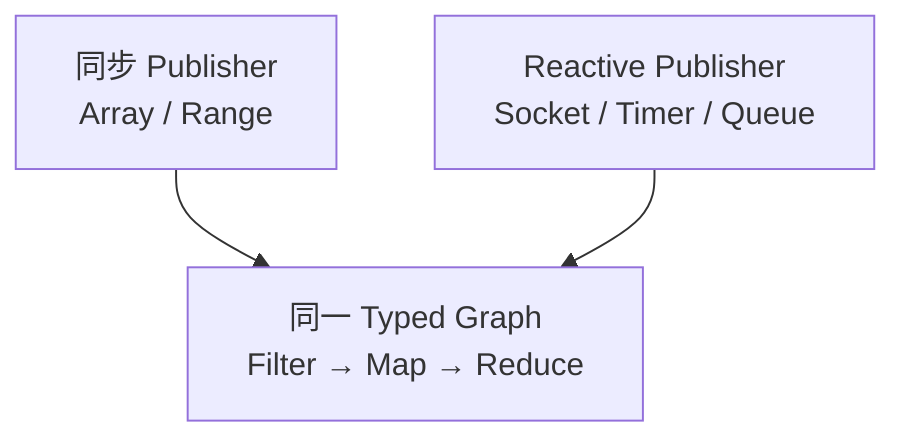
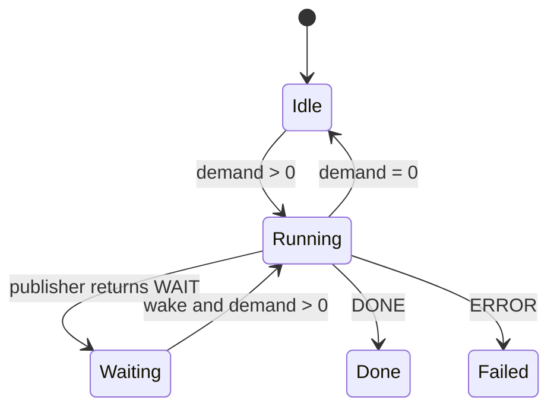
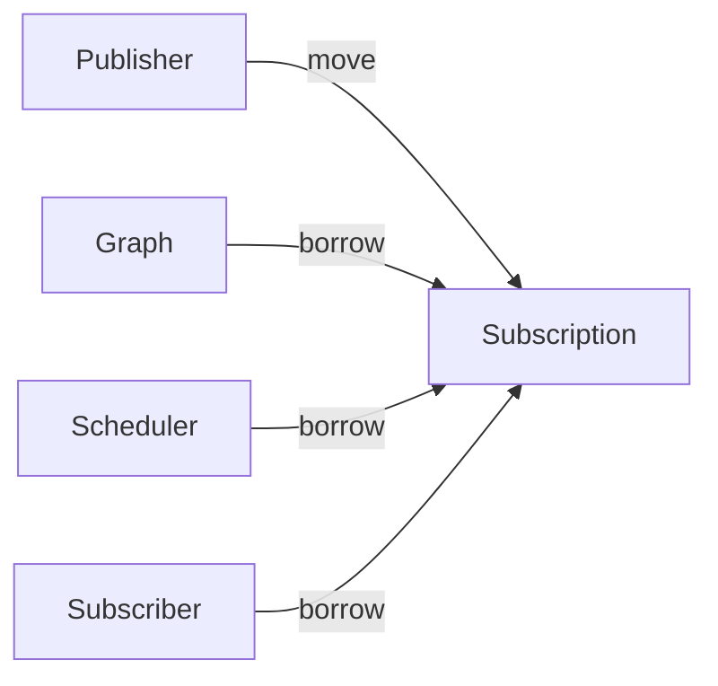

# 第八章：从 Stream 到 Reactive——WAIT、Wake、Demand 与 Backpressure


> **本章路线**
>
> 前两章已经把 canonical pipeline 固定为一张 reusable Typed Graph。本章不改变 Filter / Map / Reduce 的计算关系，只给“执行”增加时间、等待和下游需求：
>
> ~~~text
> immutable Graph
>      +
> movable Publisher
>      +
> Subscription-owned live state
>      +
> Scheduler
>      ↓
> Reactive execution
> ~~~
>
> canonical pipeline 仍然是：
>
> ~~~text
> `Source<int>`
>     ↓
> Filter(is_even)
>     ↓
> Map(square)
>     ↓
> Reduce(sum)
> ~~~
>
> 真正新增的是 source 每次 resume 可以回答：
>
> ~~~text
> VALUE
> VALUE_AND_DONE
> WAIT
> DONE
> ERROR
> ~~~
>
> 因此本章的核心不再是“数据怎样转换”，而是：
>
> **什么时候允许继续、谁拥有等待状态、谁消耗 demand、Wake 是否会丢失，以及 terminal 如何成为唯一事实源。**

上一章做到 Stream 以后，整个数据转换模型已经比较完整：

```text
Range
  ↓
Filter
  ↓
Map
  ↓
Reduce / Collect
```

如果数据来自：

```text
Array
Vec
List
Range
```

这种已经存在于内存中的对象，那么执行过程非常直接。

执行器不断：

```text
next
next
next
```

Publisher 每次都可以立即回答：

```text
VALUE
```

或者：

```text
DONE
```

这就是典型的同步 Stream。

但 Graph 做出来以后，我们很快发现一个重要事实：

> **Graph 中的 Map、Filter、Reduce 并不关心数据来自哪里。**

它们真正关心的只是：

```text
输入一个 T
然后按照既定语义处理它
```

既然如此，Publisher 为什么一定要是：

```text
Array
Container
```

呢？

它也完全可能是：

```text
Socket
Timer
Message Queue
File Reader
UI Event
Sensor
Async API
```

这时问题发生了变化。

不是 Graph 不能处理这些数据，而是：

> **数据现在可能还没有到。**

这就是从 Stream 向 Reactive 演进的真正起点。

---

## 1. 同步 Publisher 隐含了一个非常强的假设

传统 iterator 可以概念上写成：

```c
bool next(void *out);
```

调用：

```text
next()
```

以后只有两种结果：

```text
有值
没有值
```

通常：

```text
有值
    = 继续

没有值
    = 完成
```

这对 Array、Vec、List 很合理。

但对于 Socket：

```text
现在没有数据
```

并不意味着：

```text
以后也不会有数据
```

同样，对于 Timer：

```text
时间还没有到
```

也不意味着：

```text
Timer 已经结束
```

所以简单的：

```text
VALUE / DONE
```

模型已经不足以表达真实异步系统。

我们需要第三种状态：

**WAIT**

也就是：

> **现在没有结果，但 computation 仍然有效，未来某个时刻应该继续。**

---

## 2. WAIT 是从同步迭代走向异步执行的关键

于是 Publisher 的一步执行可以不再只是：

```text
VALUE
DONE
ERROR
```

而扩展成：

```text
VALUE
VALUE_AND_DONE
WAIT
DONE
ERROR
```

本版 CFlow 实现 runtime 就把可恢复执行的一步显式建模成这五种结果。

它们的语义分别是：

```text
VALUE
    产生一个值，后面还可能继续

VALUE_AND_DONE
    产生最后一个值，同时结束

WAIT
    当前无法继续，需要等待外部事件

DONE
    正常结束

ERROR
    失败终止
```

这样：

```text
没有 Value
```

第一次被分成了两个完全不同的语义：

```text
WAIT
    以后还能继续

DONE
    永远不会再继续
```

这是 Reactive 模型中非常重要的区别。

---

## 3. WAIT 不应该等于“阻塞当前线程”

最简单的异步实现当然可以是：

```c
read(socket, ...);
```

如果没有数据：

```text
线程阻塞
```

直到数据到达。

这种方法对一些程序完全可用。

但如果系统里有：

```text
1000 个 Socket
1000 个 Timer
1000 个等待中的任务
```

那么：

```text
每一个 WAIT
    =
占用一个 Thread
```

就会变得非常昂贵。

所以 WAIT 的目标不应该是：

> 把线程停在那里。

而应该是：

> **把 computation 的状态保存下来，把线程还给执行系统；等真正有事情发生时，再恢复 computation。**

也就是：



这是一种：

```text
Suspend
+
Resume
```

而不是：

```text
Block
+
Unblock
```

的模型。

---

## 4. WAIT 以后必须回答一个问题：谁来通知“可以继续了”？

如果 Publisher 返回：

```text
WAIT
```

执行器停止调用它。

那么将来数据到达以后，谁负责告诉执行器：

```text
现在可以继续了
```

答案是：

```text
Wake
```

因此 WAIT 通常要与一个：

```text
Waitable
```

配合。

Waitable 可以非常小。

它只需要支持类似：

```text
arm(waker)
cancel()
```

执行流程可以理解成：

```text
Publisher.resume()
      ↓
     WAIT
      ↓
  Waitable.arm(waker)
      ↓
执行线程离开
      ↓
外部事件发生
      ↓
   waker.wake()
      ↓
重新调度 Subscription
      ↓
Publisher.resume()
```

本版 CFlow 实现 的 `cflow_waitable` 就是这样的轻量 Interface，只暴露 `arm` 和 `cancel`；`cflow_waker` 本身也只是一个 `wake(user)` callback。

---

## 5. Publisher 因此从 Iterator 变成 Resumable

同步 Iterator 可以简单理解成：

```text
next()
```

Reactive Publisher 更接近：

```text
resume()
```

这个名字本身就表达了一个重要变化。

它不再假定：

```text
每次调用都从头开始一个独立动作
```

而是：

> **继续上一次可能尚未完成的 computation。**

因此一个 Publisher 可能拥有内部状态：

```text
cursor
socket state
parser state
timer state
partial frame
```

一次：

```text
resume()
```

可能：

```text
产生一个值
```

也可能：

```text
走到等待点
```

以后再继续。

本版 CFlow 实现 将这种底层模型抽象成 `cflow_resumable`，而 `cflow_publisher` 则在其上增加名称、输出类型、terminal polling 等 Publisher 语义。

---

## 6. 最重要的是：Graph 本身没有因此改变

假设同步数据流是：

```text
Array<int>
    ↓
Filter(even)
    ↓
Map(square)
    ↓
Reduce(sum)
```

现在把 Publisher 换成：

```text
Socket<int>
```

Graph 中：

```text
Filter
Map
Reduce
```

的语义并没有变化。

变化的只是：

```text
Publisher 什么时候能够产生下一个 int
```

所以更准确的结构是：



这就是 Graph 带来的一个重要发现：

> **Stream 和 Reactive 的差异主要存在于 execution progression，而不是数据转换语义。**

于是没有必要重新实现一套：

```text
ReactiveMap
ReactiveFilter
ReactiveReduce
```

---

## 7. Reactive 不是另一套 Operator Framework

如果没有 Graph，很容易分别设计：

```text
Stream API
```

和：

```text
Reactive API
```

然后两边都有：

```text
map
filter
flatMap
reduce
```

最后出现两套：

```text
Operator
Type Rule
Callback Rule
Optimization Rule
```

Graph 统一以后：

```text
Map
```

仍然只是 Map。

```text
Filter
```

仍然只是 Filter。

真正不同的是：

```text
同步执行：
    Publisher 永远立即回答

Reactive：
    Publisher 可以 WAIT
```

所以更合理的关系是：

```text
Typed Graph
    ↓
不同 Execution Model
```

而不是：

```text
不同 Framework
    ↓
各自一套 Graph
```

---

## 8. 但是有 WAIT 之后，仅仅“能恢复”还不够

假设一个 Socket 非常快：

```text
Producer
 ↓↓↓↓↓↓↓↓↓↓↓
```

而下游：

```text
Consumer
```

很慢。

如果 Publisher 每次醒来以后都不断产生数据：

```text
value
value
value
value
...
```

最终系统只能：

```text
无限排队
```

或者：

```text
丢数据
```

所以 Reactive 系统的下一个问题不是：

> 怎样异步？

而是：

> **怎样控制数据流速度？**

这就是：

**Backpressure**

---

## 9. Backpressure 的最简单形式：Demand

一个非常清楚的方案是：

```text
Consumer 明确告诉上游：

我现在愿意接受多少个 Value。
```

例如：

```text
request(10)
```

代表：

```text
下游允许再产生 10 个值
```

这就是：

```text
Demand
```

本版 CFlow 实现 的 `cflow_subscription_request(subscription, n)` 就采用这种显式 demand 模型。

于是运行逻辑变成：

```text
Demand = 0
    ↓
不继续向下游 emit

request(10)
    ↓
Demand = 10

每成功 emit 一个 downstream value
    ↓
Demand -= 1
```

---

## 10. 一个非常关键的语义：Demand 不是 Publisher Pull Count

这一点很容易写错。

假设：

```text
Publisher<int>
    ↓
Filter(even)
    ↓
Subscriber
```

Subscriber 请求：

```text
request(1)
```

Publisher 接下来产生：

```text
1
3
5
7
8
```

前四个值全部被 Filter 丢掉。

如果每调用一次 Publisher 就减少 Demand：

```text
request(1)
```

第一次读到 `1` 后 demand 就变成 0。

那么 Subscriber 永远收不到它真正请求的那个值。

正确语义应该是：

```text
Publisher item
≠
Downstream value
```

所以：

```text
1 -> filtered
Demand still 1

3 -> filtered
Demand still 1

5 -> filtered
Demand still 1

7 -> filtered
Demand still 1

8 -> emitted
Demand becomes 0
```

本版 CFlow 实现 runtime 对这个语义有明确约束：

> Demand 永远表示 downstream-value demand，而不是 publisher-item demand。

这是整个数据流执行模型中非常基础、但非常容易被忽略的一条规则。

---

## 11. 这意味着 Executor 必须知道“什么时候继续 pull”

有了 Demand 后，执行器不能简单：

```text
while publisher has value:
    process
```

而要同时考虑：

```text
Subscription State
Publisher State
Demand
Terminal State
WAIT State
```

例如：

```text
Demand > 0
Publisher ready
    ↓
可以 resume
```

但：

```text
Demand = 0
```

即使 Publisher 已经 ready，也不应该继续无限向下游生产。

所以运行状态开始更接近：



这时：

```text
Subscription
```

开始成为一个真正的 execution instance。

---

## 12. 为什么需要 Subscription，而不是让 Graph 自己保存这些状态

Graph 表示：

```text
计算是什么
```

例如：

```text
Filter
Map
Reduce
```

它应该尽可能：

```text
immutable
reusable
```

而：

```text
当前还剩多少 Demand
当前 Publisher 是否 WAIT
当前是否 Cancelled
当前执行到哪里
```

这些明显是：

```text
一次执行
```

才具有的状态。

因此需要分开：

```text
Graph
    = computation definition

Subscription
    = one execution instance
```

同一个 Graph 完全可以：

```text
Subscription A
Subscription B
Subscription C
```

同时执行不同数据。

这和：

```text
Machine Definition
```

与：

```text
Machine Instance
```

后来会采用的思想完全一致。

---

## 13. Subscription 也让 Ownership 变得明确

一次异步执行很容易遇到生命周期问题。

例如：

```text
Publisher
Graph
Scheduler
Subscriber
```

到底谁拥有谁？

如果没有明确规则：

```text
cancel
close
destroy
wake
```

很容易产生：

```text
double free
use after free
stale wake
```

本版 CFlow 实现 采用一个比较清楚的模型：

```text
Publisher
    move into Subscription

Graph
    borrowed by Subscription

Scheduler
    borrowed by Subscription

Subscriber
    borrowed protocol
```

`cflow_subscribe()` 成功后会把 Publisher 移入 Subscription；Graph、Scheduler、Subscriber 及其 callback state 保持 borrowed，直到 `cflow_subscription_close()` 完成。

可以表示成：



这使：

```text
谁负责 destroy Publisher
```

不再是模糊约定。

---

## 14. WAIT 以后必须特别小心 Lost Wakeup

异步系统中一个经典问题是：

```text
Publisher 判断：
    现在没有数据

同时外部事件到达

然后 Publisher 才真正注册 Waiter
```

如果处理不好：

```text
事件已经发生
但 wake 没有人收到
```

系统就会永久停在：

```text
WAIT
```

这就是：

```text
Lost Wakeup
```

典型 race：

```text
Thread A                   External Event

检查：没有数据

                           数据到达
                           尝试 wake
                           尚未 arm

开始 arm

永久等待
```

所以：

```text
WAIT
```

不是简单返回一个状态码就结束了。

还需要一个明确的：

```text
arm / wake protocol
```

保证：

```text
signal-before-arm
```

和：

```text
signal-concurrent-with-arm
```

都不会造成永久 suspension。

---

## 15. 这也是 Lean 开始真正进入执行模型的地方

对于：

```text
Enum
Struct
Generic
```

单元测试已经非常有效。

但：

```text
WAIT / Wake race
```

这种问题很难通过几个测试说明：

> 所有可能的状态交错都安全。

因此可以在 Lean 中建立：

```text
Wait State
Arm Step
Wake Step
Runtime State
```

然后证明：

```text
如果事件已经发生
arm 不会让系统永久 WAIT
```

或者：

```text
合法 wake token 不会被重复消费
```

也就是说，Lean 开始从：

```text
验证有限类型关系
```

进入：

```text
验证运行时状态转换
```

这是形式化在整个体系中的第二次重要扩展。

---

## 16. Scheduler 是在这里自然出现的

如果外部事件调用：

```text
wake()
```

以后直接：

```text
resume()
```

就会产生一个问题：

```text
resume 到底在哪个线程执行？
```

例如 Socket completion 可能来自：

```text
I/O thread
```

Timer 可能来自：

```text
timer thread
```

UI event 可能来自：

```text
UI thread
```

如果所有 `wake()` 都直接执行 Graph：

```text
整个 Graph 的执行上下文会变得不可预测
```

更合理的是：

```text
wake
    ↓
Scheduler
    ↓
重新安排 Subscription
```

也就是说：

> **Wake 表示“现在可以继续”，而不是“现在就在这个 callback 栈上继续”。**

---

## 17. Scheduler 回答的是“什么时候执行”

前面已经出现过：

```text
Executor
```

它更关注：

```text
一个 task 以什么执行语义运行
```

而 Scheduler 在 Reactive 中进一步加入：

```text
时间
延迟
timer
cancel
```

例如本版 CFlow 实现 Scheduler protocol 提供：

```text
post_after
cancel
run_one
run_ready
advance
now
wait_idle
```

并通过 capability 描述 delayed、manual-clock 和 concurrent 等能力。

所以可以先粗略地区分：

```text
Executor
    = 怎样执行一个 Task

Scheduler
    = 什么时候让这个 Task 获得执行机会
```

下一章会更系统地展开 Executor。

---

## 18. Manual Clock 对测试特别重要

真实 Timer 基于：

```text
wall clock
```

测试时会产生：

```text
sleep(100ms)
```

之类的代码。

这种测试：

```text
慢
容易受调度影响
容易 flaky
```

如果 Scheduler 支持：

```text
Manual Clock
```

就可以：

```text
post_after(100)
advance(99)
    -> 不执行

advance(1)
    -> 执行
```

这样 Reactive 的时间行为可以变成：

```text
确定性的状态推进
```

而不必真的等待现实时间。

这也是为什么：

```text
Scheduler
```

不应该只是一个 thread pool 的别名。

---

## 19. 从 Reactive 原语进入状态语义

前十八节已经引入这一章真正新增的东西：WAIT、arm/wake、Demand、Subscription、bounded scheduling，以及 Scheduler 与时间控制。Graph 和 operator semantics 并没有因此变成另一套 framework。

后半章因此直接用 canonical timed source 固定这些语义：WAIT 不代表已经 arm，wake 不产生 demand，source VALUE 不等于 downstream emission，terminal/cancel 必须唯一且显式，Subscription 是 live execution state 的 owner。随后再把这些规则对应到 Lean small-step model、当前 C implementation 与 race/resource evidence。

这里同样严格区分 safety 与 liveness：formal invariant 不被写成对 OS fairness 或未来 wake 一定发生的证明。

---

## 20. Canonical Example：Graph 不变，Source 开始拥有时间

上一章的同步 Stream 可以理解成：

~~~text
input array / Range
      ↓
Source<int>
      ↓
Filter(is_even)
      ↓
Map(square)
      ↓
Reduce(sum)
~~~

同步 source 的一个隐含假设是：

> 每次被询问时，要么马上给值，要么马上结束。

Reactive 打破的只有这个假设。

Graph 本身仍然可以保持：

~~~text
Filter(is_even)
Map(square)
Reduce(sum)
~~~

变化的是 source protocol：

~~~text
resume()
   ↓
VALUE
VALUE_AND_DONE
WAIT
DONE
ERROR
~~~

其中 WAIT 的语义必须非常精确：

> **现在没有值，但这个 continuation 仍然有效；当外部条件变化时，系统可以被唤醒并重新尝试。**

它不是：

~~~text
sleep current thread
~~~

也不是：

~~~text
treat as DONE
~~~

更不是：

~~~text
spin until something appears
~~~

这一个区别，让同一张 Graph 可以从：

~~~text
already-materialized input
~~~

延伸到：

~~~text
timer
channel
readiness
socket / pipe / file completion
custom asynchronous publisher
~~~

而不需要重新设计 operator semantics。

---

## 21. Semantic Contract：Reactive 新增的是 execution state，而不是 Graph state

这一章最重要的分层是：

~~~text
Graph
    = immutable/reusable program description

Subscription
    = one live execution
~~~

### 32.1 WAIT 只是 source outcome，不是“已经注册成功”

source 返回 WAIT 时，只说明：

~~~text
continuation saved
+
waitable available
~~~

接下来仍然存在一个独立步骤：

~~~text
arm(waitable, waker)
~~~

因此：

~~~text
WAIT
    ≠
SUSPENDED
~~~

更准确的状态变化是：

~~~text
READY
  ↓ resume returns WAIT
PENDING_ARM
  ↓ arm succeeds quietly
SUSPENDED
  ↓ matching wake
READY
~~~

把 WAIT 与 armed suspension 分开，是处理 lost wakeup 的关键。

### 32.2 Wake 不产生 demand

Wake 的意义只是：

> “外部条件可能变化了，可以重新调度一次 continuation。”

它不代表：

~~~text
允许多产生一个 downstream value
~~~

所以 Wake 应保持 demand 不变。

这一区分很重要，因为：

~~~text
readiness
    = can retry

demand
    = downstream permits output
~~~

两者来自不同事实源。

### 32.3 Demand 是 downstream-value demand，不是 Publisher pull count

这是 Reactive 中最容易被写错的地方之一。

例如：

~~~text
Source<int>
    ↓
Filter(is_even)
    ↓
Map(square)
~~~

下游请求：

~~~text
demand = 1
~~~

并不意味着：

~~~text
source.resume() exactly once
~~~

因为第一个 input 可能被 Filter 丢掉。

为了产生一个 downstream value，source 可能需要被 resume 多次。

因此 contract 是：

> **Demand 只在真正向 downstream emit 一个 value 时消耗。**

source VALUE 本身不自动消耗 downstream demand。

这让：

~~~text
Filter
FlatMap
Relation
other cardinality-changing operators
~~~

都可以共享一致的 demand 语义。

### 32.4 Terminal 必须有唯一事实源

Reactive run 的终止不能由多个 bool 拼出来：

~~~text
done
cancelled
failed
maybe_source_done
~~~

更清楚的模型是：

~~~text
RUNNING
DONE
ERROR(message)
CANCELLED
~~~

并且 terminal state 一旦建立，就不能再开始新的 kernel small-step。

这里还必须区分：

~~~text
source done
~~~

和：

~~~text
whole run done
~~~

因为 source 已经没有新 input 时，Graph 下游可能仍有：

~~~text
reduce finalization
buffer drain
pending terminal emission
~~~

所以：

~~~text
source completion
    ↓
draining
    ↓
whole-run DONE
~~~

不能被压成一个状态。

### 32.5 Cancel 是显式语义，不是 Error 的别名

Cancel 应该：

- 停止新的执行推进；
- unarm/cancel 当前 wait registration；
- 建立 CANCELLED terminal；
- 按 ownership contract 释放或结算 live state。

它不是：

~~~text
ERROR("cancelled")
~~~

因为 cancellation 是 control-plane decision，而 error 是 computation/source failure。

### 32.6 Subscription 是 live state 的唯一 owner

Graph 不应该保存：

~~~text
demand
wait registration
cancelled flag
reduce accumulator
slice counter
live temporary value
opened backend state
~~~

这些都属于一次 execution。

因此一个 Subscription 的 ownership contract 应接近：

~~~text
owns:
    moved Publisher
    demand
    wait state
    continuation/live slots
    per-node mutable state
    cancellation/terminal/error state

borrows:
    immutable Graph
    Scheduler
    Subscriber
    backend/interface tables
~~~

这条边界是后面 Executor、Machine、Actor 能继续组合的基础。

---

## 22. Lean：这一章已经有真实的 Reactive small-step calculus

这里不需要再发明一套“可能的 Lean 模型”。

本版 Salts 快照 已经有：

~~~text
formal/cmeta_cflow_calculus/
  CMetaCFlowCalculus/CFlow/Execution.lean
  CMetaCFlowCalculus/Proofs/Execution.lean
~~~

它把本章最关键的 execution facts 显式建模为：

~~~text
SourceState
Demand
WaitState
Terminal
SourceTerminal
DrainState
RuntimeState
Config
SourceResult
SourceStep
ArmStep
WakeStep
EmitStep
DrainStep
FinishStep
CancelStep
~~~

这正好展示 Lean 怎样反过来帮助 C 设计变清楚。

### 33.1 Demand.consume：零 demand 不能 emit

formal model 将 demand 定义为有限剩余数量，并让：

~~~text
consume(0)
    = none

consume(n + 1)
    = some(n)
~~~

因此 downstream emission 必须拿到一个成功 consume witness。

已经存在的 theorem：

~~~text
step_value_decrements_demand
~~~

表达：

> 每次真正向 downstream emit 一个 value，恰好消耗一个 demand。

而：

~~~text
zero_demand_no_value
~~~

表达：

> demand 为零时，不可能发生 value-emitting kernel step。

这正好对应 C runtime 最重要的 backpressure safety property。

### 33.2 Source VALUE 不直接消耗 downstream demand

现有 theorem：

~~~text
source_value_preserves_demand
~~~

明确证明：

~~~text
SourceStep VALUE
    ↓
demand unchanged
~~~

为什么要这样？

因为 source value 还可能经过：

~~~text
Filter
FlatMap
other cardinality-changing computation
~~~

真正消耗 demand 的位置是 downstream EmitStep。

这正是前面“Demand 不是 Publisher pull count”的形式化版本。

### 33.3 WAIT → arm → wake 保留 continuation 与 demand

现有 theorem：

~~~text
wait_arm_wake_preserves_source
~~~

表达 quiet arm + matching wake 后：

~~~text
saved continuation preserved
wait returns READY
ownership preserved
demand preserved
source terminal preserved
drain state preserved
run terminal preserved
wake generation advances exactly once
~~~

这非常有价值，因为它证明：

> Wake 本身不是一次数据消费，也不是一次状态重建；它只是安全恢复同一个 continuation。

### 33.4 Lost Wakeup 不是一句“加个锁”就能解决

formal model 直接区分：

~~~text
noSignal
signalBeforeArm
signalConcurrentWithArm
~~~

并已有 theorem：

~~~text
signal_before_arm_is_ready
signal_concurrent_with_arm_is_ready
~~~

它们保证：

> 如果 readiness 在注册前或注册竞争中已经被观察到，run 不会错误地进入 suspended。

另外：

~~~text
arm_issues_fresh_token
~~~

保证每次 arm 都使用当前 generation 并只推进一次 generation。

因此 stale wake 与 current registration 可以在模型里被区分。

这比一句模糊的：

~~~text
avoid lost wakeup
~~~

强得多。

它把 race condition 变成了明确 state machine contract。

### 33.5 Terminal 是 absorbing

现有 theorem：

~~~text
terminal_no_step
~~~

说明：

~~~text
terminal != RUNNING
    ↓
no kernel Step can start
~~~

而：

~~~text
cancel_unarms_and_terminates
~~~

说明 Cancel：

~~~text
wait -> READY
terminal -> CANCELLED
~~~

这给 C implementation 一个非常直接的 refinement target。

### 33.6 Safety 与 Liveness 必须分开

上面的 theorem 大部分是 safety：

~~~text
不会在 zero demand 下 emit
不会从 terminal 继续 step
不会因为 arm race 永久丢掉已经看到的 signal
wake 不修改 demand
~~~

但它们并不能自动证明：

~~~text
外部设备最终一定 ready
Scheduler 最终一定运行某个 task
OS 一定返回 I/O completion
线程永远不会饿死
~~~

这些属于环境公平性或 platform liveness assumption。

所以书里必须保持：

> **Lean 可以证明“如果事件发生，状态机怎样安全变化”；不能凭空证明现实世界一定给你事件。**

---

## 23. Current C Implementation：formal state 已经有清晰的 C counterpart

对照本版 Salts 实现快照：

~~~text
qigao/salts
snapshot: ad389928b437c0612c1c60844fe53677f3ed27a6
~~~

### 34.1 Source outcome 是五态 protocol

当前 C API 直接定义：

~~~text
CFLOW_STEP_VALUE
CFLOW_STEP_VALUE_AND_DONE
CFLOW_STEP_WAIT
CFLOW_STEP_DONE
CFLOW_STEP_ERROR
~~~

这与 formal SourceResult 对应。

WAIT 还携带一个 waitable：

~~~text
arm(waker)
cancel()
~~~

所以等待不是一个 bool，而是一个明确协议对象。

### 34.2 Publish context 直接传递 downstream demand snapshot

当前 publish context 中保存：

~~~text
scheduler
downstream_demand
~~~

注释明确说明 downstream_demand 是：

> Subscription 在调用 resume 前的精确 outstanding downstream-value demand。

这让 source 可以利用 demand 做 bounded read/window admission，但不能重新定义 demand 的含义。

例如 I/O publisher 可以：

~~~text
target window
=
min(downstream demand, configured capacity)
~~~

这就是 backpressure 与 bounded resources 的连接点。

### 34.3 Subscription 是 opaque execution owner

Graph 在前两章刻意保持 concrete IR，方便 introspection 和验证。

Subscription 则相反：

~~~c
typedef struct cflow_subscription {
    void *impl;
} cflow_subscription;
~~~

这是一个非常好的对比。

为什么？

因为 Subscription 拥有的是：

~~~text
live mutable execution state
locks / scheduling state
demand
wait registration
continuations
mutable node state
terminal state
~~~

这些细节需要演进，也不应该被 caller 直接改写。

因此：

~~~text
Graph
    concrete read-only IR rows

Subscription
    opaque mutable execution owner
~~~

不是风格不一致，而是 ownership 不同导致的正确 API 形状。

### 34.4 Subscribe 使用 move-style Publisher ownership

当前 contract 非常明确：

~~~text
before success:
    caller owns Publisher

subscribe succeeds:
    Subscription takes Publisher
    caller Publisher is cleared

admission fails:
    ownership remains with caller
~~~

同时：

~~~text
Graph
Scheduler
Subscriber
~~~

都是 borrowed。

这把错误恢复和 destroy 顺序变得可推理。

### 34.5 Request 保留 outstanding demand，即使调度 admission 暂时失败

request API 明确要求：

~~~text
demand accepted
    ↓
pump scheduling may fail immediately
    ↓
outstanding demand remains retained
    ↓
later wake/request may retry
~~~

这避免把：

~~~text
scheduler queue full
~~~

错误解释成：

~~~text
downstream no longer wants the value
~~~

Demand 是 semantic fact；scheduler admission 是 execution resource fact。

两者不能混在一起。

### 34.6 Wake 可以从任意 driver/event-loop callback 调用

当前：

~~~text
cflow_subscription_wake()
~~~

被定义为 advanced integration hook，可由外部 event loop / driver callback 调用。

Wake 的实现最终重新进入 Subscription pump admission，而不是让 driver 自己执行 Graph state mutation。

这保持：

~~~text
external readiness
    ↓
wake notification
    ↓
Subscription / Scheduler
    ↓
Graph execution
~~~

的边界。

---

## 24. Scheduler：时间与执行位置是 capability，不是继承层次

当前 Scheduler 同样是小 Interface，而不是 class hierarchy。

它显式声明 capabilities：

~~~text
DELAYED
MANUAL_CLOCK
CONCURRENT
CALLER_DRIVEN_ZERO_DELAY
~~~

并且有多个实现策略。

### 35.1 Inline Scheduler

~~~text
accepted zero-delay task
    ↓
executes before admission returns
~~~

没有：

~~~text
queue
clock
timer storage
~~~

适合明确需要 zero-hop 的边界。

### 35.2 Manual Scheduler

~~~text
bounded ready queue
+
caller-driven run_one / run_ready / run_until_idle
~~~

没有 timer clock。

它特别适合：

~~~text
external event loop
deterministic batch processing
tests
~~~

### 35.3 Test Scheduler / Manual Clock

支持：

~~~text
post_after
advance(ticks)
run_until_idle
~~~

这让时间不再依赖：

~~~text
sleep(...)
wall clock race
~~~

从而可以写 deterministic temporal tests。

### 35.4 Worker Scheduler

把 dispatch 移到 worker threads，并显式提供 bounded ready/timer capacity 与统计。

因此：

> Scheduler 回答何时/在哪个 execution context 执行，不拥有 Graph semantics。

这为下一章 Executor 的进一步拆分做好准备。

---

## 25. Evidence：Reactive 需要同时验证 demand、wait、race 与 bounded resources

本章不能只写一个 async demo。

至少需要几类 evidence。

### 36.1 Demand conformance

当前 reactive tests 已经检查：

~~~text
request result
outstanding demand retained/decremented
scheduler admission failure does not silently discard demand
~~~

calculus conformance tests也直接观察：

~~~text
demand = 1
...
emit
...
demand = 0
~~~

这对应 Lean 的 step_value_decrements_demand。

### 36.2 WAIT / Waitable evidence

Reactive、Temporal、I/O、Machine adapter tests 都有：

~~~text
resume
    ↓
CFLOW_STEP_WAIT
    ↓
waitable valid
    ↓
arm(waker)
~~~

这证明 WAIT 已经是多个 subsystem 共享的 protocol，而不是某个 socket backend 的特殊状态。

### 36.3 Wake race / quiescence evidence

Readiness tests 中已经存在非常具体的并发场景：

~~~text
cancel waits until old callback waker is quiescent
~~~

这类测试属于 C implementation race evidence。

Lean 的 ArmTiming theorem 给 state-machine safety model；

真实 readiness test 则检查：

> 实际 callback/lock/lifetime implementation 是否遵守那个模型。

两者不能互相替代。

### 36.4 Bounded scheduler evidence

Scheduler tests 已经检查 bounded admission，例如：

~~~text
capacity = 1
second admission rejected_full
drain/advance
capacity reused
~~~

因此 Backpressure 不只是 demand counter。

它还必须覆盖：

~~~text
bounded scheduling
bounded buffers
bounded publisher windows
bounded operator state
~~~

### 36.5 Temporal determinism

Timer/temporal tests使用可控 Scheduler/Clock 路径检查：

~~~text
WAIT
advance time
wake
resume
terminal
cancel
~~~

比 wall-clock sleep-based test 更适合作为 semantic regression gate。

---

## 26. What We Learned

本章完成的不是：

~~~text
Stream
    ↓
Async Stream
~~~

这么简单。

真正新增的是一个独立 execution state machine：

~~~text
Program Description:
    immutable Typed Graph

Live Execution:
    Subscription
      owns Publisher
      owns demand
      owns wait registration
      owns mutable operator state
      owns terminal/cancel/error state

Execution Policy:
    Scheduler

External World:
    Waitable / Waker / readiness / timer / I/O
~~~

Lean 在这里也第一次从“证明静态 relation”进入“证明执行 step”。

现有 calculus 已经把几个非常关键的工程约束变成 theorem：

~~~text
zero demand → no emitted value

emit → demand decreases exactly once

source value → demand unchanged

WAIT + quiet arm + matching wake
    → same continuation, same demand

signal-before/concurrent-arm
    → cannot become lost suspension

terminal
    → no further kernel step

cancel
    → unarm + CANCELLED
~~~

这就是本书想展示的 Lean 用法：

> **不是先写完一个异步框架再给它加证明，而是把 race、demand、terminal 的语义写清楚，然后让这些约束反过来塑造 C runtime。**

下一章继续把 execution policy 拆小。

Subscription 需要有人执行 pump task；

Machine 以后也需要有人串行执行 transition；

parallel reduce 也需要提交 task。

但这些上层语义都不应该进入同一个执行 primitive。

因此下一章的问题是：

> **能不能让一个底层对象只理解 Task，而完全不知道 Graph、Stream、Reactive、Machine 或 Actor？**

这就是 Executor。

---

**Executor**

---

**小结：Reactive 是给 Graph 增加“时间”和“流量”**

Stream 的世界主要是：

```text
Value
    ↓
Transformation
```

Reactive 则进一步增加：

```text
Value
+
Time
+
Demand
```

其中：

```text
WAIT / Wake
```

解决：

> 现在没有数据，以后怎么继续？

```text
Scheduler
```

解决：

> 什么时候、在哪个调度上下文继续？

```text
Demand
```

解决：

> 下游现在允许产生多少 Value？

```text
Backpressure
```

解决：

> Producer 和 Consumer 速度不一致时如何保持资源有界？

因此 Reactive 并不是重新发明一套数据处理系统。

它是建立在同一个 Typed Graph 上，把原本同步的：

```text
数据转换
```

扩展成：

```text
可暂停
可恢复
有流量控制
有明确终止语义
```

的执行模型。

而这一阶段最重要的发现之一是：

> **高级异步能力并不一定要求一个巨大的异步 Runtime。**

如果：

```text
Publisher
Waitable
Scheduler
Demand
Subscription
```

都保持为小而清晰的协议，那么同步 Stream 和 Reactive 可以共享绝大多数计算语义。

下一章将继续拆解这个执行模型最核心的 primitive：**Executor——为什么它只需要理解 Task，却可以进一步支撑 Stream、Reactive、State Machine、Actor 和并行计算。**
