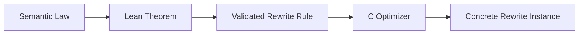
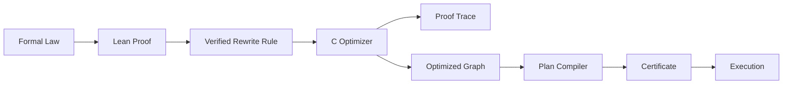

# 第六章：Graph 的可信语义——从 Semantic Law 到 Verified Rewrite、Certificate 与 Refinement


> **本章路线**
>
> 前十章已经出现了三种不同的“正确”：
>
> ~~~text
> C code works on tested examples
> semantic transformation is mathematically valid
> compiled/runtime artifact still corresponds to the proven model
> ~~~
>
> 本章不再泛泛讨论 Lean，而是把全书 trusted boundary 拆成明确层次，并用三个已经存在的真实案例做闭环：
>
> 1. **Idempotent Map rewrite**：Semantic Law → Lean theorem → optimizer trace；
> 2. **Reactive WAIT/Demand**：small-step theorem → Subscription runtime invariant；
> 3. **Machine SmallStep**：determinism/type preservation → Machine build/commit boundary。
>
> 然后再把 Manifest、Proof Trace、Certificate、C differential tests、ABI tests、benchmark 放到各自正确的位置。

上一章讨论了一个核心原则：

```text
Rich Control Plane
        ↓
Simple Execution Plane
```

也就是说，我们愿意在执行之前做更多事情：

```text
Type Validation
Signature Resolution
Graph Analysis
Optimization
Plan Compilation
Parallel Eligibility
```

换取真正执行时更简单的：

```text
load
call
branch
store
```

但这个方向越往前推进，一个新的问题就越重要：

> **如果 Control Plane 开始主动改变程序，我们凭什么相信这些改变没有破坏程序语义？**

例如：

```text
Map(f)
 ↓
Map(f)
```

如果 optimizer 删除一个 `Map(f)`，最终变成：

```text
Map(f)
```

这已经不只是：

```text
“程序跑得快一点”
```

而是：

> **系统主动把用户写的程序换成了另一个程序。**

再例如：

```text
Sequential Reduce
```

被改成：

```text
Parallel Reduce
```

执行顺序发生了变化。

如果某个函数实际上不满足：

```text
ASSOCIATIVE
```

结果就可能不同。

因此，当系统开始拥有：

```text
Rewrite
Fusion
Parallelization
Lowering
```

这些能力以后，仅仅依靠：

```text
“看起来合理”
```

已经不够。

这也是 Lean 真正开始承担更重要角色的地方。

---

## 1. 为什么测试不能完全解决这个问题

测试当然仍然非常重要。

例如我们可以测试：

```c
assert(run(original, input1) == run(optimized, input1));
assert(run(original, input2) == run(optimized, input2));
assert(run(original, input3) == run(optimized, input3));
```

如果发现不同，说明 optimizer 显然有 bug。

但如果：

```text
1000 个测试全部相同
```

我们仍然只能说明：

```text
这 1000 个输入上没有发现问题
```

不能说明：

```text
对于所有可能输入
优化前后都具有相同语义
```

尤其是某些 rewrite：

```text
依赖函数的数学性质
```

时，问题更明显。

例如：

```text
f(f(x))
```

什么时候可以变成：

```text
f(x)
```

测试可以找反例。

但真正的规则是：

```text
∀x, f(f(x)) = f(x)
```

这已经天然是一个数学命题。

---

## 2. Metadata Claim 不能直接当成 Proof

前面 CMeta 已经允许 Callable 带：

```text
Effects
Properties
```

例如：

```text
PURE
DETERMINISTIC
TOTAL
IDEMPOTENT
ASSOCIATIVE
```

这些 metadata 非常有价值。

Optimizer 可以通过它们快速找到：

```text
可能允许优化的候选
```

例如：

```text
if callable.properties contains IDEMPOTENT
    candidate for duplicate-map elimination
```

但这里必须保持一个非常严格的边界：

> **Metadata 是声明，不是证明。**

程序员可以错误地写：

```text
increment
    IDEMPOTENT
```

但：

```text
increment(increment(1))
=
3
```

而：

```text
increment(1)
=
2
```

显然：

```text
3 != 2
```

所以：

```text
IDEMPOTENT bit
```

只能表示：

```text
程序声明这个函数具有该性质
```

而不能自动推出：

```text
数学上真的成立
```

当前 formal rewrite 设计也明确区分 CMeta property 与真正的 semantic law；`IDEMPOTENT` metadata 本身不足以完成形式证明，还需要独立的 `IdempotentLaw`。

---

## 3. Semantic Law 才是真正的数学条件

例如 Idempotent 的真正含义是：

```text
∀x, f(f(x)) = f(x)
```

Associative 的真正含义是：

```text
∀a b c,

f(f(a,b),c)
=
f(a,f(b,c))
```

Identity 则可能是：

```text
∀x,

f(identity, x) = x
```

这些都不是：

```text
flag
```

而是：

```text
Law
```

因此可以把系统中的语义信息区分成三个层次：

```text
Metadata

程序声称什么


Semantic Law

这个性质在数学上是什么意思


Proof

某条 transformation 在这些 law 下为什么保持语义
```

这三个层次不能混在一起。

---

## 4. Lean 首先应该证明“规则”，而不是证明每一次程序运行

一个很容易走向极端的想法是：

> 既然用了 Lean，是不是应该把整个 C Runtime 都搬进 Lean，然后每次运行都经过 proof？

这显然会让工程变得非常沉重。

更实际的边界是：

```text
Lean
    证明通用规则

C
    在具体程序上应用规则
```

例如 Lean 证明：

```text
对于任意满足 IdempotentLaw 的 f

Map(f) ; Map(f)

与

Map(f)

具有相同 observable result
```

这是：

```text
General Rewrite Theorem
```

C optimizer 看到某个具体：

```text
normalize_user
```

满足对应 admission 条件后：

```text
应用这个规则
```

所以分工是：



这样形式化系统和生产 runtime 的边界保持清楚。

---

## 5. 为什么必须先定义“程序的可观察语义”

要证明两个 Graph 等价，首先必须回答：

> **什么叫“等价”？**

例如：

```text
Graph A
```

和：

```text
Graph B
```

内部执行步骤不同并没有关系。

真正关心的是：

```text
用户最终能观察到什么
```

例如 Stream 可能有：

```text
Values
Terminal Status
Error
```

所以可以定义：

```text
StreamResult
```

包含完整可观察结果。

然后证明：

```text
run(GraphA, input)
=
run(GraphB, input)
```

不是要求：

```text
每一步内部状态都完全一样
```

而是要求：

```text
最终 observable behavior 一样
```

当前 Lean rewrite formalization 就针对完整可观察的 `StreamResult` 建立 preservation theorem。

---

## 6. 这是 Compiler Correctness 的基本思路

传统 compiler optimization 也不会要求：

```text
优化前后的机器指令一模一样
```

否则优化本身就没有意义。

真正需要的是：

```text
Source Program
```

和：

```text
Optimized Program
```

具有相同：

```text
Observable Semantics
```

所以 CFlow 的 rewrite proof 本质上也遵循：

```text
Program Transformation
        ↓
Semantic Preservation
```

这让 CFlow optimizer 从普通：

```text
graph rewrite code
```

逐渐接近：

```text
verified transformation
```

---

## 7. 一个完整 Rewrite Rule 可以分成四层

例如：

```text
Duplicate Idempotent Map Elimination
```

可以拆成：

### 第一层：Graph Pattern

```text
Map(f)
 ↓
Map(f)
```

这是：

```text
syntactic candidate
```

---

### 第二层：Metadata Admission

要求：

```text
same callable identity
compatible types
IDEMPOTENT property
其他必要 effects/properties
```

这是：

```text
C-side fast check
```

---

### 第三层：Semantic Law

真正要求：

```text
∀x, f(f(x)) = f(x)
```

这是：

```text
mathematical assumption
```

---

### 第四层：Preservation Theorem

证明：

```text
run(Map(f);Map(f))
=
run(Map(f))
```

这是：

```text
formal guarantee
```

于是：

```text
Pattern
+
Admission
+
Law
+
Theorem
```

共同定义一条可信 rewrite。

---

## 8. 这能避免“Property 驱动的危险优化”

如果 optimizer 只是：

```c
if (props & CMETA_PROP_IDEMPOTENT)
    remove_duplicate_map();
```

那么整个正确性最终依赖：

```text
一个 bit 没有被错误设置
```

这当然很脆弱。

更好的工程模式应该是：

```text
Property
    用于候选筛选

Verified Rule
    定义什么 transformation 合法

Certificate / Trace
    记录这次实际应用
```

这样即使无法证明某个具体用户 callback 的数学性质，至少：

```text
optimizer rule 本身
```

是经过证明的。

这已经建立了一个非常有价值的可信边界。

---

## 9. 形式化不只可以用于 Optimizer

Lean 最早也可以用于更简单、更有限的事情：

```text
Type Universe
Signature Universe
Operator Policy
Machine Schema
```

这些内容具有一个共同特点：

```text
有限
结构化
关系明确
```

所以非常适合先在 Lean 中定义：

```text
authoritative model
```

然后生成：

```text
C manifest
```

目前 CMeta 的 built-in finite signature universe 就有对应 Lean 模型，并生成 checked `builtin_signature_manifest.h`；普通 C build 不需要运行 Lean。

---

## 10. Manifest 模式解决的是“重复事实源”问题

假设：

```text
C header
```

维护一份：

```text
允许的 callback signature
```

而 Lean 又维护一份：

```text
允许的 callback signature
```

那么迟早会产生：

```text
C version != Lean version
```

这就重新回到了第一章的根本问题：

> **同一个事实维护了两份。**

所以更合理的方向是：

```text
Authoritative Formal Definition
        ↓
Generate
        ↓
C Manifest
```

而不是：

```text
Lean manually mirrors C
```

这再次延续整个项目最早的原则：

```text
One Fact
    ↓
Many Uses
```

---

## 11. Lean 因此也是一种更高层的 Code Generator

早期：

```text
X-Macro
```

做的是：

```text
一份 row
    ↓
多个 C declaration
```

后来：

```text
Schema
```

做的是：

```text
结构化事实
    ↓
多个 Meta artifact
```

现在 Lean 可以进一步：

```text
Formal Relation
    ↓
Validated Manifest
    ↓
C Header
```

可以看到整个历史其实非常连续：

```text
X-Macro Generation
        ↓
Schema Generation
        ↓
Type-aware Generation
        ↓
Proof-driven Generation
```

Lean 并不是突然加入的一个完全不同方向。

它只是把：

```text
生成前的“事实”
```

提升到了：

```text
可形式化验证的事实
```

层次。

---

## 12. 为什么普通 C Build 不应该依赖 Lean

即使 Lean 很有价值，也不应该让普通使用者：

```text
cmake ..
make
```

的时候必须：

```text
安装 Lean
编译 theorem
生成 manifest
```

否则一个本来应该简单的 C library：

```text
构建复杂度
```

会迅速上升。

更合理的是：

```text
Development / Verification Pipeline

Lean model
   ↓
prove / generate
   ↓
checked generated headers
   ↓
commit
```

然后普通用户只看到：

```text
C headers
C sources
```

所以：

```text
普通 Build
```

仍然是：

```text
C Compiler
```

这保持了整个系统最重要的工程属性之一：

> **Formal tooling 增强开发可信度，而不是污染普通消费者构建路径。**

---

## 13. Operator Policy 也非常适合这种方式

前面 Graph 中存在：

```text
Map
Filter
Reduce
FlatMap
```

等 operator。

但并不是所有：

```text
CMeta Signature
```

都适合所有 operator。

例如：

```text
Filter
```

要求：

```text
T -> bool
```

而：

```text
Map
```

可能接受：

```text
T -> U
```

所以存在两个不同 universe：

```text
CMeta
    定义全局有限 Signature Universe

CFlow
    定义每个 Operator 接受哪些 Signature
```

这是：

```text
global capability
```

和：

```text
local policy
```

的区别。

本版 CFlow 实现 就通过 per-operator admitted relations 建立 builtin operator policy，并由 Lean 验证后生成 `builtin_operator_policy.h`。

---

## 14. 这让 CMeta 和 CFlow 的责任边界更加清楚

CMeta 可以说：

```text
系统存在：

int -> long
User -> bool
long × long -> long
```

但它不应该决定：

```text
哪个 signature 可以作为 Filter
```

因为这是：

```text
CFlow Operator Semantic
```

所以：

```text
CMeta
    owns relation universe

CFlow
    owns operator admission policy
```

Lean 则可以分别验证：

```text
Universe 本身是否正确

Policy 是否只引用 Universe 中存在的 relation
```

这是一种很干净的模块化 formal boundary。

---

## 15. Machine Schema 同样可以进入 Formal Model

State Machine 中已经有：

```text
State
Event
Transition
WAIT
Terminal
```

这些本身就是非常典型的：

```text
transition system
```

因此可以在 Lean 中定义：

```text
Machine Configuration
Event
Small Step
```

例如：

```text
(State, Event)
    →
NextState
```

或者复杂一点：

```text
Running
Waiting
Done
Error
```

当前 `formal/cmeta_cflow_calculus` 已经覆盖 Types、Effects、Properties、Ownership、Flow syntax、WAIT/Demand/Terminal、Machine small-step 和 rewrite semantics。

这让整个 formal model 不只是：

```text
compile-time type checker
```

而逐渐覆盖：

```text
runtime semantics
```

---

## 16. Small-step Semantics 为什么重要

如果只写：

```text
run(machine, events)
=
final_state
```

很难描述：

```text
WAIT
Wake
Cancel
Intermediate Transition
```

这些行为。

Small-step 更接近：

```text
Configuration₀
    ↓ one step
Configuration₁
    ↓ one step
Configuration₂
```

例如：

```text
Running
    → WAIT
```

再：

```text
Waiting
    → Wake
    → Running
```

这种模型特别适合表达异步执行。

因此可以证明：

```text
某一步之后仍然满足 invariant
```

而不是只能看最终结果。

---

## 17. Runtime 的目标变成“Refine Formal Semantics”

到了这里，C runtime 和 Lean model 的关系也可以更准确地描述。

不是：

```text
Lean program
    翻译成
C program
```

而是：

```text
Lean Semantics
    定义允许的行为

C Runtime
    实现这些行为
```

也就是说希望建立：

```text
Runtime Step
    refines
Formal Step
```

例如：

```text
CFlow runtime:
    cflow_step_kind = WAIT
```

应该对应：

```text
Lean:
    Waiting transition
```

Machine transition 成功：

```text
old state
event
new state
```

应该对应：

```text
formal small-step relation
```

这比“Lean 生成全部 C Runtime”更加实际。

---

## 18. Refinement 是连接 Proof 和 Implementation 的关键词

形式证明最容易陷入一个问题：

```text
Lean 中证明的东西很好
但 C 实现是否真的做的是同一件事？
```

所以必须明确：

```text
Model
```

与：

```text
Implementation
```

之间的 mapping。

例如：

```text
Lean:
    Step.value

C:
    CFLOW_STEP_VALUE
```

```text
Lean:
    Waiting

C:
    CFLOW_STEP_WAIT
```

```text
Lean:
    Terminal.error

C:
    CFLOW_STEP_ERROR
```

这种结构对应关系越明确，formal proof 才越容易实际约束实现。

---

## 19. Certificate 是另一种更轻的 Refinement Bridge

不是所有东西都需要：

```text
完整 machine-checked C refinement proof
```

工程上可以使用更轻的手段。

例如：

```text
Plan Certificate
```

记录：

```text
Graph Version
Fingerprint
Instruction
Callable
Input Type
Output Type
Effects
Properties
```

然后运行一个：

```text
C-side checker
```

验证：

```text
这个 Plan 是否仍然符合 normalized Graph
```

当前 `certificate.h` 就提供这种 runtime-checkable plan certificate。

因此形成一种分层保证：

```text
Lean
    证明通用规则

Generator
    生成有限 manifest

C Checker
    检查具体 artifact

Runtime
    执行已经批准的 artifact
```

---

## 20. 为什么 Certificate 比“相信 Compiler”更有价值

假设：

```text
Plan Compiler
```

有 bug。

它把：

```text
Map<int,long>
```

错误地生成成：

```text
double handler
```

如果执行阶段直接相信 Plan：

```text
可能产生 memory corruption
```

但如果 Plan 必须通过：

```text
Certificate Check
```

就有机会在 admission 阶段发现：

```text
input/output type 不一致
callable 不一致
instruction 不一致
```

这并不能证明所有 implementation bug 都不存在。

但它增加了一层：

```text
independent validation boundary
```

这在系统设计里非常有价值。

---

## 21. Proof Trace 与 Certificate 解决的是两个不同问题

两者很容易混淆。

**Proof Trace**

回答：

```text
为什么这个 Graph transformation 被执行？
```

例如：

```text
Rule = IdempotentMapElimination
```

它关注：

```text
Optimization History
```

---

**Certificate**

回答：

```text
这个最终 Plan 是否仍然对应那个 Graph？
```

它关注：

```text
Artifact Consistency
```

所以：

```text
Trace
    解释 transformation

Certificate
    验证 execution artifact
```

二者共同让 Control Plane 更容易审计。

---

## 22. 这形成了一条完整可信链

可以把整个过程表示成：



这条链条中，每一层承担不同责任。

没有要求：

```text
Lean 直接执行生产程序
```

也没有要求：

```text
C runtime 完全没有动态检查
```

而是逐层建立：

```text
trust boundary
```

---

## 23. 从可信链进入证据矩阵

前面已经建立了本章真正需要的 trusted chain：Metadata Claim 负责声明候选事实，Semantic Law 给出数学条件，Lean theorem 证明有限规则，C optimizer 记录 concrete rewrite，Plan/Certificate 再把 execution artifact 绑定回获准的 IR。

出版版不再在这里重复展开“为什么要 formalize、Lean 应该证明多少、它和测试是什么关系”这些已经由前文回答的问题。后半部分直接用证据矩阵和三个 case study 检查每一层到底能证明什么、不能证明什么。

边界保持严格：Lean theorem 不自动证明任意 C 实现已经 refine 该模型，也不证明 ABI、memory safety、OS liveness 或 benchmark 数字；普通 C consumer build 仍然不依赖 Lean。

---

## 24. Trusted Boundary Matrix：不同证据到底证明什么

到了这一章，最容易犯的错误已经不是“没有证明”。

而是：

> **拿一种证据去证明它本来证明不了的事情。**

可以先建立一张全书通用矩阵。

| 证据 | 主要回答 | 不能单独证明 |
|---|---|---|
| Metadata claim | 这个实现声明了什么 property/capability | 声明在数学上真的成立 |
| Compile-time check | C 类型/宏/声明是否满足当前 compiler contract | 运行时语义等价 |
| Lean theorem | 在 formal model/premise 下某关系是否成立 | 任意 C 实现自动 refine 该模型 |
| Generated manifest | 已验证有限事实怎样进入普通 C build | C runtime 的所有行为正确 |
| Optimizer proof trace | 这一次 concrete rewrite 应用了哪些已知 rule | rule 自己是否正确 |
| Certificate / witness | execution artifact 是否绑定到特定 approved IR | OS/runtime 永远无 bug |
| Differential test | 几个真实 implementation path 的 observation 是否一致 | 对所有输入的数学证明 |
| ABI/install test | 外部 consumer 是否能通过真实 package/link boundary | semantic law |
| Sanitizer/stress | memory/concurrency bug 是否在覆盖场景中暴露 | absence of all bugs |
| Benchmark | 指定 workload/platform 上的 cost | semantic correctness |

这张表是整本书最重要的“不要过度声称”规则之一。

---

## 25. Case Study A：Idempotent Map——从 Property Claim 到 Verified Rewrite

第七章将继续使用：

~~~text
Map(clamp)
Map(clamp)
~~~

希望重写为：

~~~text
Map(clamp)
~~~

这个例子可以把整条 trusted chain 走完整。

## 25.1 Claim

C metadata 可以声明：

~~~text
IDEMPOTENT
~~~

它只表示：

> 这个 callable 被 admission 层声明为可参与 idempotent rule。

如果 claim 是手写的，它本身不是 proof。

## 25.2 Semantic Law

真正需要的是：

~~~text
forall x,
clamp (clamp x) = clamp x
~~~

这才是 rewrite premise。

## 25.3 Rule theorem

当前 formal Rewrite proof 已经存在：

~~~text
map_idempotent_elimination
~~~

它的直接 premise 不是一个裸的 property bit，而是：

~~~text
IdempotentEndomapPremises Γ ty
~~~

其中包含被信任/建模的 callable meaning 以及真正的 idempotent law。更一般的：

~~~text
certified_rewrite_preserves_observations
~~~

则对有限组合的 certified rewrites 建立 observation preservation。

这类 theorem 回答：

> 如果 callable meaning 与对应 semantic law 已经进入 theorem premise，那么删除重复 Map preserve observable stream semantics。

注意 theorem 证明的是 rule。

它不是在每一次运行时重新证明 concrete C function。

## 25.4 Concrete rewrite instance

当前 C optimizer 的 property rewrite 可以产生稳定 rule id：

~~~text
IDEMPOTENT_MAP_ELIMINATION
~~~

并在 proof trace 中记录：

~~~text
source subgraph
retained node/callable
removed node/callable
~~~

Trace 回答：

> 这一次 optimized Graph 具体在哪个 source coordinate 应用了哪个 rule？

所以：

~~~text
Lean theorem
    = proof of rule

C trace
    = record of rule instance
~~~

## 25.5 Trace checker / AOT matcher

后续 checker 可以验证：

~~~text
trace bound to exact source Graph/version
trace bound to exact optimized Graph/version
rule id supported
source/target coordinates match
final optimized structure matches expected Stage IR
~~~

于是 trusted path 是：

~~~text
Semantic Law
    ↓
Lean rule theorem
    ↓
C optimizer applies rule
    ↓
Proof Trace
    ↓
Trace/IR checker
~~~

这比：

~~~text
property bit set
    ↓
optimizer deletes node
~~~

强很多。

---

## 26. Case Study B：Reactive——Proof 直接改变 Runtime State Machine

Reactive 是另一种 proof 使用方式。

它不是 optimizer rewrite，而是执行协议。

第八章的 Reactive 执行协议会继续使用当前 theorem：

~~~text
step_value_decrements_demand
zero_demand_no_value
source_value_preserves_demand
wait_arm_wake_preserves_source
signal_before_arm_is_ready
signal_concurrent_with_arm_is_ready
arm_issues_fresh_token
terminal_no_step
cancel_unarms_and_terminates
~~~

这些 theorem 的价值不是：

~~~text
“我们给 Reactive 加了形式证明”
~~~

而是它们直接回答 API/runtime design 的危险问题。

## 26.1 Demand 在哪里消费

theorem：

~~~text
source_value_preserves_demand
~~~

配合：

~~~text
step_value_decrements_demand
~~~

把设计锁定为：

~~~text
Publisher VALUE
    does not consume downstream demand

downstream Emit
    consumes exactly one demand
~~~

这不是实现风格。

它决定 Filter / FlatMap 等 cardinality-changing operator 是否能正确 backpressure。

## 26.2 WAIT 与 Arm 必须分离

如果模型只有：

~~~text
WAITING : Bool
~~~

很难精确描述 signal-before-arm race。

formal model迫使设计出现：

~~~text
READY
PENDING_ARM(waitable)
SUSPENDED(waitable, generation)
~~~

然后 theorem：

~~~text
signal_before_arm_is_ready
signal_concurrent_with_arm_is_ready
~~~

明确告诉 C runtime：

> arm race 中已经被观察到的 readiness 不能丢成永久 suspension。

所以 Lean 在这里不是“验证既有设计”。

它实际帮助设计了：

~~~text
wait registration state
generation token
wake semantics
~~~

## 26.3 C implementation refinement

真正 C runtime 还需要：

~~~text
mutex/atomic
callback lifetime
waitable arm/cancel
scheduler admission
driver readiness
~~~

Lean theorem 本身不证明这些代码没有 race。

因此 bridge 必须是：

~~~text
formal state transition
    ↓
documented C linearization point
    ↓
race-focused tests / sanitizer
~~~

例如 readiness test：

~~~text
cancel waits until old callback waker is quiescent
~~~

就是 implementation refinement evidence，而不是 theorem 的替代品。

---

## 27. Case Study C：Machine——Proof 把“状态机设计”变成 Typed Program Contract

第十章的 Machine 提供第三种用法。

现有 theorem 包括：

~~~text
smallStep_deterministic
smallStep_requires_event_typing
step_consumes_once
step_preserves_state_typing
terminal_no_step
terminal_state_no_step
applyTransition_action_failure
~~~

## 27.1 Build-time facts 成为 theorem premise

Machine.Valid 已经包含：

~~~text
IDs unique
references valid
event schema valid
guard/action types aligned
priority keys unique
all states reachable
declarations used
terminal/source rules valid
~~~

因此 SmallStep proof 不需要在每次 transition 时重复处理所有 structural invalidity。

这就是：

~~~text
control-plane validation
    ↓
stronger theorem premise
    ↓
simpler runtime
~~~

## 27.2 Determinism 反过来约束 transition selection

如果 C builder 允许：

~~~text
same state
same event
same priority
two enabled transitions
~~~

而 runtime“按数组顺序拿第一个”，那么 formal smallStep_deterministic 的设计意图就被破坏。

所以 proof obligation 反过来推动：

~~~text
ambiguous transition
    → build failure
~~~

这就是“Lean 帮助设计 API”的直接例子。

## 27.3 State typing preservation 反过来要求 staged commit

theorem：

~~~text
step_preserves_state_typing
~~~

要求成功 transition 后 target state value 仍匹配 target declaration。

最自然的 C implementation不是：

~~~text
mutate current bytes while action runs
~~~

而是：

~~~text
action constructs staged target
validate target/output
atomic commit
~~~

这样 failure 才能保持旧 state。

所以：

> **Proof-friendly design 往往也是更清楚的 transactional C design。**

---

## 28. Manifest：Lean 怎样进入普通 C，而不进入普通 C Build

形式化如果要求每个应用 consumer 都安装 Lean，工程边界就失败了。

本版 Salts 快照 已经采用 checked-in generated artifact 模式。

## 28.1 Builtin Signature Manifest

Lean 验证有限 builtin type/signature relation，然后生成：

~~~text
cmeta/include/cmeta/generated/
    builtin_signature_manifest.h
~~~

普通 C/C++ build：

~~~text
includes checked-in header
does not run Lean
~~~

CI / semantic developer workflow 才运行：

~~~text
cmeta-signature-gen --check
~~~

确保：

~~~text
formal source
    ↔
checked-in C artifact
~~~

没有漂移。

## 28.2 Builtin Operator Policy

同样，CFlow operator policy 的有限 relation 由 formal package 检查，并生成：

~~~text
cflow/include/cflow/generated/
    builtin_operator_policy.h
~~~

这样 C optimizer/runtime 消费普通 C table/header，而不是在 hot path 调 theorem prover。

## 28.3 Machine Schema

Machine state/action enum schema 也有：

~~~text
cflow-machine-schema-gen
    --write / --check
~~~

生成：

~~~text
cflow/include/cflow/generated/
    machine_schema.h
~~~

这形成一个很清楚的边界：

~~~text
Lean
    owns semantic source / proof
      ↓
generator
      ↓
checked-in C artifact
      ↓
ordinary C compilation
~~~

## 28.4 Generator 也是 trusted bridge

这里必须诚实：

如果 theorem 正确，但 generator 把结果错误地翻译成 C header，普通 C build仍然可能错误。

因此 trusted bridge 中至少包括：

~~~text
formal definitions/theorems
generator mapping
generated-artifact check
C consumer interpretation
~~~

所以 generated header应该：

- 尽量简单；
- 可读；
- diff-friendly；
- CI 可重生成/check；
- 不允许手工修改成为第二事实源。

---

## 29. Certificate 与 Proof Trace：两个不同的 Runtime Bridge

这两个概念经常被混在一起。

## 29.1 Proof Trace

回答：

> optimized Graph 为什么从 source Graph 变成现在这样？

它记录：

~~~text
rewrite rule id
source coordinate
retained/removed node
callable coordinate
source/output Graph binding
~~~

Trace 是：

~~~text
Transformation Witness
~~~

## 29.2 Certificate

回答：

> 这个 Plan / execution path 是否仍然对应被批准的 normalized/optimized semantic program？

它记录：

~~~text
Graph version/fingerprint
certified opcode rows
types
callables
effects/properties
execution path
ordering
required capabilities
~~~

Certificate 是：

~~~text
Execution Artifact Witness
~~~

因此可信链不是二选一，而是：

~~~text
Source Graph
    ↓
Optimizer
    ↓
Proof Trace
    ↓
Optimized Graph
    ↓
Plan Compile
    ↓
Certificate
    ↓
Execution
~~~

如果将来需要更强 assurance，可以分别加强：

~~~text
trace checker
certificate checker
artifact identity
generator provenance
~~~

而不需要把整个 runtime 改造成 theorem prover。

---

## 30. Formal Trusted Base 与 Execution Trusted Base 必须分开

讨论“trusted computing base”时必须指定层次。

## 30.1 Formal proof trusted base

至少包括：

~~~text
formal definitions
theorem statements/premises
Lean checker/kernel/toolchain assumptions
semantic model itself
~~~

一个 theorem 只能相对于它的 model/premises 正确。

如果 observable semantics 定义错了：

~~~text
proof can be perfectly valid
but prove the wrong thing
~~~

所以 specification review 与 theorem proof 同样重要。

## 30.2 Bridge trusted base

包括：

~~~text
generators
rule-id mapping
trace construction/checking
certificate construction/checking
type/callable identity mapping
~~~

这些把 formal world 连到 C artifact。

## 30.3 Execution trusted base

包括：

~~~text
C compiler/linker
C implementation
allocator/thread primitives
OS/runtime
hardware
borrowed callback/user code
~~~

只有其中被 formalized/refined 的部分，才能获得对应 theorem 的 guarantee。

其他部分需要：

~~~text
tests
sanitizers
ABI qualification
stress
platform CI
benchmark
~~~

## 30.4 External liveness assumptions

像：

~~~text
OS eventually schedules worker
socket eventually becomes ready
device eventually completes
user callback eventually returns
~~~

通常是环境 assumption，而不是 CMeta/CFlow theorem。

书里必须显式标注这种假设。

这样才不会把 safety proof 写成“系统永远不会卡住”的过度承诺。

---

## 31. Proof / Test / Runtime Check 的协作方式

一个成熟 feature 不应该问：

~~~text
proof 还是 test？
~~~

而应该问：

> **这条 claim 分别在哪几个层次需要证据？**

以 idempotent rewrite 为例：

~~~text
Semantic law
    → Lean theorem

Concrete optimizer event
    → proof trace

Graph/optimized binding
    → trace checker

Plan binding
    → certificate

C implementation regression
    → differential tests

memory/lifetime
    → sanitizer

performance benefit
    → benchmark
~~~

以 Reactive demand 为例：

~~~text
demand mathematical invariant
    → Lean

runtime state mapping
    → conformance tests

wake/cancel race
    → stress/readiness tests

scheduler capacity behavior
    → bounded protocol tests

latency/throughput
    → benchmark
~~~

因此真正专业的 verification stack 是：

~~~text
Formal proof
+
Generated facts
+
Runtime admission
+
Differential testing
+
Memory/concurrency testing
+
ABI/platform qualification
+
Measurement
~~~

不是其中任意一个单独称霸。

---

## 32. What We Learned

本章真正建立的是全书的可信方法，而不是“Lean 章节”。

现在可以把证据链压缩成：

~~~text
Claim
    ↓
Semantic Definition
    ↓
Proof Obligation
    ↓
Lean Theorem
    ↓
Generated/Registered Rule
    ↓
Concrete Trace
    ↓
Artifact Certificate
    ↓
C Runtime
    ↓
Differential / Sanitizer / ABI Evidence
    ↓
Benchmark
~~~

但不是每个 feature 都必须经过所有层。

原则是：

> **用最适合的证据证明对应层次的 claim。**

三个真实 case 已经展示不同用法：

~~~text
Optimizer:
    theorem licenses transformation

Reactive:
    theorem shapes execution state machine

Machine:
    theorem constrains build/commit semantics
~~~

而 Manifest 又展示：

~~~text
formal knowledge
    → checked-in ordinary C artifact
~~~

这使 Lean 真正成为：

> **Modern C control/trust plane 的设计与验证工具，而不是一个新的 runtime dependency。**

下一章重新回到最现实的 C 工程问题：

~~~text
这些 semantic identities、generated artifacts、public structs、
callables、descriptors、vtable、status codes
怎样跨 Translation Unit、shared library、install/export 和 compiler boundary？
~~~

只有这一步成立，前面的设计才不是单仓库实验。


