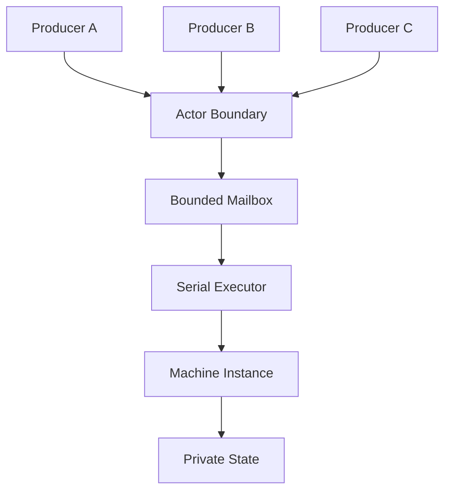
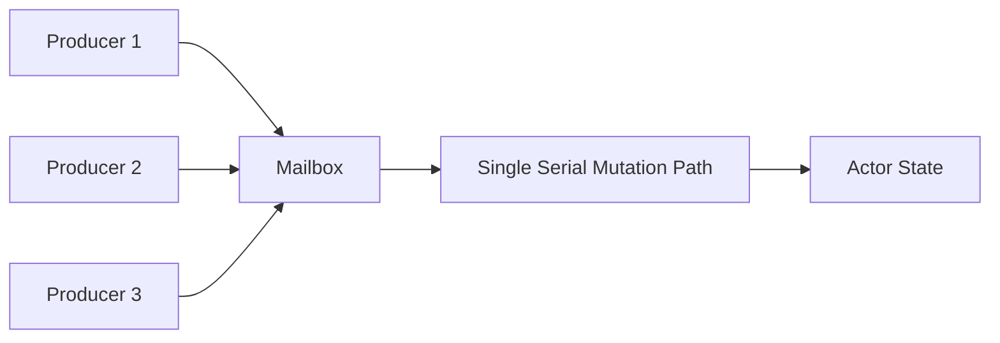
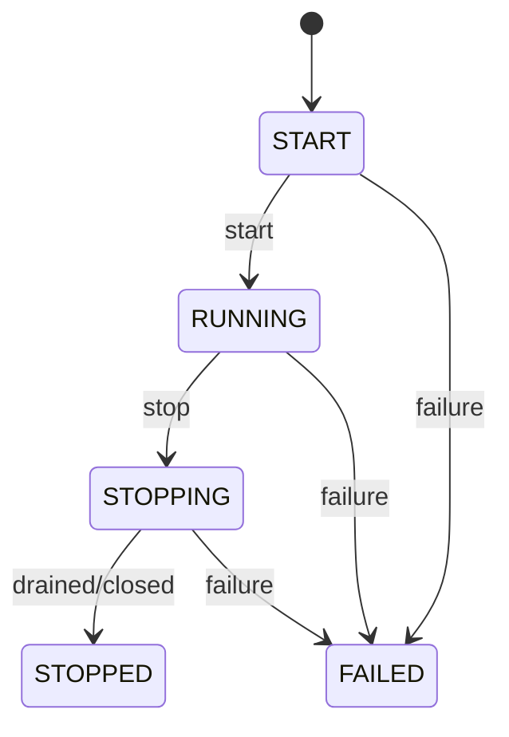
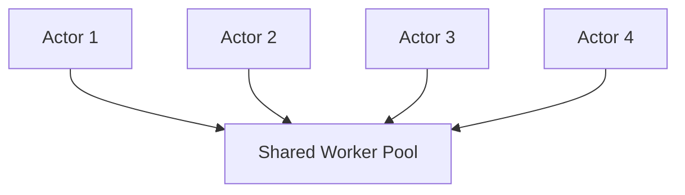

# 第十一章：从 State Machine 到 Actor——用 Mailbox、串行执行与生命周期组合并发对象


> **本章路线**
>
> 第十章已经把连接状态机固定成一个可验证的 Machine。本章不增加第二套 transition semantics，而是在 Machine 外面增加并发对象真正需要的 shell：
>
> ~~~text
> Immutable Machine
>       ↓
> Machine Instance
>       +
> Bounded Typed Mailbox
>       +
> Serial Executor
>       +
> Concurrent Scheduler
>       +
> Actor Lifecycle
>       +
> Producer References
>       ↓
> Actor
> ~~~
>
> canonical control program仍然是：
>
> ~~~text
> Disconnected --Connect--------> Connecting
> Connecting   --ConnectedEvent-> Connected
> Connecting   --Timeout--------> Disconnected
> Connected    --Disconnect-----> Closing
> Closing      --ClosedEvent----> Closed
> ~~~
>
> Actor 只负责让多个 producer 能够安全地把 Typed Event 送到同一个 serialized mutable owner，并为这段长期执行增加 identity、lifecycle、stale reference 和 failure boundary。

上一章做到 State Machine 以后，我们已经拥有一个很完整的有状态执行模型：

```text
Typed State
+
Typed Event
+
Guard
+
Action
+
Transition
+
Serial Executor
```

Machine Instance 拥有自己的：

```text
Current State
```

外部通过：

```text
Event
```

驱动它变化。

与此同时，前面已经解决了几个非常关键的问题：

```text
Executor
    负责执行

Serial Executor
    保证单一 mutation owner

Bounded Mailbox
    负责有界 admission

Scheduler
    负责时间与异步推进

WAIT / Wake
    负责暂停与恢复
```

做到这里以后，一个新的发现其实已经非常明显。

如果一个 Machine：

```text
拥有私有 State
```

外部不能直接修改它；

所有输入都通过：

```text
Message / Event
```

进入；

多个线程可以同时发送消息；

但真正修改 State 的 Transition 始终：

```text
Serialized
```

那么它实际上已经非常接近：

**Actor**

所以 Actor 并不是在这个阶段突然决定重新设计的一套并发框架。

更自然的发展路径是：

```text
Machine
+
Mailbox
+
Serial Execution
+
Concurrent Producers
+
Lifecycle
    ↓
Actor
```

---

## 1. Actor 真正重要的并不是“线程”

很多人第一次接触 Actor Model 时，很容易把它理解成：

```text
一个 Actor
=
一个对象
+
一个 Mailbox
+
一个线程
```

但真正重要的语义其实不是：

```text
Thread
```

而是：

> **Actor 的私有状态只能通过自己的消息处理序列进行修改。**

也就是：

```text
Private State
+
Message Passing
+
Serialized State Mutation
```

至于：

```text
谁真正执行这些消息
```

是另外一层问题。

这正好是前面：

```text
Machine
```

和：

```text
Executor
```

分离以后已经解决的问题。

因此 Actor 完全没有必要：

```text
一个 Actor 创建一个 OS Thread
```

它只需要拥有：

```text
逻辑上的串行执行权
```

---

## 2. 为什么 State Machine 已经提供了 Actor 最核心的东西

一个 Machine Instance 本身已经拥有：

```text
Private Mutable State
```

例如：

```text
AccountState
ConnectionState
SessionState
WorkerState
```

外部不能直接：

```text
state->field = ...
```

而是通过：

```text
Event
```

触发：

```text
Transition
```

例如：

```text
BalanceState
+
DepositEvent
    ↓
Transition
    ↓
New BalanceState
```

这已经符合 Actor 中最重要的一条原则：

> **状态变化由消息驱动，而不是由外部线程直接共享修改。**

如果再允许：

```text
多个 Producer
```

并发发送 Event，就几乎完成了 Actor 的主要执行语义。

---

## 3. Actor 可以看成 Machine 的一个 Lifecycle / Admission Boundary

因此更准确的定义不是：

```text
Actor = another runtime
```

而是：

```text
Actor
    =
Machine Instance
+
Bounded Mailbox
+
Serial Execution
+
Producer References
+
Lifecycle
+
Failure Boundary
```

本版 CFlow 实现 的 Actor 设计就是沿这个方向建立：Actor 本身是一个 lifecycle/admission boundary，内部可以组合 Machine Instance 或 Statechart Instance，并拥有 identity Graph 与单一 Subscription，而不是另外建立一套 actor-specific state-machine runtime。

可以表示成：



Actor 真正新增的是外围边界。

不是重新发明 Transition。

---

## 4. Message 和 Event 可以使用同一个类型模型

Actor 文献里通常说：

```text
Message
```

State Machine 中则通常说：

```text
Event
```

但在这里二者没有必要形成两套基础设施。

一个 Message 本质上可以是：

```text
Typed Event
```

例如：

```text
Deposit {
    amount : Money
}

Withdraw {
    amount : Money
}

CloseAccount {
    reason : CloseReason
}
```

所以 Actor mailbox 里存储的并不是：

```text
void *
```

而可以明确知道：

```text
Event ID
Payload Type
Payload Value
```

这样 Machine 在真正处理之前就可以检查：

```text
这个 Actor 是否接受这种消息？
Payload 类型是否正确？
```

---

## 5. Send 的第一阶段应该只是 Admission

假设：

```c
actor_send(actor, event);
```

最简单的实现方式是：

```text
直接执行 Event
```

但这会产生很多问题。

例如调用者可能来自：

```text
网络线程
UI 线程
Worker 线程
Timer Callback
其他 Actor
```

如果 `send()` 直接进入 Transition：

```text
Producer Thread
    ↓
Guard
    ↓
Action
    ↓
State Mutation
```

那么 Actor 的执行上下文就变得不可预测。

更合理的是把：

```text
send
```

拆成：

```text
Admission
```

和：

```text
Execution
```

两个阶段。

```text
Producer
   ↓
send(message)
   ↓
Mailbox Admission
   ↓
return
```

真正执行：

```text
Mailbox
   ↓
Serial Executor
   ↓
Machine Transition
```

这样消息发送者与消息执行者完全解耦。

---

## 6. Send 应该是 Bounded、Non-blocking 的

如果 Actor 的 Mailbox 可以：

```text
无限增长
```

那么 Actor 本身其实没有真正的资源边界。

假设：

```text
Producer
    1,000,000 messages/s

Actor
    10,000 messages/s
```

无限 Mailbox 最终只会把速度不匹配转成：

```text
Memory Growth
```

所以 Mailbox 应该：

```text
fixed capacity
```

或至少：

```text
明确 bounded
```

然后：

```text
send()
```

可以返回：

```text
ACCEPTED
FULL
```

当前 Actor send contract 正是有界、非阻塞的：不会在 send 内部 retry、wait、resize、overwrite 或隐式丢弃消息，而是显式返回 admission status。

这与前面的：

```text
Executor FULL
Reactive Demand
```

其实属于完全相同的资源哲学。

---

## 7. 为什么底层绝不能替用户偷偷 Drop Message

当 Mailbox 满了时，有很多可能 policy：

```text
drop newest
drop oldest
retry
block caller
disconnect producer
coalesce
route elsewhere
fail system
```

没有一种是所有 Actor 都正确的默认选择。

例如：

```text
UI repaint
```

也许可以合并。

```text
Telemetry
```

也许可以丢低优先级消息。

但：

```text
Payment
```

绝不能静默丢弃。

所以 Actor mechanism 最合理的行为仍然只是：

```text
FULL
```

把事实暴露给调用方。

然后由更高层 policy 决定：

```text
怎么办
```

这再次体现：

```text
Mechanism
≠
Policy
```

---

## 8. 多 Producer 不意味着多 State Owner

Actor 最重要的并发结构可以画成：



这里：

```text
Producer Side
```

可以是并发的。

但：

```text
State Side
```

仍然只有一个逻辑 owner。

因此我们获得：

```text
Concurrent Admission
+
Serialized Mutation
```

而不是：

```text
Concurrent Shared-State Mutation
```

这是一种非常重要的复杂度转换。

---

## 9. Actor 的价值之一，就是把 Locking 问题变成 Queueing 问题

传统共享对象可能写成：

```c
mutex_lock(&account->lock);

account->balance += amount;

mutex_unlock(&account->lock);
```

随着逻辑复杂，可能继续出现：

```text
多个 mutex
lock ordering
condition variable
nested lock
reader/writer lock
```

Actor 则可以把它转换成：

```text
Deposit(amount)
    ↓
Mailbox
    ↓
Serialized Transition
```

这里并不是：

```text
没有同步
```

而是同步边界变得更明确。

从：

```text
很多代码任意 acquire lock
```

变成：

```text
所有 mutation 都通过 mailbox admission
```

这通常更容易推理。

---

## 10. 但 Actor 并不意味着所有问题都应该消息化

这一点也非常重要。

如果一个数据结构只是：

```text
局部变量
```

或者：

```text
短生命周期的 Vec
```

显然没有必要包成 Actor。

Actor 更适合：

```text
长生命周期
拥有私有 mutable state
需要并发访问
事件驱动
存在清晰 ownership boundary
```

例如：

```text
Connection
Session
Device
Game Entity
Workflow Instance
Service Coordinator
```

所以 Actor 仍然只是上层组合模型。

不是新的默认对象模型。

---

## 11. Actor Lifecycle 为什么必须显式存在

普通函数调用的生命周期非常简单：

```text
enter
execute
return
```

Actor 则可能活很久。

所以必须回答：

```text
什么时候可以 send？
什么时候开始执行？
什么时候停止接受消息？
什么时候彻底停止？
失败以后还能不能恢复？
```

因此 Actor 需要显式 lifecycle。

例如：

```text
START
RUNNING
STOPPING
STOPPED
FAILED
```

当前实现中 Actor lifecycle 就明确区分这些状态。

可以表示成：



---

## 12. Lifecycle 直接影响 Admission

Lifecycle 不应该只是：

```text
一个 debug 字段
```

它应该直接影响：

```text
send()
```

例如：

```text
START
    → NOT_STARTED

RUNNING
    → ACCEPTED / FULL

STOPPING
    → STOPPING

STOPPED
    → STOPPED

FAILED
    → FAILED
```

也就是说：

```text
Lifecycle
```

是 Actor protocol 的组成部分。

这使发送方能够精确知道：

```text
消息为什么没有被接受
```

而不是只得到：

```text
false
```

---

## 13. STOPPING 和 STOPPED 必须区分

这是一个很容易被忽略的区别。

```text
STOPPING
```

通常表示：

```text
不再接受新的普通工作
但已经接受的工作可能还在 drain
```

而：

```text
STOPPED
```

表示：

```text
执行已经彻底结束
```

如果二者混成一个状态，就很难表达：

```text
优雅关闭
```

例如：

```text
RUNNING
    ↓ stop requested

STOPPING
    ↓
drain accepted mailbox
    ↓
STOPPED
```

与：

```text
立即 cancel
```

显然不是同一个语义。

---

## 14. Actor Owner 和 Producer Reference 应该分开

如果任何持有：

```text
Actor *
```

的人都可以：

```text
destroy(actor)
```

那么并发 Producer 很容易产生生命周期 race。

更清楚的模型是：

```text
Actor Owner
```

负责：

```text
start
stop
destroy
```

而外部发送者只拿到：

```text
Producer Reference
```

它只能：

```text
send
```

不能：

```text
destroy actor
```

可以理解为：

```text
Owner
    = lifecycle authority

Producer Ref
    = admission capability
```

这其实是一种非常轻量的：

```text
Capability-based ownership
```

设计。

---

## 15. 为什么需要 STALE

Actor 被销毁以后，某些其他线程可能仍然持有旧 Producer Reference。

如果旧引用只是一个裸：

```text
Actor *
```

那么：

```text
send()
```

可能变成：

```text
use-after-free
```

一种更安全的协议是：

```text
旧 reference
    ↓
发现 identity / generation 已失效
    ↓
STALE
```

当前 Actor producer ref 就明确支持 `STALE` 结果：owner 被销毁后，旧 producer reference 不能重新把消息送入新的或已经不存在的 actor instance。

这使生命周期错误从：

```text
memory corruption
```

变成：

```text
protocol error
```

---

## 16. Identity 因此不是可有可无的名字

Actor Identity 不只是：

```text
用于日志打印的 ID
```

它还可以帮助区分：

```text
同一个内存地址
在不同生命周期中的两个 Actor instance
```

例如：

```text
Actor generation 42
```

销毁以后，内存被复用：

```text
Actor generation 43
```

旧 Producer Ref 不能因为：

```text
地址碰巧相同
```

就认为：

```text
还是同一个 Actor
```

这和前面：

```text
descriptor pointer
≠
semantic type identity
```

其实是同一种思想。

> **地址不是语义身份。**

---

## 17. Actor 不需要自己的线程

这一点现在就可以更严格地说明。

假设有：

```text
100,000 Actors
```

如果：

```text
1 Actor
=
1 Thread
```

则需要：

```text
100,000 OS Threads
```

这通常完全不可接受。

但如果 Actor 只是：

```text
Mailbox
+
Machine Instance
+
Logical Serial Execution
```

那么多个 Actor 可以共享：

```text
N Worker Threads
```

例如：



真正需要保证的只是：

```text
Actor 1 的两个 transition
不能同时执行
```

但：

```text
Actor 1
```

和：

```text
Actor 2
```

完全可以并行。

---

## 18. Concurrency 与 Parallelism 在这里彻底分开

Actor 系统可以是高度：

```text
Concurrent
```

因为：

```text
很多 Actor
很多 Producer
很多 Message
```

都可以同时存在。

但是单个 Actor 内部：

```text
State Mutation
```

仍然：

```text
Serial
```

不同 Actor 之间则可以：

```text
Parallel
```

所以：

```text
Concurrency
```

描述：

> 有多少独立 computation 正在推进。

而：

```text
Parallelism
```

描述：

> 某个时刻到底有多少 computation 真正在 CPU 上同时执行。

Actor 并不要求二者一一对应。

---

## 19. 从 Actor 外壳进入 lifecycle/admission contract

前十八节已经得到 Actor 的最小定义：它不是“一条线程”，而是在既有 Machine 语义外增加 bounded mailbox、non-blocking admission、single mutable owner、显式 lifecycle，以及 owner/reference/stale identity 边界。多 producer 只增加并发 admission，不增加并行 state mutation。

后半章因此不再扩展 Supervisor、Effect 或“大一统模型”讨论，而是用 canonical Actor 检查这层外壳到底新增了什么：RUNNING 才能接受 send，rejected send 不改变 queue，STOPPING 先关闭 admission，FAILED/STOPPED 是 terminal，accepted handoff 继续 refine 原 Machine transition。随后再核对 Lean model、当前 C ownership、identity 和并发/lifecycle evidence。

---

## 20. Canonical Actor：给同一个 Connection Machine 加并发外壳

第十章的 Machine 已经解决：

~~~text
Event typing
Transition selection
Guard / Action
Atomic commit
State typing
Terminal semantics
~~~

Actor 不应该重新实现这些逻辑。

它真正新增的是：

~~~text
谁可以发送？
什么时候允许发送？
消息在哪里等待？
哪个 execution owner 修改状态？
owner 销毁以后旧 producer ref 怎么办？
runtime failure 如何进入 lifecycle？
~~~

因此可以把 Connection Actor 理解成：

~~~text
many producer refs
      ↓
Actor admission gate
      ↓
bounded typed mailbox
      ↓
single Machine Instance
      ↓
Serial Executor
      ↓
Connection Machine SmallStep
~~~

这和“一 Actor 一线程”的传统想象不同。

真正不可妥协的是：

> **同一个 Actor 的 Machine-owned mutable state 同时只有一个 transition owner。**

它是否拥有专用 OS thread，只是 execution policy。

---

## 21. Semantic Contract：Actor 只增加 lifecycle/admission，不增加 transition meaning

## 21.1 Lifecycle 是 Actor 自己的新语义

Machine 有自己的 terminal state。

Actor 还需要独立 lifecycle：

~~~text
START
RUNNING
STOPPING
STOPPED
FAILED
~~~

为什么不能直接复用 Machine state？

因为：

~~~text
Machine state
    = application/domain control state

Actor lifecycle
    = runtime ownership/admission state
~~~

例如 Connection Machine 可能当前是：

~~~text
Connected
~~~

但 Actor lifecycle 已经进入：

~~~text
STOPPING
~~~

此时：

~~~text
domain state
~~~

和：

~~~text
runtime admission
~~~

必须能同时存在。

## 21.2 Send 第一阶段只做 Actor-gated admission

Producer ref 的 send 不应该直接运行 Machine transition。

它只做：

~~~text
is ref live?
is Actor RUNNING?
is event id/type valid?
is mailbox capacity available?
      ↓
copy into mailbox
      ↓
return exact status
~~~

因此 send status 可以精确区分：

~~~text
ACCEPTED
INVALID_ARGUMENT
TYPE_MISMATCH
FULL
NOT_STARTED
STOPPING
STOPPED
FAILED
STALE
~~~

这些状态不是“错误字符串”。

它们是 producer policy 的输入。

## 21.3 Rejected send 必须保持 queue 不变

如果 send 返回：

~~~text
FULL
STOPPING
STOPPED
FAILED
STALE
TYPE_MISMATCH
~~~

底层不能：

~~~text
部分写入
覆盖旧消息
偷偷 drop 另一条消息
自动 retry
改变 Machine state
~~~

所以 rejected admission 的关键 contract 是：

~~~text
mailbox after
=
mailbox before
~~~

这与 Executor 的 rejected task ownership 是同一种设计。

## 21.4 Multiple Producers 不改变 FIFO / single-consumer semantics

多 producer 只意味着：

~~~text
many threads may attempt admission
~~~

它不意味着：

~~~text
many threads may concurrently execute transitions
~~~

Mailbox commit 可以是 MPMC admission；

Machine execution 仍然是：

~~~text
one consumer
one serialized transition stream
~~~

这把“锁住整个 domain object”的问题转化成：

~~~text
concurrent enqueue
+
serialized mutation
~~~

## 21.5 Actor Owner 与 Producer Ref 必须分开

如果 producer 直接持有 Actor owner pointer，那么 destroy 以后最危险的问题是：

~~~text
旧 producer 仍然调用 send
    ↓
use-after-free
~~~

所以需要两个概念：

~~~text
Actor owner
    owns root reference and lifecycle control

Actor ref
    independently retained producer capability
~~~

destroy owner 时，不需要立即让整个小 control block 消失。

可以：

~~~text
mark refs stale
close runtime
release root
wait until last producer ref released
    ↓
reclaim control block
~~~

这样 STALE 就成为显式 semantic status，而不是野指针行为。

## 21.6 Stale classification 应先于 Event validation

一个已经 stale 的 producer ref 收到：

~~~text
unknown event id
wrong payload type
~~~

时，最重要事实首先是：

~~~text
this reference no longer targets a live Actor
~~~

因此 stale 应优先分类。

这使 caller 不会从一个已经失效的 runtime capability 中继续推断 schema/lifecycle 状态。

## 21.7 STOPPING 必须先关闭 admission

request_stop 的第一个效果应该是：

~~~text
no new messages admitted
~~~

然后才：

~~~text
cancel/close queued runtime
settle in-flight work
transition to STOPPED
~~~

否则在 shutdown 过程中 producer 仍然不断加入新消息，系统就没有有限的 settlement boundary。

## 21.8 FAILED 应成为 terminal lifecycle，而不是隐式 restart

如果底层 Machine/Subscription/runtime 失败：

~~~text
Actor -> FAILED
~~~

后续 send 明确：

~~~text
FAILED
~~~

而不是：

~~~text
silently create a new Machine Instance
retry the message
restart with old/new state
~~~

自动 restart 是 Supervisor/Application policy，不应该藏进 Actor primitive。

---

## 22. Lean：Actor formal model只增加 lifecycle gate，并复用 Machine semantics

本版 formal calculus 已经包含：

~~~text
CMetaCFlowCalculus/CFlow/Actor.lean
CMetaCFlowCalculus/Proofs/Actor.lean
~~~

模型非常符合本章目标：

~~~text
Actor.State
    lifecycle
    mailbox
    live
~~~

注意：

> Actor formal state 甚至没有复制一份 Machine transition state。

这正好强调：

~~~text
Machine/Mailbox remain authoritative
Actor adds lifecycle admission boundary
~~~

## 22.1 State.Valid：Lifecycle 与 Mailbox terminal 必须一致

formal Actor.Valid 要求：

~~~text
mailbox.Valid
+
mailbox.terminal
=
lifecycle.expectedMailboxTerminal
~~~

其中：

~~~text
START/RUNNING
    → mailbox OPEN

STOPPING/STOPPED/FAILED
    → mailbox CANCELLED
~~~

这样 lifecycle 不是一个与 Mailbox 无关的 flag。

它直接约束 admission substrate。

## 22.2 start / requestStop / settle / fail 全部 preserve Valid

已有：

~~~text
start_preserves_valid
requestStop_preserves_valid
settle_preserves_valid
fail_preserves_valid
~~~

这说明 lifecycle transition 不应该让：

~~~text
Actor lifecycle
~~~

和：

~~~text
Mailbox terminal
~~~

进入互相矛盾的组合。

例如：

~~~text
Actor STOPPED
+
Mailbox OPEN
~~~

在模型里就不属于 Valid state。

## 22.3 requestStop_cancels_pending

已有 theorem：

~~~text
requestStop_cancels_pending
~~~

对于 START/RUNNING：

~~~text
requestStop
    ↓
mailbox queue = []
mailbox terminal = CANCELLED
~~~

这精确表达 shutdown admission boundary。

Actor 不只是：

~~~text
state = STOPPING
~~~

而是要把消息入口同时终止。

## 22.4 send_accepted_only_running

已有：

~~~text
send_accepted_only_running
~~~

证明如果 send 返回 ACCEPTED，那么 before 必须：

~~~text
live = true
lifecycle = RUNNING
~~~

这给 producer API 一个非常强的 semantic statement。

## 22.5 send_accepted_appends_once

已有 theorem：

~~~text
send_accepted_appends_once
~~~

证明一次 accepted send：

~~~text
queue_after
=
queue_before ++ [event]
~~~

这同时表达：

~~~text
no overwrite
no duplicate insertion
no hidden reordering at abstract admission layer
~~~

## 22.6 send_rejected_preserves_queue

对应地：

~~~text
send_rejected_preserves_queue
~~~

证明所有非 ACCEPTED 结果：

~~~text
queue_after
=
queue_before
~~~

这就是 bounded non-blocking admission 最核心的 correctness property。

## 22.7 STOPPED / FAILED 是 absorbing lifecycle

已有：

~~~text
stopped_cannot_restart
failed_cannot_restart
stopped_is_terminal
failed_is_terminal
~~~

所以 primitive Actor 不提供隐式 resurrection。

如果系统想 restart：

> 创建新 Actor / 使用更高层 Supervisor protocol。

## 22.8 accepted_handoff_refines_machine：Actor 不发明新的 transition

最关键的 theorem 是：

~~~text
accepted_handoff_refines_machine
~~~

它把一次 Actor handoff 定义成：

~~~text
Actor send accepted
      ↓
Mailbox receives exact same Event
      ↓
existing Machine RuntimeStep
~~~

并证明：

~~~text
Actor was live/running
event appended once
same event received
Machine after.trace
=
before.trace ++ Machine traceSuffix
~~~

这条 theorem 非常漂亮地说明：

> **Actor 只是 admission/lifecycle shell；真正的 domain state transition 仍然由第十章的 Machine semantics 决定。**

没有 Actor-specific “第二份 commit state”。

这正是组合式架构最重要的验证之一。

---

## 23. Current C Implementation：Actor ownership 与 Producer Ref 已经分离

本版 CFlow 实现 Actor API 明确有：

~~~text
cflow_actor
    owner handle

cflow_actor_ref
    independently retained producer handle
~~~

两者都是 opaque handle，但 ownership 不同。

## 23.1 Actor owns runtime shell

Actor owner 持有：

~~~text
Machine or Statechart Instance
bounded Mailbox
identity Graph
Subscription
lifecycle control block
root reference
~~~

同时借用：

~~~text
immutable definition
SerialExecutor
concurrent Scheduler
guard/action bindings
callback contexts
type descriptors
~~~

这让 destroy 顺序可以被明确写出来。

## 23.2 Scheduler 必须提供 CONCURRENT capability

为什么 Actor 外层 Scheduler 要 concurrent，而内部 Machine transition 仍然 Serial？

因为两个层次解决不同问题：

~~~text
Scheduler
    → many Actors / async wakeups can share execution resources

Machine SerialExecutor
    → one Actor's state mutation remains serialized
~~~

所以：

~~~text
concurrency outside
serialization inside
~~~

并不矛盾。

这是 Actor scalability 的核心。

## 23.3 Actor send 明确禁止隐藏行为

当前 producer send contract 直接写明：

~~~text
never blocks
never retries
never overwrites
never resizes
never silently drops
never allocates
~~~

这是一条非常强的 bounded runtime promise。

FULL 真的就是 FULL。

应用如果想：

~~~text
retry later
drop newest
drop oldest
fail request
apply upstream backpressure
~~~

必须自己决定。

## 23.4 Owner destroy 先让 refs stale，再回收 root

destroy contract：

~~~text
mark producer refs stale
      ↓
synchronously close selected instance/Subscription
      ↓
clear owner handle
      ↓
release root reference
      ↓
last producer ref releases
      ↓
control block reclaimed
~~~

所以 producer 可以安全得到：

~~~text
STALE
~~~

而不是访问已经 free 的 owner object。

---

## 24. Identity：为什么 Actor 不能只靠 pointer address

Actor identity 至少有两层。

## 24.1 Runtime object identity

一个 producer ref 必须知道自己是否仍绑定到：

~~~text
the same live Actor generation/control block
~~~

owner destroy 以后：

~~~text
pointer-shaped capability
~~~

不能继续表示有效身份。

STALE 是 identity/lifetime 的联合结果。

## 24.2 Domain identity

更高层系统还可能需要：

~~~text
user actor
device actor
connection actor
order actor
~~~

这种 domain key。

它不应该等于 runtime address。

Actor runtime 可以更换/重建，但 domain identity 是否延续是 Supervisor/Application policy。

所以这本书继续坚持：

> **address is representation location, not semantic identity.**

这和 Type descriptor、Callable、Graph certificate 的 identity 问题属于同一条主线。

---

## 25. Evidence：Actor 必须验证 concurrent admission + serialized mutation + lifecycle

## 25.1 Bounded multi-producer admission

并发 producer 同时 send，必须验证：

~~~text
accepted count <= capacity available
FULL does not alter queue
accepted events each appear exactly once
no silent drop
~~~

队列顺序应按 documented mailbox commit/FIFO contract 验证，而不是假设 producer call-start 顺序。

## 25.2 Single mutable owner

Machine transition instrumentation 应验证：

~~~text
in-flight transition count <= 1
~~~

即使：

~~~text
many producers
concurrent scheduler
shared worker pool
~~~

同时存在。

这比“没有 crash”更能证明 Actor semantic isolation。

## 25.3 Lifecycle admission matrix

分别测试：

~~~text
START
    send → NOT_STARTED

RUNNING
    send → ACCEPTED/FULL/type error

STOPPING
    send → STOPPING

STOPPED
    send → STOPPED

FAILED
    send → FAILED

owner destroyed + retained ref
    send → STALE
~~~

## 25.4 Ref lifetime / stale stress

必须覆盖：

~~~text
acquire many refs
concurrent send
owner destroy
refs observe STALE
release refs in arbitrary order
last ref frees control block
~~~

并放入 sanitizer/stress gate。

这是 Actor C implementation 最容易出 use-after-free 的地方。

## 25.5 Actor-to-Machine refinement evidence

选定第十章 Connection Machine，发送同一串：

~~~text
Connect
ConnectedEvent
Disconnect
ClosedEvent
~~~

分别通过：

~~~text
direct Machine Instance
Actor mailbox/ref path
~~~

比较最终：

~~~text
Machine state
observation trace
consumed event count
first error
~~~

应该一致。

这就是 accepted_handoff_refines_machine 的 C-side differential counterpart。

## 25.6 Failure evidence

人为让：

~~~text
Machine action fail
Subscription fail
Scheduler admission fail
~~~

检查 Actor：

~~~text
enters FAILED once
rejects later sends
retains first failure
does not implicit restart
settles ownership
~~~

---

## 26. What We Learned

Actor 看起来像一个很大的并发模型，但走到这里，它实际上只新增少数内容：

~~~text
Machine
    already owns domain transition semantics

Mailbox
    already owns bounded typed admission

Serial Executor
    already owns serialized mutation

Scheduler
    already owns dispatch context

Reactive Subscription
    already owns long-lived execution
~~~

Actor 增加：

~~~text
lifecycle gate
producer references
stale classification
root/ref lifetime
failure boundary
identity shell
~~~

Lean formalization也证明了这一点。

最重要的 theorem 不是：

~~~text
Actor has some new transition semantics
~~~

而是：

~~~text
accepted Actor handoff
    ↓
same Mailbox Event
    ↓
same existing Machine RuntimeStep
~~~

所以：

> **高级模型不是靠不断增加新的基础机制获得的，而是靠把已经验证的小 primitive 组合在一起。**

这也解释为什么下一章不应该继续发明更多 framework。

现在真正的问题已经变成：

> **Graph、Callable、Reactive、Machine、Actor 这些丰富信息，到底哪些必须进入 hot path，哪些应该在 execution 以前被 normalize、verify、compile、lower 掉？**

这就是第七章已经建立的：

~~~text
Rich Control Plane
    ↓
Simple Execution Plane
~~~


