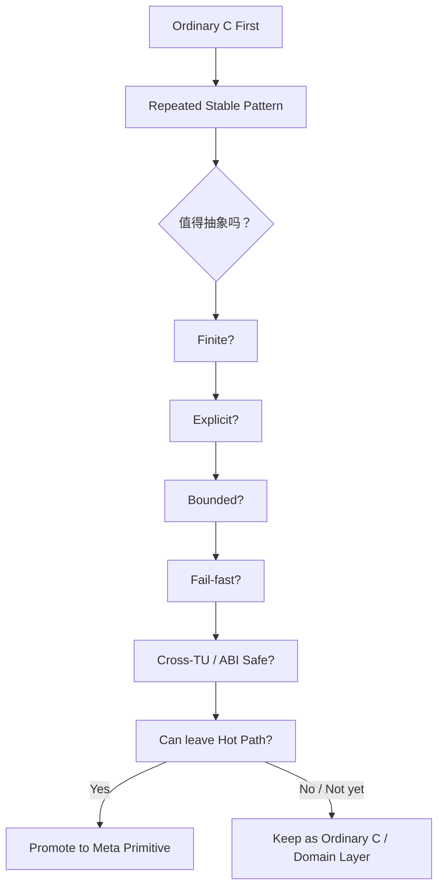

# 第十四章：有限、显式、按需——什么时候应该停止 Meta 化


> **本章路线**
>
> 前十三章一直在展示“什么时候抽象有价值”。这一章反过来专门研究“什么时候抽象会失败”。
>
> 我们不再只列原则，而是用具体 counterexample 验证：
>
> ~~~text
> Too-Early Meta
> Infinite Inference
> Pointer Identity
> Hidden Allocation
> Unbounded Queue
> Silent Fallback
> Everything-is-Virtual
> Raw Token as Business Data
> Formal Proof at the Wrong Layer
> Module Ownership Leakage
> ~~~
>
> 每个反例都回答三件事：
>
> **它为什么一开始看起来很合理？真正坏在哪里？最小修正是什么？**
>
> 目标不是让读者害怕抽象，而是建立一个更专业的判断能力：
>
> > **不是“能不能 Meta 化”，而是“这份知识是否已经稳定到值得进入 Meta”。**

做到上一章以后，已经可以看到一个很容易让项目走向另一个极端的问题。

我们已经证明：

```text
Type
Traits
Generic
Callable
Graph
Executor
Machine
```

这些基础能力能够组合出很多东西。

甚至可以进一步支撑：

```text
Serialization
RPC
Plugin
Workflow
ECS
Query
Protocol
```

这时最危险的诱惑反而不是：

> C 能力不够。

而是：

> **既然 Meta 可以解决这么多问题，是不是所有问题都应该继续 Meta 化？**

答案应该非常明确：

# 不是。

如果继续沿着：

```text
“这个也能用宏实现”
“这个也能做 DSL”
“这个也能在编译期推导”
```

无限向前扩展，那么最终很可能重新回到第一章的问题：

```text
本来为了减少复杂度
        ↓
创造了一套更复杂的系统
```

因此，CMeta 真正成熟以后，最重要的能力之一反而应该是：

> **知道什么时候不应该增加新的 Meta 能力。**

---

# 1. Meta 不是目的

整个系统最开始不是为了：

```text
实现元编程
```

而是为了：

```text
少维护重复代码
```

后来增加 Schema，不是因为：

```text
Schema 很高级
```

而是因为：

```text
同一组事实被多次使用
```

增加 Type，不是因为：

```text
想给 C 做 Reflection
```

而是因为：

```text
宏没有类型
导致同一份类型知识重复维护
```

增加 Generic，不是因为：

```text
想复制 C++ Template
```

而是因为：

```text
相同算法不断针对不同类型重复实例化
```

增加 Graph，也不是因为：

```text
Graph 是一个漂亮的抽象
```

而是因为：

```text
需要验证 Type + Callable
能否描述一个真正复杂的计算对象
```

所以判断一个 abstraction 是否应该存在，最重要的问题始终不是：

> 能不能做？

而应该是：

> **它消除了什么已经真实存在的复杂度？**

---

# 2. Ordinary C 永远应该是第一选择

如果一个问题用：

```c
for (...) {
    ...
}
```

写出来：

```text
简单
清楚
只出现一次
```

那么完全没有理由为了：

```text
“统一”
```

强行改成：

```text
Stream
Graph
Meta DSL
```

同样，如果一个模块只有：

```c
struct Config {
    int port;
    int workers;
};
```

而且它：

```text
不需要 serialization
不需要 field iteration
不需要 binding
```

就没有必要马上：

```text
Struct(Config, ...)
```

Meta abstraction 不是默认语法。

它应该只在：

```text
普通 C 已经产生稳定重复模式
```

之后出现。

---

# 3. 一个非常重要的原则：先写普通 C，再抽象

更健康的发展顺序应该是：

```text
Problem
   ↓
Ordinary C Implementation
   ↓
第二个类似实现
   ↓
第三个类似实现
   ↓
观察真正重复的部分
   ↓
抽象
```

而不是：

```text
设计一个 Universal Meta Abstraction
        ↓
然后寻找问题来使用它
```

可以简单概括成：

# Code First, Meta Later

因为只有真实代码出现以后，才能知道：

```text
什么真的重复
什么只是看起来相似
哪些差异是偶然的
哪些差异是语义性的
```

---

# 4. 过早抽象最大的危险，是把偶然相似变成永久约束

假设现在有两个模块：

```text
A
B
```

都写了：

```text
init
run
stop
```

看起来非常相似。

如果立刻抽成：

```text
Lifecycle<T>
```

以后却发现：

```text
A:
    stop 可以恢复

B:
    stop 永远 terminal
```

那么最初的抽象实际上把两个：

```text
不同语义
```

强行压进：

```text
同一接口
```

最后只能增加：

```text
flags
optional methods
special cases
```

抽象反而更复杂。

所以：

> **重复的形状，不一定意味着重复的语义。**

CMeta 应该抽的是：

```text
stable semantic repetition
```

而不是：

```text
syntactic similarity
```

---

# 5. Finite 是第一条核心纪律

整个体系中最重要的限制之一，就是：

# Finite

例如：

```text
Finite Type Universe
Finite Signature Universe
Finite Generic Kinds
Finite Relations
Finite Operator Policies
Finite Rewrite Rules
```

这并不是：

```text
因为技术能力不够
```

而是主动设计。

因为 finite 会带来一个非常重要的链条：

```text
Finite
   ↓
Enumerable
   ↓
Inspectable
   ↓
Validatable
   ↓
Generatable
   ↓
Provable
```

如果一个系统允许：

```text
任意类型
任意 token recursion
任意 template computation
```

那么很多：

```text
完整检查
manifest
proof
```

都会困难很多。

---

# 6. Finite 也让编译行为更可预测

复杂 template/meta 系统一个常见问题是：

```text
编译器到底会实例化多少东西？
```

如果规则可以递归扩展：

```text
A<T>
    ↓
B<A<T>>
    ↓
C<B<A<T>>>
    ↓
...
```

生成规模可能迅速失控。

而有限模型可以明确：

```text
最多多少 Type
最多多少 Signature
最多多少 Operator Relation
```

因此：

```text
compile time
generated code size
error surface
```

更容易预测。

对于一个底层 C library，这种可预测性本身就是价值。

---

# 7. 第二条核心纪律：Explicit

C 之所以长期适合系统编程，一个重要原因就是：

```text
很多成本是显式的
```

例如：

```text
malloc
free
mutex
thread
```

用户通常知道：

```text
什么时候 allocation
什么时候 synchronization
```

CMeta/CFlow 不应该为了高级 abstraction 破坏这一点。

所以应该尽量明确：

```text
谁拥有对象
谁 borrow
谁 move
哪里 allocate
哪里可能 block
queue capacity 是多少
```

而避免：

```text
hidden allocation
hidden retry
hidden thread
hidden fallback
```

---

# 8. Explicit Ownership 比自动“聪明”更重要

例如：

```text
Subscription
```

成功接管 Publisher 时：

```text
Publisher ownership moves to Subscription
```

这比：

```text
“framework 会自己决定什么时候释放”
```

更容易理解。

Actor：

```text
Owner
```

负责 lifecycle，

Producer Reference：

```text
只能 send
```

同样如此。

这种设计看起来比：

```text
shared smart object
```

更手工。

但它给出了：

```text
非常明确的 lifetime boundary
```

对 C 来说，这往往比自动化更重要。

---

# 9. 第三条核心纪律：Bounded

所有可能积累资源的地方，都应该优先考虑：

```text
上限是什么？
```

例如：

```text
Executor Queue
Mailbox
Capture Storage
Machine Declaration
Graph Nodes
Pending Tasks
```

无限增长通常意味着：

```text
问题只是被推迟
```

例如：

```text
Producer
    100k/s

Consumer
    10k/s
```

如果 queue unbounded：

```text
系统暂时没有失败
```

但最终只是：

```text
Memory Exhaustion
```

所以更好的协议是：

```text
capacity
FULL
```

把系统的真实限制暴露出来。

---

# 10. Bounded 也让系统更容易证明

形式化系统最怕：

```text
状态空间无限扩张
```

如果：

```text
Mailbox
Executor Queue
Type Relation
```

都存在明确边界，

很多性质就更容易表达。

例如：

```text
pending <= capacity
```

可以成为明确 invariant。

这再次说明：

```text
Engineering Constraint
```

和：

```text
Formal Verifiability
```

往往不是矛盾的。

有限资源边界反而让二者更统一。

---

# 11. 第四条核心纪律：Fail-fast

整个体系应该尽量避免：

```text
猜
```

例如：

```text
Type 不知道
    → 猜成 void *

Trait 缺失
    → 猜成 memcpy

Signature 不匹配
    → runtime generic call

Parallel 不支持
    → 自动变 sequential
```

这些“友好”行为很容易隐藏真正问题。

所以更合适的是：

```text
Unknown Type
    → Reject

Missing Trait
    → Reject

Invalid Signature
    → Reject

Unsupported Execution Mode
    → Reject
```

---

# 12. Fail-fast 的真正价值，是缩短错误距离

假设用户写：

```text
Filter(user_name)
```

但：

```text
user_name : User -> String
```

而 Filter 要求：

```text
User -> bool
```

最好的错误位置是：

```text
Graph Build
```

甚至：

```text
compile-time
```

而不是：

```text
程序跑了一小时
某个 User 到来以后
在 adapter 里发现输出大小不对
```

也就是说：

```text
Error Detection
```

应该尽量靠近：

```text
Error Introduction
```

这是 Fail-fast 最重要的价值。

---

# 13. 第五条核心纪律：No Silent Fallback

Fail-fast 之外，还需要更严格的一条：

# 不静默改变语义

例如调用方要求：

```text
Parallel Reduce
```

系统不能因为条件不满足：

```text
偷偷执行 Sequential Reduce
```

结果可能仍然一样。

但调用方真正请求的是：

```text
一个 execution contract
```

如果没有满足，就应该明确：

```text
Unsupported
```

而不是：

```text
“我帮你做了一个差不多的”
```

---

# 14. Fallback 什么时候才合理

这并不是说所有 fallback 都错误。

关键在于：

```text
fallback 是否属于显式 contract
```

例如用户明确写：

```text
try_direct
else_plan
```

那么：

```text
Direct 不可用
    ↓
Plan
```

完全合理。

因为 policy 是：

```text
用户明确允许的
```

问题是：

```text
framework 自己悄悄决定
```

所以仍然回到：

```text
Mechanism
≠
Policy
```

---

# 15. 第六条核心纪律：Static When Possible, Dynamic When Necessary

CMeta 已经提供：

```text
Runtime Type Descriptor
Interface
Dynamic Callable Adapter
```

但这并不意味着：

```text
所有代码都应该动态化
```

相反，更理想的策略是：

```text
Static Interior
Dynamic Boundary
```

例如：

```text
Plugin / Publisher
    runtime provider
```

可以通过：

```text
Interface
```

进入系统。

但：

```text
已经确定的 Map / Filter
```

应尽量：

```text
direct call
```

而不是每个 value 继续动态 dispatch。

---

# 16. Runtime Reflection 应该只服务真正动态的问题

例如：

```text
Deserializer
```

在 runtime 才知道：

```text
目标 Field
```

使用 descriptor 很合理。

但如果：

```text
Vec<int>
```

已经在编译期确定，

就不应该每次 push 都：

```text
find_type("int")
```

再去决定：

```text
sizeof(int)
```

这种使用方式相当于：

```text
主动丢掉编译器已经知道的信息
```

这显然不是目标。

---

# 17. 第七条核心纪律：No Hidden Runtime

如果用户写：

```text
lambda(...)
```

不应该默认：

```text
heap allocate closure
```

如果写：

```text
actor_create(...)
```

不应该自动：

```text
spawn thread
```

如果写：

```text
stream.map(...)
```

不应该自动：

```text
创建一堆 heap stage object
```

除非 API contract 明确说明。

更好的设计是：

```text
Inline Capture
Bounded Queue
Borrowed Scheduler
Explicit Executor
```

让 runtime resource model 能从 API 表面看出来。

---

# 18. 高级语法不能隐藏低级成本

假设未来增加更漂亮的 DSL：

```text
users
    |> filter(enabled)
    |> map(name)
```

这当然很好。

但前提是用户仍然能够知道：

```text
是否 materialize？
是否 allocate？
是否 parallel？
```

高级语法的价值应该是：

```text
减少表达噪声
```

而不是：

```text
隐藏成本模型
```

这也是 Modern C 和很多高级语言 abstraction 可以保持不同的地方。

---

# 19. 第八条核心纪律：Cross-Compiler Semantics First

如果某种 abstraction 只有：

```text
GNU C
```

可以正确实现，

但核心 library 声称支持：

```text
C11
```

那么它不应该进入：

```text
核心 semantic model
```

可以提供：

```text
GNU convenience syntax
```

但底层必须仍然存在：

```text
strict C11 equivalent
```

因此：

```text
Compiler Extension
```

应该是：

```text
Ergonomic Layer
```

而不是：

```text
Semantic Foundation
```

---

# 20. 第九条核心纪律：Meta Layer 不应该泄漏进所有名字

如果用户定义：

```text
User
```

最终使用时应该仍然是：

```c
User user;
```

而不是：

```c
cmeta_generated_struct_User user;
```

Meta 只是一种：

```text
定义方式
```

不应该改变：

```text
领域模型本身
```

同样：

```text
State
Order
Event
```

仍然应该使用自然领域名字。

否则 Library implementation 会侵入整个 application vocabulary。

---

# 21. 第十条核心纪律：Module Owns Meaning

如果：

```text
CMeta
```

负责 Type，

那么其他模块不要重新定义：

```text
另一套 Type System
```

如果：

```text
CFlow
```

负责 Graph operator semantics，

CMeta 不应该反过来知道：

```text
Filter / Map
```

是什么。

如果：

```text
Container
```

负责：

```text
Vec algorithm
```

CMeta 不应该实现：

```text
Vec reserve
```

这是非常重要的：

# Ownership of Meaning

每个 module 应该拥有：

```text
自己的语义
```

而不是只按：

```text
文件目录
```

分层。

---

# 22. 什么不属于 CMeta

做到现在，可以比较明确地给 CMeta 列出 Non-goals。

CMeta 不应该负责：

```text
Container Algorithms
```

例如：

```text
Vec growth
BTree balancing
HashMap probing
```

---

不应该负责：

```text
Scheduling Policy
```

例如：

```text
worker priority
CPU affinity
fair scheduling
```

---

不应该负责：

```text
Business Retry Policy
```

---

不应该成为：

```text
Runtime Reflection VM
```

---

不应该成为：

```text
GC Object System
```

---

不应该成为：

```text
C++ Template Clone
```

---

也不应该成为：

```text
C Compiler Replacement
```

---

# 23. 什么不属于 CFlow

CFlow 同样需要 Non-goals。

CFlow 不应该：

```text
强制所有数据处理使用 Graph
```

简单 loop 仍然是简单 loop。

---

不应该：

```text
拥有所有容器
```

它只消费：

```text
Range / Collector
```

协议。

---

不应该：

```text
强制所有应用使用同一个 Thread Pool
```

---

不应该：

```text
自动决定所有 retry/drop policy
```

---

也不应该发展成：

```text
Stream + RPC + UI + Workflow + Database
全部放进同一个 core
```

它更应该保持：

```text
Execution Substrate
```

而不是：

```text
Application Framework Universe
```

---

# 24. 什么不属于 Lean

Lean 的边界也非常重要。

Lean 不应该：

```text
成为普通 C build 的必需依赖
```

---

不应该：

```text
运行生产 callback
```

---

不应该：

```text
承担所有 integration testing
```

---

不应该：

```text
为了“证明率”而形式化每一行普通 C
```

它应该优先覆盖：

```text
高复用
高风险
语义稳定
有限
```

的核心规则。

例如：

```text
Type Relations
Signature Manifest
Rewrite Law
WAIT / Demand invariants
Machine Semantics
```

---

# 25. 一个很有用的判断方法：这个 abstraction 能不能删除一份知识？

未来考虑加入一个 Meta Feature 时，可以先问：

> 它是否删除了一份现在正在重复维护的知识？

例如：

```text
Struct Schema
```

删除：

```text
struct declaration
field metadata
serializer field list
```

之间的重复。

```text
Callable
```

删除：

```text
function pointer
signature
effects
```

分散维护。

```text
Graph
```

删除：

```text
每个 execution backend
分别重新理解 operator relation
```

的重复。

如果新 abstraction 只是：

```text
让某段代码写短一点
```

但并没有删除重复知识，

它进入 core 的理由就弱很多。

---

# 26. 第二个判断方法：普通 C 是否已经足够好？

例如想增加：

```text
MetaIf
MetaWhile
MetaRecursion
```

首先应该问：

> 这些 compile-time control structure 解决了什么普通 C + finite generation 无法解决的问题？

如果回答只是：

```text
因为 C++ template 也有
```

那么不应该加入。

CMeta 不是：

```text
Feature Parity Project
```

它没有必要证明：

```text
C 也能做一切 C++ Template 做的事情
```

---

# 27. 第三个判断方法：是否能够保持有限、可检查

如果一个新 feature 需要：

```text
无限递归
```

或者：

```text
runtime arbitrary expression evaluator
```

应该非常谨慎。

因为它可能破坏：

```text
finite universe
```

这一整套基础假设。

而如果一个需求可以重新表达成：

```text
有限 row
有限 relation
显式 registration
```

通常更符合整个体系。

---

# 28. 第四个判断方法：错误会出现在哪里？

一个 abstraction 不只是要看：

```text
成功时多漂亮
```

还要看：

```text
失败时会发生什么
```

例如新的宏 DSL 如果用户写错后只得到：

```text
expected ')' before token
```

那么虽然语法看起来简洁，

实际工程价值可能很差。

所以新 primitive 必须同时考虑：

```text
Happy Path
+
Error Path
```

特别是在宏环境中。

---

# 29. 第五个判断方法：它能跨 TU、跨 Library 吗？

很多 Macro Trick 在：

```text
single .c file
```

非常漂亮。

但一进入：

```text
multiple TUs
shared library
installed header
```

就失效。

如果一个 abstraction 无法回答：

```text
identity
ABI
ownership
generation boundary
```

问题，

它可能还没有成熟到：

```text
public primitive
```

阶段。

---

# 30. 第六个判断方法：它会不会进入 Hot Path？

一个 abstraction 在 build 阶段复杂一点并不可怕。

但如果它要求：

```text
每个 Value
每个 Event
每次 Callback
```

都执行大量：

```text
type lookup
string lookup
dynamic dispatch
```

就需要非常谨慎。

可以问：

> **这个 abstraction 能不能在执行之前被部分或完全消掉？**

如果答案是：

```text
可以
```

通常更适合整个设计。

---

# 31. 第七个判断方法：它属于哪个 Module？

假设某功能很好，但：

```text
不知道应该放 CMeta
还是 CFlow
还是 Container
```

往往说明：

```text
它的语义边界还没有想清楚
```

一个成熟 abstraction 应该能够清楚回答：

```text
谁拥有它
谁依赖它
谁不能依赖它
```

而不是：

```text
先找一个方便的目录放进去
```

---

# 32. Meta Primitive 应该很少，而且生命周期很长

业务 API 可以快速变化。

Meta Primitive 不应该。

因为一旦：

```text
Type
Schema
Callable
Interface
```

进入大量模块，

它就会形成巨大的：

```text
dependency fan-out
```

改变它的成本很高。

因此最底层 primitive 应该：

```text
少
稳定
通用
语义明确
```

而不是：

```text
feature-rich
```

---

# 33. 上层可以快速实验，底层应该慢慢收敛

一个健康架构可以允许：

```text
workflow/
rpc/
query/
```

快速尝试不同 API。

但 CMeta Core 只在发现：

```text
多个上层
长期反复需要同一种机制
```

以后才吸收。

可以表示成：

```text
Experimental Layer

Workflow
RPC
Query
   ↓
发现重复 primitive
   ↓
验证是否稳定
   ↓
Core
```

而不是：

```text
Core
   ↓
先设计大量 abstraction
   ↓
要求所有上层使用
```

---

# 34. CFlow 的存在本身就是这种方法的例子

CMeta 不是在最初就预先设计：

```text
Effect
Property
Callable
Interface
```

所有细节。

而是在 CFlow 真正需要：

```text
typed callback
async boundary
optimization
```

时，发现：

```text
底层缺少什么
```

再回头强化 CMeta。

所以形成：

```text
Real Use
   ↓
Pressure
   ↓
Better Primitive
```

而不是：

```text
Theoretical Completeness
   ↓
Large Framework
```

这应该继续成为未来设计方法。

---

# 35. “少”可能比“强”更重要

如果 CMeta 最终只有：

```text
10 个核心 abstraction
```

但：

```text
Container
Flow
Serialization
Binding
RPC
```

都能使用，

这比拥有：

```text
100 个高级宏
```

却互相依赖、难以理解，更有价值。

底层库真正重要的是：

```text
Composability
```

而不是：

```text
Feature Count
```

---

# 36. 可以把整个设计纪律总结成一张图



这比：

```text
“能不能用宏实现？”
```

是一个更完整的判断标准。

---

# 37. 为什么这套原则仍然非常“C”

C 的一个重要特点是：

```text
语言本身提供很少
```

但这些基础能力：

```text
struct
function
pointer
array
```

可以组合出很多系统。

CMeta/CFlow 最理想的方向也应该类似：

```text
提供少数更高层 primitive
```

例如：

```text
Type
Traits
Callable
Interface
Graph
Executor
Machine
```

然后：

```text
让用户组合
```

而不是：

```text
提供一个巨大的预制世界
```

---

# 38. CMeta 最终不应该让 C 失去自己的特点

目标从来不是：

```text
C + Meta
    =
Poor Man's C++
```

更不是：

```text
C + Runtime
    =
另一种 Java
```

它应该继续保留：

```text
明确布局
明确 ABI
明确 ownership
明确 resource boundary
低 runtime overhead
```

而 Meta 只补充：

```text
C 自己没有保存的知识
```

例如：

```text
Generic Type Identity
Callable Signature
Traits
Semantic Relation
```

---

# 39. 从这个角度看，C++ 只是参考，而不是目标

C++ 提供：

```text
Template
Concept
Lambda
std::bind
Ranges
```

其中很多思想非常有价值。

但这不意味着：

```text
必须在 C 中完整重现
```

更好的做法是问：

> 其中哪一部分真正解决了我们的 C 工程问题？

例如：

```text
Lambda
```

最重要的可能不是语法：

```cpp
[x](...) {}
```

而是：

```text
Code + Capture
```

所以实现有限 capture callable 就够了。

Template 最重要的可能是：

```text
typed instantiation
```

所以有限 Generic 就够了。

Concept 最重要的可能是：

```text
capability constraints
```

所以 Traits / Require 就够了。

---

# 40. “像 C++”不应该成为 API 的评价标准

用户 API 是否优秀，不应该看：

```text
它有多像 C++ / Java / Rust
```

而应该看：

```text
是否减少错误
是否减少重复
是否明确成本
是否保持 C 可读性
```

有时：

```text
->filter(...)
```

形式很好。

有时一个普通：

```c
filter_range(...)
```

反而更简单。

所以 syntax 应该服务：

```text
Problem
```

而不是服务：

```text
Language Imitation
```

---

# 41. 可以提出一个最终准则：Meta 必须最终能够“消失”

一个好的 Meta abstraction 在生成/构建以后：

```text
最好能够被消掉
```

例如：

```text
Struct
    ↓
ordinary struct + metadata
```

```text
typed
    ↓
ordinary C API
```

```text
lambda
    ↓
ordinary function + capture storage
```

```text
Stream
    ↓
Graph
    ↓
Plan / direct loop
```

也就是说：

> **Meta 应该更多存在于描述阶段，而不是执行阶段。**

这是判断 abstraction 是否符合整个方向的一条非常强的标准。

---

# 42. 如果一个 Meta Feature 无法消失，就要问它是不是 Runtime Feature

例如某个设计要求：

```text
每次调用
```

都必须：

```text
解析字符串
lookup type registry
动态构造 AST
```

那么它可能已经不是：

```text
Meta Feature
```

而是：

```text
Runtime Framework Feature
```

这并不代表它一定不好。

但应该：

```text
放在正确层次
```

而不是悄悄进入 CMeta Core。

---

# 43. 到这里可以得到一个完整设计哲学

整个体系可以用几个词概括：

```text
Ordinary C First

Finite

Explicit

Bounded

Fail-fast

No Silent Fallback

Static When Possible

Dynamic Only at Boundaries

One Source of Truth

Module Owns Meaning

Meta Should Disappear Before Hot Path
```

这些原则并不是附加规则。

它们实际上共同回答：

> **如何在增加高级能力的同时，不失去 C 最有价值的东西。**

---

# 44. 最重要的目标始终是减少复杂度，而不是增加能力

回到第一章，问题只是：

```text
C 宏太难维护
```

如果最后得到：

```text
一个功能极强
但没人敢改
也没人知道失败时为什么失败
```

的 Meta System，

那么整个项目就是失败的。

所以最终评价标准应该非常简单：

> **整个系统是不是比没有这些 abstraction 时更容易理解和维护？**

如果答案不是：

```text
Yes
```

那就应该删除 abstraction，而不是继续增加 abstraction。

---

# 45. 从这里开始，全文已经接近最终收束

前面的章节已经回答：

```text
为什么会有 CMeta？
```

因为普通 C 宏和重复类型知识逐渐难以维护。

回答：

```text
CMeta 能做什么？
```

Type、Traits、Generic、Inference、Callable。

回答：

```text
为什么会有 CFlow？
```

为了用一个真正复杂的可执行对象验证这些能力。

回答：

```text
Graph 后来发现了什么？
```

Stream、Reactive、Executor、Machine、Actor 可以共享大量基础模型。

回答：

```text
如何保持性能？
```

Rich Control Plane，Simple Execution Plane。

回答：

```text
如何建立可信度？
```

Lean、Semantic Law、Trace、Certificate。

回答：

```text
如何真正工程化？
```

ABI、Semantic Identity、Multi-TU、Module Ownership、Fail-fast。

这一章则回答了最后一个架构问题：

> **如何防止这套系统因为能力越来越强，最终重新变成我们最初想消除的复杂度。**

---

# 小结：真正成熟的 Meta 系统，最大的能力是克制

CMeta 最初来自一个非常小的问题：

```text
不要重复写很多 C 代码
```

一路发展到现在：

```text
Type
Generic
Callable
Graph
Formal Proof
```

能力已经增加了很多。

但最终真正应该保留下来的设计思想反而很简单：

```text
只有重复而稳定的知识
才值得被抽象。

只有有限且明确的规则
才值得进入 Core。

普通 C 能清楚解决的问题
继续使用普通 C。

动态性只留在真正动态的边界。

高级知识尽量在执行之前被消费掉。
```

因此最理想的结果不是：

```text
CMeta everywhere
```

而是：

```text
CMeta 在需要它的地方
帮助 C 知道更多

然后尽量消失
```

最后真正运行的仍然是：

```text
简单
直接
可预测
的 C
```

这可能也是整套设计与很多大型语言级 Meta System 最大的不同。

它不追求：

> **让 C 拥有无限的 Meta 表达能力。**

而追求：

> **让 C 拥有刚好足够的、有限而可信的知识，从而解决那些普通 C 长期需要靠重复、约定和 `void *` 才能解决的问题。**

下一章可以作为全文的最终总结，重新从第一章开始回看整个演化过程：

# 从 Macro Reuse 到 Typed Meta，再到 Typed Computation——CMeta / CFlow 最终到底解决了什么，以及它们对于 Modern C 的真正意义。

---


# 46. Counterexample Lab：十种“看起来高级，实际上更差”的设计

下面这些反例都不是为了制造稻草人。

它们都很常见，而且在早期通常看起来“更统一、更智能、更自动”。

真正的问题只有在系统变大以后才会暴露。

---

## 46.1 Counterexample 1：只有一次重复，也立刻造 Meta DSL

假设只有：

~~~c
int user_age(const User *u) {
    return u->age;
}

int order_count(const Order *o) {
    return o->count;
}
~~~

看到形状相似，就立刻设计：

~~~text
FieldGetter(Type, Field, ReturnType)
GenerateAccessor(...)
Reflect(...)
GenericInvoke(...)
~~~

表面收益：

~~~text
少写两行函数
~~~

实际成本：

~~~text
新的 macro vocabulary
新的错误信息
新的 naming convention
新的 compile-time dependency
新的 debugging path
~~~

而且：

~~~text
User.age
Order.count
~~~

可能只是偶然相似。

### 为什么错

你抽象的不是：

~~~text
稳定知识
~~~

而是：

~~~text
当前代码形状
~~~

这违反：

> **Code First, Meta Later.**

### 最小修正

继续写普通 C。

直到出现：

~~~text
大量稳定字段 schema
多个消费者都重复读取同一字段事实
serializer / binder / UI / query 都需要同一信息
~~~

再把：

~~~text
Field Metadata
~~~

抽成真正共享事实。

---

## 46.2 Counterexample 2：为了“像 Template”追求无限类型推导

假设最初只需要：

~~~text
CommonType(int, long) = long
CommonType(int, double) = double
~~~

但很快产生诱惑：

~~~text
既然叫 TypeFunction
为什么不能支持任意嵌套任意递归任意偏特化？
~~~

于是开始模拟：

~~~text
template partial specialization
SFINAE
recursive pattern matching
higher-kinded generic
~~~

用 preprocessor 实现。

### 为什么一开始看起来合理

因为：

~~~text
C++ Template 很强
~~~

所以容易把目标变成：

~~~text
“C 也应该一样强”
~~~

### 真正问题

C preprocessor 并不是为开放递归类型计算设计的。

结果往往是：

~~~text
错误爆炸
compile time 不可预测
compiler divergence
debugging 极差
规则边界没人说得清
formal model 反而更困难
~~~

### 最小修正

把问题重新写成：

~~~text
finite admitted universe
+
finite relation rows
+
explicit unsupported case
~~~

也就是：

~~~text
TypeFunction
    = finite relation
~~~

不是：

~~~text
TypeFunction
    = secret general-purpose compiler
~~~

这正是为什么 No Default 很重要。

未知输入就失败。

---

## 46.3 Counterexample 3：Descriptor Pointer 当 Type Identity

最简单的实现：

~~~c
if (a == b) {
    /* same type */
}
~~~

单 TU 完美工作。

甚至 test 也可能全绿。

直到：

~~~text
TU A
TU B
shared library A
shared library B
static archive duplicated into multiple DSOs
~~~

出现。

同一个：

~~~text
Pair<int, long>
~~~

可能拥有多个 descriptor object。

于是：

~~~text
pointer differs
    ↓
“type mismatch”
~~~

### 为什么错

地址回答：

~~~text
representation object 在哪里
~~~

不是：

~~~text
semantic type 是什么
~~~

### 最小修正

使用：

~~~text
stable atom id
generic constructor identity
structural arguments
pointer/const/application form
~~~

建立 semantic identity。

如果两个 descriptor：

~~~text
地址不同
结构/meaning 相同
~~~

应该相等。

这不是 abstraction bonus。

这是 Multi-TU correctness。

---

## 46.4 Counterexample 4：Lambda Capture 超过 Inline Bound 就偷偷 malloc

设计一个 C lambda：

~~~text
callable
+
inline capture[32]
~~~

很好。

然后遇到 80-byte capture。

最“方便”的做法：

~~~text
if too large:
    malloc(...)
    hide pointer inside callable
~~~

用户 API 完全不变。

### 为什么看起来合理

因为用户获得：

~~~text
“任何 capture 都能用”
~~~

### 真正问题

API 原本暗示：

~~~text
bounded value object
copy by value
no hidden allocation
predictable lifetime
~~~

现在却悄悄变成：

~~~text
some callables allocate
copy may fail
destroy becomes mandatory
thread/lifetime semantics changed
ABI shape meaning changed
~~~

而调用点不知道。

### 最小修正

三种合法选择：

~~~text
A. compile/admission failure
B. explicit heap-backed callable type
C. caller-owned external context
~~~

但必须 explicit。

> **Hidden convenience that changes ownership is not convenience. It is semantic drift.**

---

## 46.5 Counterexample 5：Actor / Executor Queue 自动无限增长

需求：

~~~text
send should almost never fail
~~~

于是实现：

~~~text
queue full
    ↓
realloc bigger
    ↓
keep accepting
~~~

甚至：

~~~text
linked-list unbounded queue
~~~

### 为什么看起来合理

上层不用处理 FULL。

demo 非常顺滑。

### 生产环境会发生什么

当 consumer变慢：

~~~text
producer rate > consumer rate
~~~

系统不会 backpressure。

只会：

~~~text
memory rises
latency rises
cache locality collapses
event becomes stale
eventually OOM
~~~

问题从：

~~~text
明确 FULL
~~~

被变成：

~~~text
很晚才发生的全局 failure
~~~

### 最小修正

固定 capacity。

返回：

~~~text
FULL
~~~

让上层选择：

~~~text
retry later
drop by explicit policy
backpressure upstream
fail operation
shed load
~~~

> **Boundedness turns resource pressure into information.**

---

## 46.6 Counterexample 6：Parallel Plan 不可用时 Silent Sequential Fallback

用户显式请求：

~~~text
parallel reduce
~~~

当前输入太小、Executor 满、reducer contract 不满足、plan 不支持。

框架觉得：

~~~text
“没关系，我帮你顺序执行，结果一样。”
~~~

### 为什么看起来合理

功能似乎“更鲁棒”。

### 为什么实际上危险

虽然结果可能相同，但：

~~~text
latency
CPU topology
resource usage
deadline behavior
load shedding
SLA
benchmark
~~~

都变了。

更糟的是：

~~~text
一个本应暴露的 admission bug
~~~

被隐藏。

### 最小修正

返回明确：

~~~text
UNSUPPORTED
FULL
INVALID_OPTIONS
INELIGIBLE
~~~

如果 application 真想 fallback：

~~~text
if parallel failed:
    explicitly choose sequential
~~~

由它自己决定。

> **Semantic equivalence does not imply operational equivalence.**

---

## 46.7 Counterexample 7：Everything Is Virtual

为了“统一”，把所有东西都变成：

~~~text
{ self, vtable }
~~~

包括：

~~~text
Map
Filter
type operations
small value transform
inner-loop compare
Graph node execution
~~~

每个 value：

~~~text
vtable lookup
indirect call
metadata check
dynamic dispatch
~~~

### 为什么一开始看起来漂亮

统一：

~~~text
one interface to rule them all
~~~

增加新类型不改调用者。

### 真正问题

你把：

~~~text
真正需要动态性的 boundary
~~~

和：

~~~text
编译/构造时已经知道的 interior
~~~

混在一起。

结果：

~~~text
optimizer knowledge无法消除
hot path始终保留动态层
debugging堆栈膨胀
cache/inlining opportunities减少
~~~

### 最小修正

保持：

~~~text
Dynamic Boundary
    Publisher / Scheduler / plugin provider

Static Interior
    known Graph stage / Plan instruction / direct target
~~~

动态性只留在真正动态的边界。

> **Interface is a boundary tool, not a universal object model.**

---

## 46.8 Counterexample 8：把 Raw Parser Token 当 Business Stream

有 JSON parser 输出：

~~~text
OBJECT_BEGIN
KEY
STRING
ARRAY_BEGIN
...
~~~

又已经有 CFlow Stream。

于是自然想到：

~~~text
Stream<Token>
    .filter(...)
    .map(...)
~~~

### 为什么看起来合理

都是“流”。

### 真正问题

token sequence不是独立 business values。

它是：

~~~text
grammar-preserving structural protocol
~~~

如果业务 filter 掉：

~~~text
ARRAY_END
~~~

整个语法失效。

而且：

~~~text
field name
number
container boundary
~~~

仍未形成 semantic object。

### 最小修正

正确边界：

~~~text
parser syntax
    ↓
canonical grammar
    ↓
binding / validation
    ↓
complete semantic/native value
    ↓
business CFlow
~~~

> **Same shape “stream of items” does not mean same semantics.**

---

## 46.9 Counterexample 9：为了“形式化”让 Lean 证明 ABI / Benchmark

团队有了 Lean 后，很容易产生新的形式主义：

~~~text
能不能证明 struct ABI stable？
能不能证明这个版本快 2x？
能不能证明 Linux scheduler 不饿死？
~~~

### 为什么错

这些问题依赖：

~~~text
compiler ABI
linker/loader
platform
CPU
OS
allocator
benchmark workload
external environment
~~~

如果 formal model没有精确包含这些现实事实，证明的只是：

~~~text
一个抽象模型
~~~

不是实际工具链。

### 最小修正

Lean 证明：

~~~text
semantic identity
rewrite preservation
state-machine invariant
bounded protocol relation
refinement
~~~

Toolchain evidence验证：

~~~text
ABI
link
install
compiler compatibility
~~~

Benchmark验证：

~~~text
actual performance
~~~

Stress/Sanitizer验证：

~~~text
memory/race bugs
~~~

> **Using proof at the wrong layer is another form of hidden assumption.**

---

## 46.10 Counterexample 10：因为“上层需要”就把 Domain Semantics 塞进 Core

例如 RPC 需要：

~~~text
retry
deadline
service discovery
~~~

于是把：

~~~text
retry policy
~~~

塞进 Executor。

Workflow 需要：

~~~text
compensation
~~~

于是把 compensation 塞进 Machine core。

JSON 需要：

~~~text
field names
~~~

于是把 JSON syntax 塞进 CMeta。

### 为什么错

Core 开始失去：

~~~text
single semantic ownership
~~~

一个 primitive 同时服务太多 domain，最后只能拥有：

~~~text
模糊的“万能”参数
~~~

### 最小修正

问：

~~~text
这是不是该 domain 独有的 meaning？
是否在至少多个独立领域稳定重复？
没有它 core 是否仍完整？
~~~

如果答案是 domain-specific：

~~~text
留在上层
~~~

> **Reuse does not require ownership transfer.**

---

# 47. “普通 C 更好”不是失败，而是设计成功

一本讲 Modern C 的书如果最后让读者觉得：

~~~text
每个问题都应该用 CMeta/CFlow
~~~

那就是错误结论。

有大量场景普通 C 明显更好。

## 47.1 一个固定 pipeline

如果只有：

~~~c
for (...) {
    if (...) {
        ...
    }
}
~~~

不会动态组合、不需要复用 Graph、不需要分析/优化：

> 直接写 loop。

## 47.2 一个小状态机

只有：

~~~text
3 states
4 events
one file
no dynamic binding
no concurrency
~~~

一个 switch 可能比 Machine IR 更好。

## 47.3 一个 callback

不需要：

~~~text
capture
signature registry
Graph
semantic optimization
~~~

就直接：

~~~c
void (*fn)(void *);
~~~

## 47.4 一个固定 struct 的 parser

只有一个 format、一个 object、不需要通用 binding：

> 手写 parser 到 struct。

## 47.5 一个简单同步程序

不需要：

~~~text
WAIT
Demand
Scheduler
Executor
~~~

就不要为了“现代”增加异步模型。

### 判断标准

如果 abstraction 没有删除：

~~~text
真实重复知识
真实错误边界
真实 runtime decision duplication
~~~

它就可能只是新增一层。

---

# 48. Decision Tree：一个新能力是否值得进入 Meta / Core

可以使用下面的顺序判断。

~~~text
Q1. Plain C 是否已经清楚、短、稳定？
    YES → 保持 Plain C
    NO  ↓

Q2. 重复的是“知识”还是只是代码形状？
    code shape only → 暂不抽象
    stable knowledge ↓

Q3. 是否至少有多个独立消费者需要同一事实？
    NO → 留在模块内部
    YES ↓

Q4. 这份知识是否有限、可显式描述？
    NO → 可能是 runtime/domain feature
    YES ↓

Q5. Ownership / failure / capacity 是否能写清？
    NO → 不进入 Core
    YES ↓

Q6. 它属于已有哪个 semantic owner？
    已有 owner → 扩展/复用 owner
    没有 ↓

Q7. 是否在多个 domain 中稳定重复？
    NO → 上层 feature
    YES ↓

Q8. 能否在执行前消费掉大部分复杂度？
    NO → 明确它是 Runtime Feature
    YES ↓

Q9. 是否有正确的 evidence strategy？
    NO → 设计未完成
    YES ↓

Q10. 加入后系统整体更容易理解吗？
    NO → 删除 abstraction
    YES → 才考虑进入 Core
~~~

最后一个问题最重要。

---

# 49. Anti-Meta Budget：Core 每增加一个 Primitive 都应该付出成本

可以把 Core feature 视为有“长期维护预算”。

一个新 primitive 一旦进入：

~~~text
CMeta
CFlow kernel
public ABI
formal model
generated manifest
~~~

以后就需要长期承担：

~~~text
documentation
compiler compatibility
ABI
Multi-TU
tests
formal maintenance
debugging
migration
downstream compatibility
~~~

所以判断标准不能只是：

~~~text
实现它是否容易
~~~

而应该是：

> **它值得我们未来 5 年继续解释、测试、兼容吗？**

这会自然降低 Core feature 增长速度。

而这正是好事。

---

# 50. Counterexample Review Checklist

代码审查一个新的 Meta/Runtime abstraction 时，可以直接问：

~~~text
[ ] 有没有 Plain C baseline？
[ ] 重复的知识是什么？
[ ] 为什么不是 module-local helper？
[ ] 为什么必须进入 Core？
[ ] type identity 是否跨 TU？
[ ] ownership 是否显式？
[ ] 是否有 hidden allocation？
[ ] resource 是否 bounded？
[ ] FULL/CLOSED/STALE 是否被保留为信息？
[ ] 是否有 silent fallback？
[ ] dynamic dispatch 是否进入不必要的 hot path？
[ ] failure 是否尽可能提前？
[ ] theorem 证明的是正确层次的问题吗？
[ ] ABI/toolchain claim 是否有真实 consumer test？
[ ] 性能 claim 是否有 fresh measurement？
[ ] abstraction 最终能否在 hot path 消失？
~~~

如果很多项答不上来：

> 不应该继续“完善 abstraction”，而应该先缩小 abstraction。

---

# 51. What We Learned

第十四章真正建立的是：

> **克制本身也是一种系统能力。**

前面的十条纪律现在有了具体失败模式：

~~~text
Finite
    防止把 preprocessor 变成无限语言

Explicit
    防止 ownership/policy 偷偷变化

Bounded
    防止 backpressure 变成 OOM

Fail-fast
    防止错误距离不断拉长

No Silent Fallback
    防止 operational semantics 被偷偷改变

Static When Possible
    防止已知 interior 保留动态成本

No Hidden Runtime
    防止 API 看起来简单、ownership 变复杂

Cross-Compiler Semantics First
    防止 core 绑定偶然 compiler trick

Semantic Identity
    防止地址偶然成为 meaning

Module Owns Meaning
    防止 Core 变成 domain feature landfill
~~~

但最重要的一条仍然是：

~~~text
Ordinary C First
~~~

不是因为普通 C 更“纯”。

而是：

> **抽象的价值必须被真实复杂度证明。**

所以一个成熟的 Modern C 系统最终应该同时拥有两种能力：

~~~text
知道什么时候应该构造 Typed / Verified abstraction

以及

知道什么时候应该只写一个普通 C function
~~~

下一章作为全文最终总结，不再列 Feature。

我们只保留一套可重复使用的方法：

~~~text
Understand
→ Model
→ Formalize
→ Verify
→ Implement
→ Lower
→ Measure
~~~

并用它回答：

> **什么才是这本书所说的 Modern C？**


