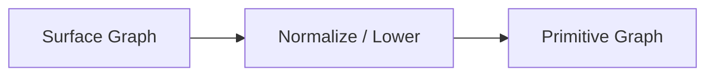
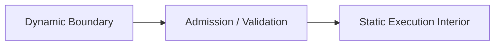

# 第十章：Rich Control Plane，Simple Execution Plane——把复杂性提前，把 Hot Path 重新变回普通 C


> **本章路线**
>
> 前九章不断增加“知道的东西”：Type、Callable、Graph、Demand、Executor、Machine、Actor。第十章反过来问：
>
> **这些知识最终是不是都要留在每一个 Value 的 hot path？**
>
> 本章把全书前半部分收束成一条真正的 compilation/refinement pipeline：
>
> ~~~text
> High-level API
>      ↓
> Surface Graph
>      ↓
> Normalize
>      ↓
> Verify / Optimize
>      ↓
> Primitive IR
>      ↓
> Plan / Direct-AOT eligibility
>      ↓
> Certificate / Equivalence Witness
>      ↓
> Simple Execution
> ~~~
>
> 核心原则不再只是口号：
>
> > **Know More Before Execution, Do Less During Execution.**
>
> 本章会严格区分当前实现能力：完整 Filter → Map → Reduce canonical pipeline 可以进入 compiled Plan；当前 closed Direct/AOT macro path 主要覆盖 Filter/Map stage，因此不会把 Reduce 误写成已经拥有同样的 direct lowering。

做到上一章以后，整个系统已经拥有了相当多的高级能力：

```text
Type
Traits
Generic
Callable
Lambda / Bind
Graph
Stream
Reactive
Executor
Scheduler
Machine
Actor
```

如果只看这些名词，很容易产生一个问题：

> **我们是不是正在把 C 变成一个越来越重的 Runtime？**

这是一个必须认真回答的问题。

因为整个设计最早的出发点恰恰不是：

```text
增加更多 abstraction
```

而是：

```text
减少重复
降低复杂度
保持 C 的简单和效率
```

如果最后每处理一个 value 都要经历：

```text
查询 Type Descriptor
解析 Generic Identity
检查 Callable Signature
遍历 Graph Edge
判断 Operator
查询 Effects
动态 Dispatch
再调用实际函数
```

那么即使接口很漂亮，设计方向也已经偏离了最初目标。

因此到了这个阶段，一个越来越明确的原则开始形成：

## Rich Control Plane, Simple Execution Plane

也就是：

> **允许构建阶段越来越聪明，但要求真正执行阶段越来越简单。**

---

## 1. 高级抽象真正昂贵的地方，往往不应该发生在每个 Value 上

假设用户写了一条高级数据转换：

```text
Input<int>
    ↓
Filter(even)
    ↓
Map(square)
    ↓
Map(to_double)
    ↓
Reduce(sum)
```

系统可以知道很多信息：

```text
Input Type
Filter Predicate Signature
Map Input / Output Type
Effects
Properties
Topology
Reducer Properties
```

这些信息当然需要分析。

但有一个关键问题：

> **这些信息多久会变化一次？**

通常答案是：

```text
Graph 构造以后
基本不会在处理每个 value 时变化
```

例如：

```text
Map(square)
```

的 signature：

```text
int -> long
```

不会因为今天处理的是：

```text
1
```

明天处理的是：

```text
2
```

就发生变化。

同样：

```text
Node A
连接 Node B
```

也不会每处理一个值就重新设计一次拓扑。

所以如果每一个 value 都重复做：

```text
type lookup
signature lookup
edge traversal
operator decode
```

实际上是在重复支付：

```text
已经知道的成本
```

---

## 2. Build Once, Execute Many

因此执行体系应该围绕一个非常简单的经济原则建立：

```text
Build Once
Execute Many
```

例如：

```text
构造 Graph
    ↓
验证 Type
    ↓
解析 Callable
    ↓
分析 Effects / Properties
    ↓
选择执行路径
    ↓
生成 Plan
    ↓
执行 1,000,000 个 Value
```

如果前面的分析成本是：

```text
O(Graph Size)
```

而后面处理的是：

```text
N 个数据
```

那么这部分成本可以被：

```text
N
```

次执行摊薄。

这和传统 compiler 的思想非常接近：

> 编译器可以花很多时间理解程序，因为机器最终可能执行这段程序无数次。

---

## 3. Graph 应该是分析对象，不一定是最终执行对象

Graph 的价值很大。

因为它可以表示：

```text
Operator
Type
Callable
Edge
Subgraph
Relation
Effects
Properties
```

但正因为它信息丰富，它未必适合直接成为 hot-path representation。

例如一个 Graph Node 可能包含：

```text
operator id
callable
input descriptor
output descriptor
edge list
relation
subgraph metadata
```

这些信息对：

```text
Validate
Optimize
Debug
Inspection
```

非常有用。

但真正执行：

```text
y = square(x);
```

时，CPU 并不需要知道：

```text
这个函数来自 Node 17
它属于 Graph version 42
它的 operator 名字是 Map
```

所以 Graph 应该允许被：

```text
Lower
Compile
Erase
```

而不是被强制保留到每一个调用点。

---

## 4. 第一层：Surface Graph 与 Primitive Graph 分开

用户最适合操作的 Graph 和 runtime 最适合执行的 Graph，不一定相同。

例如用户可能希望表达：

```text
高级 Relation
Nested Subgraph
Structured Operator
```

但 runtime 更喜欢：

```text
少数 primitive nodes
明确 edge
明确 execution relation
```

因此需要：

```text
Normalize / Lower
```

过程。

本版 CFlow 实现 的 `cflow_graph_normalize()` 就负责从 Surface Graph 创建一个独立的 primitive IR snapshot，并明确把它限定为 static IR rewriting，而不是运行时调度或资源获取。

可以理解为：



Surface Graph 优先解决：

```text
好不好表达
```

Primitive Graph 优先解决：

```text
好不好分析和执行
```

---

## 5. 为什么 Normalize 要产生独立 Snapshot

假设：

```text
原始 Graph
```

在 Normalize 后被原地修改。

那么：

```text
用户还持有的 Graph
Optimizer
Plan
Debug Tool
```

之间很容易出现：

```text
谁看到哪个版本？
```

的问题。

更简单的模型是：

```text
Surface Graph v10
    ↓ normalize
Primitive Snapshot v10
```

Primitive IR 独立存在。

后面：

```text
Analyze
Optimize
Compile
```

都针对这个稳定 snapshot。

这样控制面逐渐形成：

```text
Mutable Construction
      ↓
Immutable-ish Snapshot
      ↓
Transformation
```

而不是所有组件同时修改一个共享 Graph。

---

## 6. 第二层：Optimize——利用已经存在的语义信息

Primitive Graph 得到以后，下一步就可以开始：

```text
Analyze / Optimize
```

例如：

```text
Map(f)
 ↓
Map(g)
```

如果允许，可以融合。

或者：

```text
Map(identity)
```

可能被消除。

某些：

```text
Relation
```

可以被简化。

无用 Subgraph 可以被删除。

本版 CFlow 实现 optimizer 已经包括 canonicalization、dead-subgraph elimination、map fusion、relation simplification 和 property-based rewrites 等 pass。

这就是前面：

```text
Effects
Properties
Type
Callable
```

第一次系统性地服务：

```text
Execution Performance
```

---

## 7. Optimizer 不是看到形状一样就改

这一点非常重要。

假设：

```text
Map(f)
 ↓
Map(f)
```

从结构上看：

```text
重复了两次
```

但不能因此直接改成：

```text
Map(f)
```

因为只有当：

```text
f(f(x)) = f(x)
```

时才合法。

如果：

```c
int f(int x) {
    return x + 1;
}
```

那么：

```text
f(f(1)) = 3
```

而：

```text
f(1) = 2
```

显然不同。

因此：

```text
Graph Pattern
```

只是优化候选。

真正决定是否合法的是：

```text
Semantic Law
```

---

## 8. Property Bit 与 Semantic Law 必须区分

CMeta 可以让 Callable 声明：

```text
IDEMPOTENT
```

但这只是：

```text
Metadata Claim
```

真正数学意义上的 Idempotent 是：

```text
∀x, f(f(x)) = f(x)
```

两者不能混为一谈。

因此安全优化需要两个层次：

```text
C-side metadata
    ↓
快速识别候选

Formal semantic law
    ↓
说明这种 rewrite 为什么成立
```

当前 optimizer 中已经有稳定的：

```text
Idempotent Map Elimination
```

规则以及 owned proof trace，用于记录 rewrite 与 source/optimized graph version 之间的对应关系。

这说明 Optimizer 不只是：

```text
Graph Mutator
```

而逐渐成为：

```text
Semantic Transformation Engine
```

---

## 9. Optimizer 最重要的任务之一，是为执行阶段“删除知识”

这听起来有点反直觉。

前面一直在增加：

```text
Type
Metadata
Effects
Properties
Graph
```

为什么到了这里又要删除？

因为这些信息的价值之一就是：

> **帮助我们在执行之前做出决定，然后把决定固化。**

例如：

```text
Map f 是否可以 direct call？
```

控制面分析后得到：

```text
YES
```

那么 hot path 不再需要：

```text
if (can_direct_call(f))
```

而是直接：

```text
call f
```

同样：

```text
Reducer 是否可以 parallel？
```

分析完成后得到：

```text
Sequential
```

或者：

```text
Parallel Reduce
```

执行阶段只需要遵循结果。

所以 Meta 的一个终极用途不是：

```text
让 runtime 知道越来越多
```

而是：

> **让 runtime 不需要再问。**

---

## 10. 第三层：Direct Execution

对于足够简单、足够明确的 Graph，最理想的结果是：

```text
直接降低到普通 C 调用
```

例如：

```text
Filter
 ↓
Map
 ↓
Map
```

如果满足：

```text
类型连续
Callable 已知
copy/destroy 足够简单
effect/property 合法
```

就可以形成一个 Direct Stage IR。

当前 `direct.h` 中定义的 AOT stage IR 会记录 stage kind、dispatch、input/output type、callable 和 target name，并区分：

```text
STATIC_TARGET
CANONICAL_RAW_BATCH
ADAPTER
```

等 dispatch 形式。

也就是说：

```text
Graph Node
```

可以被进一步变成：

```text
已经确定怎么调用的 Stage
```

---

## 11. Direct Path 的目标不是“更快的解释器”，而是“不解释”

这点很关键。

如果只是：

```text
switch(op)
    ↓
更快一点
```

本质上还是 interpreter。

Direct path 更理想的方向是：

```text
Graph Semantic Node
      ↓
build-time resolution
      ↓
direct C target
```

例如最终执行：

```c
if (!even(x))
    continue;

long y = square(x);
double z = to_double(y);
```

而不是：

```c
node = graph_next(node);

switch (node->op) {
case CFLOW_MAP:
    descriptor = ...
    callable = ...
    invoke(...)
}
```

也就是说：

> **高级 Graph 的存在并不意味着 Runtime 必须“跑 Graph”。**

---

## 12. Direct Eligibility 为什么必须严格

Direct path 不能因为：

```text
看起来简单
```

就启用。

例如：

```text
copy semantics
destroy semantics
aliasing
effects
signature continuity
```

都会影响直接执行是否安全。

当前 Direct eligibility 明确检查 trivial copy/destroy，以及诸如：

```text
PURE
DETERMINISTIC
TOTAL
NO_ALIAS
```

和 signature continuity 等约束。

这再次体现：

```text
Optimization
```

不是：

```text
希望它能工作
```

而是：

```text
只有证明/检查条件满足才进入
```

---

## 13. 如果不能 Direct，并不意味着退回笨重 Graph Interpreter

很多 Graph 不适合完全静态直接执行。

例如：

```text
结构较复杂
仍需要一定 runtime routing
```

这时可以使用第二条路线：

## Compiled Plan

也就是：

```text
Graph
 ↓
Compile
 ↓
Plan
 ↓
Execute
```

Plan 的目标不是保留全部 Graph 信息。

而是：

> **把执行真正需要的内容提前解码出来。**

---

## 14. Plan 可以提前消除哪些工作

假设直接执行 Graph 时需要：

```text
读取 Node
查 Operator
找到 Callable
检查 Signature
找到 Edge
选择 Handler
```

这些很多都可以在：

```text
Plan Compile
```

阶段完成。

最终 Plan 可以预存：

```text
step handler
callable
input/output info
execution order
topology
```

于是 hot path 只需要：

```text
Step 0
Step 1
Step 2
```

当前 `cflow_plan_compile()` 就是从已经 normalized 的 primitive Graph 编译 direct synchronous collection plan；Plan 预解析 topology 和 execution handlers，执行时不再查询 Graph、Node、Edge 或 Subgraph。

这正是：

```text
Rich Control Plane
    ↓
Simple Execution Plane
```

非常具体的实现。

---

## 15. Graph 和 Plan 的区别就像“程序”和“机器准备好的程序”

Graph 适合回答：

```text
这个计算是什么意思？
```

Plan 更接近回答：

```text
现在具体按什么顺序调用？
```

可以粗略理解：

```text
Graph

Node A
   ↓
Node B
   ↓
Node C

拥有丰富 metadata
```

经过 Compile 后：

```text
Plan

Step0(handler0, callable0)
Step1(handler1, callable1)
Step2(handler2, callable2)
```

执行器不需要重新理解：

```text
为什么 Step1 是 Map
```

因为这个决定在 compile 阶段已经完成。

---

## 16. Plan 不是另一个 Graph

如果 Plan 只是把：

```text
Graph Node
```

换个名字复制一遍，价值有限。

真正的 Plan 应该：

```text
pre-resolve
pre-bind
pre-decode
```

也就是：

```text
把“选择”变成“结果”
```

例如：

```text
Graph:
    callable 可以 raw 或 adapter

Plan:
    已经决定这一步就是 raw
```

Graph：

```text
parallel 是否可能？
```

Plan：

```text
execution_mode = SEQUENTIAL
```

或者：

```text
execution_mode = PARALLEL_REDUCE
```

执行时不要再重新问。

---

## 17. 并行执行也应该由 Plan 明确决定

如果用户给了一个：

```text
Concurrent Executor
```

不能因此所有 Plan 自动：

```text
parallel
```

因为并行合法性属于：

```text
Semantic Analysis
```

所以 Plan compile 应该明确得到：

```text
SEQUENTIAL
```

或者：

```text
PARALLEL_REDUCE
```

等模式。

当前 Plan API 就把执行模式区分为 sequential 与 parallel-reduce；parallel options 必须显式提供 executor、max_tasks、min_items 等配置，而且不满足条件时不会静默 fallback 到另一种执行语义。

这个“不 fallback”很重要。

---

## 18. 为什么不应该静默 Fallback

假设调用者要求：

```text
Parallel Reduce
```

但实际上：

```text
Reducer 不满足条件
```

如果 runtime 自动：

```text
算了，我帮你串行执行
```

程序结果也许仍然正确。

但系统隐藏了一个非常重要的事实：

```text
你请求的 execution contract 没有实现
```

这会导致：

```text
性能问题被隐藏
资源配置失效
测试结论错误
```

所以更合理的是：

```text
Unsupported
```

直接拒绝。

这仍然符合整个系统一直坚持的：

```text
Do not guess.
Do not silently fallback.
```

---

## 19. Control Plane 的复杂度是可以接受的

现在控制面已经越来越丰富：

```text
Normalize
Validate
Infer
Analyze
Optimize
Compile
Certificate
```

看起来甚至比普通 C 循环复杂很多。

但它和 runtime 的成本性质不同。

假设：

```text
Plan compile = 1 ms
```

然后这个 Plan 执行：

```text
10,000 次
```

每次处理：

```text
100,000 values
```

那么：

```text
1 ms compile cost
```

几乎可以忽略。

而每个 value 少一个：

```text
type lookup
```

少一次：

```text
generic dispatch
```

可能反而更重要。

所以关键不是：

```text
系统总代码是不是复杂
```

而是：

> **复杂度放在哪里。**

---

## 20. 一个很重要的原则：Pay Before Execution

可以把这种设计总结成：

## Pay Before Execution

也就是：

```text
多做一些
    build-time / admission-time / plan-time work
```

换取：

```text
少做一些
    per-value / hot-path work
```

例如：

```text
Signature Validation
    once

Topology Resolution
    once

Effect Analysis
    once

Handler Selection
    once
```

然后：

```text
Function Call
    millions of times
```

这是一种非常适合：

```text
C library
high-performance runtime
systems programming
```

的成本分配方式。

---

## 21. CMeta 的 Runtime Metadata 也不应该被滥用

有了：

```text
Type Descriptor
```

以后，很容易什么都写成：

```c
type->traits->copy(...)
```

这种模式。

但如果一个 Generic 已经在编译期明确：

```text
T = int
```

那么没有必要每个 element 都：

```text
lookup int traits
```

更好的方式是：

```text
构建/实例化阶段
    ↓
选择 int 的 copy strategy
    ↓
hot path 直接执行
```

这说明：

> **Runtime Metadata 应该服务动态边界，而不是替代静态 C。**

---

## 22. Dynamic Boundary 与 Static Interior

这是整个系统很值得明确的一条架构原则。

例如：

```text
Plugin
External Publisher
Scheduler Provider
Collector Provider
```

这些地方确实可能：

```text
运行时才知道具体实现
```

所以：

```text
Interface
Descriptor
Dynamic Dispatch
```

非常合理。

但一旦进入：

```text
已知 Graph
已知 Callable
已知 Plan
```

内部就应该尽可能：

```text
static
direct
pre-bound
```

可以表示成：



例如：

```text
Publisher Interface
    ↓
获得 typed value
    ↓
Plan 内部 direct map/filter
    ↓
Collector Interface
```

动态只保留在边界。

---

## 23. 这和传统“Everything is Virtual”完全不同

一些通用 framework 会把：

```text
Publisher
Operator
Subscriber
State
Message
```

全部设计成：

```text
virtual object
```

这样实现简单统一。

但代价是：

```text
每一步都保留 runtime polymorphism
```

这里采取的是另一种策略：

```text
需要 runtime polymorphism 的地方
    使用 Interface

已经能够静态确定的地方
    尽量消除 polymorphism
```

也就是：

```text
Selective Dynamicism
```

而不是：

```text
Universal Dynamicism
```

---

## 24. 编译成 Plan 以后，Graph 甚至应该可以完全不参与执行

这是 Plan 最重要的边界之一。

如果执行过程中仍然需要不断：

```text
graph_node(...)
graph_edge(...)
```

说明 Compile 阶段还没有真正完成。

理想模型：

```text
Graph
   ↓
Compile
   ↓
Plan

--- execution boundary ---

Plan
   ↓
Value
   ↓
Value
```

当前 Plan contract 明确要求执行不查询 Graph/Node/Edge/Subgraph，这实际上建立了很干净的 runtime boundary。

这样 Graph 可以继续服务：

```text
debug
inspection
recompile
```

但不再是 execution dependency。

---

## 25. 这也使 Cache-Friendly Execution 更容易

Graph 往往是：

```text
pointer-rich
metadata-rich
```

的数据结构。

例如：

```text
Node *
Edge *
Descriptor *
Callable *
```

这种结构非常适合编辑。

但 CPU hot loop 更喜欢：

```text
紧凑数组
连续 step
预解析 pointer
少 branch
```

Plan 可以采用更接近：

```text
Instruction Array
```

的形式。

例如：

```text
Step[0]
Step[1]
Step[2]
```

顺序执行。

这不仅减少：

```text
semantic lookup
```

也可能改善：

```text
instruction cache
data locality
branch prediction
```

---

## 26. 对最简单的情况，Plan 甚至仍然太多

如果：

```text
Graph
```

完全静态、结构简单，而且：

```text
call targets
types
lifetimes
```

都已确定，那么最理想结果仍然是：

```text
Direct
```

例如：

```text
Stream API
    ↓
Graph
    ↓
Optimize
    ↓
Direct Stage IR
    ↓
ordinary C loop
```

所以执行后端可以形成层次：

```text
Direct
    最低 runtime abstraction

Plan
    预编译 runtime execution

Interpreter
    通用 fallback / debugging / complex cases
```

这里不是所有 Graph 都必须走同一条路。

---

## 27. Interpreter 仍然有价值

强调 Direct / Plan 并不意味着：

```text
Graph Interpreter 没有意义
```

Interpreter 非常适合：

```text
最初实现
debugging
testing
rare graph shape
dynamic configuration
semantic reference
```

特别是一个 reference interpreter 可以成为：

```text
行为基准
```

用于比较：

```text
Optimized Graph
Plan
Direct Backend
```

是否保持相同结果。

因此多个 execution form 可以共同存在：

```text
Reference Interpreter
Optimized Interpreter
Plan
Direct
```

但生产 hot path 可以优先选择更轻形式。

---

## 28. 这就引出一个新问题：怎么知道 Plan 还是对应那个 Graph？

假设：

```text
Graph v10
```

生成：

```text
Plan
```

然后 Graph 被修改成：

```text
Graph v11
```

如果继续使用旧 Plan：

```text
结果可能已经不再对应当前 Graph
```

所以必须建立：

```text
Version Binding
```

例如：

```text
Plan.graph_version = 10
```

执行或验证时确认：

```text
Graph.version == Plan.graph_version
```

否则拒绝。

这使：

```text
Graph mutation
```

与：

```text
Compiled Artifact
```

之间形成清楚的 stale detection。

---

## 29. Version 还不够时，可以加入 Fingerprint

Version 适合：

```text
同一个 Graph object
```

的 mutation。

但如果 Graph：

```text
serialized
cloned
rebuilt
```

地址和 version context 都可能变化。

这时可以进一步使用：

```text
Fingerprint
```

描述：

```text
这个 normalized program 的结构身份
```

例如：

```text
operator order
types
callable identity
relations
```

共同参与 fingerprint。

于是：

```text
Plan
Certificate
Optimization Trace
```

可以绑定到更明确的 semantic artifact。

---

## 30. 为什么需要 Certificate

做到这里以后：

```text
Graph
```

经历了：

```text
Normalize
Optimize
Compile
```

最后得到：

```text
Plan
```

那么一个重要问题是：

> **怎样证明这个 Plan 真的是由这张 Graph 合法生成的？**

特别是如果未来：

```text
Optimizer
```

越来越复杂，或者：

```text
Plan
```

需要持久化、审查、测试。

这时可以构造：

```text
Certificate
```

记录：

```text
Graph Version
Fingerprint
Opcode
Instruction Index
Callable Index
Effects
Properties
Input Type
Output Type
```

等信息。

当前 `certificate.h` 中的 runtime plan certificate 就会保存 opcode/instruction/callable indexes、effects/properties、input/output types、callable，以及 graph version、fingerprint、path/order，并可以重新对 normalized Graph + Plan 进行检查。

---

## 31. Certificate 不是为了增加 Runtime 负担

Certificate 的目标不是：

```text
每处理一个 value
都验证一次 certificate
```

而是：

```text
build / admission / debug / audit
```

阶段使用。

例如：

```text
Graph
 ↓
Plan Compile
 ↓
Certificate
 ↓
Check
 ↓
Approved Plan

--- hot path ---

Approved Plan
 ↓
Execute
```

也就是：

> **把可信度检查也放在执行前。**

---

## 32. Proof Trace 则记录“为什么 Graph 被改成这样”

Certificate 更关注：

```text
Plan 是否对应 Graph
```

而 optimizer trace 更关注：

```text
Graph A
为什么可以变成
Graph B
```

例如：

```text
Map(f)
 ↓
Map(f)
```

被优化成：

```text
Map(f)
```

trace 可以记录：

```text
Rule:
    IDEMPOTENT_MAP_ELIMINATION

Source:
    node 4..5

Result:
    node 4

Source Graph Version:
    12

Optimized Graph Version:
    13
```

这使优化不再是：

```text
神秘地少了一个 Node
```

而成为：

```text
可以审计的 transformation
```

当前 optimizer 的 trace 就显式绑定 source coordinates 以及 source/optimized graph version。

---

## 33. Lean 可以证明 Rewrite Rule，而 C 记录 Rewrite Instance

这时 Lean 和 C 的分工开始非常清晰。

Lean 可以证明：

```text
对于任意满足 IdempotentLaw 的 f

Map(f) ; Map(f)

与

Map(f)

具有相同可观察结果
```

这是：

```text
General Theorem
```

但实际某次 C program 中：

```text
Node 7 / callable normalize_user
```

是否应用了这个规则，则由 C optimizer 记录：

```text
Rewrite Instance
```

于是可以形成：

```text
Lean:
    证明 Rule

C Optimizer:
    应用 Rule

Trace:
    记录 Instance
```

这种结构比：

```text
要求 Lean 直接执行 production optimizer
```

简单得多，也更符合工程现实。

---

## 34. 这其实已经很像一个小型 Verified Compiler

到这里，CFlow execution pipeline 已经逐渐具备：

```text
Front-end representation
Normalization
IR
Semantic Analysis
Optimization
Lowering
Backend Selection
Plan Compilation
Certificate
Execution
```

再加：

```text
Lean semantic proof
```

结构上已经非常接近：

```text
verified / proof-assisted compiler
```

只是它编译的不是：

```text
完整 C 语言
```

而是：

```text
有限 Typed Computation DSL / Graph IR
```

也正因为语言有限，formalization 才更加现实。

---

## 35. Finite 在这里再次成为优势

如果 Graph language 允许：

```text
任意 runtime reflection
任意 operator
任意类型关系
任意 callback ABI
```

那么：

```text
Analyzer
Optimizer
Proof Model
```

都会非常复杂。

但如果：

```text
Operator Universe
Signature Universe
Type Relation
Optimization Rule
```

都是有限的，就可以：

```text
枚举
验证
生成
证明
```

所以前面坚持：

```text
Finite
```

现在开始产生巨大的复利。

---

## 36. Control Plane 可以越来越强

整个 Control Plane 可以逐渐拥有：

```text
Schema
Type Registry
Signature Relation
Generic Identity
Graph Validation
Effect Analysis
Property Analysis
Inference
Optimizer
Plan Compiler
Certificate Checker
Lean-generated Manifest
```

这看起来很丰富。

但它的目标不是：

```text
让 runtime 更聪明
```

而是：

> **把 runtime 将来会问的问题提前回答掉。**

最终可能形成：

```text
Question:
    callable type?

Answered before execution.

Question:
    next node?

Answered before execution.

Question:
    parallel legal?

Answered before execution.

Question:
    raw or adapter?

Answered before execution.
```

---

## 37. Execution Plane 则应该越来越“笨”

理想的 Execution Plane 可以简单到：

```text
load
call
branch
store
```

例如：

```c
for (...) {
    int x = input[i];

    if (!even(x))
        continue;

    long y = square(x);

    output[out++] = y;
}
```

或者：

```c
step0(plan, ...);
step1(plan, ...);
step2(plan, ...);
```

它不应该再：

```text
理解 CMeta
理解 Graph schema
做类型推导
判断优化规则
```

因为这些已经是 Control Plane 的工作。

---

## 38. 这形成整个体系最核心的性能哲学

可以把它总结为：

```text
Rich Compile / Control Time
        ↓
Simple Runtime
```

或者：

```text
More Knowledge Before Execution
        ↓
Less Work During Execution
```

甚至可以更简洁地表达：

## Know More, Do Less

CMeta 让系统：

```text
知道更多
```

CFlow 利用这些知识：

```text
提前做决定
```

最终执行器因此：

```text
做得更少
```

---

## 39. 这也是为什么高级 API 不一定意味着高 Runtime Cost

用户看到：

```text
stream
    .filter(even)
    .map(square)
    .collect(...)
```

很容易以为：

```text
大量 wrapper
大量 dynamic object
大量 indirect call
```

但如果架构正确，真正发生的可以是：

```text
Stream DSL
    ↓
Typed Graph
    ↓
Optimize
    ↓
Direct / Plan
    ↓
ordinary C
```

所以：

> **抽象层次和运行时成本并不是同一个维度。**

高级 API 可以存在于：

```text
Control Plane
```

而不一定存在于：

```text
Execution Plane
```

---

## 40. 同样的原则也适用于 Machine 和 Actor

Machine Build 可以提前完成：

```text
ID normalization
Type validation
Transition validation
Reachability
Ambiguity checks
```

那么 runtime 就不需要每处理一个 Event 都：

```text
重新检查整个 machine schema
```

Actor 也一样。

可以在 start/admission 时确认：

```text
Machine
Executor capability
Scheduler capability
Mailbox capacity
Type contracts
```

执行阶段只处理：

```text
dequeue
guard
action
commit
```

所以：

```text
Rich Control Plane
```

不是只针对 Stream。

它是整个 execution architecture 的统一原则。

---

## 41. 为什么这仍然是一套 C 风格的系统

虽然已经出现：

```text
Compiler
IR
Plan
Certificate
Formal Proof
```

这些听起来非常“高级”的概念，但最终仍然坚持：

```text
explicit structs
explicit ownership
explicit status
bounded resource
ordinary function pointer
ordinary C ABI
```

没有要求：

```text
GC
VM
JIT
hidden scheduler
mandatory heap
runtime reflection engine
```

这也是它和很多高级 runtime framework 的根本区别。

它试图做的不是：

> 在 C 上模拟一个新的虚拟世界。

而是：

> **在普通 C 周围增加足够的静态和控制面知识，让普通 C 本身更容易被生成、验证和优化。**

---

## 42. 完整执行链现在已经变得清楚

到这里，可以把 CFlow 的 execution pipeline 概括为：


其中：

```text
A ~ G
```

都属于：

```text
Control Plane
```

而：

```text
H
```

才是真正的：

```text
Execution Plane
```

真正理想的设计，是：

> **让前者尽可能丰富，让后者尽可能小。**

---

## 43. 从最开始看，这其实仍然是在解决“重复复杂度”

回到第一章：

```text
重复代码
    ↓
Macro
```

后来：

```text
重复事实
    ↓
Schema
```

再后来：

```text
重复类型规则
    ↓
CMeta
```

现在遇到的是：

```text
每个 Value 重复做相同的分析
```

解决方法仍然一样：

> **把不会变化的知识提取出来，只计算一次。**

所以：

```text
Plan
Direct IR
Certificate
```

从某种意义上说仍然延续着最早的思想：

```text
Don't Repeat Yourself
```

只是这次重复的不是 source code。

而是：

```text
runtime decision
```

---

## 44. 下一步：当优化越来越强，可信度变成新的问题

做到这里以后，我们已经可以：

```text
生成 Graph
改变 Graph
删除 Node
融合 Node
选择并行
生成 Plan
消除 Runtime Metadata
```

这些能力越强，一个问题就越重要：

> **我们凭什么相信这些 transformation 没有改变程序语义？**

单元测试当然仍然重要。

但如果 optimizer rule 逐渐增加，仅靠：

```text
几个 example
```

很难说明：

```text
对于所有输入都成立
```

所以接下来需要更系统地讲清：

```text
Lean
Semantic Law
Rewrite Proof
Generated Manifest
Certificate
Refinement
```

之间到底是什么关系。

也就是：

> **形式化不是为了取代 C，而是为了给那些“我们准备在运行前替程序做掉的决定”建立可信边界。**

---

## 小结：高级抽象的最终目的，是让执行阶段更简单

这一章最核心的思想可以压缩成：

```text
High-level API
    ↓
Rich Semantic IR
    ↓
Analyze
    ↓
Optimize
    ↓
Compile
    ↓
Simple Execution
```

或者：

```text
Metadata
    不是为了让每个 Value 都去查

Graph
    不是为了让每个 Value 都去遍历

Effects / Properties
    不是为了每个调用都重新判断

Type Relations
    不是为了 Runtime 每次重新推导
```

它们真正的价值是：

> **把一次又一次重复的运行时决策，提前变成一次构建期决策。**

所以最终的目标不是：

```text
Rich Runtime
```

而是：

## Rich Control Plane → Simple Execution Plane

CMeta 让程序：

```text
知道更多
```

CFlow 利用这些知识：

```text
提前检查
提前推导
提前优化
提前编译
```

最终真正运行时：

```text
反而做更少的事情
```

这也是整套设计能否继续保持 C 风格的关键。

下一章将继续回答这里留下的最后一个重要问题：

> **当我们开始根据 Type、Effect、Property 和 Graph Structure 自动改变程序以后，怎样证明这些改变是可信的？**

下一章将进入 **Lean、Semantic Law、Verified Rewrite、Manifest 与 Certificate——如何为有限的 C Meta / Flow 系统建立一个实际可用的形式化可信边界。**

---


## 45. End-to-End Case：canonical pipeline 从 Surface API 走到 Plan

回到 Part II 一直使用的 pipeline：

~~~text
Source<int>
    ↓
Filter(is_even)
    ↓
Map(square)
    ↓
Reduce(sum)
~~~

用户看到的 surface 可能是：

~~~c
stream.filter(&stream, is_even)
      ->map(&stream, square)
      ->reduce(&stream, sum);
~~~

这段 API 本身不是执行策略。

它首先产生：

~~~text
Surface Graph
~~~

其中保留：

~~~text
operator identity
callable
input/output type
effects/properties
topology
cardinality
parameters
~~~

真正的执行链从这里开始。

## 45.1 Step 1 — Surface Graph

Surface Graph 的职责是：

~~~text
faithfully record user meaning
~~~

它可以保留较高层 operator 或结构。

这里最重要的 property 是：

~~~text
easy to construct
easy to inspect
easy to diagnose
~~~

而不是：

~~~text
fastest per-value execution representation
~~~

## 45.2 Step 2 — Normalize

本版 CFlow 实现：

~~~text
cflow_graph_normalize(dst, src)
~~~

要求：

~~~text
src
    borrowed immutable Surface Graph

dst
    separate empty destination
~~~

Normalize：

~~~text
validates input
performs only static IR rewriting
validates output
publishes independent primitive snapshot
~~~

它不拥有：

~~~text
Subscription scheduling
live demand
runtime buffers
Executor state
~~~

所以：

> **Normalization 是纯 control-plane IR transformation，而不是半执行。**

这是非常重要的边界。

## 45.3 Step 3 — Optimize

Optimizer 继续使用：

~~~text
normalized immutable source
      ↓
new optimized Graph
~~~

当前 pass 包括：

~~~text
canonicalize
dead subgraphs
map fusion
relation simplify
property rewrites
~~~

并记录：

~~~text
nodes before/after
map fusion count
blocked transformations
idempotent map eliminations
~~~

特别值得注意的是：

~~~text
effect_blocked_*
property_blocked_*
~~~

这些统计本身就体现一个正确 optimizer 的态度：

> **不能证明/满足 admission 的 rewrite，应该明确“不做”，而不是 silent best effort。**

## 45.4 Step 4 — Compile Plan

完整 canonical pipeline 含 terminal Reduce。

当前 compiled Plan 是它最自然的 execution artifact。

Plan compile 会提前：

~~~text
decode topology
resolve execution handlers
bind type/callable metadata
record terminal reduce
resolve instruction sequence
~~~

执行阶段明确承诺：

> **不再查询 Graph / Node / Edge / Subgraph topology。**

也就是说：

~~~text
Graph
    is source program description

Plan
    is pre-decoded execution representation
~~~

Plan 不是另一个 Graph。

它的存在意义就是：

~~~text
remove repeated topology decisions from execution
~~~

## 45.5 Step 5 — Execute

Sequential Plan evaluation拿到：

~~~text
borrowed input
compiled instructions
pre-resolved callables/types
owned output result
~~~

然后执行。

理想状态下，per-value path 不再做：

~~~text
walk arbitrary Graph topology
lookup operator schema
infer types
choose backend
validate signature
decide rewrite
~~~

这些都已经在前面支付。

这就是：

> **Pay Before Execution.**

---

## 46. 一个真实 Rewrite：为什么 Metadata Bit 还不够

canonical pipeline 本身只有一个 Map，不适合为了展示 rewrite 硬造第二个 stage。

所以我们单独使用一个局部变体：

~~~text
Source<int>
    ↓
Map(clamp)
    ↓
Map(clamp)
    ↓
...
~~~

假设：

~~~text
clamp : int -> int
~~~

并且真正满足：

~~~text
forall x,
clamp (clamp x) = clamp x
~~~

那么第二次 Map 可以被消掉：

~~~text
Map(clamp)
Map(clamp)
    ↓
Map(clamp)
~~~

本版 CFlow 实现 optimizer 已经有稳定 semantic rewrite id：

~~~text
IDEMPOTENT_MAP_ELIMINATION
~~~

并可以在 traced optimization 中记录：

~~~text
input subgraph
retained node/callable index
removed node/callable index
~~~

这就是：

~~~text
Proof of Rule
+
Trace of Instance
~~~

的分工。

## 46.1 Property claim 只负责 admission

C callable 可以声明：

~~~text
IDEMPOTENT
~~~

但这本身只是：

~~~text
claim / admission metadata
~~~

真正的 rewrite correctness 来自 semantic law。

如果某个 C function 谎报：

~~~text
IDEMPOTENT
~~~

Lean 并不会神奇地证明那个任意机器码真的满足 law。

因此可信链必须明确：

~~~text
implementation identity
+
metadata claim
+
trusted/verified semantic meaning
+
rewrite theorem
+
rewrite trace
~~~

第十一章会把这条链完整展开。

## 46.2 Lean 已经有对应 theorem

本版 formal calculus 的 Rewrite proof 中已经包含：

~~~text
map_idempotent_elimination
certified_rewrite_preserves_observations
~~~

这使书不必再停留在：

~~~text
“理论上我们以后可以证明 optimizer”
~~~

而可以直接讨论：

> **现有 rewrite theorem 怎样授权现有 optimizer rule。**

这正是 Modern C + Lean 的专业闭环。

---

## 47. Direct / AOT：最简单的路径应该连 Plan 都不需要

Plan 已经比 Graph Interpreter 简单很多。

但对于非常简单、封闭、同步的：

~~~text
Filter / Map pipeline
~~~

Plan 仍然可能是多余层次。

本版 CFlow 实现 Direct/AOT path 明确支持一个 bounded Stage IR：

~~~text
Filter
Map
~~~

stage 数量也有显式上限。

它要求每个 stage 满足严格 eligibility。

## 47.1 Direct eligibility 是删除 runtime abstraction 的资格

当前 direct stage eligibility 会检查：

~~~text
type is direct-eligible
callable can bind
capture_size = 0
effects = PURE
required properties:
    DETERMINISTIC
    TOTAL
    NO_ALIAS
signature protocol/type chain matches
~~~

Filter 还要求：

~~~text
return bool
output type = input type
~~~

Map 要求：

~~~text
return type itself direct-eligible
~~~

这不是“为了检查而检查”。

它是在回答：

> **我们什么时候有资格完全跳过通用 invoke/runtime layer？**

## 47.2 AOT dispatch 也分多种 authority

当前 Stage IR 可表示：

~~~text
STATIC_TARGET
CANONICAL_RAW_BATCH
ADAPTER
~~~

也就是说：

~~~text
surface callable
~~~

并不自动意味着所有路径都能生成：

~~~text
direct static C call
~~~

eligibility 必须与真实 dispatch authority 一致。

## 47.3 Direct macro 的重要 promise

当前 generated Direct array path 明确承诺：

~~~text
no indirect stage callback
no allocation
no scheduler operation
~~~

同时检查：

~~~text
input/output storage
capacity
overflow
aliasing/range overlap
type chain
~~~

而失败会返回明确 status：

~~~text
INVALID_ARGUMENT
INELIGIBLE
CAPACITY_EXCEEDED
~~~

不会：

~~~text
silently fall back to Plan
silently fall back to Kernel
~~~

这正是第十四章 No Silent Fallback 的提前实践。

## 47.4 但当前 Direct 不等于完整 Reduce pipeline

这是书里必须诚实写清楚的一点。

当前 closed direct pipeline 重点是：

~~~text
Filter / Map
~~~

canonical：

~~~text
Filter → Map → Reduce
~~~

中的 Reduce 当前应走：

~~~text
compiled Plan
~~~

而不是把 Direct/AOT 的能力夸大成：

~~~text
任意 Graph 全部直接生成普通 loop
~~~

专业书最重要的不是把系统描述得无所不能。

而是：

> **把支持边界写得比 marketing 更清楚。**

---

## 48. Parallel Reduce：并行是 Execution Refinement，不是 Graph Rewrite

Reduce 是一个特别好的例子。

Graph semantic program可以保持：

~~~text
Reduce(sum)
~~~

execution 可以选择：

~~~text
sequential reduce
~~~

或者在严格前提下：

~~~text
ordered parallel reduce
~~~

这不是同一类 transformation。

## 48.1 Semantic rewrite 与 physical execution refinement 要分开

例如：

~~~text
Map(identity)
    → remove
~~~

改变 semantic IR shape，但 theorem 证明 observations 不变。

而：

~~~text
Reduce sequential
    → Parallel Reduce
~~~

可以保持相同 semantic operator，只改变 physical execution form。

formal calculus 已经明确区分：

~~~text
rewrite rule
vs
execution refinement rule
~~~

这是非常成熟的边界。

## 48.2 并行 Reduce 需要完整 admission contract

至少需要：

~~~text
homogeneous reducer
PURE
TOTAL
ASSOCIATIVE semantic law
required order model
CONCURRENT Executor capability
supported value storage
valid task/chunk bounds
~~~

不能因为：

~~~text
worker pool exists
~~~

就自动 parallelize Reduce。

## 48.3 Unsupported parallel mode 不能 silent sequential retry

当前 Plan contract 明确：

~~~text
unsupported plan
insufficient nonempty chunks
invalid options
rejected tasks
    ↓
false / explicit failure
~~~

而不是：

~~~text
parallel failed
    ↓
quietly rerun sequentially
~~~

为什么？

因为 silent fallback 会：

~~~text
改变 latency/resource behavior
掩盖 admission bug
破坏 caller policy
让 benchmark 失真
~~~

所以 fallback 本身必须是上层显式 policy。

---

## 49. Certificate：Execution artifact 为什么仍然需要被绑定到 Graph

Plan 预解码以后，Graph topology 不再进入 execution。

那怎样确认：

~~~text
Plan
~~~

仍然对应：

~~~text
那个被批准的 normalized Graph
~~~

当前 certificate 记录：

~~~text
version
certified path
order
required capabilities
graph version
graph fingerprint
semantic rows
~~~

每个 row 包含：

~~~text
opcode
instruction index
callable index
effects
properties
input/output type
callable
typed parameter
~~~

所以 certificate 不是：

~~~text
“trust me, this plan was compiled”
~~~

而是一个可检查 execution witness。

## 49.1 Certificate 不是 wire format

当前实现明确：

~~~text
pointer-bearing rows
process-local Graph identity
execution-only witness
~~~

因此不能：

~~~text
serialize certificate to disk
ship to another process
treat raw pointer/address as stable identity
~~~

这与前面 semantic identity 的原则一致。

## 49.2 Version + fingerprint 防止 stale artifact

Graph 被 mutation 后：

~~~text
version changes
~~~

certificate 绑定失败。

如果还需要更强结构绑定：

~~~text
fingerprint
~~~

进一步确保 rows/topology/callables 对应。

目的不是密码学签名。

目的是：

> **让一个 execution artifact 无法在 source program 已变化后继续被误当成可信。**

## 49.3 Lean 已经证明 certificate/refinement observation preservation

当前 formal proof 中已有：

~~~text
certificate_preserves_observation
parallel_certificate_preserves_observation
execution_refinement_preserves_semantics
~~~

特别是 `parallel_certificate_preserves_observation` 不是无条件结论。它要求：

~~~text
CertificateValid(...)
certificate.path = orderedParallelReduce
ParallelReducePremises Γ K ty
~~~

在这些前提下，它才同时建立：

~~~text
Graph-to-Plan observation equality
+
Reduce → ParallelReduce physical refinement
    ↓
same semantic result
~~~

这使 Certificate 不只是 runtime validation feature。

它是：

~~~text
formal theorem
    ↕
C runtime witness
~~~

之间的 bridge。

---

## 50. Proof Trace：为什么还需要记录“发生了哪一次 Rewrite”

Certificate 主要回答：

~~~text
这个 Plan / execution path
是否绑定到这个 Graph？
~~~

Proof Trace 回答另一个问题：

~~~text
这个 optimized Graph
为什么可以从 source Graph 得到？
~~~

当前 traced optimizer 会 transactionally 生成：

~~~text
optimized Graph
+
owned rewrite trace
~~~

trace 还绑定：

~~~text
exact source Graph object/version
exact optimized Graph object/version
~~~

所以我们可以把 trusted chain拆成：

~~~text
Lean:
    proves rewrite rule

Optimizer:
    emits rewrite instance trace

Checker/AOT matcher:
    verifies this trace matches concrete Graphs

Plan Certificate:
    binds execution artifact to approved optimized Graph
~~~

这比单纯：

~~~text
optimizer says success
~~~

强得多。

---

## 51. Cost Model：Lean 也不应该“证明 benchmark 数字”

形式化可以讨论：

~~~text
representation/refinement cost dimensions
~~~

例如：

~~~text
graph queries
scheduler hops
buffering
dispatch layers
~~~

当前 formal Cost proof 已经有：

~~~text
direct_excludes_kernel_trigger
plan_excludes_kernel_trigger
direct_cost_dominates_plan
plan_cost_dominates_kernel
costed_refinement_preserves_semantics
~~~

但必须准确理解这种 theorem。

例如 `direct_cost_dominates_plan` 还要求：

~~~text
0 < workload.items * workload.operators
~~~

也就是 workload 中确实存在 callback work；它不是对空 workload 的“无条件更优”宣传。

它证明的是：

> 在给定抽象 cost model 和 premises 下，某 representation 消除了某些 cost dimensions / 保持 semantics。

它不证明：

~~~text
这个 CPU 上快 17.3%
Clang 19 一定 inline
L1 cache miss 一定减少多少
Windows 比 Linux 快
~~~

真实 wall-clock/perf 数据必须来自 benchmark。

这又是一次：

~~~text
formal evidence
≠
empirical evidence
~~~

---

## 52. Performance Evidence：第十章必须建立 measurement discipline

本版 CFlow 实现 已经有专门 benchmark targets：

~~~text
cflow_direct_benchmark
cflow_parallel_reduce_benchmark
cflow_graph_path_benchmark
cflow_branching_csr_benchmark
cflow_reactive_benchmark
cflow_machine_hierarchy_benchmark
~~~

书里后续如果要给出具体性能结论，必须记录：

~~~text
commit
compiler
compiler version
optimization flags
platform / CPU
input size
operator count
warmup
repetition count
statistic
baseline
~~~

## 52.1 canonical data-flow benchmark 应至少比较

~~~text
hand-written C loop
Graph/kernel execution
compiled Plan
eligible Direct Filter/Map prefix
~~~

对于含 Reduce 的完整 pipeline：

~~~text
hand-written sequential loop
sequential compiled Plan
ordered parallel reduce Plan
~~~

Direct 不支持的路径必须标成：

~~~text
not eligible
~~~

而不是强行给出一个 fallback 数字。

## 52.2 Control-plane cost 也要测

Build Once, Execute Many 不是说 build cost 等于零。

应该分别测：

~~~text
Graph build
normalize
optimize
plan compile
certificate build/check
execution
~~~

然后根据 workload amortization 回答：

> 重复执行多少次以后，提前付出的 control-plane cost 才值得？

这比单独展示一个 hot-loop ns/op 更有工程意义。

## 52.3 不在没有 fresh measurement 时写“X 倍更快”

书可以解释：

~~~text
为什么 Direct 理论上少了哪些动态步骤
为什么 Plan 不再做 topology query
为什么 Graph interpretation 多哪些工作
~~~

但具体数字必须等 canonical benchmark 在固定 commit 上执行以后再写入。

这条编辑纪律会防止本书从 engineering book 退化成性能宣传材料。

---

## 53. Machine / Actor 也遵循同一条 Control/Execution Plane 原则

第八、九章看起来与 Graph optimizer 不同，其实原则完全一致。

## 53.1 Machine build 时做复杂工作

Build 阶段已经可以完成：

~~~text
ID normalization
type validation
guard/action contract validation
transition reference validation
priority/ambiguity check
reachability
unused declaration detection
terminal transition validation
~~~

于是 runtime SmallStep 不需要每次重新扫描/证明整个 schema。

## 53.2 Actor init/start 时做 capability admission

Actor control plane可以确认：

~~~text
Machine/Statechart accepted
Serial Executor valid
concurrent Scheduler valid
mailbox capacity fixed
callbacks/bindings valid
lifecycle starts consistently
~~~

然后 message hot path只需要：

~~~text
lifecycle gate
typed bounded enqueue
serialized dequeue
Machine step
commit
~~~

这也是：

~~~text
Know More
    ↓
Do Less
~~~

而不是 Graph 独有技巧。

---

## 54. What We Learned

第十章终于把前面看起来很多的组件压缩成一条统一原则。

~~~text
CMeta
    gives knowledge

CFlow Graph/Machine
    makes program structure explicit

Lean
    proves selected semantic laws/refinements

Control Plane
    validates, normalizes, optimizes, compiles, certifies

Execution Plane
    consumes pre-decided artifacts
~~~

canonical data-flow pipeline现在可以完整走完：

~~~text
Stream API
    ↓
Surface Graph
    ↓
Normalize
    ↓
Optimize
    ↓
Compiled Plan
    ↓
Certificate
    ↓
Sequential / admitted parallel execution
~~~

简单 Filter/Map pipeline 还可以进一步：

~~~text
typed AOT Stage IR
    ↓
strict eligibility
    ↓
equivalence witness
    ↓
generated direct C path
~~~

而 rewrite correctness由：

~~~text
Semantic Law
+
Lean theorem
+
Concrete proof trace
~~~

共同建立。

这就让：

~~~text
Rich Control Plane
→
Simple Execution Plane
~~~

从一个架构口号变成真实工程链。

Part III 到这里完成。

下一章要回答的已经不是：

~~~text
“还能优化什么？”
~~~

而是更严格的问题：

> **Trusted base 到底有哪些？一个 Lean theorem、一个 metadata claim、一个 optimizer trace、一个 certificate、一个 C differential test，各自能证明什么、不能证明什么？**

这就是第十一章。


