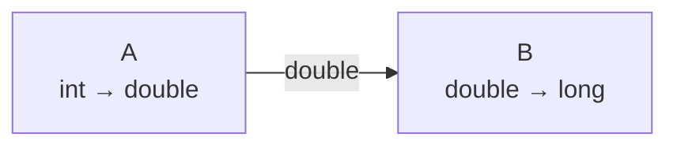
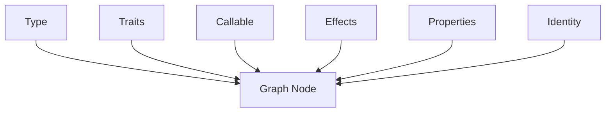
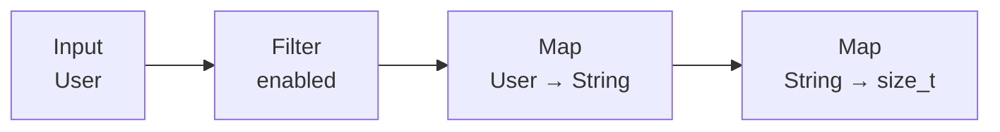
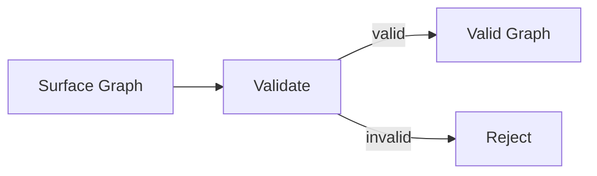
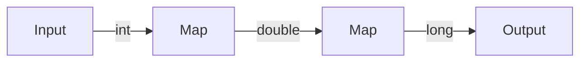
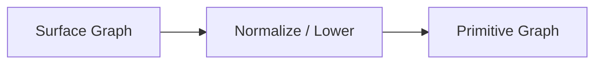
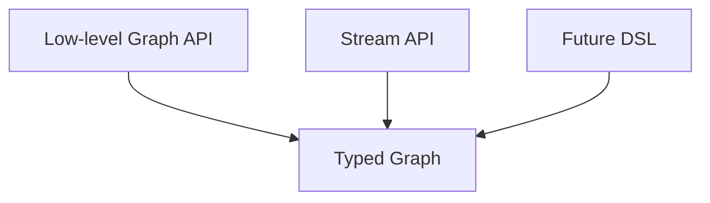
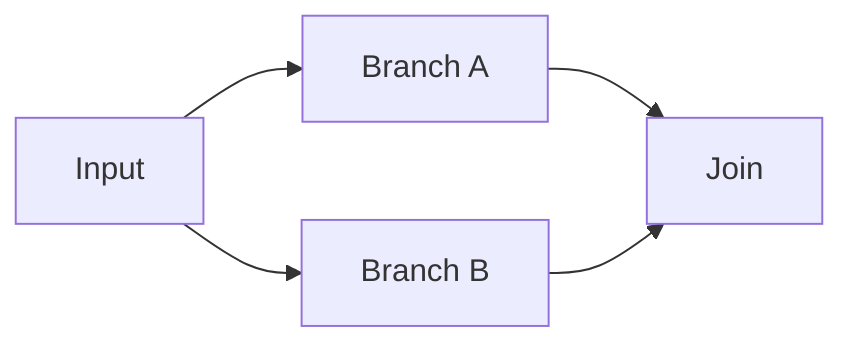
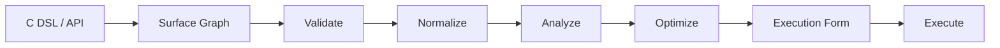
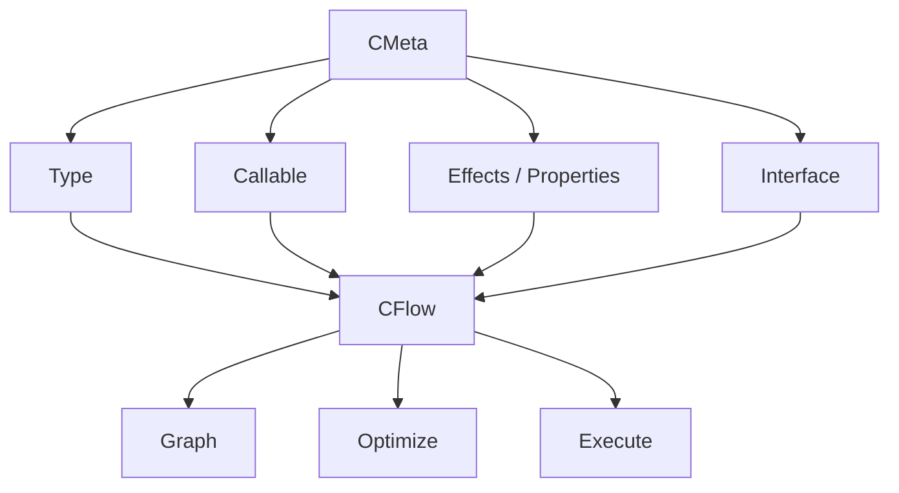

# 第四章：从 Callable 到 Graph——把计算本身变成数据


> **本章路线**
>
> 第三章已经把单个行为变成 typed Callable。第四章开始把“多个行为之间的关系”变成显式 IR，并建立后续所有 Stream / Reactive / Plan / Optimizer 共享的 canonical pipeline。
>
> ~~~text
> Plain C Pipeline
>      ↓
> Typed Callable Chain
>      ↓
> Surface Graph
>      ↓
> Validate
>      ↓
> Normalize
>      ↓
> Observable Semantics
>      ↓
> C Verification / Lean Obligation
>      ↓
> Execution Backends
> ~~~
>
> 从这一章开始，全书会持续复用同一个数据流例子：
>
> ~~~text
> Source<int>
>     ↓
> Filter(is_even)
>     ↓
> Map(square)
>     ↓
> Reduce(sum)
> ~~~
>
> 后续章节不会重新发明示例，而是不断给同一条 pipeline 增加 Stream façade、WAIT/Demand、Executor、verified rewrite 和 lowering。

上一章完成了一个非常重要的变化。

最开始，我们处理的是：

```text
Typed Data
```

后来进一步得到：

```text
Typed Callable
```

于是一个函数不再只是：

```text
function pointer
```

而可以同时具有：

```text
Signature
Effects
Properties
Capture
Dispatch
```

甚至可以通过：

```text
Lambda
Bind
Generator
```

构造新的 Callable。

这时，一个新的问题自然出现：

> **如果一个函数已经可以成为一个有类型、有语义的数据对象，那么多个函数之间的计算关系，能不能也成为数据？**

例如：

```text
User
 ↓
enabled : User -> bool
 ↓
name : User -> String
```

代码当然可以直接写成：

```c
if (enabled(user)) {
    String result = name(user);
}
```

但一旦直接执行以后：

```text
enabled
name
```

之间的关系就只存在于：

```text
控制流
```

里面。

如果希望在执行之前：

```text
检查它
分析它
修改它
优化它
选择执行方式
```

那么就需要先把：

> **计算本身保存下来。**

这就是 Graph 出现的原因。

---

## 1. Graph 首先不是为了“画图”

提到 Graph，很容易想到：

```text
Node
Edge
```

或者可视化流程图。

但这里 Graph 真正的意义不是为了画图。

它解决的是一个更重要的问题：

> **把一段原本只能通过执行表达的计算，变成一个普通的数据结构。**

例如原来的程序：

```c
x = f(input);
y = g(x);
result = h(y);
```

可以先表示成：

```text
Input
  ↓
f
  ↓
g
  ↓
h
  ↓
Output
```

一旦这个关系被保存下来，程序就第一次拥有了两个阶段：

```text
Describe
   ↓
Execute
```

而不是：

```text
Describe = Execute
```

这一步非常关键。

因为只有当：

```text
Program
```

首先成为：

```text
Data
```

以后，系统才能在执行之前对它做进一步处理。

---

## 2. 一个 Node 不应该只是 callback

最简单的 Graph Node 可以写成：

```c
struct Node {
    function_pointer fn;
};
```

但如果这样做，前面建立的类型和语义信息又全部丢失了。

更合理的 Node 应该知道：

```text
Operator
Input Type
Output Type
Callable
Effects
Properties
```

例如：

```text
Map Node

Input Type  = User
Output Type = String
Callable    = user_name
Effects     = PURE
Properties  = DETERMINISTIC | TOTAL
```

或者：

```text
Filter Node

Input Type  = User
Output Type = User
Predicate   = enabled : User -> bool
```

于是 Node 不只是：

> 调一个函数。

而是：

> **一个具有明确输入、输出和语义的计算单元。**

---

## 3. Edge 也开始具有类型意义

普通 Graph 中：

```text
A -> B
```

只表示连接关系。

Typed Graph 中，这条 Edge 还意味着：

```text
A.output_type
    ==
B.input_type
```

例如：

```text
A
int -> double

B
double -> long
```

可以连接：



但：

```text
A
int -> double

B
String -> User
```

显然不能直接连接。

因此 Graph 本身已经包含一个：

```text
Type Constraint System
```

而不是等真正运行到 B 时才发现：

```text
传进来的数据不对
```

---

## 4. 这使错误可以第一次提前到“构造阶段”

传统 callback pipeline 很容易出现：

```text
Callback A
    ↓
void *
    ↓
Callback B
```

只要双方都接受：

```text
void *
```

编译器就很难帮助检查真实 payload。

问题往往到：

```text
runtime
```

才出现。

Typed Graph 可以在：

```text
Graph Build
```

阶段就检查：

```text
Node A output type
Node B input type
```

如果不兼容：

```text
Graph 不成立
```

根本不进入执行。

这形成了一个以后一直非常重要的原则：

> **能在构造阶段拒绝的问题，就不要留给执行阶段。**

---

## 5. Graph 是对前面所有 Meta 能力的一次真正组合

到这里，前面几个章节的能力第一次同时进入一个复杂对象。



其中：

```text
Type
```

告诉 Graph：

```text
数据是什么
```

```text
Callable
```

告诉 Graph：

```text
要执行什么
```

```text
Effects / Properties
```

告诉 Graph：

```text
这个操作具有什么语义
```

```text
Type Identity
```

则保证这些信息在：

```text
多个 Translation Unit
Library
Generated Metadata
```

之间仍然可以正确比较。

这也是为什么 Graph 是验证前面整个设计是否真正可组合的一个非常好的对象。

---

## 6. Graph 首先解决的，是复杂的数据转换

一旦有：

```text
Typed Node
+
Typed Edge
```

以后，最自然的用途就是：

```text
Data Transformation
```

例如：

```text
User
 ↓
检查 enabled
 ↓
User
 ↓
取得 name
 ↓
String
 ↓
转换长度
 ↓
size_t
```

可以写成：



这里真正描述的是：

```text
数据怎样一步一步变化
```

而不是：

```text
循环变量怎么移动
临时变量叫什么
continue 放在哪里
```

这使业务代码第一次可以更多地关注：

```text
Transformation
```

而不是：

```text
Iteration Mechanics
```

---

## 7. 普通 C 循环本身没有问题

这一点需要特别说明。

例如：

```c
for (size_t i = 0; i < count; ++i) {
    if (!enabled(&users[i]))
        continue;

    names[out++] = user_name(&users[i]);
}
```

这段代码：

```text
简单
直接
高效
```

完全没有必要因为存在 Graph 就全部替换掉。

Graph 解决的是另一类问题。

当数据转换不断增加：

```text
Filter
Map
FlatMap
Limit
Skip
Reduce
Collect
```

并且同样的执行逻辑在多个地方重复时，开始出现：

```text
重复循环
重复中间 buffer
重复错误处理
重复类型转换
```

这时把：

```text
数据转换关系
```

和：

```text
执行机制
```

分开才开始真正有价值。

---

## 8. Graph 让“关系”比“过程”更重要

例如用户真正想表达：

```text
只保留 enabled User
        ↓
取得名字
        ↓
只取前 100 个
```

Graph 中可以直接保存：

```text
Filter(enabled)
Map(name)
Limit(100)
```

而不是保存：

```text
for
if
continue
counter++
break
```

可以理解成：

```text
Imperative C
    描述“怎么做”

Graph
    描述“要做什么”
```

当然最终执行时仍然必须变回：

```text
怎么做
```

但这个过程可以由后面的 Executor 或 Compiler 完成。

---

## 9. 一旦程序变成数据，就可以“看见整个程序”

这是 Graph 最重要的价值之一。

如果：

```c
x = f(input);
y = g(x);
z = h(y);
```

已经直接执行，系统很难在：

```text
h
```

运行时突然回头问：

```text
前面完整的计算是什么？
```

Graph 则从一开始就拥有：

```text
f
g
h
```

完整结构。

所以执行之前可以问：

```text
一共有几个 Node？

数据类型如何传播？

有没有无效连接？

有没有永远不会执行的 Subgraph？

两个 Map 是否可以合并？

中间结果是否真的需要存在？
```

这就产生了一个小型 compiler 的基础。

---

## 10. Graph 自然带来 Validate

第一阶段最直接的工作是：

```text
Validate
```

例如检查：

```text
所有 Node 是否有效？
所有 Edge 是否指向存在的 Node？
输入输出 Type 是否连续？
Callable Signature 是否匹配 Operator？
Subgraph 是否存在？
Terminal Node 后是否还有非法连接？
```

可以表示成：



这一步完全属于：

```text
Control Plane
```

执行数据之前完成。

---

## 11. Graph 还自然带来 Type Propagation

假设：

```text
Input
    output = int
```

接下来：

```text
Map
    int -> double
```

那么 Graph 后续 flow type 就变成：

```text
double
```

再接：

```text
Map
    double -> long
```

继续得到：

```text
long
```

于是：

```text
Type
```

不再只是每个 Node 自己的 metadata。

它开始沿着 Graph 流动。



这就是：

```text
Type Propagation
```

也是以后自动 inference 的基础。

---

## 12. 某些 Operator 的输出类型甚至可以推导

例如：

```text
Filter<T>
```

predicate 的函数类型是：

```text
T -> bool
```

但 Filter 的流输出仍然是：

```text
T
```

所以：

```text
Node output
```

并不总是简单等于：

```text
Callable return type
```

类似：

```text
FlatMap
Reduce
Collect
```

也各有自己的类型规则。

这正好可以复用前面已经建立的：

```text
Finite Relation
Inference
```

也就是说：

```text
Operator
+
Callable Signature
+
Input Type
        ↓
Output Type
```

本身也可以成为有限推导。

---

## 13. 这让 Graph 开始成为“类型化 IR”

到这里，Graph 已经不再只是：

```text
runtime callback graph
```

更接近：

```text
Intermediate Representation
```

因为它保存的不是具体机器执行步骤，而是：

```text
计算语义
类型关系
结构关系
```

例如一个高层 Node：

```text
Filter
```

并不规定：

```text
一定要使用 if
一定要单独调用一次 callback
一定要有一个 runtime node object
```

它只是表达：

> **保留满足 predicate 的数据。**

至于最后怎么执行，是下一阶段的事。

---

## 14. 这使“高级语义”和“低层执行”第一次解耦

例如：

```text
Map
```

在 Graph 中只有一个语义：

```text
T -> U
```

但它最后可能：

```text
由解释器执行
```

也可能：

```text
编译进 Plan
```

甚至：

```text
直接生成普通 C loop
```

所以：

```text
Graph
```

回答：

> 计算是什么意思？

而：

```text
Executor / Backend
```

回答：

> 这次具体怎样执行？

这是后面 CFlow 最核心的分层之一。

---

## 15. 为什么不能直接让 Graph 自己执行

最简单的实现当然可以：

```c
for each node {
    switch (node->op) {
        case MAP:
            ...
        case FILTER:
            ...
    }
}
```

作为第一个工作版本，这完全合理。

但如果永远这么执行，那么每一个 value 都可能经历：

```text
读取 Node
判断 Operator
读取 Descriptor
检查 Signature
查找下一个 Edge
动态 Dispatch
```

很多工作其实在 Graph 构造完成以后已经不会再改变。

例如：

```text
Node 类型
拓扑
Callable Signature
下一个 Node
```

所以没有必要在：

```text
每一个 value
```

上重新计算。

这开始引出：

> **Control Plane 和 Execution Plane 应该分开。**

---

## 16. Graph 构造阶段可以做复杂事情

Graph Build 可以承担：

```text
Type Validation
Signature Validation
Topology Validation
Inference
Effect Analysis
Property Analysis
```

这些操作即使相对复杂，也只执行：

```text
一次
```

或者：

```text
少数几次
```

然后得到：

```text
Validated Graph
```

后面 hot path 就可以更简单。

可以概括成：

```text
Build once
Execute many
```

对于大量数据转换，这个 trade-off 非常合理。

---

## 17. 下一步自然出现 Normalize / Lower

Graph 最开始应该优先：

```text
容易表达
```

而不是：

```text
容易执行
```

例如用户接口可能提供：

```text
较高级的 Structured Operator
```

这些 operator 适合人理解，却不一定适合 runtime 直接处理。

因此可以增加：

```text
Lower
```

阶段。



高层 API 负责：

```text
表达力
```

Primitive IR 负责：

```text
执行简单
```

这与传统 compiler：

```text
Source Language
 ↓
IR
```

是类似的思路。

---

## 18. Graph 一旦统一，就可以支持多种前端

这是非常重要的一个结果。

Graph 不应该绑定某一种 DSL。

例如用户可以：

```text
直接构造 Node / Edge
```

也可以以后提供：

```text
Stream façade
```

甚至可以从：

```text
配置
Schema
Machine
其他 DSL
```

生成 Graph。

也就是说：



只要最终统一到：

```text
Typed Graph
```

后面的：

```text
Validate
Optimize
Compile
Execute
```

都可以复用。

---

## 19. 这也是为什么 Stream 不应该是底层模型

后来我们会发现：

```text
Filter
Map
Reduce
Collect
```

非常适合提供类似 Java Stream 的接口。

但如果从一开始就把：

```text
Stream
```

定义成底层 runtime，那么系统很容易被限制在：

```text
线性 pipeline
```

而 Graph 天然可以表达：

```text
分支
合并
嵌套
Relation
Subgraph
```

所以更合理的关系是：

```text
Stream
    ↓
Graph façade
```

而不是：

```text
Graph
    ↓
复杂版 Stream runtime
```

---

## 20. Graph 也让 Branch 和 Relation 成为自然扩展

例如：

```text
一个输入
   ↓
两个分支
```

可以表示：



如果只使用线性 Stream，就必须另外发明：

```text
fork
join
zip
race
fallback
```

等大量特殊 runtime object。

Graph 中则可以进一步把这些抽象成：

```text
Subgraph
Relation
Coordination Policy
Completion Policy
Result Policy
Error Policy
```

从而减少高级模型数量。

---

## 21. “计算关系”开始成为真正的第一等数据

到这一步以后，可以保存：

```text
Graph
```

复制：

```text
Graph
```

比较：

```text
Graph
```

甚至：

```text
Graph -> Graph
```

做 transformation。

例如：

```text
原始 Graph
    ↓
Optimizer
    ↓
新 Graph
```

这实际上是：

> **程序对程序的计算。**

也是 Meta Programming 从：

```text
类型层
```

开始进入：

```text
程序结构层
```

的重要一步。

---

## 22. Optimizer 为什么会自然出现

假设 Graph：

```text
Map(f)
 ↓
Map(g)
```

如果：

```text
f : A -> B
g : B -> C
```

而且 Effects / Properties 允许，那么理论上可以考虑：

```text
Map(g ∘ f)
```

再例如：

```text
Map(identity)
```

可能可以删除。

```text
Filter(always_true)
```

也可能可以删除。

```text
Map(f)
 ↓
Map(f)
```

如果真正满足：

```text
f(f(x)) = f(x)
```

也可能简化。

这些优化之所以可能，不是因为：

```text
Graph 恰好长成这个样子
```

而是因为 Graph Node 已经保存：

```text
Type
Effects
Properties
Callable
```

因此 Optimizer 有足够的语义信息做决定。

---

## 23. Meta 信息开始第一次真正影响性能

这是一件很重要的事情。

之前：

```text
Type
Traits
Properties
```

看起来可能只是为了：

```text
更安全
更方便 reflection
```

但 Graph 出现以后，它们开始直接影响：

```text
是否允许优化
是否允许 fusion
是否允许并行
是否需要 adapter
```

也就是说：

```text
Metadata
```

第一次成为：

```text
Optimization Input
```

这说明前面建立的 Meta 层已经不再只是辅助工具。

它开始成为真正的：

```text
Compiler Semantic Substrate
```

---

## 24. Graph 还可以记录自己的版本

如果：

```text
Graph
```

可以被：

```text
修改
优化
clone
```

那么一个已经基于旧 Graph 生成的：

```text
Plan
Certificate
Optimization Trace
```

可能已经失效。

因此很自然需要：

```text
Graph Version
```

例如：

```text
Graph v42
```

生成：

```text
Plan v42
```

如果 Graph 后来变成：

```text
v43
```

那么：

```text
Plan v42
```

不能继续被当成：

```text
Graph v43 的证明
```

这让 Graph 从一个普通容器进一步具有：

```text
immutable snapshot / versioned semantic object
```

的意味。

---

## 25. 这里开始出现 Compiler 的完整轮廓

到这里，整个过程已经越来越像：

```text
Compiler
```

但输入不是传统语言源代码，而是一张通过 C API 构造出来的 Graph。

完整过程逐渐变成：



也就是：

```text
Front-end
IR
Validation
Lowering
Optimization
Backend
Execution
```

只是每一步都保持为：

```text
普通 C
有限模型
显式数据
```

---

## 26. 这就是 CFlow 真正开始形成的地方

做到这一阶段以后，系统已经不再只是：

```text
CMeta + Graph 数据结构
```

因为 Graph 需要：

```text
Operator
Lower
Optimizer
Executor
Runtime
```

一整套围绕：

```text
Flow of Computation
```

的能力。

这时候把这一部分独立出来，就非常自然。

因此：

```text
CMeta
```

继续负责：

```text
Type
Traits
Generic
Callable
Interface
Finite Relation
```

而新的一层：

```text
CFlow
```

开始负责：

```text
Graph
Operator
Dataflow
Lowering
Optimization
Execution
```

两者边界可以表示成：



---

## 27. CFlow 最初仍然不是为了做 Java Stream

这点很重要。

有了：

```text
Graph
```

以后，第一目标仍然只是：

> **证明可以用 CMeta 描述一个复杂、真正可执行的计算对象。**

Stream 只是后来看到的一个非常自然的应用。

因为当 Graph 已经能够表达：

```text
Filter
Map
Reduce
Collect
```

以后，很容易发现：

```text
这和 Java Stream 的数据转换模型很像
```

于是才进一步考虑：

```text
能不能提供更高级、更友好的 Stream façade？
```

所以真正的发展顺序应该是：

```text
Typed Callable
    ↓
Typed Graph
    ↓
Data Transformation
    ↓
发现可以做 Stream
```

而不是：

```text
先决定模仿 Java Stream
    ↓
再设计 Graph
```

---

## 28. Graph 最大的价值可能不是“可以执行”，而是“可以先不执行”

这一点值得单独强调。

如果只是为了执行：

```text
f
 ↓
g
 ↓
h
```

普通 C 函数调用已经足够。

Graph 真正增加的能力是：

> **先把计算保存下来。**

因为先不执行，才有机会：

```text
检查
推导
分析
优化
选择 Backend
证明 transformation
```

所以 Graph 可以理解成：

```text
Deferred Computation Description
```

但它又不必像某些 lazy runtime 那样保留到每个 value 的执行阶段。

它可以在执行之前再次被：

```text
编译掉
```

---

## 29. 这也为后面的“可消除运行时抽象”路线创造了条件

一旦完整 Graph 已经知道：

```text
全部 Node
全部 Type
全部 Callable
全部拓扑
```

那么对于某些简单 Graph：

```text
Graph
```

本身甚至不应该进入 hot path。

例如：

```text
Filter
 ↓
Map
 ↓
Map
```

完全可能在后面 lowering 成：

```c
for (...) {
    if (!filter(x))
        continue;

    y = map1(x);
    z = map2(y);

    output[n++] = z;
}
```

也就是说：

```text
Graph
```

的存在不是为了让 runtime 更复杂。

恰恰相反。

它可能帮助我们：

> **在运行之前把高级抽象全部消掉。**

---

## 30. 从这里开始，问题变成“Graph 可以怎样执行”

做到 Graph 后，下一步真正有意思的问题不再是：

> Graph 还能增加什么 Node？

而是：

> **同一张 Graph 可以有哪些执行方式？**

例如：

```text
同步解释执行
```

或者：

```text
预编译成 Plan
```

或者：

```text
完全 lowering 成 Direct C
```

再或者：

```text
Publisher 暂时没有数据
需要 WAIT / Wake
```

于是执行模型开始分化。

这将自然引出：

```text
Stream
Reactive
Executor
Scheduler
```

等更高层能力。

---


## 31. Canonical Example：把第三章的三个 Callable 连成一张 Graph

第三章最后已经准备了：

~~~text
is_even : int -> bool
square  : int -> int
sum     : int × int -> int
~~~

Plain C 最直接的版本其实仍然很好：

~~~c
long total = 0;
bool has_value = false;

for (size_t i = 0; i < n; ++i) {
    int x = input[i];

    if (!is_even(x))
        continue;

    int y = square(x);

    if (!has_value) {
        total = y;
        has_value = true;
    } else {
        total = sum(total, y);
    }
}
~~~

这段代码没有问题。

如果程序只需要这一条固定 pipeline，普通 C 甚至可能就是最好的实现。

Graph 出现的条件不是“for loop 不够现代”，而是系统开始需要在执行之前知道：

~~~text
有哪些 stage？
stage 的 input/output type 是什么？
哪些 stage 会丢弃 value？
哪些 stage 改变 cardinality？
哪些 Callable 有 effect/property？
哪些连接不合法？
是否允许 normalize / optimize / compile？
~~~

于是同一个计算可以先被保存成：

~~~text
Input<int>
    ↓
Filter<int>(is_even)
    ↓
Map<int,int>(square)
    ↓
Reduce<int>(sum)
~~~

这一步的本质是：

> **把只存在于控制流里的关系，提升成可以检查和变换的数据。**

### 31.1 Graph 不是执行结果，而是执行前的知识

一旦关系被保存下来，我们第一次同时拥有：

~~~text
topology
types
operators
callables
effects
properties
parameters
nested subgraphs
~~~

这使后续阶段能够在任何 input value 到来之前完成大量工作。

也就是说：

~~~text
Graph construction
    ↓
pay semantic/structural cost early

Graph execution
    ↓
use already-admitted structure
~~~

这正是全书后面不断重复的 **Pay Before Execution**。

---

## 32. Semantic Contract：什么才算一张合法 Typed Graph

Graph 不是“装着一些 node 的数组”。

它至少需要满足四类 contract。

### 32.1 Topology well-formedness

每条 Edge 必须引用存在的 node/port。

不能出现：

~~~text
dangling endpoint
invalid port
invalid nested subgraph reference
impossible entry/tail
~~~

这属于结构合法性。

### 32.2 Type preservation across edges

如果：

~~~text
node A output : T
node B input  : U
~~~

那么连接：

~~~text
A -> B
~~~

必须满足对应的 semantic type compatibility。

不能因为两个 value 都能塞进 void * 就允许连接。

对于 canonical example：

~~~text
Input<int>
  -> Filter<int>
  -> Map<int,int>
  -> Reduce<int>
~~~

每一步的类型都是 admission 的一部分，而不是 runtime cast 的猜测。

### 32.3 Operator contract

Node 不只保存 Callable。

Operator 自己还带有语义，例如：

~~~text
FILTER
    cardinality: 0..1
    output type: same as input

MAP
    cardinality: 1
    output type: callable return

FLAT_MAP
    cardinality: 0..N

REDUCE
    cardinality: N..1
~~~

所以 Graph 的类型推导需要：

~~~text
operator schema
+
callable signature
+
input type
~~~

而不是只看 function pointer。

### 32.4 Mutation / snapshot boundary

Graph 构造阶段可以修改 owning IR。

但一旦某个 Graph 被交给：

~~~text
normalize
optimize
compile
verify
execute
~~~

这些阶段必须能够绑定到一个明确版本的结构。

如果结构在背后变化，而 Plan/Certificate 仍然继续使用旧假设，就会破坏可信边界。

因此 Graph version 不是普通 debug counter。

它表达的是：

> **这份 downstream knowledge 到底绑定到哪一个具体 IR snapshot。**

---

## 33. Lean / Proof Obligation：Graph 阶段先证明什么

第四章还不需要把整个 optimizer correctness 一次证明完。

这里最重要的是先建立 Graph semantics 的基础。

### 33.1 Well-formed Graph

可以定义一个 predicate：

~~~text
WellFormed(g)
~~~

它至少包含：

~~~text
all node references valid
all edges reference valid ports
all edge types compatible
operator signatures admitted
nested graphs well formed
root/entry/exit valid
~~~

然后后面的 theorem 才能拥有统一前提：

~~~text
WellFormed(g) → ...
~~~

而不是每个 rewrite 都重新证明一遍结构合法性。

### 33.2 Graph observable semantics

必须先回答：

> “两张 Graph 语义相同”到底是什么意思？

最小模型可以先把一张纯同步 Graph 看成：

~~~text
input sequence
    ↓
zero or more output values / terminal result
~~~

于是可以定义某种：

~~~text
observe(g, input)
~~~

后面的 normalize / optimize theorem 才能写成：

~~~text
observe(surface, input)
=
observe(normalized, input)
~~~

或更一般的 ObsEq。

如果没有 observable semantics，“结构更简单”本身并不能推出“程序等价”。

### 33.3 Normalize preservation

Normalize 最先应该拥有的 theorem 不是“更快”，而是：

~~~text
WellFormed(surface)
→
ObsEq(surface, normalize(surface))
~~~

这条 law 很关键。

因为从这里开始：

~~~text
Surface Graph
~~~

和：

~~~text
Primitive / Normalized Graph
~~~

可以是两种不同 physical representation，但仍然属于同一个 semantic program。

### 33.4 Lean 暂时不证明 Graph storage layout

这一章仍然要保持 proof boundary。

Lean 不应该假装证明：

~~~text
malloc 一定成功
C struct ABI 在所有 compiler 上相同
cache layout 一定更快
pointer lifetime 永远正确
~~~

这些属于 C implementation / toolchain / runtime evidence。

形式化在这里证明的是：

~~~text
IR meaning
type relation
structural invariant
semantic preservation
~~~

---

## 34. Current C Implementation：Graph 已经是一个真正的 owning IR

对照当前 Salts：

~~~text
qigao/salts
master: ad389928b437c0612c1c60844fe53677f3ed27a6
~~~

当前 CFlow Graph 已经不是抽象伪代码。

它有明确的：

~~~text
cflow_graph
  owns subgraphs

cflow_subgraph
  owns nodes + edges

cflow_node
  stores op/callable/types/params/nested refs

cflow_edge
  stores typed topology coordinates
~~~

### 34.1 Edge 是显式 IR row

当前 edge 形态已经明确到端口：

~~~c
typedef struct cflow_edge {
    node_id  from;
    uint16_t from_port;

    node_id  to;
    uint16_t to_port;
} cflow_edge;
~~~

这意味着 Graph 不再被限制为“线性数组里的下一个 operator”。

Branch、Relation、Subgraph 可以在同一 IR 中拥有显式拓扑。

### 34.2 Node 保存的是 operator semantics + callable + type knowledge

当前 node 包含的核心信息可以概括成：

~~~text
operator
optional callable
optional fused callable chain
input type
output type
nested subgraph references
typed semantic parameters
relation policy
~~~

这和前面三章形成真正连接：

~~~text
CMeta Type
   +
CMeta Callable
   +
CFlow Operator Schema
   ↓
Typed Graph Node
~~~

因此 Graph 是前面 Meta 能力的 integration point，而不是另起一套 type system。

### 34.3 Graph 是 owning handle，但 rows 是 read-only introspection

当前 API 的边界非常专业：

~~~text
Graph builder functions
    → supported mutation API

node/edge/subgraph rows
    → read-only introspection
~~~

直接修改 storage/capacity 并不是 public contract。

这解决一个常见 C library 问题：

> “struct 是 public 的”不等于“每个 field 都允许 caller 任意写”。

### 34.4 Version 把 downstream artifacts 绑定到具体 Graph state

当前 owning Graph 持有 process-local nonzero mutation token。

成功 mutation / clone / initialization 会更新版本；

destroy 恢复 zero。

这让：

~~~text
optimizer trace
certificate
compiled plan
runtime admission
~~~

都可以明确回答：

> “我是不是还绑定在原来那张未变化的 Graph 上？”

### 34.5 Normalize / Optimize 都输出新的 Graph

当前 optimizer contract 已经明确：

~~~text
src = immutable normalized Graph
dst = new owned optimized Graph
~~~

而不是在原对象上边执行边改写。

这是非常重要的工程边界：

~~~text
source meaning remains inspectable
+
transformation result owns new IR
+
verification can compare both sides
~~~

它也天然适合 formal preservation story。

---

## 35. Evidence：Graph 这一层已经可以建立完整 C-side verification chain

第四章不能只用“Graph validate 返回 true”作为证据。

当前代码已经提供更完整的 verification pipeline：

~~~text
validate surface
    ↓
normalize + validate
    ↓
normalize(normalized)
    ↓
check structural idempotence
    ↓
optimize + validate
    ↓
optimize(optimized)
    ↓
check structural idempotence
    ↓
execute surface / normalized / optimized
    ↓
compare observable output
    ↓
when eligible:
compile direct plan
    ↓
compare output again
~~~

这非常重要，因为它把几类 evidence 分开了。

### 35.1 Structural evidence

检查：

~~~text
topology
node descriptors
relation schema
fused chains
~~~

是否满足预期结构。

### 35.2 Differential semantic evidence

同一 input 分别经过：

~~~text
surface
normalized
optimized
compiled plan
~~~

如果 observable result 不同，就说明 transformation chain 有真实 regression。

### 35.3 Formal evidence

Lean 负责证明：

~~~text
某类 transformation
在明确前提下
preserves observable semantics
~~~

### 35.4 Runtime evidence

C differential tests 则负责检查：

~~~text
真实 implementation
是否符合 formalized transformation contract
~~~

两者结合比任何一方单独存在都强。

---

## 36. Performance Evidence：Graph 本身也需要知道自己的成本

Graph 作为 control-plane IR，并不意味着 Graph traversal cost 可以忽略。

当前 CFlow 已经有专门的 graph-path benchmark，覆盖不同 operator 数量：

~~~text
1
16
256
4096
~~~

并比较不同 successor representation / traversal strategy。

这给书一个非常好的写作原则：

> **只要某个 abstraction 可能进入 hot path，就必须测量它；如果它不应该进入 hot path，就要展示怎样把它 compile/lower 掉。**

所以第四章不需要声称：

~~~text
Graph is zero-cost
~~~

更准确的说法是：

~~~text
Graph is analyzable control-plane IR

and

later execution paths should avoid repeated Graph interpretation when possible
~~~

这会自然引到第十章的 Plan / Direct / AOT。

---

## 37. What We Learned

第四章完成的是第三次关键跨越：

~~~text
Typed Data
    ↓
Typed Behavior
    ↓
Typed Program Structure
~~~

Graph 的价值不在于替换 for loop。

它真正带来的是：

1. **Topology becomes data.**
2. **Types survive across computation boundaries.**
3. **Operator semantics become explicit.**
4. **Construction/admission can fail before execution.**
5. **Normalize / Optimize / Compile can work on immutable snapshots.**
6. **Lean finally has a program structure on which to state preservation theorems.**
7. **C verification can compare surface/normalized/optimized/compiled observations.**
8. **Execution can later remove Graph knowledge instead of repeatedly interpreting it.**

canonical example 也从：

~~~text
three independent Callable
~~~

正式变成：

~~~text
Source<int>
    ↓
Filter(is_even)
    ↓
Map(square)
    ↓
Reduce(sum)
~~~

第五章不会重新设计一套数据处理 runtime。

它只回答：

> **既然 Graph 已经能够表达这条 pipeline，能不能给普通 C 用户一个更轻、更自然的 façade 来构造它？**

答案就是 Stream。

---

## 小结：Graph 让“行为”进一步变成“程序结构”

前一章完成的是：

```text
Function
    ↓
Callable
```

让一个函数从：

```text
代码地址
```

变成：

```text
有类型、有语义的数据对象
```

这一章继续向前：

```text
Callable
    ↓
Graph
```

让多个行为之间的关系，也变成：

```text
普通数据
```

于是第一次可以：

```text
在执行之前看到整个计算
```

并对它进行：

```text
Validation
Type Propagation
Inference
Lowering
Optimization
Compilation
```

这就是 CFlow 真正出现的地方。

而 Graph 做出来以后，我们很快发现它特别适合表达：

```text
Filter
Map
FlatMap
Reduce
Collect
```

这一类数据转换。

也正是在这里，下一步才自然出现：

> **既然 Graph 已经能够很好地表达数据转换，能不能在它上面提供类似 Java Stream 的高级接口，让复杂的数据处理在 C 中也可以用更声明式、更类型化的方式表达？**

下一章将从这个发现继续：**从 Graph 到 Stream——为什么高级数据转换 API 可以只是 Graph 的一个轻量 façade，而不需要成为另一个重量级运行时。**
